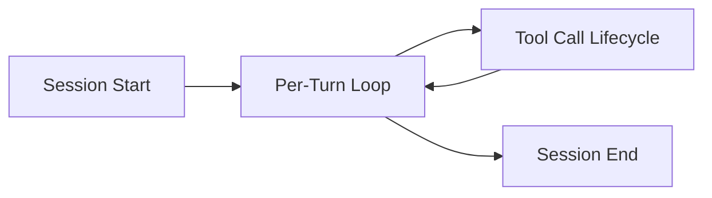

# Hook Protocol & Event Specification

<instructions priority="critical">
This document defines the hook protocol and event system for agents in the WASHVN Master Skill Suite. Subagent-forge MUST load this document when generating hook configurations or implementing event-driven agent behavior. All hooks, matchers, and handlers MUST conform to this specification. Dual-format blocking (Format A and Format B) MUST be supported by every subagent that intercepts tool calls.
</instructions>

---

## 1. Hook Lifecycle Flow

Every agent session progresses through four lifecycle phases. Hooks hook into specific phases to intercept, modify, or block execution.



### 1.1 Session Start Phase

Fires `SessionStart` and `Setup` events. Hook handlers attached to these events run once at session initialization. This is the correct phase for loading environment variables, validating project structure, or asserting capability requirements.

### 1.2 Per-Turn Phase

Fires `UserPromptSubmit`, `UserPromptExpansion`, `Elicitation`, and `ElicitationResult` events. Each user message cycles through submission, optional expansion via context injection, and optional elicitation rounds when the agent requests clarification.

### 1.3 Tool Call Lifecycle

For each tool invocation within a turn, the following event sequence fires:

1. `PreToolUse` -- intercept before execution (primary blocking point)
2. `PermissionRequest` -- fires if a permission gate is configured
3. `PermissionDenied` -- fires if the user denies permission
4. `PostToolUse` -- fires after successful execution
5. `PostToolUseFailure` -- fires if the tool call fails
6. `PostToolBatch` -- fires after all batched tool calls complete

### 1.4 Session End Phase

Fires `PreCompact`, `PostCompact`, then `SessionEnd` in sequence. Hook handlers here MUST perform cleanup: closing file descriptors, flushing logs, and releasing temporary resources.

---

## 2. Hook Configuration Schema

Hooks are configured via JSON arrays in settings files or frontmatter. Every hook entry contains a matcher, an event type filter, and one or more handler blocks.

### 2.1 Hook Locations

Hooks are resolved from the following locations in order (last writer wins by merge):

| Priority | Location | Scope |
|----------|----------|-------|
| 1 (lowest) | [~/.claude/settings.json](file:///home/stveve/.claude/settings.json) | Global user defaults |
| 2 | [.claude/settings.json](file:///home/stveve/Documents/workspace/build-workflow/WASHVN/.claude/settings.json) | Project-wide |
| 3 | `.claude/settings.local.json` | Local overrides (gitignored) |
| 4 | Plugin-declared hooks | Plugin manifest |
| 5 (highest) | Skill or Agent YAML frontmatter | Per-skill or per-agent |

> **Note:** The hooks configuration format shown in §2.4 is the canonical JSON structure for `settings.json` files. When declaring hooks in a subagent's YAML frontmatter, the same logical structure applies: each hook entry has a `matcher` (or event name) and `handlers` array with `event` and `script` fields. Refer to the examples in §7 for concrete YAML patterns.

### 2.2 Matcher Patterns

```yaml
matcher_field:
  purpose: "Filters which tool calls, prompts, or events the hook applies to"
  evaluation_order:
    1: "exact match -- letters, digits, hyphens, spaces, commas, pipes"
    2: "OR pattern -- pipe (|) separates alternatives"
    3: "regex match -- all other patterns with special characters"
```

### 2.3 Handler Fields

```yaml
handler_schema:
  type: object
  required:
    - event
  optional:
    - type
    - script
    - prompt
    - model
    - timeout
    - continueOnBlock
    - if
    - description
    - matcher
  fields:
    event:
      type: string
      description: "Event type this handler subscribes to (see Section 4)"
    type:
      type: string
      enum: [command, prompt, agent]
      description: "Type of hook handler. Defaults to 'command' if 'script' is provided."
    script:
      type: string
      description: "Path to the handler script (absolute or relative to project root). Required if type is 'command'."
    prompt:
      type: string
      description: "Prompt query/instructions to send to the LLM/Agent. Required if type is 'prompt' or 'agent'. Supports $ARGUMENTS placeholder."
    model:
      type: string
      description: "Specific LLM model to execute the prompt-based checks (e.g., 'claude-3-5-haiku', 'claude-3-5-sonnet'). Only applicable to type 'prompt'."
    timeout:
      type: integer
      description: "Execution timeout in seconds. Defaults to 30s for prompt/command, 60s for agent."
    continueOnBlock:
      type: boolean
      description: "If true, when prompt/agent hook blocks (returns ok: false), the runtime feeds the block reason back to the agent to auto-repair and continue the session. Only applicable to type 'prompt' or 'agent'."
    if:
      type: string
      description: "Condition expression that gates handler execution (see Section 8)"
    description:
      type: string
      description: "Human-readable purpose of this hook handler"
    matcher:
      type: string
      description: "Tool name or pattern to match (inherits from parent if omitted)"
```

### 2.4 Settings File Structure

```json
{
  "hooks": [
    {
      "matcher": "bash",
      "handlers": [
        {
          "event": "PreToolUse",
          "script": "scripts/hooks/pre-bash.sh",
          "description": "Block destructive bash commands"
        },
        {
          "event": "PostToolUse",
          "script": "scripts/hooks/log-bash.sh",
          "description": "Log all bash commands to audit trail"
        }
      ]
    },
    {
      "matcher": "Read|Write|Edit",
      "handlers": [
        {
          "event": "PreToolUse",
          "if": "tool.params.filePath =~ \\.env$",
          "script": "scripts/hooks/block-env-files.sh",
          "description": "Block access to environment files"
        }
      ]
    }
  ]
}
```

---

## 3. Matcher Syntax

Matchers determine which tool calls trigger a hook. The matcher string is evaluated using the following three strategies in sequence.

### 3.1 Exact Matching

If the matcher consists solely of Latin letters, digits, hyphens, spaces, commas, or pipe characters, it is evaluated as an exact or multi-exact match.

```yaml
exact_match_rules:
  allowed_chars: "[a-zA-Z0-9\\- ,|]"
  evaluation: "split by comma, whitespace-trim each token, exact match against tool name"
  examples:
    - "bash" -> matches only the bash tool
    - "Read, Write, Edit" -> matches any of the three file tools
    - "bash, Write" -> matches bash or Write
```

### 3.2 OR Patterns (Pipe)

When the matcher contains a pipe character and passes the exact-match character filter, each pipe-delimited segment becomes an alternative:

```regex
PreToolUse.PostToolUse|Stop
```

This matches any of: `PreToolUse`, `PostToolUse`, or `Stop`. Whitespace around pipes is stripped.

### 3.3 Regex Patterns

If the matcher contains any character outside the exact-match set (such as `.`, `*`, `+`, `?`, `^`, `$`, `[`, `]`, `(`, `)`, `{`, `}`, `\\`), it is compiled as a JavaScript-compatible regular expression.

```yaml
regex_match_rules:
  detection: "any char not in exact-match set triggers regex mode"
  flags: "case-insensitive by default"
  examples:
    - "^git" -> matches any tool starting with "git" (Git, Github, GitList)
    - "\\.(env|secret)$" -> matches tools acting on .env or .secret files
    - "(bash|zsh|sh)$" -> matches any shell tool
```

---

## 4. Core Hook Events

The following four events form the core hook protocol. Every hook implementation MUST handle them.

| Event | Timing | Purpose | Matcher Support | Input Schema |
|-------|--------|---------|-----------------|--------------|
| `SessionStart` | Before first turn | Init context, validate environment, assert capabilities | None (global) | `{ sessionId: string, projectDir: string }` |
| `PreToolUse` | Before tool execution | Permission gate, input validation, request modification | Yes | `{ tool: string, params: object }` |
| `PostToolUse` | After successful execution | Audit logging, result transformation, side effects | Yes | `{ tool: string, params: object, result: object }` |
| `Stop` | On interrupt or abort | Cleanup, state persistence, rollback | None (global) | `{ reason: string, sessionId: string }` |

### 4.1 SessionStart

Fired once per agent session before any user interaction. The hook script receives a JSON object on stdin with `sessionId` and `projectDir`. The script MUST exit 0. A non-zero exit terminates the session with a setup failure.

### 4.2 PreToolUse

The primary interception point. The hook script receives the tool name and parameters as JSON on stdin. The script decides whether to allow, block, or modify the call via the Dual-Format Blocking protocol (Section 5).

### 4.3 PostToolUse

Fired after a tool call succeeds. The hook receives the input parameters plus the result object. This is the correct event for audit trails, usage metrics, and result caching. A non-zero exit from a PostToolUse handler does NOT roll back the tool call -- it only logs the failure.

### 4.4 Stop

Fired when the session is interrupted (SIGINT, /stop command, or error abort). The hook receives a reason string. Handlers MUST exit within 5 seconds; the runtime does not wait for slow cleanup scripts.

---

## 5. Complete Event Reference

This table lists every event in the system with its firing context and matcher support.

| Event | Phase | Matcher Supported (Yes/No) | Input |
|-------|-------|---------|-------|
| `SessionStart` | Session start | No | Session metadata |
| `Setup` | Session start | No | Configuration object |
| `UserPromptSubmit` | Per-turn | Yes (prompt pattern) | User message text |
| `UserPromptExpansion` | Per-turn | Yes (expansion tag) | Expanded context |
| `PreToolUse` | Tool lifecycle | Yes | Tool name + params |
| `PermissionRequest` | Tool lifecycle | No | Permission descriptor |
| `PermissionDenied` | Tool lifecycle | No | Denial reason |
| `PostToolUse` | Tool lifecycle | Yes | Tool + params + result |
| `PostToolUseFailure` | Tool lifecycle | Yes | Tool + params + error |
| `PostToolBatch` | Tool lifecycle | No | Batch result array |
| `Notification` | Any | Yes | Notification payload |
| `MessageDisplay` | Per-turn | Yes | Rendered message |
| `SubagentStart` | Orchestration | Yes | Subagent config |
| `SubagentStop` | Orchestration | Yes | Subagent result |
| `TaskCreated` | Orchestration | Yes | Task descriptor |
| `TaskCompleted` | Orchestration | Yes | Task result |
| `Stop` | Session end | No | Stop reason |
| `StopFailure` | Session end | No | Error details |
| `TeammateIdle` | Orchestration | Yes | Teammate ID + duration |
| `InstructionsLoaded` | Session start | No | Instructions hash |
| `ConfigChange` | Runtime | Yes | Diff of config |
| `CwdChanged` | Runtime | Yes | New working directory |
| `FileChanged` | Runtime | Yes | File path + event type |
| `WorktreeCreate` | Runtime | Yes | Worktree path |
| `WorktreeRemove` | Runtime | Yes | Worktree path |
| `PreCompact` | Session end | No | Current memory snapshot |
| `PostCompact` | Session end | No | Compact result |
| `Elicitation` | Per-turn | Yes | Clarification question |
| `ElicitationResult` | Per-turn | Yes | User response |
| `SessionEnd` | Session end | No | Session summary |

---

## 6. Dual-Format Blocking Protocol

Every `PreToolUse` hook script MUST implement one of two blocking formats. The runtime checks the script's exit code and stdout to determine the permission decision.

### 6.1 Permission Decision Table

| Script Behavior | Runtime Interpretation |
|-----------------|----------------------|
| `exit 0` with no `permissionDecision` field on stdout | No decision -- allow the tool call |
| `exit 0` with stdout `{"permissionDecision": "deny"}` | Block the tool call |
| `exit 2` (any stdout ignored) | Block the tool call; stderr is displayed to the user |
| Any other non-zero exit | Block the tool call; logged as hook error |

There is no mechanism for a hook to permanently grant permission. Every `PreToolUse` invocation is independently evaluated.

### 6.2 Format A -- Stdout JSON Blocking

The script writes a JSON object to stdout containing a `permissionDecision` field. The JSON MAY include additional fields for logging or debugging.

```bash
#!/bin/bash
# Format A example: block rm -rf / and chmod 777 patterns
# File: scripts/hooks/pre-bash-format-a.sh
set -euo pipefail

INPUT=$(cat)

COMMAND=$(echo "$INPUT" | jq -r '.params.command // ""')

if echo "$COMMAND" | grep -qE 'rm\s+-rf\s+/|chmod\s+777'; then
  cat <<'EOF'
{"permissionDecision": "deny", "reason": "Destructive command blocked by security hook"}
EOF
  exit 0
fi

exit 0
```

### 6.3 Format B -- Exit Code 2 Blocking

The script exits with code 2 and writes a human-readable explanation to stderr. This format is simpler and does not require stdout JSON parsing.

```bash
#!/bin/bash
# Format B example: block network write operations via bash
# File: scripts/hooks/pre-bash-format-b.sh
set -euo pipefail

INPUT=$(cat)

COMMAND=$(echo "$INPUT" | jq -r '.params.command // ""')

if echo "$COMMAND" | grep -qE 'curl\s+-X\s+(POST|PUT|DELETE)|wget\s+--post'; then
  echo "Hook blocked: network write operations require explicit approval" >&2
  exit 2
fi

exit 0
```

### 6.4 Choosing Between Formats

```yaml
format_selection_guide:
  use_format_a_when:
    - "Multiple hooks chain together and need structured output"
    - "Logging or audit trail requires machine-parsable reasons"
    - "Caller needs to distinguish deny reason via JSON path"
  use_format_b_when:
    - "Simplicity is preferred over structured output"
    - "Human-readable error message is sufficient"
    - "The hook runs as a standalone gate with no downstream consumers"
  rules:
    - "A single script MUST NOT mix both formats"
    - "If stdout contains valid JSON with permissionDecision, Format A takes precedence"
    - "If exit code is 2 and Format A was not detected, Format B is assumed"
```

---

## 7. Hook Types

Hooks can be attached to different categories of agent operations.

### 7.1 Command Hooks

Intercept shell command execution. The matcher targets tool names like `bash`, `execute`, `shell`, or custom regex patterns.

```yaml
command_hook_example:
  matcher: "bash"
  event: "PreToolUse"
  handler: "scripts/hooks/pre-bash.sh"
  purpose: "Validate and gate all shell commands"
```

### 7.2 HTTP Hooks

Intercept HTTP requests made by the agent (tool calls with URL parameters).

```yaml
http_hook_example:
  matcher: "http|fetch|webfetch"
  event: "PreToolUse"
  handler: "scripts/hooks/pre-http.sh"
  purpose: "Block outbound requests to unauthorized domains"
```

### 7.3 MCP Tool Hooks

Intercept MCP (Model Context Protocol) tool invocations. The matcher targets the MCP tool name as reported by the MCP server.

```yaml
mcp_hook_example:
  matcher: "codegraph_explore|codegraph_node"
  event: "PostToolUse"
  handler: "scripts/hooks/log-codegraph.sh"
  purpose: "Audit all CodeGraph lookups"
```

### 7.4 Prompt and Agent Hooks

Unlike command hooks that run local shell scripts, **Prompt-based** and **Agent-based** hooks execute directly within the Claude Code LLM framework. They enable advanced semantic evaluation and self-healing validation without depending on the host OS.

#### 7.4.1 Native Prompt-Based Hooks (`type: "prompt"`)
Prompt-based hooks send a instruction directly to an LLM (typically a lightweight model like Haiku, or optionally Sonnet) to evaluate event parameters in a single-turn request.

* **Settings Configuration Example:**
  ```json
  {
    "hooks": {
      "Stop": [
        {
          "handlers": [
            {
              "type": "prompt",
              "prompt": "Evaluate if the workspace documentation is structurally complete. Event context: $ARGUMENTS. Return JSON in schema: {\"ok\": boolean, \"reason\": string}",
              "model": "claude-3-5-haiku",
              "timeout": 45,
              "continueOnBlock": true,
              "description": "Verify MD layout and YAML frontmatter prior to session end"
            }
          ]
        }
      ]
    }
  }
  ```

* **Required LLM Output JSON Schema:**
  ```json
  {
    "ok": true,
    "reason": "Clear explanation of the decision (mandatory if ok is false)"
  }
  ```

* **Auto-Repair / Self-Healing Loop (`continueOnBlock: true`):**
  When registered on session termination events (`Stop` or `SubagentStop`), if the prompt hook decides to block (`"ok": false`), the runtime does not crash. If `continueOnBlock` is set to `true`, the `reason` is fed back into the agent's context as a new turn. The agent must correct the issues described in the `reason` (e.g., repairing malformed markdown syntax or missing YAML tags) and attempt to complete the session again.

#### 7.4.2 Native Agent-Based Hooks (`type: "agent"`)
Agent-based hooks spin up a background subagent (allowing up to 50 turns of autonomous execution). This subagent is equipped with filesystems tools (`Read`, `Grep`, `Glob`) to query the workspace and compile findings before deciding to allow or block.

* **Settings Configuration Example:**
  ```json
  {
    "hooks": {
      "PreToolUse": [
        {
          "matcher": "Write",
          "handlers": [
            {
              "type": "agent",
              "prompt": "Check if the proposed file write violates workspace architectural guidelines. Inspect the codebase first to verify pattern consistency. Event context: $ARGUMENTS",
              "timeout": 120,
              "description": "Multi-turn semantic audit of code writing"
            }
          ]
        }
      ]
    }
  }
  ```
* **Required Output format:** Just like prompt hooks, the subagent must output a structured JSON containing `{ "ok": boolean, "reason": "..." }` at the end of its investigation. Agent-based hooks are experimental and should be restricted to non-blocking or low-frequency hooks due to high latency.

---

## 8. If-Condition Filtering

Every handler MAY include an `if` field containing a condition expression. The condition is evaluated before the handler script runs. If the condition evaluates to false, the handler is skipped without error.

### 8.1 Condition Syntax

```yaml
condition_syntax:
  type: "expression string evaluated against the event context"
  operators:
    - "==" -> equality
    - "=~" -> regex match (right-hand side is a regex literal)
    - "!=" -> inequality
    - "in" -> membership (right-hand side is a comma-separated list)
  context_variables:
    - "tool.name" -> the name of the tool being invoked
    - "tool.params.*" -> any parameter from the tool call
    - "event.type" -> the event type string
    - "session.projectDir" -> the project root directory
```

### 8.2 Condition Examples

```yaml
condition_examples:
  file_path_match:
    if: "tool.params.filePath =~ \\.env$"
    purpose: "Only trigger for .env file operations"

  tool_name_equality:
    if: 'tool.name == "bash"'
    purpose: "Only trigger for the bash tool"

  multi_tool_membership:
    if: 'tool.name in "Read, Write, Edit, Glob"'
    purpose: "Gate all file system tools"

  project_specific:
    if: 'session.projectDir =~ /washvn/i'
    purpose: "Only run in WASHVN workspace"
```

---

## 9. Placeholder Path Substitution

Handler script paths and condition expressions support placeholder substitution. The runtime resolves these placeholders before invoking the handler.

### 9.1 Supported Placeholders

| Placeholder | Resolution | Example |
|-------------|------------|---------|
| `$CLAUDE_PROJECT_DIR` | Absolute path to the current project root | `/home/user/projects/my-app` |
| `$CLAUDE_GLOBAL_DIR` | Absolute path to the Claude config root | `/home/user/.claude` |
| `$CLAUDE_SESSION_ID` | Current session unique identifier | `ses_abc123def` |
| `$HOME` | User home directory | `/home/user` |
| `$TMPDIR` | System temp directory | `/tmp` |

### 9.2 Substitution Rules

```yaml
substitution_rules:
  - "Placeholders resolve BEFORE path normalization"
  - "Relative paths in handler scripts resolve against $CLAUDE_PROJECT_DIR"
  - "If a placeholder references a non-existent variable, the hook fails closed (blocked)"
  - "Substitution supports both script paths and if-condition values"
  - "Literal dollar signs MUST be escaped as $$"
```

### 9.3 Substitution Examples

```yaml
substitution_examples:
  project_relative_script:
    raw: "scripts/hooks/pre-bash.sh"
    resolved: "$CLAUDE_PROJECT_DIR/scripts/hooks/pre-bash.sh"
    effective: "/home/stveve/Documents/workspace/build-workflow/WASHVN/scripts/hooks/pre-bash.sh"

  global_script:
    raw: "$CLAUDE_GLOBAL_DIR/hooks/global-audit.sh"
    resolved: "/home/stveve/.claude/hooks/global-audit.sh"

  condition_with_placeholder:
    if: 'session.projectDir == "$CLAUDE_PROJECT_DIR"'
    purpose: "Always true -- useful for scoping to this project only"
```

---

## 10. Error Handling and Hook Failure Mode

```yaml
hook_error_policy:
  on_script_not_found:
    behavior: "fail closed -- block the tool call"
    log: "ERROR hook script not found at path"
  on_timeout:
    threshold: "30 seconds per handler invocation"
    behavior: "fail closed -- block the tool call"
    log: "ERROR hook timed out after 30s"
  on_parse_error:
    scenario: "Format A script produces invalid JSON"
    behavior: "fall back to Format B exit code evaluation"
    log: "WARNING malformed JSON from hook, falling back to exit code"
  on_non_zero_not_2:
    behavior: "fail open -- allow the tool call, log the error"
    log: "ERROR hook exited with unexpected code {n}"
  on_chain_break:
    behavior: "first denied decision wins; subsequent hooks are skipped"
    log: "INFO hook chain interrupted by deny at {hook_name}"
```

---

## 11. Cross-References

- [Agent Configuration Standards](file:///home/stveve/Documents/workspace/build-workflow/WASHVN/.claude/knowledge/agents/configuration.md)
- [Agent Capability Controls](file:///home/stveve/Documents/workspace/build-workflow/WASHVN/.claude/knowledge/agents/capability_controls.md)
- [Agent Workflow Patterns](file:///home/stveve/Documents/workspace/build-workflow/WASHVN/.claude/knowledge/agents/workflow_patterns.md)
- [XML Tags Standards](file:///home/stveve/Documents/workspace/build-workflow/WASHVN/.claude/knowledge/agents/xml_tags_standards.yaml)
- [WASHVN Standards](file:///home/stveve/Documents/workspace/build-workflow/WASHVN/standards.md)
- [WASHVN Architecture](file:///home/stveve/Documents/workspace/build-workflow/WASHVN/architecture.md)

<output_contract>
```yaml
document_summary:
  name: hooks-and-events
  version: 0.0.1
  status: canonical
  target_consumer: subagent-forge
  sections:
    - lifecycle_flow
    - configuration_schema
    - matcher_syntax
    - core_events
    - complete_event_reference
    - dual_format_blocking
    - hook_types
    - if_condition_filtering
    - placeholder_substitution
    - error_handling
    - cross_references
```
</output_contract>
