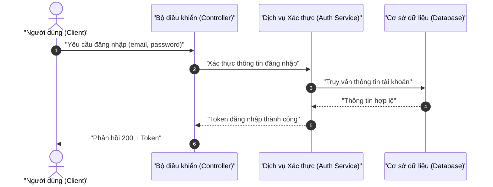

# FR/NFR Taxonomy & BA Analysis Knowledge Base

> [!NOTE]
> Tài liệu hợp nhất (merged) 5 nguồn tri thức BA từ `skills/ver-0.0.2/ba-analyst/`:
> classification-rules (§1), ba-elicitor normalization (§2), mermaid-syntax (§3),
> gherkin-guide (§4), risk-assessment (§5). Mỗi domain là 1 section độc lập.
> Semantic anchors: BABOK, ISO/IEC 25010, MoSCoW, FMEA.

---

## §1 — FR/NFR Classification & MoSCoW Matrix

> [!NOTE]
> Nguồn: `knowledge/classification-rules.md` (89 dòng). Định nghĩa phân loại yêu cầu + ma trận ưu tiên.

<instructions>
Phân loại tự động mọi yêu cầu đầu vào thành FR hoặc NFR trước khi gán MoSCoW.
</instructions>

```yaml
classification_rules:
  functional_requirements:
    definition: "Hành động, quy trình nghiệp vụ, CRUD, hoặc luồng tương tác hệ thống BẮT BUỘC thực thi."
    triggers: ["Luồng nghiệp vụ", "Thao tác dữ liệu (CRUD)", "Bước xử lý hệ thống", "Tương tác Actor — Hệ thống"]

  non_functional_requirements:
    definition: "Ràng buộc chất lượng, hiệu năng, bảo mật, khả năng mở rộng, tính sẵn sàng, trải nghiệm."
    rule_quantification: "Mọi NFR dạng cảm tính BẮT BUỘC lượng hóa thành chỉ số kỹ thuật đo lường được (xem §2)."
```

```yaml
moscow_matrix:
  must_have:   { priority: "P0", desc: "Bắt buộc (MVP). Thiếu thì hệ thống không vận hành được." }
  should_have: { priority: "P1", desc: "Quan trọng, không chặn phát hành. Có workaround tạm thời." }
  could_have:  { priority: "P2", desc: "Nice-to-have. Rủi ro thấp, dời pha sau không ảnh hưởng core flow." }
  wont_have:   { priority: "P3", desc: "Out of scope pha này. Định nghĩa rõ để tránh scope creep." }
```

**Technical justification examples:**
- P0: *"Thiếu lưu log giao dịch → vi phạm luật an toàn tài chính, không đối soát khi sự cố."*
- P1: *"Gửi email xác nhận giảm tỷ lệ bấm thanh toán trùng lặp."*
- P2: *"Xuất PDF giúp lưu trữ offline, nhưng user vẫn xem web/chụp màn hình được."*

**Trace tags convention:** `[TỪ INPUT]` (từ elicitation-report) · `[SUY LUẬN]` (suy luận BA) · `[CẦN LÀM RÕ]` (khoảng trống cần confirm).

**Required sources (compliance):** SRS, Wireframe Specs, User Story, Gherkin, Mermaid, Data Schema/ERD.

---

## §2 — NFR Quantification Mapping

> [!NOTE]
> Nguồn: pattern từ `ba-elicitor` normalization-logic. Bảng ánh xạ từ mơ hồ → metrics đo lường.

<instructions>
Thay mọi tính từ cảm tính bằng cặp `name + value (số) + unit`. Không giữ từ mơ hồ trong output.
</instructions>

```yaml
quantification_map:
  - vague: "nhanh / fast"
    metric: { name: "Latency p95", value: 200, unit: "ms" }
    rule: "95% API calls phải hoàn thành dưới ngưỡng."
  - vague: "mượt / smooth"
    metric: { name: "Response Time", value: 500, unit: "ms" }
    rule: "Thời gian phản hồi hiển thị tối đa."
  - vague: "an toàn / secure"
    metric: { name: "Auth Level", value: 0, unit: "n/a" }
    rule: "JWT auth + mã hóa AES-256 at rest, TLS 1.3 in transit."
  - vague: "không sập / reliable"
    metric: { name: "Availability", value: 99.9, unit: "%" }
    rule: "Uptime hàng tháng tối thiểu."
  - vague: "ổn định / stable"
    metric: { name: "Throughput", value: 1000, unit: "req/s" }
    rule: "Thông lượng duy trì dưới tải đỉnh."
  - vague: "linh hoạt / flexible"
    metric: { name: "Concurrent Users", value: 5000, unit: "users" }
    rule: "Số user đồng thời hỗ trợ."
```

> [!IMPORTANT]
> `metrics[].value` trong `analysis.schema.yaml` là **số (number)** — không để dạng string.

---

## §3 — Mermaid Diagram Safety Rules

> [!NOTE]
> Nguồn: `knowledge/mermaid-syntax.md` (153 dòng — giàu nhất). Quy tắc tránh render error.

<instructions>
BỌC TẤT CẢ labels bằng dấu ngoặc kép đôi. Parser Mermaid nhạy cảm với ký tự đặc biệt.
</instructions>

```yaml
safety_rules:
  label_quoting: 'A["Người dùng"] --> B{"Có lỗi?"}   # ĐÚNG. A[Người dùng] --> B{Có lỗi?} SAI'
  character_restrictions: "Không dùng (), [], {}, /, , bên ngoài dấu ngoặc kép."
  zero_placeholder: "Không TODO/TBD/mock/... bên trong sơ đồ."
```

**Sequence Diagram:** ≥3 actors/participants; đủ 3 luồng Happy / Alternative / Exception.
**Flowchart:** hướng TD hoặc LR; rẽ nhánh trong `{}` ghi rõ điều kiện, đường ra đặt tên.
**ERD:** đánh dấu `PK`/`FK`; khai báo kiểu dữ liệu mỗi cột (integer/string/boolean/timestamp).
**Use Case:** labels nằm trong `()`; actor + usecase + relationships.



---

## §4 — Gherkin Acceptance Criteria

> [!NOTE]
> Nguồn: `knowledge/gherkin-guide.md` (102 dòng). Chuyển yêu cầu → kịch bản test tự động hóa.

<instructions>
Mỗi tính năng có User Story + ≥3 scenarios (Happy / Alternative / Exception). Không từ mơ hồ.
</instructions>

```markdown
**User Story:**
As a [Actor] I want to [Hành động] So that [Giá trị]
```

```gherkin
Feature: [Tên tính năng]
  Scenario: [Tên kịch bản]
    Given [Bối cảnh]
    When [Hành động kích hoạt]
    Then [Kết quả mong đợi]
    And [Kết quả bổ sung]
```

```yaml
scenario_coverage_rules:
  minimum_scenarios: 3
  happy_path:      { desc: "Luồng chuẩn thành công.", min_count: 1 }
  alternative_path: { desc: "Nhánh rẽ hợp lệ khác.", min_count: 1 }
  exception_path:  { desc: "Lỗi/ngoại lệ: validation fail, mất kết nối.", min_count: 1 }

gherkin_quality_rules:
  testability: "Given/When/Then lượng hóa được. Bad: 'tải thật nhanh'. Good: 'trong < 2.0 giây'."
  zero_placeholder: "Tuyệt đối không TODO/TBD/mock."
  sync_format: "Dùng Markdown headers/tables sẵn sàng import Git/Notion."
```

---

## §5 — Risk Assessment Matrix

> [!NOTE]
> Nguồn: `knowledge/risk-assessment.md` (74 dòng). Ma trận P×I + mitigation (FMEA-style).

<instructions>
Mọi rủi ro liệt kê PHẢI có ít nhất 1 mitigation kỹ thuật cụ thể (không chung chung).
</instructions>

```yaml
risk_matrix:
  dimensions: { probability: ["Thấp", "Trung bình", "Cao"], impact: ["Thấp", "Trung bình", "Cao"] }
  levels:
    acceptable:       { P: "Thấp",     I: "Thấp",     action: "Theo dõi định kỳ." }
    needs_mitigation: { P: "Trung bình", I: "Cao",     action: "Thiết kế giải pháp dự phòng." }
    unacceptable:     { P: "Cao",     I: "Cao",     action: "Mitigation ngay trước triển khai." }

action_rules:
  - "Change Impact Vector: khoanh vùng module/API/table bị ảnh hưởng."
  - "Pre-change Risk Estimation: ước lượng hiệu năng/bảo mật/mở rộng trước design."
  - "Mitigation Paths: mỗi risk có giải pháp cụ thể (caching, rate limiting, mã hóa, DB replica)."

moscow_integration:
  high_risk_must_have:  { cond: "Rủi ro Cao + P0",       strategy: "Mitigation vào MVP." }
  high_risk_wont_have:  { cond: "Rủi ro Cao + P3",       strategy: "Re-scope loại bỏ rủi ro." }
  low_risk_could_have:  { cond: "Rủi ro Thấp + P2",      strategy: "Monitor & Accept." }
```

| Mã RR | Mô tả rủi ro | Xác suất | Tác động | Giải pháp giảm thiểu |
|:---|:---|:---:|:---:|:---|
| RR-01 | AWS credential rò rỉ khi hardcode source | Trung bình | Cao | IAM Instance Role / Vault / ENV secrets |
| RR-02 | DB backup timeout do data >10GB | Trung bình | Trung bình | Streaming compress / incremental backup |
| RR-03 | Client spam API làm treo server | Cao | Trung bình | Rate limiting 3 req/giờ/user tại API Gateway |
