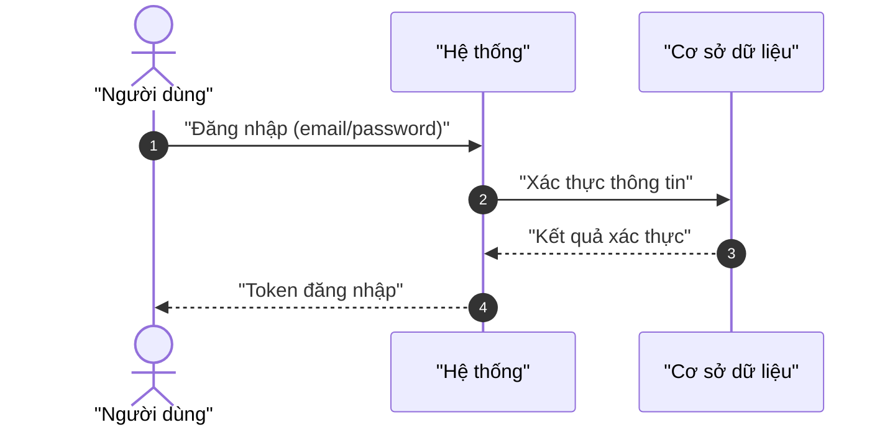
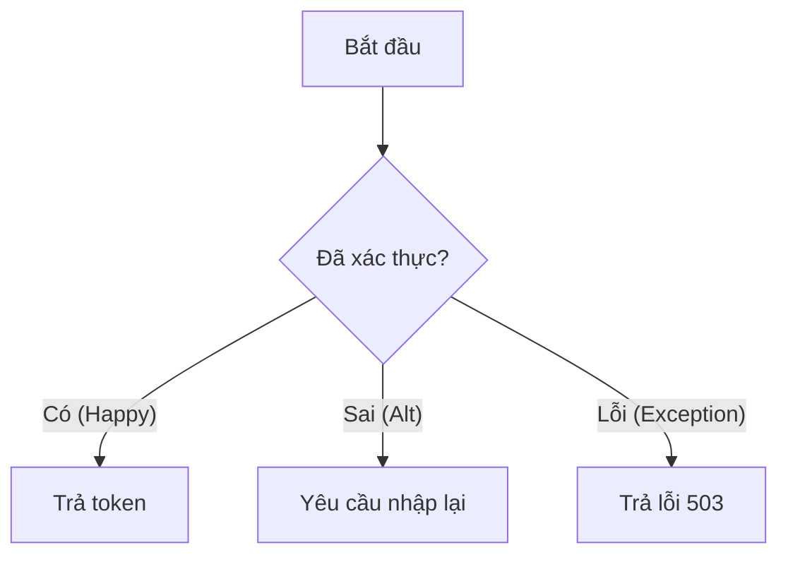
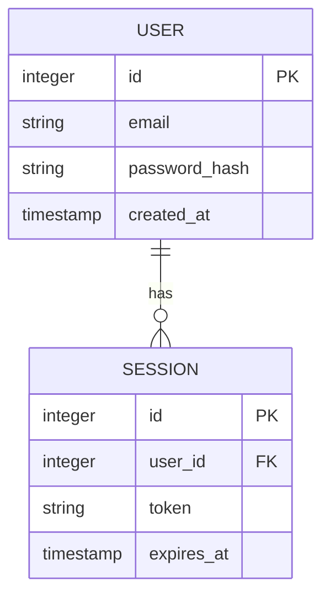

> [!NOTE]
> **Artifact Metadata (KHÔNG thuộc frontmatter schema-validated).**
> Các trường dưới đây ghi đè lên WORM contract nhưng không nằm trong
> `analysis.schema.yaml` (schema dùng `additionalProperties: false`), nên đặt
> ở phần thân này chứ không đưa vào YAML frontmatter ở trên.
>
> ```yaml
> analyzed_by: "ba-analyst"
> analyzed_at: "ISO-8601 timestamp (ví dụ 2026-07-11T14:30:00Z)"
> status: "completed | pending_clarification"
> schema_ref: "skills/ver-3/_shared/schemas/analysis.schema.yaml"
> artifact_lifecycle: "WORM"
> validated_by: "schema_validator.py"
> trace_tags: ["TỪ INPUT", "SUY LUẬN", "CẦN LÀM RÕ"]
> ```

# Báo Cáo Phân Tích Nghiệp Vụ & Đặc Tả Kỹ Thuật

## §1: Classification & MoSCoW Matrix

| ID | Yêu cầu | Loại | MoSCoW | Giải thích kỹ thuật |
|:---|:--------|:----:|:------:|:-------------------|
| FR-01 | Đăng nhập email/password | FR | P0 — Must | Core auth, không thể thiếu |
| FR-02 | Đăng nhập Google OAuth | FR | P1 — Should | Tăng UX, có thể delay |
| NFR-01 | Latency đăng nhập ≤ 2s | NFR | P0 — Must | User retention threshold |

## §2: System Diagrams (Sequence + Flowchart + ERD)

### Sequence Diagram



### Flowchart



### ERD



## §3: Data Schema Design (tables + JSON Schema)

| Tên trường | Kiểu | Ràng buộc | Mô tả |
|:---|:---|:---|:---|
| `id` | `integer` | `PK, AUTO_INCREMENT` | Khóa chính |
| `created_at` | `timestamp` | `NOT NULL` | Thời gian tạo |

```json
{
  "$schema": "http://json-schema.org/draft-07/schema#",
  "title": "UserSchema",
  "type": "object",
  "properties": {
    "id": { "type": "integer" },
    "created_at": { "type": "string", "format": "date-time" }
  },
  "required": ["id", "created_at"]
}
```

## §4: Gherkin Acceptance Criteria (3-path)

**User Story:** As a user, I want to log in with email and password so that I can access my account securely.

```gherkin
Feature: User Authentication
  Scenario: Happy Path — Đăng nhập thành công
    Given user có tài khoản hợp lệ
    When user nhập email và password chính xác
    Then hệ thống trả về token đăng nhập

  Scenario: Alternative Path — Sai mật khẩu
    Given user có tài khoản hợp lệ
    When user nhập sai password 3 lần
    Then tài khoản bị khóa 15 phút

  Scenario: Exception Path — Hệ thống lỗi
    Given database không khả dụng
    When user cố gắng đăng nhập
    Then hệ thống trả về lỗi 503 kèm retry-after header
```

## §5: Risk Assessment Matrix (P×I + mitigation)

| Mã RR | Mô tả rủi ro | Xác suất | Tác động | Giải pháp giảm thiểu |
|:---|:---|:---:|:---:|:---|
| RR-01 | Token leak do hardcode | Trung bình | Cao | Lưu secret trong Vault / ENV |
| RR-02 | DB timeout khi tải cao | Cao | Trung bình | Connection pool + retry với backoff |

## §6: Traceability Mapping (requirement → diagram → test → risk)

- **Yêu cầu phân loại**: [TỪ INPUT] ánh xạ từ `elicitation-report.md`.
- **Sơ đồ & logic**: [SUY LUẬN] suy luận từ quy tắc nghiệp vụ.
- **Điểm chưa rõ**: [CẦN LÀM RÕ] khoảng trống cần Elicitor confirm.
