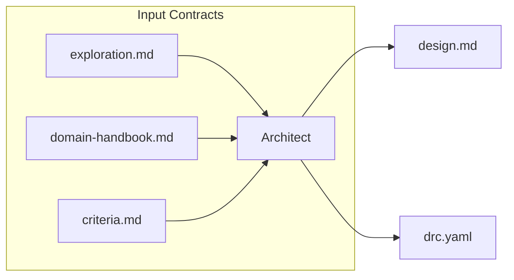
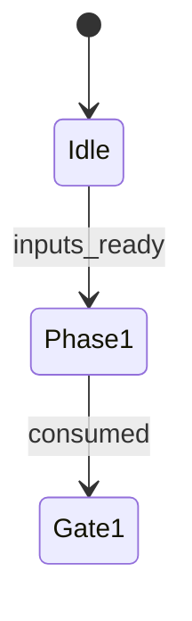
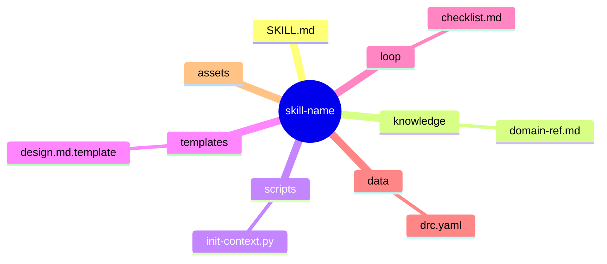
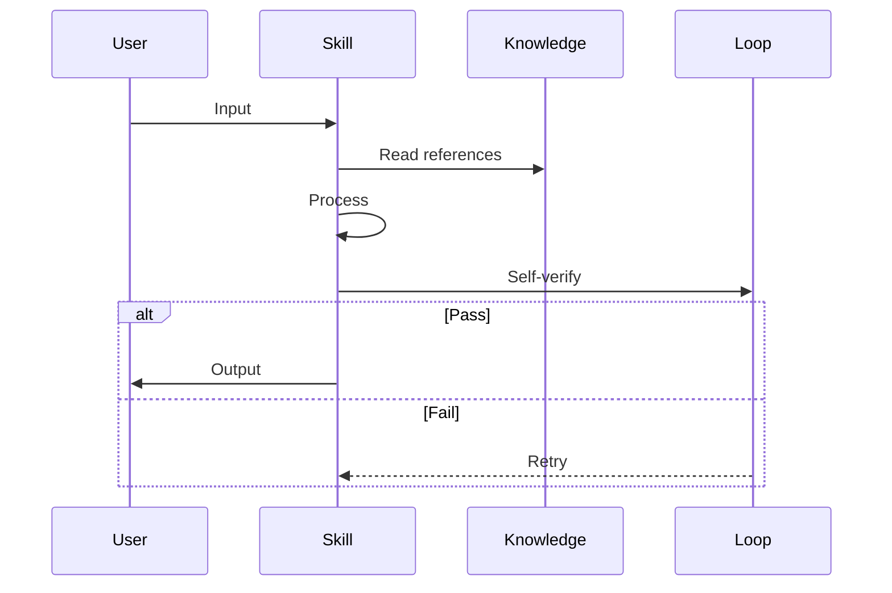
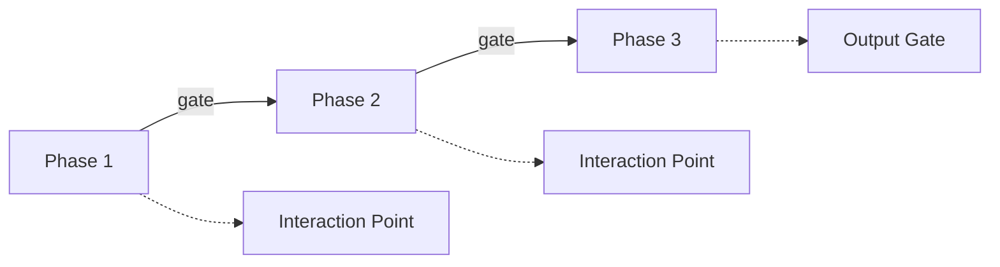
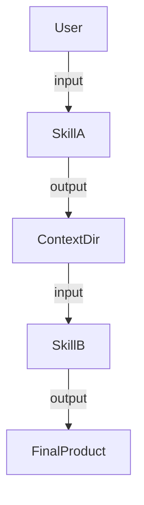
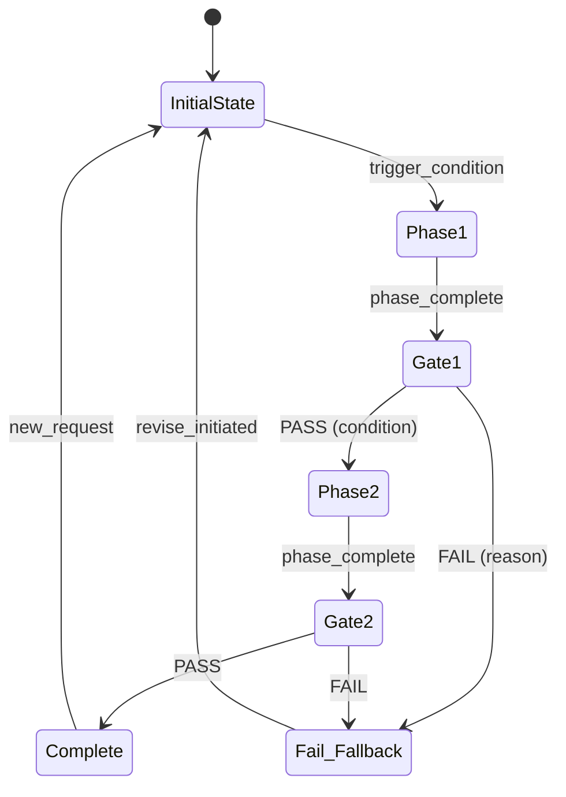
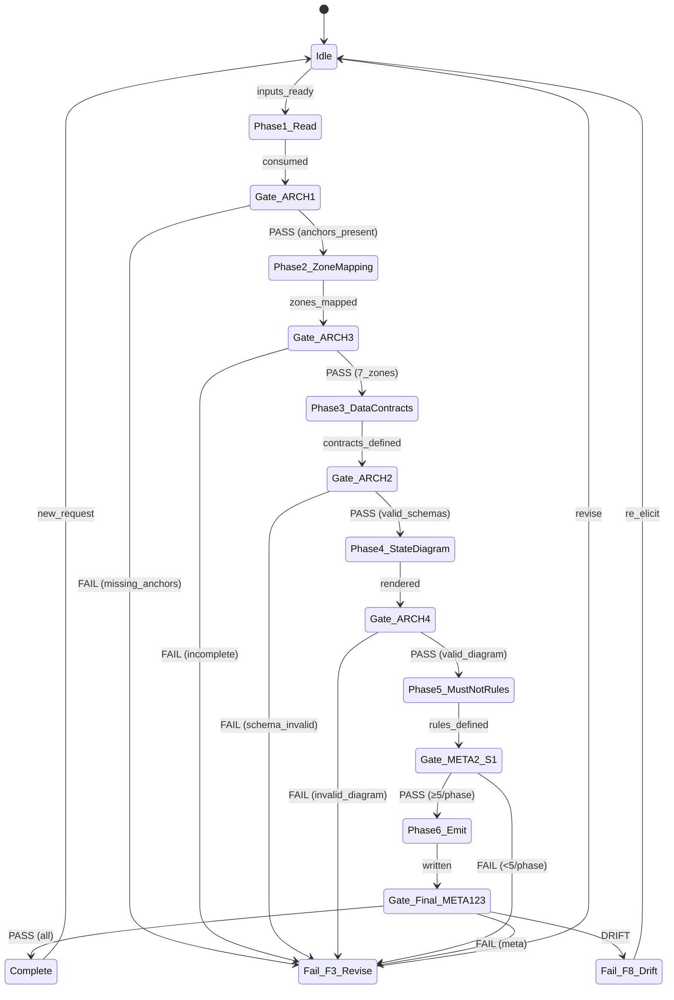
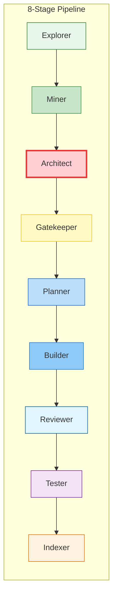

# Visualization & Diagram Guidelines

This guide defines how to create effective, concrete, and unambiguous architecture diagrams for Agent Skills. Use when designing a new skill to ensure clarity for both humans and AI.

## Principle: "Show, then explain"

For each major concept, FIRST draw a diagram, THEN add a table or text that explains details the diagram cannot convey. Never replace a diagram with a table.

### "Show, then explain" Examples

**Good** — Data Contract Visualization:

Then explain: "Three upstream artifacts feed the architect. Two outputs: design.md (primary, WORM lifecycle) and drc.yaml (routing contract). Design.md consumed by gatekeeper S1.5 and planner S2. drc.yaml consumed by gatekeeper S1.5 only."

**Good** — State Machine Visualization:

Then explain: "The workflow starts in Idle. When all 3 inputs are ready, transition to Phase 1. After consumption, gate evaluation."

## Diagram Types & When to Use

| # | Diagram Type | Mermaid Syntax | Use When |
|---|---|---|---|
| D1 | **Folder Structure** | `mindmap` | ALWAYS — show the skill's directory tree |
| D2 | **Execution Flow** | `sequenceDiagram` | ALWAYS — show runtime interaction |
| D3 | **Workflow Phases** | `flowchart LR` | Multi-phase with clear stages |
| D4 | **Relationship** | `flowchart TD` | External systems or skill connections |
| D5 | **Data Flow** | `flowchart LR` | Data transforms through multiple stages |

## Mermaid Skeletons

### D1 — Folder Structure (Mindmap)

### D2 — Execution Flow (Sequence)

### D3 — Workflow Phases (Flowchart)

### D4 — Relationship (Flowchart)

## State Diagram Syntax (stateDiagram-v2)

### Skeleton for §4 State Machine

### Rules for State Diagrams
- Initial state must be named (not just `[*]`)
- Every transition must have a trigger label
- All decision gates must have both PASS and FAIL transitions (no single-branch gates)
- Fallback states (F3, F8) must be reachable from every gate
- Use `stateDiagram-v2` syntax (not `stateDiagram`)
- Guard conditions in parentheses: `PASS (condition_met)`
- States should be CamelCase (Phase1_Read, Gate_ARCH1)

### Example: 6-Phase State Machine

## Pipeline Integration Diagram Styling

## Quality Checklist for Diagrams

- [ ] Each diagram has a clear title or is under a descriptive heading
- [ ] Participants/nodes use short, readable labels
- [ ] Decision points (alt/else, gates) are visible where logic branches
- [ ] Interaction points with user are explicitly marked
- [ ] Diagram renders correctly in standard Mermaid (no unsupported syntax)
- [ ] State diagrams have both PASS and FAIL transitions from all gates
- [ ] Fallback routes (F3, F8) are present where applicable

---

> **Last Updated**: 2026-07-22
> **Purpose**: Mermaid visualization standards for skill-architect ver-3
