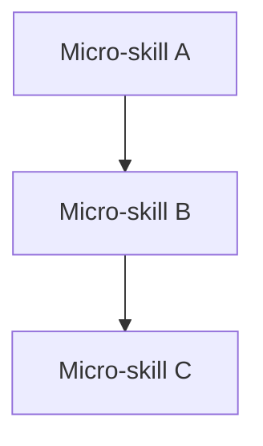

# Architecture Prompt Standards & Format Requirements Analysis

> Phân tích từ: `standards.md`, `CLAUDE.md`, và các resource files trong `.skill-context/skill-explorer-main-build/resources/`
> Mục đích: Xây dựng format template cho architecture design prompt

---

## 1. Format Selection Rules (từ standards.md)

### Nguyên lý cốt lõi
Format tốt không phải format đẹp nhất, mà là format giúp mô hình trả lời nhanh các câu hỏi:
- Đây là mệnh lệnh hay dữ liệu tham chiếu?
- Đây là luật bắt buộc hay gợi ý mềm?
- Thông tin này luôn cần hay chỉ dùng theo ngữ cảnh?
- Phần nào là ví dụ, phần nào là tiêu chí chấp nhận?
- Khi có xung đột, ưu tiên nào cao hơn?

### Bảng Format Selection

| Format | Dùng cho | Tránh dùng cho |
|--------|----------|----------------|
| **Markdown** | Explanation, architecture, rationale, onboarding, domain knowledge, human-readable docs | Hard rules without schema, long mixed policy blocks |
| **YAML** | Constraints, policies, checklists, routing, permission maps, output contracts, acceptance criteria | Long prose, complex narrative context, deeply nested documents |
| **XML-like tags** | Semantic boundaries, separating context from instruction, wrapping examples, wrapping external input, parseable output sections | Excessive micro-tagging, replacing all markdown, deeply nested prompt trees |

### Tổ hợp khuyến nghị cho Architecture Prompt
```
Hybrid: Markdown (explanation + rationale) + YAML (constraints + policies + output contract) + XML (semantic boundaries)
```

---

## 2. Token Budget Allocation Advice

### Token Budget by Layer (kiến trúc)

| Layer | Good | Warning | Split When |
|-------|------|---------|------------|
| **L0 Anchor Rules** (instructions, non-negotiables) | 150-400 tokens | 500-700 tokens | > 700 tokens |
| **L1 Working Policy** (coding rules, tool rules, output contract) | 400-1200 tokens | 1200-2000 tokens | > 2000 tokens |
| **L2 Domain Context** (kiến trúc, domain glossary, data flow) | 600-2500 tokens | 2500-5000 tokens | > 5000 tokens |
| **L3 Evidence/Examples** (specs, logs, examples, fixtures) | 300-2000 tokens | 2000-6000 tokens | > 6000 tokens |

### Token Budget by Format Block

| Format Block | Light | Medium | Heavy | Overloaded |
|-------------|-------|--------|-------|------------|
| Markdown section | 100-400 | 400-900 | 900-1800 | > 1800 |
| YAML block | 80-300 | 300-700 | 700-1200 | > 1200 |
| XML block | 50-250 | 250-800 | 800-1500 | > 1500 |
| **Root guide total** | Excellent: 300-900 | Good: 900-1800 | Warning: 1800-3000 | Heavy: 3000-5000 |

### Khuyến nghị allocation cho Architecture Design Prompt

```
Architecture Prompt = ~2500-4000 tokens (Warning → Heavy zone → cần phân tầng cẩn thận)
├─ L0: Instructions + Non-negotiables    200-400 tokens  (XML + YAML)
├─ L1: Working Policy + Constraints      500-900 tokens  (YAML)
├─ L1: Output Contract                    200-400 tokens  (YAML)
├─ L2: Architecture Context              600-1200 tokens (Markdown + Mermaid)
├─ L2: Process Flow                      400-800 tokens  (Markdown + Mermaid)
└─ L2: Design Schema + Zone Mapping      300-600 tokens  (YAML + Markdown)
```

**Cảnh báo**: Nếu vượt 3000 tokens → cần tách L2 vào file riêng (progressive disclosure).  
Root guide (SKILL.md) tuyệt đối không quá 700-900 tokens.

### Lưu ý Tiếng Việt
- Tiếng Việt: 1 token ≈ 3-5 ký tự (dao động mạnh)
- Tiếng Anh: 1 token ≈ 4 ký tự
- Khi viết bilingual, tính toán dư ~30% token budget cho phần Tiếng Việt

---

## 3. Semantic Activation Anchors (nên dùng nhất quán)

Từ standards.md, các anchor đã được chuẩn hóa và cần dùng **nhất quán** trong toàn bộ architecture prompt:

### Priority Rules Group
```
<instructions>...</instructions>     — mệnh lệnh điều khiển hành vi (bắt buộc)
non_negotiables / hard_rules         — luật không được vi phạm
constraints                          — must / must_not
priority_order                       — thứ tự ưu tiên khi xung đột
```

### Task Execution Group
```
task / scope                         — xác định miền tác vụ
plan / steps                         — các bước thực hiện
stop_conditions                      — điều kiện dừng
validation                           — kiểm định kết quả
```

### Quality Control Group
```
acceptance_criteria                  — tiêu chí nghiệm thu
output_contract                      — định dạng đầu ra bắt buộc
review_checklist / definition_of_done
risk_notes                           — rủi ro và giảm thiểu
```

### Context Boundaries Group (dùng XML tags)
```
<context>...</context>               — dữ liệu tham chiếu, không phải lệnh
<examples>...</examples>             — ví dụ pattern đúng/sai
<evidence>...</evidence>             — bằng chứng từ codebase
<input>...</input>                   — thông tin người dùng / tài liệu nguồn
<output_contract>...</output_contract> — định dạng đầu ra
```

### Routing & Loading Group
```
load_when_needed                     — bản đồ nạp context động
domain_map / file_map                — file và module mapping
relevant_context                     — context cần cho task hiện tại
routing_rules                        — luật điều hướng giữa các zones
```

---

## 4. Kiến trúc Prompt Khuyến nghị

Dựa trên **4-Layer Knowledge Model** từ standards.md và **8-Stage Pipeline** từ CLAUDE.md:

### Cấu trúc tổng thể (Hierarchical)

```
ARCHITECTURE PROMPT STRUCTURE
├── ═══════════════════════════════════════════
├── L0: ROOT (SKILL.md / Root Guide)
│   ├── Frontmatter (YAML)
│   ├── <instructions>...</instructions>
│   ├── priority_order + constraints (YAML)
│   ├── non_negotiables
│   └── Working Map (load_when_needed)
│   └── Token budget: 300-700 tokens
│
├── ═══════════════════════════════════════════
├── L1: WORKING POLICY (policy/*.md)
│   ├── Output contract (YAML)
│   ├── Zone mapping rules
│   ├── Tool use policy
│   ├── Quality gates checklist
│   └── Token budget: 400-1200 tokens
│
├── ═══════════════════════════════════════════
├── L2: DOMAIN CONTEXT (knowledge/*.md)
│   ├── Architecture overview (Markdown)
│   ├── Mermaid diagrams (data flow, module map)
│   ├── Process flow: As-Is vs To-Be
│   ├── 7-Zone planning
│   ├── SCS scoring (bảng Complexity Score)
│   └── Token budget: 600-2500 tokens
│
└── ═══════════════════════════════════════════
└── L3: EVIDENCE (nạp task-specific)
    ├── Code exemplars (từ codebase)
    ├── API specs
    ├── Resource files
    └── Token budget: 300-2000 tokens
```

### Template Reference: output spec từ Explorer (07-explorer-output-spec.md)

Đây là cấu trúc thực tế đã được chuẩn hóa cho Stage 0 → Stage 1:

```
exploration.md (output)
├── §1 Pain Point & Core Objective
├── §2 Existing Resources Audit (Rich vs Thin)
├── §3 Seven Golden Standards Assessment
├── §3.3 Skill Scale & Decomposition Assessment (SCS scoring)
├── §4 AI Instruction Standards & Rules
├── §5 Process Flow & Automation Mapping (As-Is / To-Be)
├── §6 Architectural Recommendations (7-Zone mapping)
├── §7 Risks & Open Questions
└── §8 Metadata (YAML frontmatter)
```

---

## 5. Format Template cho Architecture Design Prompt

```markdown
---
name: <skill-name>-architect
description: "<mô tả>"
version: 0.0.1
suite: WASHVN
---

# === BOOT CONFIGURATION (L0 — Anchor Rules) ===

<instructions>
must:
  - <luật bắt buộc 1>
  - <luật bắt buộc 2>
must_not:
  - <điều cấm 1>
  - <điều cấm 2>
</instructions>

<context>
### Boot Sequence
1. Đọc SKILL.md — done
2. Nạp context từ .skill-context/{target_skill}/
3. Kiểm tra exploration.md đã tồn tại?
   - YES → phân tích
   - NO → dừng, yêu cầu Stage 0

### Token Budget & Priorities
- token_budget: { SKILL_md: 700, L1_limit: 1200, L2_limit: 2500, enforcement: hard }
- priority_order: [<ưu tiên 1>, <ưu tiên 2>, ...]

### Routing Map
- Tier 1 (Boot): <file bắt buộc>
- Tier 2 (Conditional): <file theo phase>
- Tier 3 (On-Demand): <file chi tiết>
</context>

---

## Architecture Design Body (L2)

<!-- 7-Zone Assessment -->
### 1. Core Zone Design
```yaml
core_zone:
  role: "<vai trò>"
  mapping:
    - direct_output: "<đường dẫn>"
    - shared_rules: "<đường dẫn>"
```

### 2. Knowledge Zone
- domain_docs: <đường dẫn>
- tri thức cần tách biệt

### 3. Scripts Zone
- Code generation scripts
- Validation scripts

### 4. Templates Zone
- Output templates
- Init scripts

### 5. Loop Zone
- Quality checklists
- Guardrails

### 6. Data Zone
- Schemas, blacklists
- Static config

### 7. Assets Zone
- Images, diagrams
- Supporting files

---

## Process Flow (As-Is vs To-Be)

> [!IMPORTANT]
> Vẽ Mermaid diagram cho luồng phối hợp nếu SCS > 3.0



---

## Output Contract (L1)

```yaml
output_contract:
  artifact: ".skill-context/{target_skill}/design.md"
  format: markdown_with_yaml_frontmatter
  required_sections:
    - zone_mapping
    - process_flow
    - quality_gates
    - risk_assessment
    - routing_rules
  handoff_to: gatekeeper
```

---

## Quality Gates Checklist

```yaml
quality_gates:
  - Đã kiểm tra 7 Golden Standards?
  - Đã chạy SCS scoring?
  - Có Mermaid diagrams cho process flow?
  - Có output contract rõ ràng?
  - Có routing map (load_when_needed)?
  - Có phân tách L0/L1/L2 rõ ràng?
```

---

## 6. Checks: Overload Detection

| Zone | Smell | Fix |
|------|-------|-----|
| **Markdown section** > 900 tokens | Trộn explanation + rules + exceptions | Chuyển policy sang YAML, split domain context |
| **YAML block** > 700 tokens | Quá sâu (>3-4 levels), multi-domain in one block | Split by domain, flatten schema |
| **XML** | Tags wrap nearly every sentence | Use outer block tags only |
| **Root guide** | Grows every sprint, contains examples | Keep only L0 + minimal L1, add working map |

---

## 7. Kết luận

- **Format chuẩn**: Hybrid Markdown + YAML + XML-like tags
- **Phân tầng**: 4-Layer Knowledge Model (L0 → L3)
- **Budget**: Root guide ≤ 700-900 tokens, tổng prompt ≤ 3000-4000 tokens
- **Anchors nhất quán**: Dùng đúng semantic keys từ standards.md
- **Output contract**: YAML bắt buộc, có handoff field
- **Progressive Disclosure**: Chỉ nạp L2/L3 khi cần, dùng Working Map
- **Tiếng Việt**: Tính dư budget ~30% cho phần tiếng Việt
