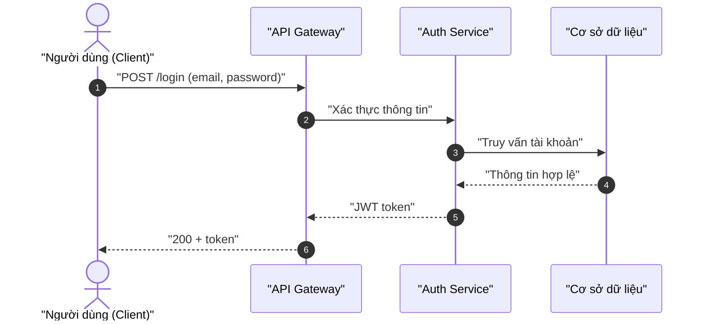
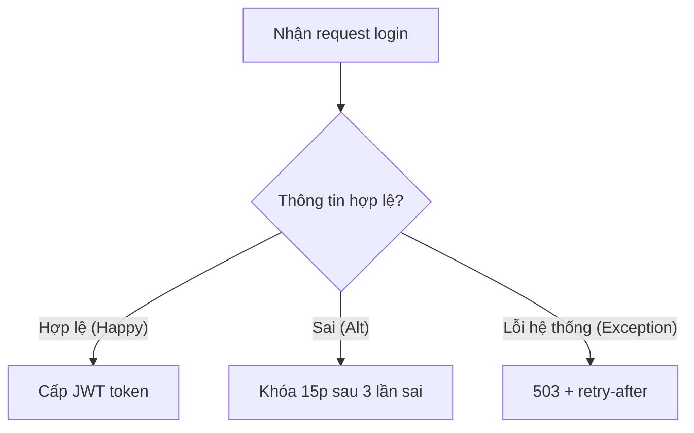
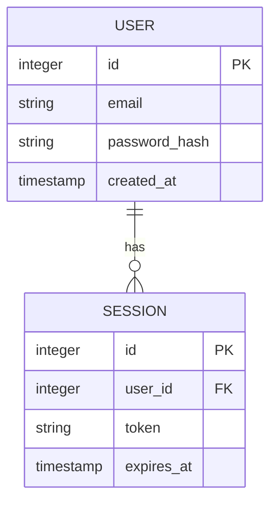

> [!NOTE]
> **Artifact Metadata (không thuộc frontmatter schema).**
> analyzed_by: "ba-analyst"
> analyzed_at: "2026-07-11T14:30:00Z"
> status: "completed"
> schema_ref: "skills/ver-3/_shared/schemas/analysis.schema.yaml"
> artifact_lifecycle: "WORM"
> validated_by: "schema_validator.py"
> trace_tags: ["TỪ INPUT", "SUY LUẬN", "CẦN LÀM RÕ"]

# Báo Cáo Phân Tích — Tính năng Đăng nhập

## §1: Classification & MoSCoW Matrix

| ID | Yêu cầu | Loại | MoSCoW | Giải thích kỹ thuật |
|:---|:--------|:----:|:------:|:-------------------|
| FR-01 | Đăng nhập email/password | FR | P0 — Must | Core auth, thiếu không vận hành được |
| FR-02 | Đăng nhập Google OAuth | FR | P1 — Should | Tăng UX, có workaround |
| NFR-01 | Latency đăng nhập ≤ 2s | NFR | P0 — Must | Giữ chân user |
| NFR-02 | Availability ≥ 99.9% | NFR | P0 — Must | SLA vận hành |

## §2: System Diagrams

### Sequence



### Flowchart



### ERD



## §3: Data Schema Design

| Tên trường | Kiểu | Ràng buộc | Mô tả |
|:---|:---|:---|:---|
| `id` | `integer` | `PK, AUTO_INCREMENT` | Khóa chính |
| `email` | `string` | `UNIQUE, NOT NULL` | Email đăng nhập |
| `password_hash` | `string` | `NOT NULL` | Bcrypt hash |
| `created_at` | `timestamp` | `NOT NULL` | Thời gian tạo |

```json
{
  "$schema": "http://json-schema.org/draft-07/schema#",
  "title": "UserSchema",
  "type": "object",
  "properties": {
    "id": { "type": "integer" },
    "email": { "type": "string", "format": "email" },
    "created_at": { "type": "string", "format": "date-time" }
  },
  "required": ["id", "email", "created_at"]
}
```

## §4: Gherkin Acceptance Criteria

**User Story:** As a user, I want to log in with email and password so that I can access my account securely.

```gherkin
Feature: User Authentication
  Scenario: Happy Path — Đăng nhập thành công
    Given user có tài khoản hợp lệ
    When user gửi email và password chính xác
    Then hệ thống trả về JWT token và status 200

  Scenario: Alternative Path — Đăng nhập Google OAuth
    Given user chọn đăng nhập Google
    When user xác thực thành công trên Google
    Then hệ thống tạo tài khoản/nối phiên và trả JWT token

  Scenario: Exception Path — Hệ thống lỗi DB
    Given database không khả dụng
    When user cố gắng đăng nhập
    Then hệ thống trả về lỗi 503 kèm header retry-after
```

## §5: Risk Assessment Matrix

| Mã RR | Mô tả rủi ro | Xác suất | Tác động | Giải pháp giảm thiểu |
|:---|:---|:---:|:---:|:---|
| RR-01 | Secret rò rỉ do hardcode | Trung bình | Cao | Secrets Manager / ENV, xoay key 30 ngày |
| RR-02 | DB down khi auth | Cao | Cao | Replica failover + circuit breaker |
| RR-03 | Brute-force password | Cao | Trung bình | Rate limit + khóa 15p |

## §6: Traceability Mapping

- **Yêu cầu phân loại**: [TỪ INPUT] ánh xạ từ elicitation-report (FR-01, FR-02).
- **Sơ đồ & logic**: [SUY LUẬN] ERD USER/SESSION suy từ luồng session.
- **Điểm chưa rõ**: [CẦN LÀM RÕ] chính sách expire token cụ thể chưa được Elicitor cung cấp.
