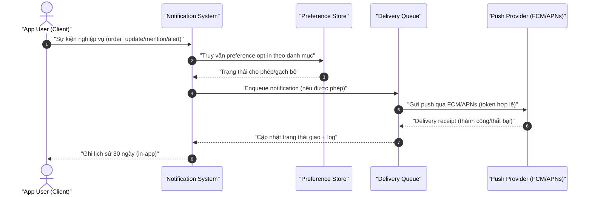
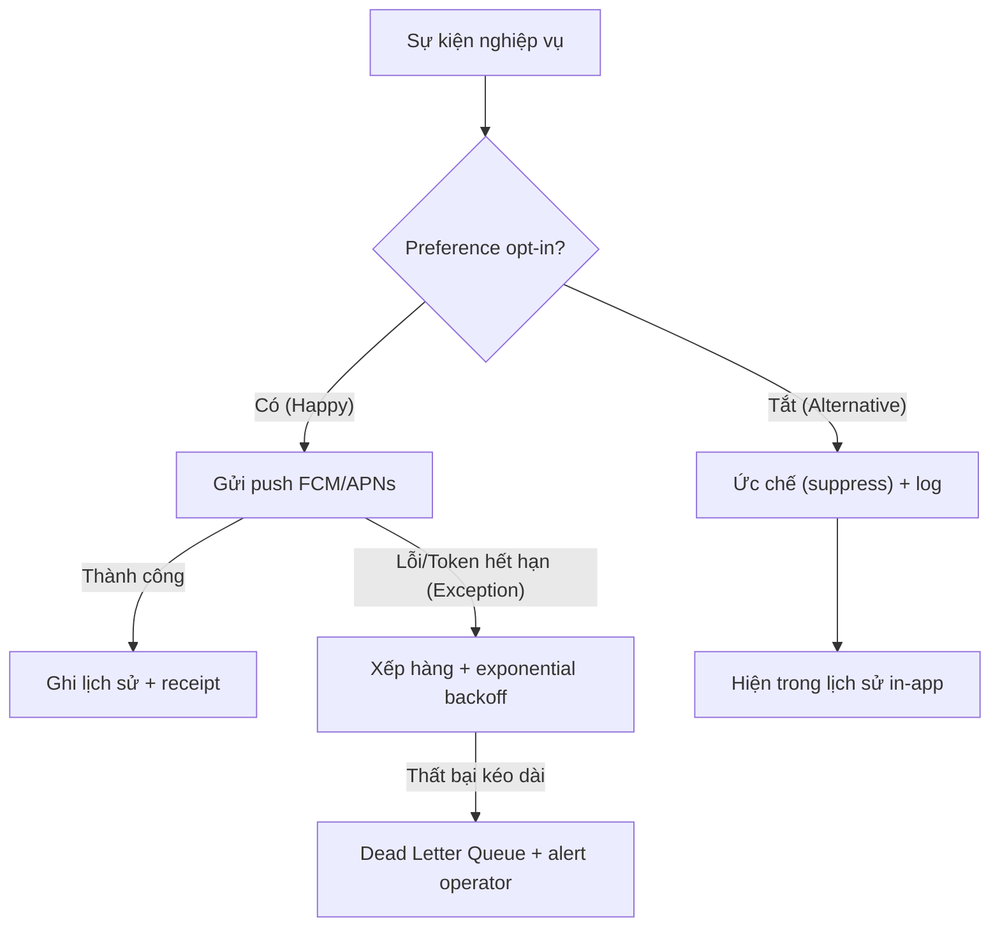
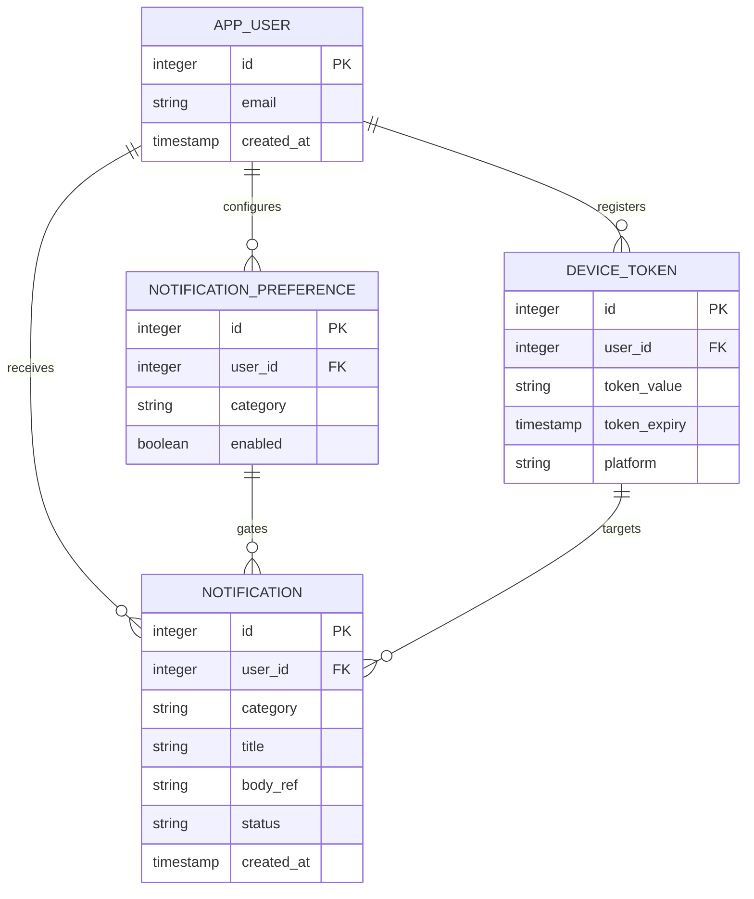

> [!NOTE]
> **Artifact Metadata (KHÔNG thuộc frontmatter schema-validated — schema dùng `additionalProperties: false`).**
> ```yaml
> analyzed_by: "ba-analyst"
> analyzed_at: "2026-07-11T14:30:00Z"
> status: "completed"
> schema_ref: "skills/ver-3/_shared/schemas/analysis.schema.yaml"
> artifact_lifecycle: "WORM"
> validated_by: "schema_validator.py + validate_metrics.py"
> ```

# Báo Cáo Phân Tích Kỹ Thuật — mock-notify-feature

## §1: Classification & MoSCoW Matrix

| ID | Yêu cầu | Loại | MoSCoW | Giải thích kỹ thuật |
|:---|:--------|:----:|:------:|:-------------------|
| FR-01 | Push khi order_update | FR | P0 — Must | Core delivery, thiếu thì tính năng vô nghĩa |
| FR-02 | Push khi mention | FR | P0 — Must | Core delivery, MECE với FR-01/03 |
| FR-03 | Phát system_alert | FR | P0 — Must | Cảnh báo bắt buộc cho người dùng |
| FR-04 | Cấu hình preference theo danh mục | FR | P0 — Must | Cổng kiểm soát gửi, deny-by-default |
| NFR-01 | Latency p95 ≤ 500ms | NFR | P0 — Must | retention threshold, đo trên create→enqueue |
| NFR-02 | Throughput ≤ 100 rps | NFR | P0 — Must | burst protection, token bucket |
| NFR-03 | Availability ≥ 99.9% | NFR | P0 — Must | uptime tháng, SLA operator |
| NFR-04 | WCAG AA | NFR | P1 — Should | a11y giao diện config/lịch sử |
| NFR-05 | Mandatory opt-in | NFR | P0 — Must | tuân thủ đồng ý, chặn gửi trái phép |
| NFR-06 | Pagination 12/page | NFR | P1 — Should | giới hạn payload list |
| NFR-07 | Filter simple_text_match | NFR | P2 — Could | default lọc nội dung, nâng cấp sau |

## §2: System Diagrams

### Sequence Diagram (5 actors, double-quote labels)



### Flowchart (3-path: Happy / Alternative / Exception)



### ERD (PK/FK + kiểu dữ liệu)



## §3: Data Schema Design

| Trường | Kiểu | Ràng buộc | Mô tả |
|:---|:---|:---|:---|
| `id` | `integer` | `PK, AUTO_INCREMENT` | Khóa chính |
| `user_id` | `integer` | `FK → app_user.id, NOT NULL` | Người nhận |
| `category` | `string` | `enum[order_update,mention,system_alert]` | Danh mục |
| `title` | `string` | `NOT NULL, max 80` | Tiêu đề (không PII) |
| `body_ref` | `string` | `NOT NULL` | Tham chiếu nội dung, không PII thô |
| `status` | `string` | `enum[queued,sent,failed,suppressed]` | Trạng thái giao |
| `created_at` | `timestamp` | `NOT NULL` | Thời gian tạo (TTL 30d) |

```json
{
  "$schema": "http://json-schema.org/draft-07/schema#",
  "title": "NotificationSchema",
  "type": "object",
  "properties": {
    "id": { "type": "integer" },
    "user_id": { "type": "integer" },
    "category": { "type": "string", "enum": ["order_update", "mention", "system_alert"] },
    "title": { "type": "string", "maxLength": 80 },
    "body_ref": { "type": "string" },
    "status": { "type": "string", "enum": ["queued", "sent", "failed", "suppressed"] },
    "created_at": { "type": "string", "format": "date-time" }
  },
  "required": ["id", "user_id", "category", "title", "body_ref", "status", "created_at"]
}
```

```json
{
  "$schema": "http://json-schema.org/draft-07/schema#",
  "title": "NotificationPreferenceSchema",
  "type": "object",
  "properties": {
    "id": { "type": "integer" },
    "user_id": { "type": "integer" },
    "category": { "type": "string", "enum": ["order_update", "mention", "system_alert"] },
    "enabled": { "type": "boolean" }
  },
  "required": ["id", "user_id", "category", "enabled"]
}
```

## §4: Gherkin Acceptance Criteria

**User Story:** As an App User, I want to receive push notifications for order updates, mentions, and system alerts only when I opt in, so that I stay informed without notification fatigue.

```gherkin
Feature: Mobile Notification Delivery
  Scenario: Happy Path — Gửi thành công khi opt-in
    Given user bật preference danh mục "order_update"
    And device token hợp lệ chưa hết hạn
    When sự kiện cập nhật đơn hàng xảy ra
    Then hệ thống tạo notification và enqueue trong vòng 500ms p95
    And push đến thiết bị qua FCM/APNs thành công
    And bản ghi lịch sử được ghi với status "sent"

  Scenario: Alternative Path — Bị ức chế khi tắt preference
    Given user tắt preference danh mục "mention"
    When sự kiện mention xảy ra
    Then hệ thống đánh dấu notification status "suppressed"
    And sự kiện được ghi log không gửi push
    And user vẫn thấy mục trong lịch sử in-app

  Scenario: Exception Path — Token hết hạn / provider lỗi
    Given device token của user đã hết hạn
    When hệ thống cố gửi push qua FCM/APNs
    Then provider trả lỗi 4xx và receipt báo failed
    And hệ thống xếp vào Delivery Queue với exponential backoff
    And sau thất bại kéo dài đưa vào Dead Letter Queue và alert operator
    And core flow không sập, lịch sử vẫn ghi status "failed"
```

## §5: Risk Assessment Matrix (P×I)

| Mã RR | Rủi ro | Xác suất | Tác động | P×I | Giải pháp giảm thiểu |
|:---|:---|:---:|:---:|:---:|:---|
| RR-01 | Token hết hạn gửi tiếp | Trung bình | Cao | 6 | TTL check + prune + receipt loop |
| RR-02 | Bỏ qua opt-in | Thấp | Cao | 3 | Preference gate deny-by-default + test |
| RR-03 | Vượt 100 rps burst | Cao | Trung bình | 6 | Token bucket + backpressure + drop oldest |
| RR-04 | Push provider outage | Trung bình | Cao | 6 | Exponential backoff + DLQ + alert |
| RR-05 | PII trong payload | Thấp | Cao | 3 | Chỉ reference id, mã hóa at rest |
| RR-06 | Lịch sử 30d phình | Trung bình | Trung bình | 4 | TTL purge + pagination 12 + index |

Rủi ro Cao (RR-01, RR-03, RR-04) đều gắn với P0 → mitigation đưa vào MVP.

## §6: Traceability Mapping

- `[TỪ INPUT]` FR-01..04, danh mục 3 loại, FCM+APNs, 30-day history, backoff.
- `[SUY LUẬN]` NFR defaults (500ms, 100rps, 99.9%, WCAG AA, 12/page, simple_text_match, mandatory opt-in), ERD entities, risk matrix.
- `[CẦN LÀM RÕ]` 0 — mọi khoảng trống đã áp default an toàn (theo elicitation-report §6/§8).
