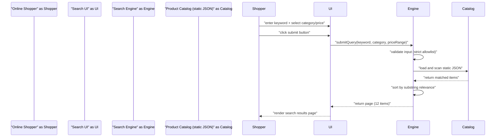
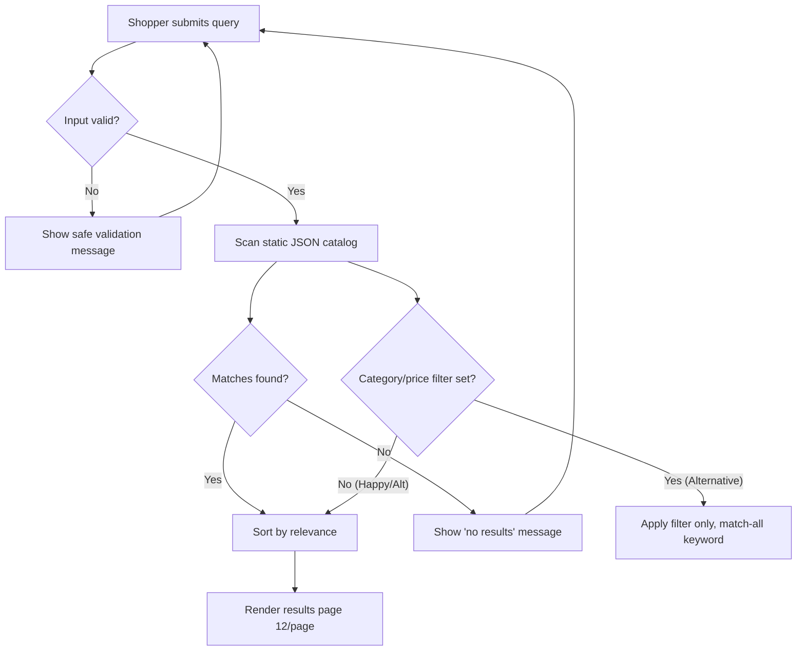
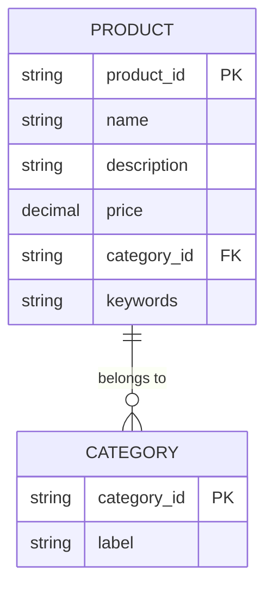

# Business Analysis Output - mock-search-feature

> Analyzed from: ba-elicitor/elicitation-report.md (status=completed, confidence=70, all clarifications resolved)

## 1. Classification and MoSCoW

| ID | Requirement | Type | MoSCoW | Priority |
|----|-------------|------|--------|----------|
| FR-1 | Keyword input | FR | Must | P0 |
| FR-2 | Category filter (hardcoded) | FR | Should | P1 |
| FR-3 | Price range filter | FR | Should | P1 |
| FR-4 | Relevance sort (substring match) | FR | Must | P0 |
| FR-5 | Results page render + 12/page pagination | FR | Must | P0 |
| NFR-1 | Latency p95 <= 500ms | NFR | Must | P0 |
| NFR-2 | Throughput 100 req/s | NFR | Should | P1 |
| NFR-3 | Strict allowlist input validation | NFR | Must | P0 |
| NFR-4 | WCAG 2.1 Level AA | NFR | Should | P1 |
| NFR-5 | Availability 99.9% | NFR | Should | P1 |

Excluded by scope: autocomplete/live search (submit-only), TF-IDF/ML ranking, dynamic category admin, external search service/DB.

## 2. Diagrams (Mermaid - all labels double-quoted)

### 2.1 Sequence Diagram



### 2.2 Flowchart (3-Path)



### 2.3 ERD (PK / FK)



## 3. Data Schema

### 3.1 Data Tables

| Entity | Field | Type | Key | Notes |
|--------|-------|------|-----|-------|
| PRODUCT | product_id | string | PK | unique catalog id |
| PRODUCT | name | string | - | display name |
| PRODUCT | description | string | - | free text |
| PRODUCT | price | decimal | - | numeric, >= 0 |
| PRODUCT | category_id | string | FK to CATEGORY | hardcoded set |
| PRODUCT | keywords | string | - | substring match target |
| CATEGORY | category_id | string | PK | hardcoded in app code |
| CATEGORY | label | string | - | human-readable |

### 3.2 JSON Schema

```json
{
  "$schema": "http://json-schema.org/draft-07/schema#",
  "title": "Product",
  "type": "object",
  "required": ["product_id", "name", "price", "category_id"],
  "properties": {
    "product_id": { "type": "string", "minLength": 1 },
    "name": { "type": "string", "minLength": 1 },
    "description": { "type": "string" },
    "price": { "type": "number", "minimum": 0 },
    "category_id": { "type": "string", "enum": ["electronics", "books", "home", "fashion", "toys"] },
    "keywords": { "type": "string" }
  },
  "additionalProperties": false
}
```

## 4. Gherkin Scenarios and User Story

User Story: As an Online Shopper, I want to enter a keyword and apply category/price filters then submit, so that I can quickly find relevant products ranked by relevance across a paginated results page.

```gherkin
Feature: Product Search over static JSON catalog

  Scenario: Happy Path - query plus filters return ranked paginated results
    Given the static product catalog is loaded
    And the shopper enters keyword "phone"
    And the shopper selects category "electronics"
    And the shopper sets price range 100 to 500
    When the shopper clicks the submit button
    Then the system validates input via strict allowlist
    And the system returns results sorted by substring relevance
    And the results page displays at most 12 items per page

  Scenario: Alternative Path - keyword only or filter only still valid
    Given the static product catalog is loaded
    And the shopper enters no keyword
    And the shopper selects category "books"
    When the shopper clicks the submit button
    Then the system treats empty keyword as match-all
    And the system returns books matching the category filter
    And the results page renders without error

  Scenario: Exception Path - no match and invalid price range
    Given the static product catalog is loaded
    And the shopper enters keyword "zzzznotexist"
    When the shopper clicks the submit button
    Then the system displays the "no results" message
    And the filter state is preserved for adjustment
    Given the shopper sets price range 500 to 100
    When the shopper clicks the submit button
    Then the system shows a safe validation message
    And the search is aborted without crashing
```

## 5. Risk Matrix (P x I)

| Risk | Probability | Impact | Score | Mitigation |
|------|-------------|--------|-------|------------|
| R-1 Empty keyword plus filters | Medium | Low | 4 | Match-all keyword; bounded scan |
| R-2 Invalid price range | Medium | Low | 4 | Pre-query validation, safe message |
| R-3 No match or empty set | High | Low | 3 | "no results" UI, preserve state |
| R-4 Catalog load over p95 500ms | Low | Medium | 3 | Bootstrap pre-load, in-memory scan |
| R-5 XSS via keyword input | Low | High | 4 | Allowlist plus HTML escape on render |

## 6. Metadata

- analyzed_by: ba-analyst (skill v3.0.0)
- status: completed
- schema_ref: skills/ver-3/_shared/schemas/analysis.schema.yaml
- artifact_lifecycle: raw -> designed -> planned -> built
- validated_by: schema_validator.py + validate_metrics.py (8/8 metric gates; exit 0)
