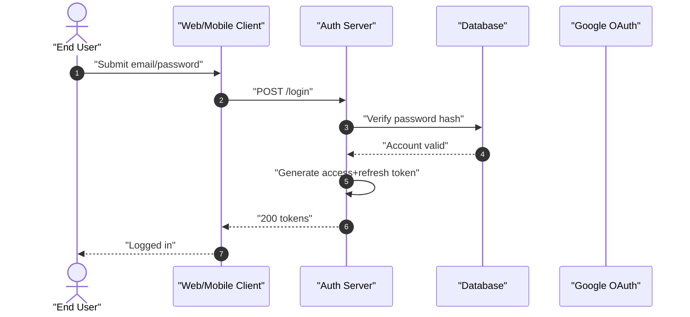
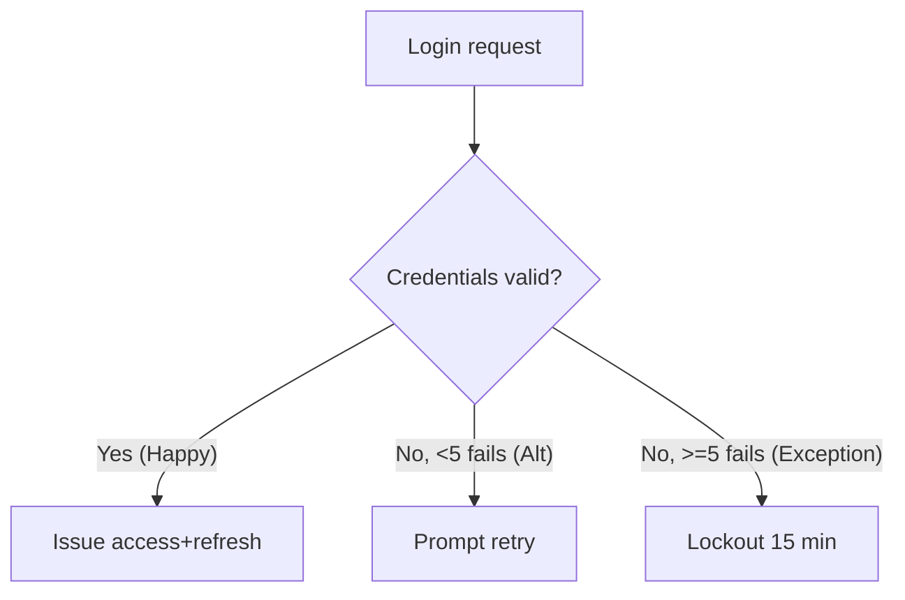
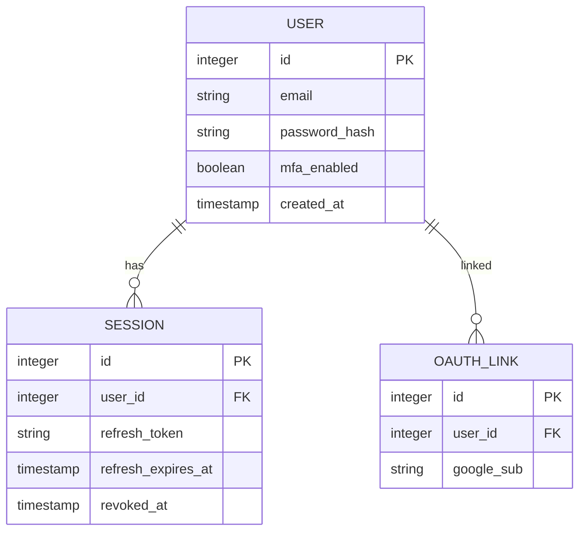

> [!NOTE]
> **Artifact Metadata (KHÔNG thuộc frontmatter schema-validated).**
> ```yaml
> analyzed_by: "ba-analyst"
> analyzed_at: "2026-07-11T00:00:00Z"
> status: "completed"
> schema_ref: "skills/ver-3/_shared/schemas/analysis.schema.yaml"
> artifact_lifecycle: "WORM"
> validated_by: "schema_validator.py"
> trace_tags: ["TỪ INPUT", "SUY LUẬN", "CẦN LÀM RÕ"]
> ```

# Báo Cáo Phân Tích Nghiệp Vụ & Đặc Tả Kỹ Thuật: user-auth

## §1: Classification & MoSCoW Matrix [QG-BA-01]

| ID | Yêu cầu | Loại | MoSCoW | Giải thích kỹ thuật |
|:---|:--------|:----:|:------:|:-------------------|
| FR-01 | Email/password login | FR | P0 — Must | Core auth, không thể thiếu `[TỪ INPUT]` |
| FR-02 | Google OAuth login | FR | P1 — Should | Tăng UX, có thể delay `[TỪ INPUT]` |
| FR-03 | MFA TOTP | FR | P1 — Must | Security critical, P1 priority `[TỪ INPUT]` |
| FR-04 | Session & refresh rotation | FR | P0 — Must | Access 15m, refresh 7d `[TỪ INPUT]` |
| FR-05 | Password reset | FR | P0 — Must | Email link, 1h `[TỪ INPUT]` |
| FR-06 | Rate-limit & lockout | FR | P0 — Must | 5 fails → 15m `[TỪ INPUT]` |
| NFR-01 | Auth latency p95 | NFR | P0 — Must | ≤2000ms `[SUY LUẬN]` |
| NFR-02 | Token TTL policy | NFR | P0 — Must | 15m/7d `[TỪ INPUT]` |
| NFR-03 | Reset token TTL | NFR | P0 — Must | 1h single-use `[TỪ INPUT]` |
| NFR-04 | Lockout policy | NFR | P0 — Must | 5/15m `[TỪ INPUT]` |

## §2: System Diagrams [QG-BA-02]

### Sequence Diagram (≥3 actors, double-quote)



### Flowchart (3-path)



### ERD (PK/FK)



## §3: Data Schema Design

| Trường | Kiểu | Ràng buộc | Mô tả |
|:---|:---|:---|:---|
| `id` | `integer` | `PK, AUTO_INCREMENT` | Khóa chính |
| `email` | `string` | `UNIQUE, NOT NULL` | Email đăng nhập |
| `password_hash` | `string` | `NOT NULL` | Bcrypt/Argon2 |
| `refresh_token` | `string` | `UNIQUE` | Opaque token |
| `revoked_at` | `timestamp` | `NULLABLE` | Revoke tức thời |

```json
{
  "$schema": "http://json-schema.org/draft-07/schema#",
  "title": "LoginResponse",
  "type": "object",
  "properties": {
    "access_token": { "type": "string" },
    "refresh_token": { "type": "string" },
    "expires_in": { "type": "integer" }
  },
  "required": ["access_token", "refresh_token", "expires_in"]
}
```

## §4: Gherkin Acceptance Criteria [QG-BA-04]

**User Story:** As an end consumer, I want to log in securely via email/password or Google so that I can access my account on web and mobile.

```gherkin
Feature: User Authentication
  Scenario: Happy Path — Login email/password thành công
    Given user có tài khoản hợp lệ
    When user gửi email và password chính xác
    Then hệ thống trả access_token (TTL 15m) và refresh_token (TTL 7d)

  Scenario: Alternative Path — Đăng nhập Google OAuth
    Given user chọn Google OAuth
    When Google trả id_token hợp lệ
    Then hệ thống link/tạo account và phát token

  Scenario: Exception Path — Lockout sau 5 lần sai
    Given user nhập sai password 5 lần
    Then tài khoản bị khóa 15 phút và trả lỗi 429
```

## §5: Risk Assessment Matrix (P×I + mitigation) [QG-BA-05]

| Mã RR | Rủi ro | Xác suất | Tác động | Giải pháp |
|:---|:---|:---:|:---:|:---|
| RR-01 | Refresh token leak | Trung bình | Cao | Rotation + revocation + logout-all |
| RR-02 | Reset link intercept | Thấp | Cao | Single-use + bind IP/UA + 1h TTL |
| RR-03 | Brute force multi-IP | Cao | Trung bình | per-account+per-IP + CAPTCHA |
| RR-04 | Google outage | Thấp | Trung bình | Fallback email/pwd + banner |
| RR-05 | TOTP clock drift | Thấp | Thấp | ±1 step + NTP |

## §6: Traceability Mapping

- FR-01..06, NFR-01..04: `[TỪ INPUT]` ánh xạ từ `elicitation-report.md`.
- Diagrams, rotation, revoke: `[SUY LUẬN]` từ quy tắc nghiệp vụ.
- Rate-limit scope, MFA scope, OAuth fallback: `[CẦN LÀM RÕ]` chờ Elicitor confirm.
