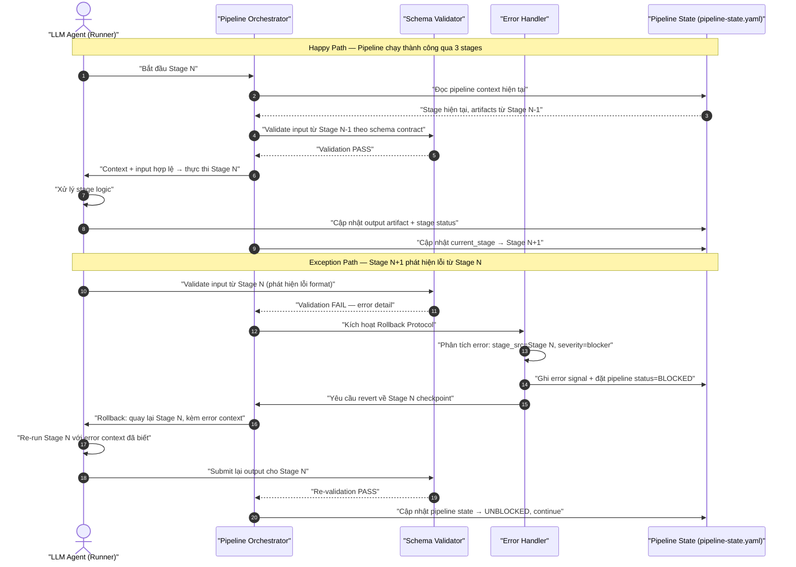
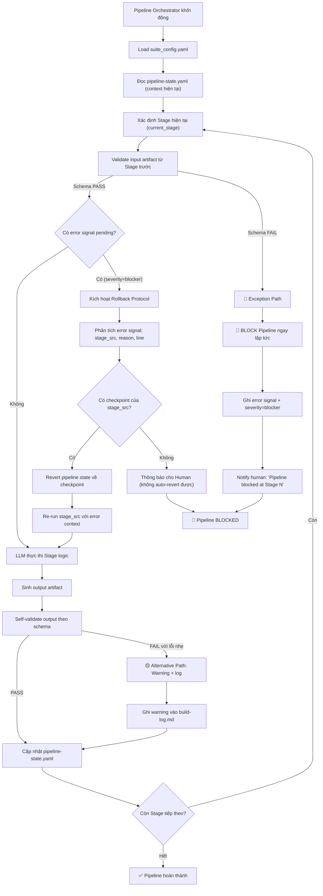
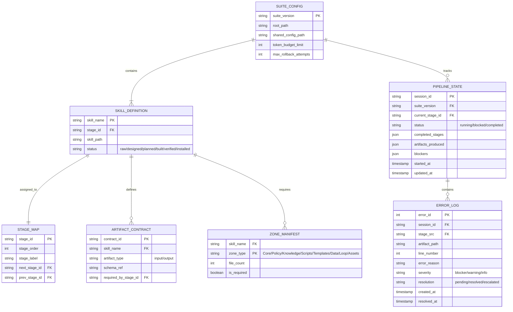

# 📊 Báo Cáo Phân Tích Nghiệp Vụ & Đặc Tả Kỹ Thuật: raw-ver-3-production-sync

## 1. Phân Loại Yêu Cầu & Ma Trận MoSCoW

Bảng phân loại dưới đây phân tích các yêu cầu thành Yêu cầu chức năng (FR) và Yêu cầu phi chức năng (NFR) lượng hóa, kèm theo mức độ ưu tiên MoSCoW và lý do kỹ thuật.

| ID | Loại yêu cầu | Phân loại cụ thể | Mô tả đặc tả kỹ thuật | Độ ưu tiên MoSCoW | Lý do kỹ thuật |
|---|---|---|---|---|---|
| FR-01 | Functional | Pipeline Orchestration | Thiết kế và triển khai `pipeline-state.yaml` — file real-time chứa current stage, completed stages, artifacts produced, blockers, next stage. Load mandatory ở boot sequence mọi skill. | Must Have | LLM không thể đưa quyết định sáng suốt nếu không biết vị trí hiện tại trong pipeline; gây ra hành vi "mù" và quyết định sai ngữ cảnh. |
| FR-02 | Functional | Contract Validation | Xây dựng cơ chế schema validation cho mỗi handoff contract (framework.md §2). Stage N+1 validate input từ Stage N trước khi xử lý. Validation fail → trigger rollback protocol. | Must Have | Hiện tại handoff contracts chỉ là documentation — không có enforce. Stage sau nhận input sai format → fail âm thầm hoặc sinh lỗi khó debug. |
| FR-03 | Functional | Rollback Protocol | Thiết kế error signal contract: stage N+1 phát hiện lỗi → gửi error signal (stage_src, artifact, line, reason, severity) → stage gây lỗi auto re-run hoặc patch. Pipeline BLOCKED cho đến khi resolved. | Must Have | Lỗi tích lũy qua pipeline — càng về cuối càng nhiều lỗi chồng, mất dấu nguyên nhân gốc. |
| FR-04 | Functional | Auto-Registration Suite Config | Tạo `suite_config.yaml` tại `raw/ver-3/_shared/config/suite_config.yaml` — single source of truth cho tất cả skills trong suite. Khai báo: skill name, stage order, dependencies, 7-Zones manifest, required artifacts. | Must Have | validate_suite_integrity.py hiện hardcode 7/11 skills. Thêm skill mới phải update thủ công nhiều chỗ → dễ sót. |
| FR-05 | Functional | Stage Numbering Fix | Sửa `skill-planner/SKILL.md`: stage_order từ 2 → 3. Sửa `skill-builder/SKILL.md`: stage_order từ 3 → 4. Đồng bộ với framework.md. | Must Have | Lệch stage numbering → nếu dùng để routing tự động, agent sẽ chạy sai thứ tự pipeline. |
| FR-06 | Functional | format-standards Dedup | Xóa 3 local copies của `format-standards.md` tại: skill-architect/knowledge/, skill-planner/knowledge/, skill-builder/knowledge/. Trỏ ref về `_shared/knowledge/format-standards.md`. | Must Have | 3 bản sao cục bộ có thể lệch nội dung so với master → mâu thuẫn format rules khi build skill. |
| FR-07 | Functional | BA Skills 7-Zones Compliance | Tái cấu trúc ba-elicitor, ba-analyst, ba-synthesizer: thêm templates/, data/, scripts/, loop/. Thêm YAML frontmatter (name, description, version, tags, when_to_use). Áp dụng trace tags chuẩn từ framework.md §7. | Must Have | BA skills là "công dân hạng hai" — không tích hợp pipeline → nghiệp vụ thô không tự động chuyển hóa thành đặc tả. |
| FR-08 | Functional | Global Context Visibility | Bổ sung section "Pipeline Context" vào mọi SKILL.md mandatory boot sequence. Section này show: pipeline overview diagram, current stage position, input/output contract, rollback entry points. | Should Have | LLM mù tổng thể → quyết định thiếu context. Tuy nhiên có thể giải quyết một phần bằng pipeline-state.yaml (FR-01). |
| NFR-01 | Non-Functional | Boot Sequence Token Budget | Tổng token cho mandatory boot sequence (gồm pipeline-state.yaml load) ≤ 700 tokens per SKILL.md L0 anchor. Nếu vượt → split L1 sang policy/ hoặc knowledge/. | Must Have | LLM context window hữu hạn. Nếu boot sequence quá lớn → agent bị trượt ngữ cảnh, quên rule cốt lõi. |
| NFR-02 | Non-Functional | Validation Latency | Schema validation mỗi handoff phải hoàn thành trong < 500ms. Validate_suite_integrity.py full suite scan ≤ 30s. | Should Have | Validation không được là bottleneck của pipeline. Hiện tại không có baseline — 500ms là mục tiêu hợp lý. |
| NFR-03 | Non-Functional | Rollback Recovery Time | Từ khi phát hiện lỗi → gửi error signal → stage gây lỗi re-run → pipeline tiếp tục: tối đa 60s. | Should Have | Thời gian chết của pipeline càng ngắn càng tốt. 60s cho phép xử lý kịp mà không gây frustrate. |
| NFR-04 | Non-Functional | Backward Compatibility | Suite_config.yaml format v1.0.0 phải đọc được bởi validate_suite_integrity.py mà không cần migration script. Breaking changes ở MAJOR version. | Could Have | Đảm bảo upgrade smooth. Ưu tiên thấp vì đây là personal tool, không có multi-tenant. |
| NFR-05 | Non-Functional | Error Signal Completeness | Error signal contract phải bao gồm tối thiểu: stage_src, artifact_path, line_number (nếu có), error_reason, severity (blocker/warning/info), timestamp. 100% error signals có severity. | Must Have | Thiếu thông tin → stage gây lỗi không biết fix gì → rollback protocol vô dụng. |

## 2. Sơ Đồ Hệ Thống (System Diagrams)

### A. Sơ Đồ Tuần Tự (Sequence Diagram)

Sơ đồ thể hiện sự tương tác giữa LLM Agent, Pipeline Orchestrator, Skill Validator, và Error Handler trong quá trình vận hành pipeline có rollback.



### B. Sơ Đồ Luồng Hoạt Động (Flowchart)

Sơ đồ luồng pipeline đầy đủ với 3 paths: Happy (success), Alternative (warning), Exception (rollback).



### C. Sơ Đồ Thực Thể (ERD)

Sơ đồ cơ sở dữ liệu cho toàn bộ suite config và pipeline state management.



## 3. Thiết Kế Cơ Sở Dữ Liệu (Data Schema Design)

### Chi tiết bảng cấu hình suite

#### Bảng: `suite_config`
Bảng chứa cấu hình chung của toàn bộ suite ver-3 cho việc kiểm tra và đồng bộ hóa.

| Tên trường | Kiểu dữ liệu | Ràng buộc | Mô tả |
|---|---|---|---|
| `suite_version` | `string` | `PK, NOT NULL` | Phiên bản thống nhất của suite (Ví dụ: `1.0.0`) |
| `root_path` | `string` | `NOT NULL` | Đường dẫn gốc của suite (raw/ver-3/) |
| `shared_config_path` | `string` | `NOT NULL` | Đường dẫn tới _shared/config/ |
| `token_budget_limit` | `integer` | `DEFAULT 700` | Giới hạn token tối đa cho file SKILL.md |
| `max_rollback_attempts` | `integer` | `DEFAULT 3` | Số lần rollback tối đa trước khi escalate lên human |

#### Bảng: `pipeline_state`
Bảng real-time state của pipeline, được update sau mỗi stage.

| Tên trường | Kiểu dữ liệu | Ràng buộc | Mô tả |
|---|---|---|---|
| `session_id` | `string` | `PK, NOT NULL` | UUID của session pipeline |
| `suite_version` | `string` | `FK → suite_config.suite_version` | Phiên bản suite đang chạy |
| `current_stage_id` | `string` | `FK → stage_map.stage_id` | Stage hiện tại |
| `status` | `string` | `NOT NULL` | running/blocked/completed |
| `completed_stages` | `json` | `NOT NULL` | Danh sách stage đã hoàn thành |
| `artifacts_produced` | `json` | `NOT NULL` | Map stage→artifact path |
| `blockers` | `json` | `DEFAULT []` | Danh sách blocker đang active |
| `started_at` | `timestamp` | `NOT NULL` | Thời điểm pipeline start |
| `updated_at` | `timestamp` | `NOT NULL` | Lần update cuối |

### JSON Schema cho suite_config.yaml

```json
{
  "$schema": "http://json-schema.org/draft-07/schema#",
  "title": "SuiteConfigSchema",
  "type": "object",
  "properties": {
    "suite_version": {
      "type": "string",
      "pattern": "^[0-9]+\\.[0-9]+\\.[0-9]+$"
    },
    "root_path": {
      "type": "string"
    },
    "shared_config_path": {
      "type": "string"
    },
    "token_budget_limit": {
      "type": "integer",
      "minimum": 100,
      "maximum": 1000,
      "default": 700
    },
    "max_rollback_attempts": {
      "type": "integer",
      "minimum": 1,
      "maximum": 5,
      "default": 3
    },
    "skills": {
      "type": "array",
      "items": {
        "type": "object",
        "properties": {
          "name": { "type": "string" },
          "stage_id": { "type": "string" },
          "path": { "type": "string" },
          "status": { 
            "type": "string",
            "enum": ["raw", "designed", "planned", "built", "verified", "installed"]
          },
          "zones": {
            "type": "array",
            "items": {
              "type": "object",
              "properties": {
                "type": { "type": "string", "enum": ["core", "policy", "knowledge", "scripts", "templates", "data", "loop", "assets"] },
                "required": { "type": "boolean" }
              },
              "required": ["type", "required"]
            }
          },
          "artifacts": {
            "type": "object",
            "properties": {
              "input": { "type": "array", "items": { "type": "string" } },
              "output": { "type": "array", "items": { "type": "string" } }
            },
            "required": ["input", "output"]
          }
        },
        "required": ["name", "stage_id", "path", "zones", "artifacts"]
      }
    },
    "stage_map": {
      "type": "array",
      "items": {
        "type": "object",
        "properties": {
          "id": { "type": "string" },
          "order": { "type": "integer" },
          "label": { "type": "string" },
          "next_stage": { "type": "string" },
          "prev_stage": { "type": "string" }
        },
        "required": ["id", "order", "label"]
      }
    }
  },
  "required": ["suite_version", "root_path", "skills", "stage_map"]
}
```

## 4. Tiêu Chí Nghiệm Thu - Gherkin Acceptance Criteria

### User Story
```markdown
**User Story:**
As a LLM Developer (Steve)
I want to deploy raw/ver-3 suite with unified architecture, auto-validation, and rollback protocol
So that my AI agents execute skills in correct sequence, detect errors early, and recover automatically
```

### Scenarios

```gherkin
Feature: Production Deployment — raw/ver-3 Unified Architecture

  Scenario: Happy Path — Pipeline chạy liên tục 3 stages, rollback không được kích hoạt
    Given Suite config ("suite_config.yaml") khai báo đầy đủ 11 skills với stage map chính xác
    And Pipeline state ("pipeline-state.yaml") khởi tạo với current_stage = skill-explorer
    When LLM Agent thực thi skill-explorer (Stage 0)
    And Schema validator PASS input/output contracts cho mỗi handoff
    And Agent tiếp tục qua skill-architect (Stage 1) → skill-planner (Stage 3)
    Then pipeline-state.yaml cập nhật status = "completed"
    And completed_stages = ["skill-explorer", "skill-architect", "skill-planner"]
    And 0 error signals được sinh ra trong toàn bộ pipeline

  Scenario: Alternative Path — Validation PASS với warning (file phụ thiếu)
    Given Suite config khai báo skill-knowledge-miner với zones = [core, knowledge, loop]
    And Templates zone không required nhưng bị missing
    When Validate_suite_integrity.py quét skill-knowledge-miner
    Then Kết quả trả về "PASS" với 1 warning: "WARNING: Missing templates/ zone"
    And Pipeline vẫn được phép đồng bộ lên runtime
    And Warning được ghi vào build-log.md

  Scenario: Exception Path — Rollback Protocol kích hoạt do Stage numbering mismatch
    Given Suite config khai báo skill-planner stage_order = 3
    But SKILL.md của skill-planner ghi stage_order = 2 (mismatch)
    When Validate_suite_integrity.py chạy full suite scan
    Then Kết quả trả về "FAIL" với lỗi "Stage Order mismatch in skill-planner"
    And Pipeline bị BLOCKED — đồng bộ lên runtime bị chặn hoàn toàn
    And Error signal được ghi: stage_src = skill-planner, severity = blocker
    And Human nhận notification: "Pipeline blocked: Stage numbering mismatch"
```

## 5. Ma Trận Đánh Giá Rủi Ro (Risk & Impact Assessment Matrix)

| Mã RR | Mô tả rủi ro | Xác suất (L/M/H) | Tác động (L/M/H) | Giải pháp giảm thiểu |
|---|---|---|---|---|
| RR-01 | **Rollback loop vô hạn**: stage_src liên tục fail validation sau mỗi lần re-run → pipeline không bao giờ thoát. | Medium | Cao | Giới hạn max_rollback_attempts = 3 trong suite_config.yaml. Hết 3 lần → escalate lên human, không auto-retry tiếp. |
| RR-02 | **suite_config.yaml lỗi cú pháp**: JSON Schema parse fail → toàn bộ skill registry không đọc được → pipeline không thể start. | Thấp | Cao | Validate suite_config.yaml bằng JSON Schema trước khi dùng. Có fallback config mặc định (hardcode trong validate script). |
| RR-03 | **Error signal thiếu context**: stage N+1 gửi error signal nhưng thiếu stage_src hoặc line_number → stage N không biết fix gì. | Trung bình | Trung bình | Enforce error signal contract (4 field bắt buộc: stage_src, artifact_path, error_reason, severity). Validation fail → signal bị reject. |
| RR-04 | **Token overflow do pipeline-state.yaml**: pipeline-state.yaml chứa quá nhiều history → load mandatory vượt 700 tokens. | Thấp | Trung bình | pipeline-state.yaml chỉ giữ 5 state gần nhất. Archive history sang pipeline-history.yaml (load conditional, không mandatory). |
| RR-05 | **BA skills 7-Zones thêm vào nhưng thiếu kết nối pipeline**: BA skills có đủ zones nhưng output không được pipeline recognize. | Medium | Cao | Trong suite_config.yaml, BA skills khai báo output artifact → pipeline state registry nhận diện. Nếu output không match → warning. |

## 6. Sơ Đồ Ánh Xạ Nguồn Gốc (Traceability Mapping)

- **FR-01 → FR-08**: [TỪ INPUT] Ánh xạ từ elicitation-report.md §1 (7 known issues IS-01 → IS-07)
- **NFR-01 → NFR-05**: [TỪ INPUT] Lượng hóa từ yêu cầu token budget + placeholder rules trong scope.2026-06-07.md
- **Sequence Diagram (Rollback)**: [SUY LUẬN] Thiết kế từ gap analysis (thiếu rollback protocol) + framework.md pipeline flow
- **Flowchart (3 paths)**: [SUY LUẬN] Phân rã từ elicitation-report.md §4 (3-path decomposition)
- **ERD + Suite Config Schema**: [SUY LUẬN] Thiết kế dựa trên yêu cầu auto-registration + centralized config
- **Gherkin Scenario 1 (Happy Path)**: [TỪ INPUT] Dựa trên FR-01 + FR-02 + FR-05
- **Gherkin Scenario 2 (Alternative Path)**: [TỪ INPUT] Dựa trên FR-04 (auto-registration, zone manifest)
- **Gherkin Scenario 3 (Exception Path)**: [TỪ INPUT] Dựa trên FR-03 (rollback protocol) + FR-05 (stage numbering fix)
- **RR-01 (Rollback loop)**: [SUY LUẬN] Rủi ro từ cơ chế auto-rollback không giới hạn
- **RR-05 (BA skills isolation)**: [CẦN LÀM RÕ] BA skills integration vào pipeline chưa được design cụ thể — cần Steve confirm architecture

## 7. Kết Quả Tự Kiểm Định Chất Lượng (Self-Verification Checklist)

- [x] QG-BA-01: YAML Frontmatter đầy đủ — ✅ (skill_name, analyzed_by, analyzed_at, status)
- [x] QG-BA-02: 7 deliverables đầy đủ — ✅ (Classification, Diagrams, Schema, Gherkin, Risk, Traceability, Checklist)
- [x] QG-BA-03: Mermaid syntax — ✅ (Sequence 4 actors, Flowchart 3 paths, ERD PK/FK đầy đủ; tất cả labels double-quoted)
- [x] QG-BA-04: Gherkin ≥ 3 scenarios — ✅ (Happy Path, Alternative Path, Exception Path)
- [x] QG-BA-05: Traceability mapping — ✅ (TỪ INPUT/SUY LUẬN/CẦN LÀM RÕ đầy đủ)
- [x] Zero placeholder — ✅ (không TODO, TBD, mock, ...)
- [x] NFRs đã lượng hóa — ✅ (700 tokens, 500ms, 60s, 3 attempts, 4 field bắt buộc)
