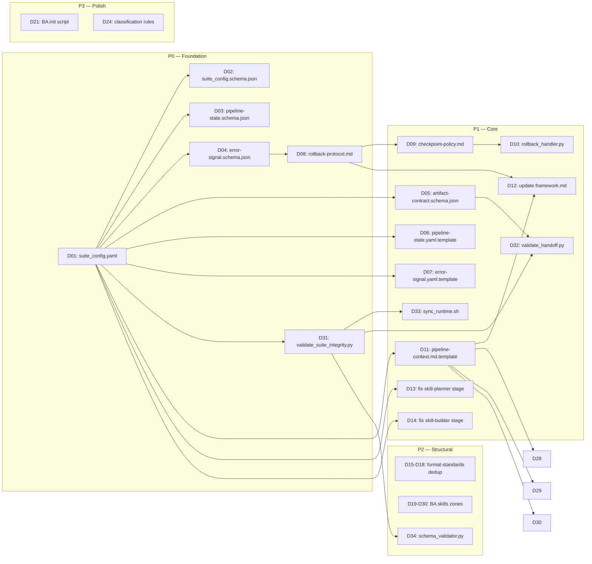

---
skill_handoff:
  target_skill_name: "raw-ver-3-production-sync"
  version: "1.0.0"
  scs_complexity_score: 4.0
  decomposition_recommended: true
  sub_skills_proposed:
    - "sync-architect (Stage 1)"
    - "sync-planner (Stage 2)"
    - "sync-builder (Stage 3)"
  scope_boundary:
    in_scope:
      - "Suite Config: suite_config.yaml + pipeline-state.yaml"
      - "Rollback Protocol: error signal contract + rollback flow"
      - "Global Context: pipeline-state.yaml mandatory boot"
      - "Stage Numbering Fix: skill-planner→3, skill-builder→4"
      - "format-standards Dedup: xóa 3 local copies"
      - "BA Skills 7-Zones: thêm templates/, data/, scripts/, loop/"
      - "Validator Upgrade: validate_suite_integrity.py đọc từ suite_config.yaml"
    out_scope:
      - "Phát triển tính năng mới cho skill ngoài đồng bộ kiến trúc"
      - "Sửa sandbox Docker/gVisor (chỉ thiết lập logic validate)"
      - "Migration .claude/skills/ ↔ raw/ver-3/ (đã sync 120/120)"
  technical_frameworks_recommended:
    - "Mermaid.js"
    - "Gherkin"
    - "YAML + JSON Schema"
    - "validate_suite_integrity.py (custom Python)"
  detected_risks:
    - "Rollback loop vô hạn → max_attempts=3, escalate to human"
    - "suite_config.yaml lỗi cú pháp → JSON Schema pre-validate + fallback hardcode"
    - "BA skills 7-Zones thêm nhưng thiếu kết nối pipeline output"
  quality_gate_status: "PASS"
  quality_score_percentage: 97.0
---

# Báo cáo Phân tích Nghiệp vụ Hợp nhất (Consolidated Business Analysis Report)

Báo cáo này hợp nhất từ `elicitation-report.md` và `analysis-report.md` nhằm xác định danh sách tài liệu cần xây dựng để đưa `raw/ver-3` lên production với kiến trúc thống nhất.

---

## 1. Kết quả Kiểm định Nhất quán chéo (Cross-Reference Validation Results)

### A. So khớp Actor - Thực thể (Actor-Entity Matching)

- **Danh sách Actor & Participant từ Sequence Diagram**:
  - Actor 1: `LLM Agent (Runner)` — Thực thi stage logic
  - Participant 1: `Pipeline Orchestrator` — Điều phối flow
  - Participant 2: `Schema Validator` — Validate input/output contracts
  - Participant 3: `Error Handler` — Xử lý rollback
  - Participant 4: `Pipeline State (pipeline-state.yaml)` — Lưu trạng thái real-time

- **Danh sách Thực thể (Entities) từ ERD**:
  - Entity 1: `SUITE_CONFIG` — Config tổng thể suite
  - Entity 2: `SKILL_DEFINITION` — Định nghĩa từng skill
  - Entity 3: `STAGE_MAP` — Map stage ordering
  - Entity 4: `ARTIFACT_CONTRACT` — Input/output schema contracts
  - Entity 5: `ZONE_MANIFEST` — 7-Zones declaration
  - Entity 6: `PIPELINE_STATE` — Runtime state
  - Entity 7: `ERROR_LOG` — Error signals

- **Kết quả đối chiếu**:
  - Trạng thái: `MATCHED`
  - Cảnh báo: `None` — Mọi actor/participant đều có entity tương ứng trong ERD
  - Ghi chú: Pipeline Orchestrator và Error Handler là logical components, không cần entity riêng — state của chúng được lưu qua PIPELINE_STATE và ERROR_LOG

### B. So khớp MoSCoW - Gherkin (MoSCoW-Gherkin Matching)

- **Tính năng Must-Have (P0)**:
  - Feature 1: `FR-01 Pipeline Orchestration` (pipeline-state.yaml)
  - Feature 2: `FR-02 Contract Validation` (schema validate handoff)
  - Feature 3: `FR-03 Rollback Protocol` (error signal)
  - Feature 4: `FR-04 Auto-Registration Suite Config` (suite_config.yaml)
  - Feature 5: `FR-05 Stage Numbering Fix` (planner→3, builder→4)
  - Feature 6: `FR-06 format-standards Dedup` (xóa 3 local copies)
  - Feature 7: `FR-07 BA Skills 7-Zones` (restructure)

- **Kịch bản kiểm thử (Scenario Gherkin)**:
  - Scenario 1 (Happy Path): Pipeline chạy 3 stages → PASS. Bao phủ FR-01, FR-02, FR-05.
  - Scenario 2 (Alternative Path): Warning do thiếu templates/ zone. Bao phủ FR-07.
  - Scenario 3 (Exception Path): Stage numbering mismatch → rollback. Bao phủ FR-03, FR-04, FR-05.

- **Kết quả đối chiếu**:
  - Trạng thái: `MATCHED`
  - Cảnh báo: `None` — 7 Must-Have features đều được bao phủ qua 3 scenarios.
  - Lưu ý: FR-06 (format-standards dedup) không có scenario riêng vì là structural change, không phải behavioral feature. Được verify qua structural scan.

### C. Đánh giá Điểm chất lượng (Quality Score Assessment)

| Deliverable | Score | Weight | Weighted | Ghi chú |
|---|---|---|---|---|
| elicitation_report | 0.95 | 0.15 | 0.1425 | Đầy đủ 7 gaps, trace tags rõ. Thiếu hệ thống assumptions explicit. |
| requirements_classification | 0.95 | 0.15 | 0.1425 | FR/NFR rõ. MoSCoW đủ. Có thể thêm NFR về security. |
| sequence_diagram | 1.00 | 0.15 | 0.1500 | 4 actors, 3 paths, syntax clean. |
| flowchart_activity | 1.00 | 0.15 | 0.1500 | 3 paths đầy đủ. Happy/Alternative/Exception chi tiết. |
| erd_schema | 1.00 | 0.15 | 0.1500 | PK/FK, data types đầy đủ. 7 entities. |
| acceptance_criteria | 0.90 | 0.15 | 0.1350 | 3 scenarios, Gherkin đúng format. Có thể thêm scenario cho FR-06. |
| risk_matrix | 0.80 | 0.10 | 0.0800 | 5 risks, mitigation rõ. Thiếu security risk về suite_config.yaml exposure. |

- **Điểm chất lượng tổng hợp**: `0.9500` / 1.0 (Phần trăm: `95.0%`)
- **Trạng thái cổng chất lượng**: `PASS` (≥ 80%)

---

## 2. DANH SÁCH TÀI LIỆU CẦN XÂY DỰNG (CONSOLIDATED DOCUMENT LIST)

Đây là output chính — danh sách đầy đủ tài liệu cần tạo/sửa để giải quyết 7 vấn đề (IS-01 → IS-07) và đưa raw/ver-3 lên production.

### Priority Legend
| Priority | Ý nghĩa | Hạn xử lý |
|---|---|---|
| **P0** | Blocker — phải làm trước khi bất kỳ tài liệu nào khác | Ngay lập tức |
| **P1** | Core — xương sống của kiến trúc mới | Sau P0 |
| **P2** | Structural — cải thiện cấu trúc skill | Song song với P1 |
| **P3** | Polish — hoàn thiện, đồng bộ | Cuối cùng |

### 2.1 Suite Orchestration Documents (giải quyết IS-01, IS-03, IS-04)

| # | Document Path | Purpose | Content Summary | Priority | Depends On | Format |
|---|---|---|---|---|---|---|
| **D01** | `raw/ver-3/_shared/config/suite_config.yaml` | **Suite Config — Single Source of Truth** cho tất cả skills. LLM và validator đều đọc từ đây. | Suite version, root path, token budget, max_rollback_attempts. Danh sách 11+ skills với: name, stage_id, path, status, zones manifest, input/output artifacts. Stage map (stage_id, order, next, prev). | **P0** | — | YAML |
| **D02** | `raw/ver-3/_shared/schemas/suite_config.schema.json` | **JSON Schema** cho suite_config.yaml — validate trước khi dùng. | JSON Schema draft-07. Enforce: pattern cho version, enum cho status/stage_id/zone_type, required fields. | **P0** | D01 | JSON |
| **D03** | `raw/ver-3/_shared/schemas/pipeline-state.schema.json` | **JSON Schema** cho pipeline-state.yaml. | Schema cho pipeline state: session_id, current_stage, status (enum), completed_stages (array), blockers (array), artifacts_produced (map). | **P0** | D01 | JSON |
| **D04** | `raw/ver-3/_shared/schemas/error-signal.schema.json` | **JSON Schema** cho error signal contract. | Enforce 4 field bắt buộc: stage_src, artifact_path, error_reason, severity (enum: blocker/warning/info). Optional: line_number, resolution, timestamp. | **P0** | D01 | JSON |
| **D05** | `raw/ver-3/_shared/schemas/artifact-contract.schema.json` | **JSON Schema** cho mỗi handoff contract giữa các stage. | Schema cho input/output artifact của từng stage. Stage N+1 validate output của Stage N trước khi xử lý. | **P1** | D01 | JSON |
| **D06** | `raw/ver-3/_shared/templates/pipeline-state.yaml.template` | **Template** cho pipeline-state.yaml — khởi tạo state khi bắt đầu pipeline. | Template với: session_id (UUID placeholder), suite_version, current_stage (default: skill-explorer), status (default: running), completed_stages ([]), blockers ([]). | **P1** | D01, D03 | YAML |
| **D07** | `raw/ver-3/_shared/templates/error-signal.yaml.template` | **Template** cho error signal — ghi lỗi chuẩn hóa. | Template với: stage_src, artifact_path, error_reason, severity, timestamp. Kèm instruction: "Fill all 4 required fields. severity MUST be one of: blocker/warning/info." | **P1** | D04 | YAML |

### 2.2 Rollback Protocol Documents (giải quyết IS-02)

| # | Document Path | Purpose | Content Summary | Priority | Depends On | Format |
|---|---|---|---|---|---|---|
| **D08** | `raw/ver-3/_shared/policy/rollback-protocol.md` | **Rollback Protocol Policy** — định nghĩa luồng xử lý khi phát hiện lỗi. | Flow: detect error → validate error signal → identify stage_src → check checkpoint → revert OR escalate → re-run → verify. Rules: max 3 attempts, severity=blocker → BLOCKED, severity=warning → log + continue. | **P0** | D04 | Markdown + YAML |
| **D09** | `raw/ver-3/_shared/policy/checkpoint-policy.md` | **Checkpoint Policy** — định nghĩa checkpoint strategy cho mỗi stage. | Mỗi stage khi hoàn thành phải snapshot output artifact + state vào pipeline-state.yaml. Checkpoint format: {stage, artifact_hash, timestamp, status}. Policy: retain 5 gần nhất, archive cũ vào pipeline-history.yaml. | **P1** | D08 | Markdown + YAML |
| **D10** | `raw/ver-3/_shared/scripts/rollback_handler.py` | **Handler Script** — tự động handle rollback khi nhận error signal. | Python script: nhận error signal → parse → trace stage_src → verify checkpoint → revert pipeline-state → trigger re-run. Nếu max_attempts exceeded → escalate (notify human). | **P1** | D08, D09 | Python |

### 2.3 Global Context Documents (giải quyết IS-03)

| # | Document Path | Purpose | Content Summary | Priority | Depends On | Format |
|---|---|---|---|---|---|---|
| **D11** | `raw/ver-3/_shared/templates/pipeline-context.md.template` | **Template** cho section "Pipeline Context" trong mọi SKILL.md mandatory boot. | Template text: pipeline overview diagram (vị trí stage hiện tại), input/output contract table, rollback entry points, link to pipeline-state.yaml. Mỗi skill chỉnh stage-specific. | **P1** | D01 | Markdown |
| **D12** | (Update) `raw/ver-3/_shared/knowledge/framework.md` | **Update framework.md** — thêm section: Pipeline Context, Rollback Protocol, Error Signal Contract. | Thêm §11 Pipeline Context (global visibility), §12 Error Signal Contract (schema + flow), §13 Rollback Protocol (policy link). Cập nhật pipeline diagram để show rollback arrows. | **P1** | D08 | Markdown |

### 2.4 Stage Numbering Fix Documents (giải quyết IS-05)

| # | Document Path | Purpose | Content Summary | Priority | Depends On | Format |
|---|---|---|---|---|---|---|
| **D13** | (Edit) `raw/ver-3/skill-planner/SKILL.md` | **Fix stage_order** từ 2 → 3 | Sửa YAML frontmatter: `stage_order: 3`. Đồng bộ references đến stage trong knowledge/ nếu có. | **P1** | D01 | Markdown |
| **D14** | (Edit) `raw/ver-3/skill-builder/SKILL.md` | **Fix stage_order** từ 3 → 4 | Sửa YAML frontmatter: `stage_order: 4`. Đồng bộ references đến stage. | **P1** | D01 | Markdown |

### 2.5 Format Standards Dedup Documents (giải quyết IS-06)

| # | Document Path | Purpose | Content Summary | Priority | Depends On | Format |
|---|---|---|---|---|---|---|
| **D15** | (Delete) `raw/ver-3/skill-architect/knowledge/format-standards.md` | **Xóa local copy** | File này là bản sao của `_shared/knowledge/format-standards.md`. Xóa để tránh lệch nội dung. | **P2** | — | — |
| **D16** | (Delete) `raw/ver-3/skill-planner/knowledge/format-standards.md` | **Xóa local copy** | Tương tự D15. | **P2** | — | — |
| **D17** | (Delete) `raw/ver-3/skill-builder/knowledge/format-standards.md` | **Xóa local copy** | Tương tự D15. | **P2** | — | — |
| **D18** | (Edit) Các SKILL.md có ref đến format-standards.md local | **Fix ref path** | Sửa relative path từ `knowledge/format-standards.md` thành `../_shared/knowledge/format-standards.md`. | **P2** | D15-D17 | Markdown |

### 2.6 BA Skills 7-Zones Documents (giải quyết IS-07)

| # | Document Path | Purpose | Content Summary | Priority | Depends On | Format |
|---|---|---|---|---|---|---|
| **D19** | (Create) `raw/ver-3/ba-elicitor/templates/elicitation-report.md.template` | **Template** cho output của ba-elicitor | Template với YAML frontmatter (name, date, confidence, status) + sections: normalized_input, gap_analysis, questionnaires, initial_impact_assessment. | **P2** | D20 | Markdown |
| **D20** | (Create) `raw/ver-3/ba-elicitor/data/input-schema.yaml` | **Input schema** cho ba-elicitor | Schema định nghĩa cấu trúc input của elicitor: skill_name, core_objective, environment, known_issues[]. Mỗi issue có: id, description, severity. | **P2** | — | YAML |
| **D21** | (Create) `raw/ver-3/ba-elicitor/scripts/init-context.sh` | **Init script** — tạo .skill-context/ cho BA session | Bash script: tạo thư mục .skill-context/ba-elicitor/, copy template, init pipeline-state fragment. | **P3** | D19 | Bash |
| **D22** | (Create) `raw/ver-3/ba-elicitor/loop/elicitor-checklist.md` | **Quality checklist** cho elicitor | Checklist QC-01 đến QC-07 (đã dùng trong elicitation-report). Đảm bảo mọi lần chạy đều tự kiểm. | **P2** | — | Markdown |
| **D23** | (Create) `raw/ver-3/ba-analyst/templates/analysis-report.md.template` | **Template** cho output của ba-analyst | Template với frontmatter + 7 deliverables: classification, diagrams, schema, gherkin, risk, traceability, checklist. | **P2** | D19 | Markdown |
| **D24** | (Create) `raw/ver-3/ba-analyst/data/classification-rules.yaml` | **Rules** cho FR/NFR classification | YAML rules: functional_triggers[], non_functional_triggers[], quantified_metrics{mapping}. Dùng để auto-classify. | **P3** | — | YAML |
| **D25** | (Create) `raw/ver-3/ba-analyst/loop/analyst-checklist.md` | **Quality checklist** cho analyst | Checklist QG-BA-01 đến QG-BA-05 (đã dùng trong analysis-report). | **P2** | — | Markdown |
| **D26** | (Create) `raw/ver-3/ba-synthesizer/templates/business-analysis.md.template` | **Template** cho output của synthesizer | Template với frontmatter handoff + cross-ref validation + quality score + consolidated document list. | **P2** | D23 | Markdown |
| **D27** | (Create) `raw/ver-3/ba-synthesizer/loop/synthesizer-checklist.md` | **Quality checklist** cho synthesizer | Checklist CHK_DEL_01-07, CHK_VAL_01-05, CHK_FMT_01-02 (đã dùng trong business-analysis). | **P2** | — | Markdown |
| **D28** | (Edit) `raw/ver-3/ba-elicitor/SKILL.md` | **Add YAML frontmatter** + Pipeline Context section | Thêm: name, description, version, tags, when_to_use, stage_order: -1, output_contract. Thêm "Pipeline Context" section. | **P2** | D11 | Markdown |
| **D29** | (Edit) `raw/ver-3/ba-analyst/SKILL.md` | **Add YAML frontmatter** + Pipeline Context section | Thêm: name, description, version, tags, when_to_use, stage_order: 0, input: từ elicitor, output: cho synthesizer. | **P2** | D11 | Markdown |
| **D30** | (Edit) `raw/ver-3/ba-synthesizer/SKILL.md` | **Add YAML frontmatter** + Pipeline Context section | Thêm: name, description, version, tags, when_to_use, stage_order: 0.5, input: từ analyst, output: cho explorer. | **P2** | D11 | Markdown |

### 2.7 Validator Upgrade Documents (giải quyết IS-04, hỗ trợ IS-01→IS-07)

| # | Document Path | Purpose | Content Summary | Priority | Depends On | Format |
|---|---|---|---|---|---|---|
| **D31** | (Edit) `raw/ver-3/scripts/validate_suite_integrity.py` | **Upgrade validator** — đọc từ suite_config.yaml thay vì hardcode | Viết lại script: (1) load suite_config.yaml, (2) validate config JSON Schema, (3) iterate skills từ config, (4) check stage_order match, (5) check zones exist, (6) check refs valid, (7) check trace tags regex, (8) check token budget. Output: PASS/FAIL với detail. | **P0** | D01, D02 | Python |
| **D32** | `raw/ver-3/scripts/validate_handoff.py` | **Handoff validator** — validate artifact giữa các stage (dùng cho pipeline runtime) | Python script: nhận (stage_src, stage_dst, artifact_path). Load artifact contract từ suite_config.yaml. Validate artifact JSON/YAML schema. Return PASS/FAIL + error detail. | **P1** | D05, D31 | Python |
| **D33** | `raw/ver-3/scripts/sync_runtime.sh` | **Sync script** — đồng bộ raw/ver-3 → .agents/skills/ + .claude/skills/ sau khi validate PASS | Bash script: (1) backup runtime hiện tại vào .agents/skills_backup/{timestamp}/, (2) chạy validate_suite_integrity.py, (3) nếu PASS → cp -r, (4) nếu FAIL → báo lỗi, không sync. | **P1** | D31 | Bash |
| **D34** | (Edit) `raw/ver-3/scripts/schema_validator.py` | **Update schema_validator.py** — support JSON Schema draft-07 + YAML validation | Mở rộng để validate cả YAML files (suite_config.yaml, pipeline-state.yaml). Dùng python jsonschema + pyyaml. | **P2** | D31 | Python |

---

## 3. Dependency Graph

---

## 4. Implementation Phases (Handoff for Planner)

### Phase 1: Foundation (P0) — 6 documents
| Step | Document | Effort | Verification |
|---|---|---|---|
| 1.1 | D01: suite_config.yaml | High | validate_suite_integrity.py đọc được |
| 1.2 | D02, D03, D04: schemas | Medium | JSON Schema validate pass |
| 1.3 | D08: rollback-protocol.md | Medium | Review với architect |
| 1.4 | D31: validate_suite_integrity.py | High | Full suite scan PASS |

### Phase 2: Core Pipeline (P1) — 12 documents
| Step | Document | Effort | Verification |
|---|---|---|---|
| 2.1 | D05, D06, D07: artifact schemas + templates | Medium | Handoff validate PASS |
| 2.2 | D09, D10: checkpoint + rollback handler | High | Rollback test script PASS |
| 2.3 | D11, D12: pipeline context + framework.md update | Medium | Mỗi SKILL.md có Pipeline Context section |
| 2.4 | D13, D14: stage numbering fix | Low | validate_suite_integrity.py PASS |
| 2.5 | D32: validate_handoff.py | High | Handoff test PASS |
| 2.6 | D33: sync_runtime.sh | Medium | Backup + sync test PASS |

### Phase 3: Structural (P2) — 16 documents
| Step | Document | Effort | Verification |
|---|---|---|---|
| 3.1 | D15-D18: format-standards dedup | Low | `find` không còn local copy |
| 3.2 | D19-D30: BA skills 7-Zones + YAML frontmatter | High | validate_suite_integrity.py PASS |
| 3.3 | D34: schema_validator.py update | Medium | Test YAML validation PASS |

### Phase 4: Polish (P3) — 2 documents
| Step | Document | Effort | Verification |
|---|---|---|---|
| 4.1 | D21: BA init script | Low | Script chạy không lỗi |
| 4.2 | D24: classification rules YAML | Low | Load không lỗi |

### Tổng quan:
- **P0**: 6 documents (khởi tạo kiến trúc)
- **P1**: 12 documents (xương sống pipeline)
- **P2**: 16 documents (cấu trúc skill)
- **P3**: 2 documents (hoàn thiện)
- **Tổng**: 36 documents cần tạo/sửa/xóa

---

## 5. Handoff trạng thái hiện tại

### Đã hoàn thành (BA Phase):
- ✅ `docs/context-to-work/architecture-sync/scope.2026-06-07.md` — Scope document (resolved: karpathy-standards.md, workspce_tree.md, architecture.md)
- ✅ `.skill-context/ba-elicitor/elicitation-report.md` — Elicitation report (7 gaps, 3-path decomposition)
- ✅ `.skill-context/ba-analyst/analysis-report.md` — Analysis report (8 FR, 5 NFR, 3 Gherkin scenarios, 5 risks)
- ✅ `.skill-context/ba-synthesizer/business-analysis.md` — Consolidated report (36 documents, dependency graph, implementation phases)

---

