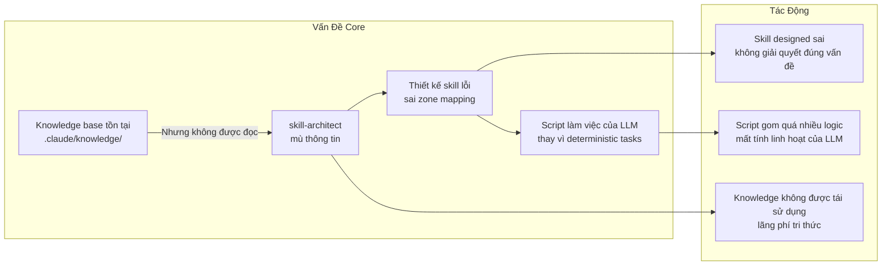
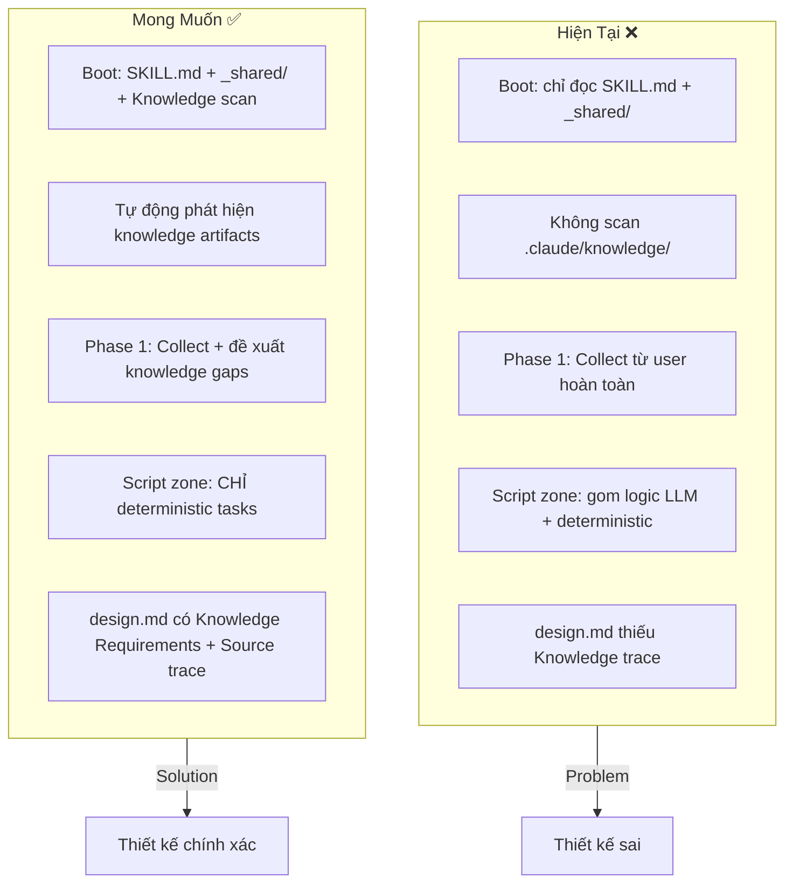

# Analysis Report: skill-architect (ver-0.0.2)

> Generated by ba-analyst | 2026-06-18
> Phân tích thiết kế skill-architect dựa trên vấn đề: thiếu context-aware design, không khai thác knowledge base, xác định sai vai trò script

---

## 1. Tổng quan vấn đề



---

## 2. Functional Requirements (FR)

### 2.1 FR — Context Awareness (Ưu tiên cao nhất)

| FR ID | Mô tả | MoSCoW | Liên quan vấn đề |
|-------|-------|--------|-------------------|
| FR-01 | skill-architect PHẢI tự động quét `.claude/knowledge/` khi boot để lấy domain context | Must-have | Mù thông tin → thiết kế sai |
| FR-02 | skill-architect PHẢI đọc upstream artifacts (exploration.md, domain-handbook.md) nếu tồn tại | Must-have | Không tận dụng kiến thức cũ |
| FR-03 | skill-architect PHẢI phân biệt 3 loại input: User pain point / Knowledge base / Heavy-thinking (suy luận) | Must-have | Không trace được nguồn thông tin |
| FR-04 | skill-architect CÓ THỂ đề xuất bổ sung knowledge nếu phát hiện thiếu hụt | Could-have | Cải thiện knowledge base |

### 2.2 FR — Script Boundary (Quan trọng)

| FR ID | Mô tả | MoSCoW | Liên quan vấn đề |
|-------|-------|--------|-------------------|
| FR-05 | Scripts zone CHỈ chứa deterministic tasks (init, validate, export). KHÔNG chứa logic nghiệp vụ | Must-have | Script gom chức năng LLM |
| FR-06 | Mọi quyết định nghiệp vụ PHẢI để LLM tự xử lý trong knowledge/ + SKILL.md instructions | Must-have | Script cứng ngắc hóa LLM |
| FR-07 | Scripts được xác định sau khi knowledge zone đã thiết kế xong — không thiết kế script song song | Should-have | Thứ tự thiết kế sai |
| FR-08 | Script chỉ làm: IO operations, file system, network calls, parsing deterministic formats | Must-have | Runbook cho script design |

### 2.3 FR — Knowledge Integration Pipeline

| FR ID | Mô tả | MoSCoW |
|-------|-------|--------|
| FR-09 | Tích hợp Knowledge Miner (Stage 0.5) output làm upstream input cho Architect | Must-have |
| FR-10 | Boot sequence phải có bước "Load Knowledge": quét knowledge/agents, knowledge/skills, knowledge/hooks | Must-have |
| FR-11 | Nếu knowledge không đủ → skill-architect phải dừng và báo "Cần thêm domain knowledge" thay vì tự bịa | Should-have |
| FR-12 | design.md §2 Capability Map phải trace từng knowledge source file cụ thể | Must-have |

### 2.4 FR — Design Quality & Validation

| FR ID | Mô tả | MoSCoW |
|-------|-------|--------|
| FR-13 | Mọi zone trong design phải có rationale "tại sao zone này cần/không cần" | Should-have |
| FR-14 | Skill-architect PHẢI validate thiết kế trước khi handoff: checklist tự động | Must-have |
| FR-15 | Output design.md PHẢI bao gồm "Knowledge Requirements" section riêng, liệt kê từng file knowledge cần xây dựng | Must-have |
| FR-16 | dynamic routing: skill-architect phải kiểm tra `.skill-context/{target_skill}/` artifacts trước khi design | Must-have |

### 2.5 FR — Script Zone Redesign

| FR ID | Mô tả | MoSCoW |
|-------|-------|--------|
| FR-17 | Script Zone chỉ generate cho các task: init context, validate schema, generate Mermaid export, run checklist | Must-have |
| FR-18 | KHÔNG generate scripts cho: business logic, decision trees, data transformation rules, conditional branching logic | Must-have |
| FR-19 | Mỗi script trong zone phải có "deterministic boundary" — mô tả rõ script này giải quyết cái gì và KHÔNG giải quyết cái gì | Should-have |
| FR-20 | Scripts không được chứa LLM prompt logic hoặc generate prompt templates | Must-have |

---

## 3. Non-Functional Requirements (NFR)

| NFR ID | Mô tả | Target | MoSCoW |
|--------|-------|--------|--------|
| NFR-01 | Context Load Time: skill-architect boot không quá 2 lần đọc file (capped at configurable) | ≤ 5 knowledge files loaded at boot | Must-have |
| NFR-02 | Knowledge Freshness: skill-architect PHẢI kiểm tra timestamp của knowledge files > design.md timestamp | Detect stale design | Should-have |
| NFR-03 | Traceability: mọi assertion trong design.md phải có trace tag | 100% trace coverage | Must-have |
| NFR-04 | Token Efficiency: SKILL.md ≤ 600 tokens, tổng boot load ≤ 2000 tokens | ≤ 2600 tokens total | Must-have |
| NFR-05 | Hallucination Guard: zero placeholders, zero faux-knowledge | Zero tolerance | Must-have |
| NFR-06 | Script Determinism: mọi script phải có input/output schema, không side-effect với LLM context | Full deterministic boundary | Must-have |

---

## 4. Current State vs Desired State



---

## 5. Phân tích Root Cause: Script Zone Misuse

### 5.1 Current Anti-Pattern

```
init_context.py (HIỆN TẠI):
  - Tạo .skill-context/{name}/ 
  - Tạo design.md.template (cứng)
  - Tạo todo.md.template (cứng)
  - Tạo build-log.md.template (cứng)
  → Làm thay việc của LLM: quyết định cấu trúc design là việc của skill-architect (LLM)
  → Template cứng: không linh hoạt theo yêu cầu cụ thể

export-pipeline.py (HIỆN TẠI):
  - Sinh Mermaid diagram pipeline
  → Quá đơn giản, có thể inline trong SKILL.md
  → Tốn 1 file script cho việc có thể làm bằng tay
```

### 5.2 Correct Script Design

```
scripts/ (ĐÚNG):
  init_context.py:
    - Tạo thư mục .skill-context/{name}/
    - Copy resources/ vào resources/
    - → IO deterministic, không quyết định design

  validate_design.py:
    - Parse design.md → check frontmatter, required sections
    - Run checklist rules
    - → Parse + validate deterministic

  export_diagrams.py:
    - Extract Mermaid blocks từ design.md
    - Export sang file riêng nếu cần
    - → Extract + export deterministic
```

### 5.3 Decision Boundary

```yaml
script_boundary:
  llm_decides: # KHÔNG cho vào script
    - "What zones are needed"
    - "What knowledge files required"
    - "What interaction points"
    - "What progressive disclosure tiers"
    - "Design rationale and trade-offs"
  
  script_handles: # CHO vào script
    - "Create directory structure"
    - "Copy/initialize template files"
    - "Validate YAML frontmatter"
    - "Check required sections present"
    - "Export Mermaid to standalone files"
    - "Generate checklist report"
```

---

## 6. Database Schema: Knowledge Source Registry

### 6.1 Knowledge Source Table

```json
{
  "knowledge_sources": [
    {
      "source_id": "KS-01",
      "path": ".claude/knowledge/agents/",
      "type": "agents",
      "load_condition": "WHEN designing skill that uses subagents",
      "priority": "tier2"
    },
    {
      "source_id": "KS-02", 
      "path": ".claude/knowledge/skills/",
      "type": "skills_framework",
      "load_condition": "ALWAYS — core skill design framework",
      "priority": "tier1"
    },
    {
      "source_id": "KS-03",
      "path": ".claude/knowledge/hooks/",
      "type": "hooks",
      "load_condition": "WHEN skill needs hook integration",
      "priority": "tier2"
    },
    {
      "source_id": "KS-04",
      "path": ".skill-context/{target_skill}/exploration.md",
      "type": "exploration",
      "load_condition": "IF EXISTS — primary upstream context",
      "priority": "tier1"
    },
    {
      "source_id": "KS-05",
      "path": ".skill-context/{target_skill}/domain-handbook.md",
      "type": "domain_handbook",
      "load_condition": "IF EXISTS — domain knowledge from Knowledge Miner",
      "priority": "tier1"
    }
  ]
}
```

### 6.2 Boot Load Decision Tree

```mermaid
flowchart TD
    Start([skill-architect boot]) --> LoadSKILL[Load SKILL.md]
    LoadSKILL --> CheckContext[Check .skill-context/{target_skill}/]
    CheckContext --> HasExploration{exploration.md<br/>exists?}
    HasExploration -->|Yes| LoadExploration[Load exploration.md]
    HasExploration -->|No| CheckHandbook{domain-handbook.md<br/>exists?}
    LoadExploration --> CheckHandbook
    CheckHandbook -->|Yes| LoadHandbook[Load domain-handbook.md]
    CheckHandbook -->|No| ScanKnowledge[Scan .claude/knowledge/]
    LoadHandbook --> ScanKnowledge
    ScanKnowledge --> KnowSkills[Read knowledge/skills/]
    ScanKnowledge --> KnowAgents[Read knowledge/agents/ conditional]
    ScanKnowledge --> KnowHooks[Read knowledge/hooks/ conditional]
    KnowSkills --> Ready[Knowledge Context Ready ✅]
    KnowAgents --> Ready
    KnowHooks --> Ready
    Ready --> Phase1[Start Phase 1: Collect]
```

---

## 7. Gherkin Scenarios

### 7.1 Scenario: Boot with Existing Knowledge

```gherkin
Feature: Knowledge-Aware Boot
  As skill-architect
  I want to scan knowledge bases before designing
  So that designs are informed by existing knowledge

  Scenario: Knowledge base has relevant files
    Given skill-architect is triggered for skill "api-analyzer"
    And .claude/knowledge/skills/ contains "api-integration.md"
    And .claude/knowledge/agents/ contains "subagent-patterns.md"
    When skill-architect completes boot sequence
    Then §2 Capability Map MUST reference "api-integration.md"
    And §2 Capability Map MUST reference "subagent-patterns.md"
    And §3 Zone Mapping MUST include knowledge/ zone with concrete filenames
```

### 7.2 Scenario: Script Deterministic Boundary

```gherkin
Feature: Script Boundary Enforcement
  As skill-architect
  I want to keep scripts deterministic only
  So that LLM flexibility is preserved

  Scenario: Proposed script violates deterministic boundary
    Given skill-architect is designing scripts zone
    When user or context suggests a script that contains business logic
    And the logic involves "if this condition then do that" (decision tree)
    Then skill-architect MUST flag this as "Script Boundary Violation"
    And MUST redirect to knowledge/ zone or SKILL.md instructions instead
    And MUST NOT allow such logic in scripts/ zone
```

### 7.3 Scenario: Knowledge Gap Detection

```gherkin
Feature: Knowledge Gap Detection
  As skill-architect
  I want to detect when knowledge is insufficient
  So that I don't hallucinate designs

  Scenario: No knowledge files exist for the target domain
    Given skill-architect is triggered for skill "payment-validator"
    And .claude/knowledge/ does not contain any payment-related files
    And exploration.md does not exist
    When skill-architect proceeds to Phase 2 Analyze
    Then confidence MUST be < 70%
    And skill-architect MUST ask user for domain knowledge
    And MUST NOT generate §2 with hallucinated domain content
```

---

## 8. Risk Analysis

| # | Risk | Probability | Impact | Severity | Mitigation |
|---|------|-------------|--------|----------|------------|
| R1 | skill-architect thiết kế zone mapping sai vì thiếu knowledge | High | Critical | P0 | FR-01: Bắt buộc scan .claude/knowledge/ khi boot |
| R2 | Script zone chứa logic nghiệp vụ → mất flexibility của LLM | High | Critical | P0 | FR-05/06: Script boundary enforcement, deterministic-only |
| R3 | skill-architect hallucinate domain knowledge khi không có source | Medium | Critical | P1 | NFR-05: Zero tolerance hallucination; FR-11: Dừng khi thiếu knowledge |
| R4 | Skill thiết kế không match với Claude Code runtime capabilities | Medium | High | P1 | FR-16: Dynamic routing check + knowledge/agents/ scan |
| R5 | Template cứng → design.md không customize được | Medium | Medium | P2 | FR-14: Checklist tự động validate design; Loại bỏ template cứng |
| R6 | Script dependency (Python runtime) → skill không portable | Low | Medium | P2 | Scripts dùng shell/Bun thay Python khi có thể |

---

## 9. Proposed Architecture Changes

### 9.1 Summary of Changes

| Thay đổi | Zone | Priority | Impact |
|----------|------|----------|--------|
| Thêm Knowledge Boot Sequence vào SKILL.md | Core | Critical | Thay đổi boot flow |
| Thêm Knowledge Requirements §11 vào output spec | Output Spec | Critical | Mở rộng design.md |
| Phân tách Script Boundary thành policy riêng | Policy | Critical | Thêm guardrails mới |
| Update design-checklist với knowledge scan check | Loop | High | Cập nhật checklist |
| Update design.md.template: bỏ template cứng, giữ skeleton | Templates | High | Giảm cứng nhắc |
| Loại bỏ fallback template code khỏi init_context.py | Scripts | Medium | Script chỉ còn deterministic |

### 9.2 New Boot Sequence

```yaml
boot_sequence_v2:
  step_1: "Read SKILL.md"
  step_2: "Read _shared/knowledge/framework.md"
  step_3: "Scan .claude/knowledge/skills/ — Tier 1 (ALWAYS)"
  step_4: "Check .skill-context/{target_skill}/exploration.md — Tier 1 if exists"
  step_5: "Check .skill-context/{target_skill}/domain-handbook.md — Tier 1 if exists"
  step_6: "Conditional scan — knowledge/agents/, knowledge/hooks/ — Tier 2"
  step_7: "Proceed to Phase 1 only after context built"
```

---

## 10. Metadata

```yaml
skill_name: skill-architect
version: 0.0.2
analyzed_by: ba-analyst
analysis_date: 2026-06-18
status: 🟢 ANALYSIS COMPLETE
handoff_checklist:
  - [ ] FR/NFR documented → cho skill-planner
  - [ ] Gherkin scenarios ready → cho QA
  - [ ] Risk matrix documented → cho Architect
  - [ ] Schema changes proposed → cho Gatekeeper
key_findings:
  - "Root cause: Boot sequence không scan knowledge base"
  - "Script zone bị lạm dụng: chứa logic thuộc về LLM"
  - "Template cứng làm mất khả năng customize của Architect"
  - "Không có Knowledge Requirements section trong output"
```
