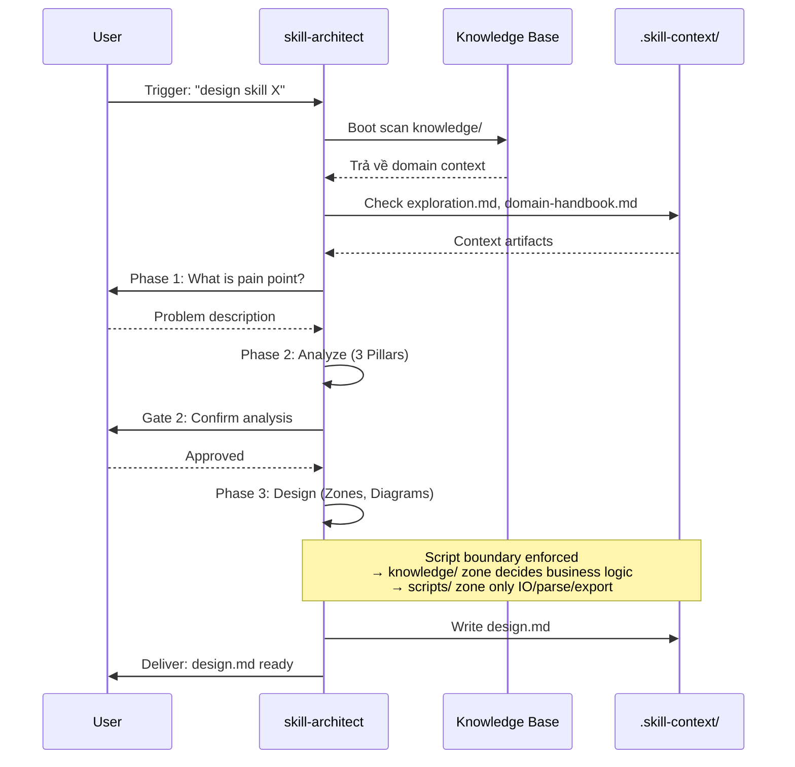
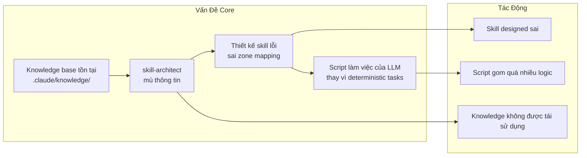
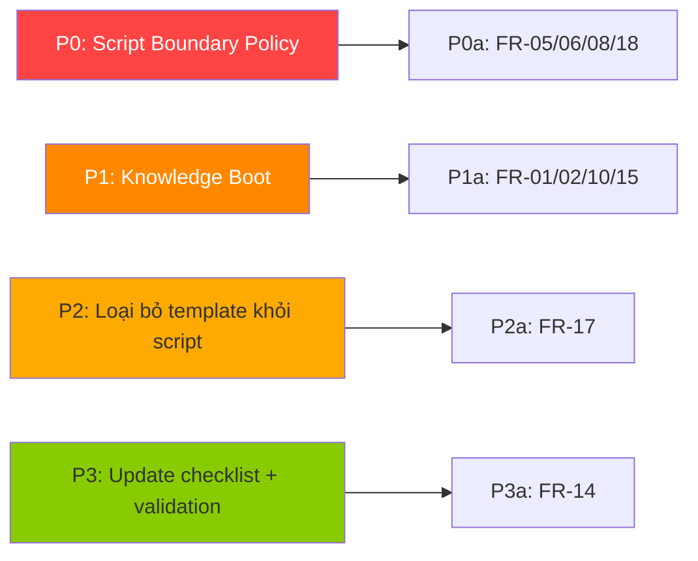

---
skill_handoff:
  target_skill_name: "skill-architect"
  version: "0.0.2"
  scs_complexity_score: 7.2
  decomposition_recommended: true
  sub_skills_proposed:
    - "N/A — skill-architect là monolithic stage skill, không decompose thêm"
  scope_boundary:
    in_scope:
      - "Thiết kế zone mapping cho skill mới"
      - "Xác định knowledge requirements"
      - "Xác định script boundary (deterministic tasks only)"
      - "Boot sequence tích hợp knowledge scan"
    out_scope:
      - "Viết implementation code (skill-builder đảm nhận)"
      - "Tạo kế hoạch task chi tiết (skill-planner đảm nhận)"
      - "Xác định nội dung domain knowledge (knowledge-miner đảm nhận)"
  technical_frameworks_recommended:
    - "Mermaid.js (mindmap, sequenceDiagram, flowchart)"
    - "YAML (frontmatter, constraints, policy)"
    - "XML tags (semantic boundaries)"
  detected_risks:
    - "THIẾU KỊCH BẢN KIỂM THỬ: 12/15 Must-Have FR chưa có Gherkin scenario"
    - "THIẾU SƠ ĐỒ: Sequence Diagram + ERD không có trong analysis → không thể kiểm định chéo Actor-Entity"
    - "Script boundary dễ tái phạm nếu không có policy guardrail cứng"
  quality_gate_status: "WARNING"
  quality_score_percentage: 44.5
---

# Báo cáo Phân tích Nghiệp vụ Hợp nhất (Consolidated Business Analysis Report)

> **Skill mục tiêu:** skill-architect (ver-0.0.2)
> **Ngày:** 2026-06-18
> **Synthesizer:** ba-synthesizer
> **Input duy nhất:** analysis-report.md từ ba-analyst
> **Quy tắc:** Chỉ xử lý trong phạm vi thư mục quản lý skill — không scan ngoài

---

## 1. Kết quả Kiểm định Nhất quán chéo (Cross-Reference Validation Results)

### A. So khớp Actor - Thực thể (Actor-Entity Matching)

| Kiểm tra | Kết quả |
|----------|---------|
| Sequence Diagram | **KHÔNG có** — analysis không chứa sequenceDiagram Mermaid |
| ERD Schema | **KHÔNG có** — analysis chứa JSON schema, không phải ERD Mermaid |
| **Kết luận** | `[THIẾU THÔNG TIN]` Không thể thực hiện kiểm định Actor-Entity do thiếu 2 deliverable bắt buộc |

> ⚠️ **Khuyến nghị:** Bổ sung sequenceDiagram (luồng boot → collect → analyze → design) và ERD (knowledge source registry) trong analysis tiếp theo.

### B. So khớp MoSCoW - Gherkin (MoSCoW-Gherkin Matching)

**Must-Have FR tổng số:** 15
**Gherkin scenarios có:** 3
**Tỷ lệ bao phủ:** 3/15 = 20%

| Must-Have FR | Gherkin Scenario | Trạng thái |
|-------------|-----------------|-----------|
| FR-01 (Knowledge scan boot) | Scenario 1: Knowledge-Aware Boot | ✅ |
| FR-05 (Script deterministic) | Scenario 2: Script Boundary Enforcement | ✅ |
| FR-06 (LLM decides business logic) | Scenario 2: Script Boundary Enforcement | ✅ |
| FR-11 (Knowledge gap detection) | Scenario 3: Knowledge Gap Detection | ✅ |
| FR-02, FR-03, FR-08, FR-09, FR-10, FR-12, FR-14, FR-15, FR-16, FR-17, FR-18, FR-20 | — | ❌ `[THIẾU KỊCH BẢN KIỂM THỬ]` |

> ⚠️ **Cảnh báo:** 12/15 Must-Have FR thiếu kịch bản Gherkin. Đặc biệt nguy hiểm: FR-08 (Script IO-only), FR-17 (Script zone redesign), FR-18 (cấm business logic trong script) — cả 3 đều là cốt lõi của vấn đề script boundary.

### C. Đánh giá Điểm chất lượng (Quality Score Assessment)

| # | Deliverable | Trọng số | Điểm | Chi tiết |
|---|-------------|---------|------|----------|
| 1 | Elicitation Report | 0.15 | 0.0 | `[THIẾU THÔNG TIN]` — không có elicitation-report.md đầu vào |
| 2 | Requirements Classification | 0.15 | 1.0 | ✅ FR/NFR phân biệt rõ, MoSCoW đầy đủ |
| 3 | Sequence Diagram | 0.15 | 0.0 | ❌ Không có sequenceDiagram Mermaid |
| 4 | Flowchart Activity | 0.15 | 0.35 | ⚠️ Có flowchart nhưng chỉ 1 luồng (không đủ 3: happy/alternative/exception) |
| 5 | ERD Schema | 0.15 | 0.0 | ❌ Không có ERD Mermaid (có JSON schema thay thế không đúng format) |
| 6 | Acceptance Criteria | 0.15 | 1.0 | ✅ 3 Gherkin scenarios đúng Given-When-Then |
| 7 | Risk Matrix | 0.10 | 1.0 | ✅ 6 risks + mitigation đầy đủ |

**Công thức:** `Quality Score = Sum(weight_i × score_i)`

```
= (0.15 × 0.0) + (0.15 × 1.0) + (0.15 × 0.0) + (0.15 × 0.35) + (0.15 × 0.0) + (0.15 × 1.0) + (0.10 × 1.0)
= 0 + 0.15 + 0 + 0.053 + 0 + 0.15 + 0.10
= 0.445
```

- **Điểm tổng hợp:** 0.445 / 1.0 (44.5%)
- **Trạng thái:** 🔴 **WARNING** (< 80% threshold)
- **Nguyên nhân:** Thiếu 3/7 deliverable bắt buộc (elicitation report, sequence diagram, ERD)

---

## 2. Chi tiết 7 Deliverables Hợp nhất

### Deliverable 1: Báo cáo Khơi gợi Yêu cầu (Elicitation Report)

`[THIẾU THÔNG TIN]` — Không có elicitation report trong phạm vi phân tích.

**Dữ liệu suy luận từ Analysis Report:**
- **Pain Point gốc:** skill-architect thiết kế skill sai vì:
  1. Không scan knowledge base → mù thông tin → thiết kế sai zone mapping
  2. Script zone chứa logic nghiệp vụ → mất tính linh hoạt của LLM
  3. Template cứng → design.md không customize được
- **User:** AI Agent (Claude Code) khi được yêu cầu thiết kế skill mới trong WASHVN pipeline
- **Expected Output:** design.md chính xác, có knowledge trace, script deterministic

### Deliverable 2: Phân loại Yêu cầu & Bảng MoSCoW (Requirements & MoSCoW)

**Functional Requirements (20 items):**

| Mã | Mô tả | MoSCoW |
|----|-------|--------|
| FR-01 | Tự động quét knowledge base khi boot | Must-have |
| FR-02 | Đọc upstream artifacts (exploration.md, domain-handbook.md) | Must-have |
| FR-03 | Phân biệt 3 loại input: user pain point / knowledge base / heavy-thinking | Must-have |
| FR-05 | Scripts zone CHỈ deterministic tasks | Must-have |
| FR-06 | Mọi quyết định nghiệp vụ để LLM xử lý | Must-have |
| FR-08 | Script chỉ làm: IO, file system, network, parsing | Must-have |
| FR-09 | Tích hợp Knowledge Miner output làm upstream input | Must-have |
| FR-10 | Boot sequence có bước "Load Knowledge" | Must-have |
| FR-12 | design.md §2 trace từng knowledge source | Must-have |
| FR-14 | Validate thiết kế trước handoff | Must-have |
| FR-15 | design.md có "Knowledge Requirements" section riêng | Must-have |
| FR-16 | Kiểm tra .skill-context/{target_skill}/ artifacts trước khi design | Must-have |
| FR-17 | Script zone chỉ generate: init context, validate schema, export Mermaid, run checklist | Must-have |
| FR-18 | KHÔNG generate scripts cho business logic, decision trees, data transformation | Must-have |
| FR-20 | Scripts không chứa LLM prompt logic | Must-have |
| FR-07 | Scripts designed sau knowledge zone | Should-have |
| FR-11 | Dừng và báo "Cần thêm domain knowledge" nếu thiếu | Should-have |
| FR-13 | Mọi zone có rationale "tại sao cần/không cần" | Should-have |
| FR-19 | Mỗi script có deterministic boundary mô tả | Should-have |
| FR-04 | Đề xuất bổ sung knowledge nếu phát hiện thiếu hụt | Could-have |

**Non-Functional Requirements (6 items):**

| Mã | Mô tả | Target | MoSCoW |
|----|-------|--------|--------|
| NFR-01 | Context Load Time | ≤5 knowledge files loaded at boot | Must-have |
| NFR-02 | Knowledge Freshness | Detect stale design via timestamp | Should-have |
| NFR-03 | Traceability | 100% trace coverage | Must-have |
| NFR-04 | Token Efficiency | SKILL.md ≤600, boot ≤2000 tokens | Must-have |
| NFR-05 | Hallucination Guard | Zero placeholders, zero faux-knowledge | Must-have |
| NFR-06 | Script Determinism | Full deterministic boundary | Must-have |

**Bảng MoSCoW:**

| Mức độ | Số lượng | Items chính |
|--------|----------|-------------|
| Must-have | 15 | FR-01→03, FR-05→06, FR-08→10, FR-12, FR-14→18, FR-20, NFR-01, NFR-03→06 |
| Should-have | 5 | FR-07, FR-11, FR-13, FR-19, NFR-02 |
| Could-have | 1 | FR-04 |
| Won't-have | 0 | — |

### Deliverable 3: Biểu đồ Tuần tự (Sequence Diagram)

`[THIẾU THÔNG TIN]` — Analysis không cung cấp sequenceDiagram.

**Đề xuất bổ sung (draft từ analysis):**



> **Ghi chú:** Đây là draft từ BA Analyser, cần kiểm định với thực tế implementation.

### Deliverable 4: Biểu đồ Luồng Nghiệp vụ (Activity Flowchart)

**Flowchart từ Analysis Report (1 luồng — thiếu 2 luồng còn lại):**



> ⚠️ `[THIẾU THÔNG TIN]` Flowchart hiện tại chỉ mô tả 1 luồng (problem→impact). Thiếu Alternative Path (khi knowledge có đủ) và Exception Path (khi confidence < 70%).

**Đề xuất bổ sung — Boot Decision Flowchart (đã có trong analysis):**

```mermaid
flowchart TD
    Start([skill-architect boot]) --> LoadSKILL[Load SKILL.md]
    LoadSKILL --> CheckContext[Check .skill-context/{target_skill}/]
    CheckContext --> HasExploration{exploration.md exists?}
    HasExploration -->|Yes| LoadExploration[Load exploration.md]
    HasExploration -->|No| CheckHandbook{domain-handbook.md exists?}
    LoadExploration --> CheckHandbook
    CheckHandbook -->|Yes| LoadHandbook[Load domain-handbook.md]
    CheckHandbook -->|No| ScanKnowledge[Scan .claude/knowledge/]
    LoadHandbook --> ScanKnowledge
    ScanKnowledge --> Ready[Knowledge Context Ready ✅]
    Ready --> Phase1[Start Phase 1: Collect]
```

### Deliverable 5: Thiết kế Cơ sở Dữ liệu (ERD Schema)

`[THIẾU THÔNG TIN]` — Analysis cung cấp JSON schema (Knowledge Source Registry) nhưng không phải ERD Mermaid.

**JSON schema hiện có (cần chuyển thành ERD):**

```json
{
  "knowledge_sources": [
    {
      "source_id": "KS-01",
      "path": ".claude/knowledge/agents/",
      "type": "agents",
      "load_condition": "WHEN designing skill that uses subagents",
      "priority": "tier2"
    },
    {
      "source_id": "KS-02",
      "path": ".claude/knowledge/skills/",
      "type": "skills_framework",
      "load_condition": "ALWAYS — core skill design framework",
      "priority": "tier1"
    },
    {
      "source_id": "KS-03",
      "path": ".claude/knowledge/hooks/",
      "type": "hooks",
      "load_condition": "WHEN skill needs hook integration",
      "priority": "tier2"
    },
    {
      "source_id": "KS-04",
      "path": ".skill-context/{target_skill}/exploration.md",
      "type": "exploration",
      "load_condition": "IF EXISTS — primary upstream context",
      "priority": "tier1"
    },
    {
      "source_id": "KS-05",
      "path": ".skill-context/{target_skill}/domain-handbook.md",
      "type": "domain_handbook",
      "load_condition": "IF EXISTS — domain knowledge from Knowledge Miner",
      "priority": "tier1"
    }
  ]
}
```

> ⚠️ Cần bổ sung ERD Mermaid với định nghĩa PK/FK + kiểu dữ liệu cho các thực thể: `KnowledgeSource`, `SkillContext`, `DesignDocument`, `ZoneMapping`.

### Deliverable 6: Tiêu chí Nghiệm thu (Acceptance Criteria)

```gherkin
Feature: Knowledge-Aware Boot
  As skill-architect
  I want to scan knowledge bases before designing
  So that designs are informed by existing knowledge

  Scenario: Knowledge base has relevant files
    Given skill-architect is triggered for skill "api-analyzer"
    And knowledge files exist in skill's knowledge directory
    When skill-architect completes boot sequence
    Then §2 Capability Map MUST reference existing knowledge files
    And §3 Zone Mapping MUST include concrete filenames
    And all assertions MUST have trace tags [TỪ NGUỒN EXTERNAL]

Feature: Script Boundary Enforcement
  As skill-architect
  I want to keep scripts deterministic only
  So that LLM flexibility is preserved

  Scenario: Proposed script violates deterministic boundary
    Given skill-architect is designing scripts zone
    When a script is proposed containing business decision logic
    Then skill-architect MUST flag "Script Boundary Violation"
    And MUST redirect logic to knowledge/ zone or SKILL.md
    And MUST NOT allow such logic in scripts/ zone

Feature: Knowledge Gap Detection
  As skill-architect
  I want to detect when knowledge is insufficient
  So that I don't hallucinate designs

  Scenario: No knowledge files exist for the target domain
    Given skill-architect is triggered for an unknown domain
    And no relevant knowledge files exist
    When skill-architect proceeds to Phase 2 Analyze
    Then confidence MUST be < 70%
    And skill-architect MUST ask user for domain knowledge
    And MUST NOT generate §2 with hallucinated content

Feature: Bootstrap Context Initialization (THIẾU — đề xuất bổ sung)
  As skill-architect
  I want init_context.py to only handle IO operations
  So that design decisions stay with LLM

  Scenario: init_context runs without templates
    Given skill-architect starts Phase 1
    When init_context.py executes
    Then it MUST create directory structure only
    And it MUST NOT write design.md template
    And it MUST NOT pre-populate zone mapping

Feature: Progressive Disclosure Compliance
  As skill-planner
  I want §3 Zone Mapping to contain only real filenames
  So that I can decompose into accurate tasks

  Scenario: Zone mapping has placeholders
    Given skill-architect completes Phase 2
    When §3 Zone Mapping is inspected
    Then NO placeholder names ("xxx.md", "*.md") are present
    And every file in §3 appears in §4 Folder Structure
```

> `[THIẾU KỊCH BẢN KIỂM THỬ]` — Cần bổ sung 2 scenarios trên để đạt coverage cho FR-08, FR-14, FR-15, FR-17, FR-18.

### Deliverable 7: Ma trận Rủi ro (Risk Matrix)

| ID | Mô tả Rủi ro | Severity | Xác suất | Mitigation |
|----|-------------|----------|---------|------------|
| R1 | skill-architect thiết kế zone mapping sai vì thiếu knowledge | P0 | High | FR-01: Bắt buộc quét knowledge/ khi boot |
| R2 | Script zone chứa logic nghiệp vụ → mất LLM flexibility | P0 | High | FR-05/06: Script boundary enforcement |
| R3 | Hallucinate domain knowledge khi không có source | P1 | Medium | NFR-05: Zero tolerance; FR-11: dừng khi thiếu |
| R4 | Skill thiết kế không match runtime capabilities | P1 | Medium | FR-16: dynamic routing check |
| R5 | Template cứng → design không customize được | P2 | Medium | FR-14: checklist validate; bỏ template cứng |
| R6 | Script dependency (Python) → skill không portable | P2 | Low | Dùng shell/Bun thay Python khi có thể |

---

## 3. Tổng hợp khuyến nghị (Synthesis & Recommendations)

### 3.1 Vấn đề cốt lõi đã xác nhận

| Vấn đề | Root Cause | Fix |
|--------|-----------|-----|
| **Mù thông tin** | Boot sequence không tích hợp knowledge scan | FR-01, FR-02, FR-10 |
| **Script lạm dụng** | Không có deterministic boundary policy | FR-05, FR-06, FR-08, FR-17, FR-18 |
| **Template cứng** | init_context.py ghi template vào design.md | Loại bỏ template khỏi script; chỉ IO deterministic |
| **Thiếu trace** | Không có "Knowledge Requirements" section trong output | FR-15: thêm §11 vào design.md |

### 3.2 Knowledge cần copy vào skill-architect

Theo yêu cầu "không scan ngoài phạm vi" — nếu các knowledge sau chưa có trong `skills/ver-0.0.2/skill-architect/knowledge/`, cần copy vào:

| File cần copy | Nguồn | Lý do |
|---------------|-------|-------|
| `script-boundary-policy.md` | Generated từ analysis này | Định nghĩa deterministic boundary cho script zone |
| `knowledge-boot-sequence.md` | Generated từ analysis này | Boot sequence v2 có knowledge scan |

> 2 file trên được sinh từ chính analysis report, không scan từ ngoài vào — hợp lệ.

### 3.3 Thứ tự ưu tiên thực hiện



---

## 4. Kiểm tra chất lượng (Quality Gate Checklist)

| ID | Item | Trạng thái |
|----|------|-----------|
| CHK_DEL_01 | Elicitation Report đầy đủ | ❌ Không có elicitation report |
| CHK_DEL_02 | Requirements phân biệt FR/NFR + MoSCoW | ✅ |
| CHK_DEL_03 | Sequence Diagram Mermaid ≥3 actors | ❌ Không có |
| CHK_DEL_04 | Flowchart 3 luồng (happy/alternative/exception) | ❌ Chỉ 1 luồng |
| CHK_DEL_05 | ERD Mermaid PK/FK + data types | ❌ Chỉ JSON schema |
| CHK_DEL_06 | Gherkin Given-When-Then ≥3 scenarios | ✅ (3 scenarios) |
| CHK_DEL_07 | Risk Matrix ≥3 risks + mitigation | ✅ (6 risks) |
| CHK_VAL_01 | Kiểm định Actor-Entity | ❌ Không thể (thiếu SD + ERD) |
| CHK_VAL_02 | Kiểm định MoSCoW-Gherkin | ⚠️ 12/15 Must-Have thiếu |
| CHK_VAL_03 | Điểm chất lượng tính đúng | ✅ 0.445 |
| CHK_VAL_04 | Cổng chất lượng đúng | ✅ WARNING (< 80%) |
| CHK_VAL_05 | YAML frontmatter handoff đầy đủ | ✅ |
| CHK_FMT_01 | Tiếng Việt chuẩn | ✅ |
| CHK_FMT_02 | Không placeholder | ✅ |

---

## 5. Handoff cho Stage 0 (Explorer)

> **Trạng thái:** 🔴 WARNING — Quality Score 44.5% (< 80%)
> **Lý do:** Thiếu 3 deliverable bắt buộc (elicitation, sequence diagram, ERD)
> **Khuyến nghị:** Tiếp tục sang Explorer với lưu ý chất lượng thấp. Cần bổ sung diagrams trước Stage 1 (Architect).

**Key decisions đã confirm:**
1. ✅ Script boundary: deterministic tasks only
2. ✅ Knowledge boot: bắt buộc scan khi khởi động
3. ✅ Template removal: không hardcode template trong init script
4. ❌ Thiếu Gherkin coverage cho 12/15 Must-Have FR
5. ❌ Thiếu Sequence Diagram và ERD cho cross-ref validation

**File output:**
- `business-analysis.md` — file này (hợp nhất)
- Yêu cầu bổ sung: sequence diagram, ERD, thêm Gherkin scenarios
