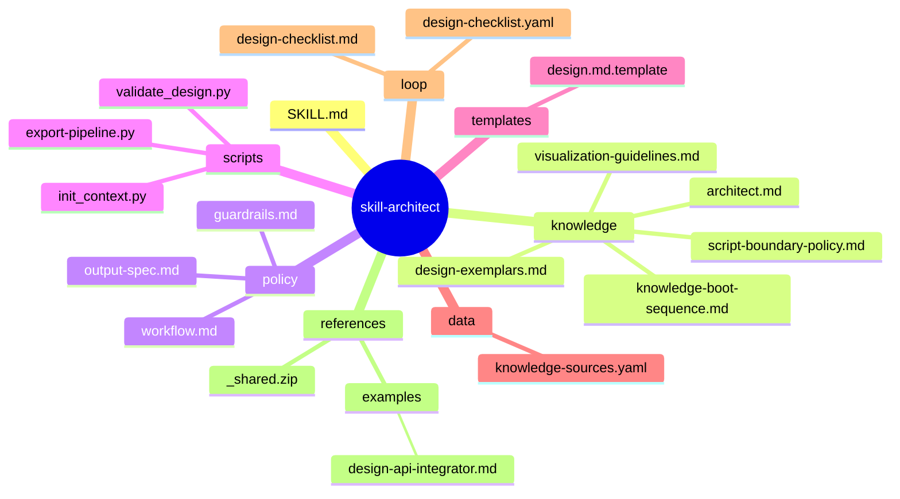
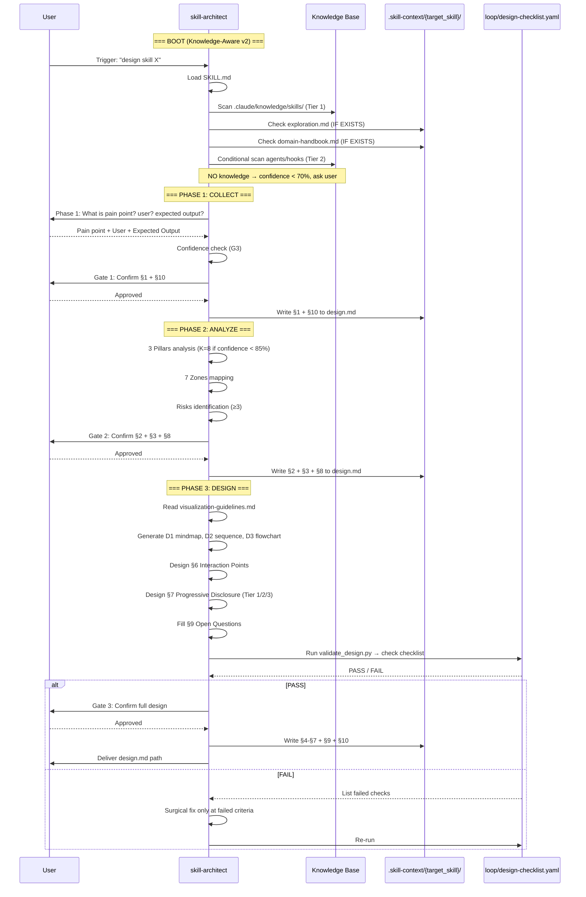
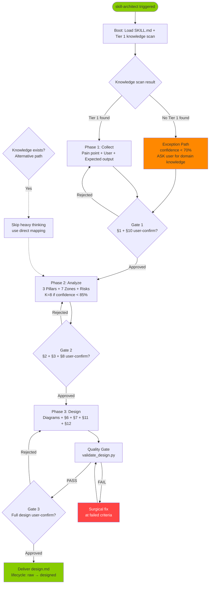

# skill-architect — Architecture Design (self-application, ver-0.0.2)

> Generated by skill-architect (dogfooding) | 2026-06-18T12:00:00Z
> Status: design-completed (Stage 1 → Stage 1.5 handoff)

> **Note**: This design.md is the architecture document for the **skill-architect skill itself** (self-application / dogfooding). It demonstrates the 3-Phase workflow and 7-Zone mapping that skill-architect enforces on every other skill.

---

## 1. Problem Statement

**Vấn đề**: skill-architect ở ver-0.0.1 thiết kế zone mapping sai vì boot sequence không scan knowledge base. [TỪ BA §3.1 — R1, FR-01] Cụ thể:

- Knowledge base tồn tại (`.claude/knowledge/`, `_shared/knowledge/`) nhưng **không được đọc** khi boot → architect mù thông tin → chọn sai zones, gán sai knowledge files. [TỪ BA §1 — flowchart, FR-02]
- Scripts zone bị lạm dụng để chứa business logic (init_context.py có FALLBACK_TEMPLATES + pre-populate design.md.template) thay vì chỉ làm deterministic IO tasks. [TỪ BA §5.1 — anti-pattern, FR-17/18]
- design.md output thiếu Knowledge Requirements section, thiếu trace tag coverage → Planner và Builder không đủ context để decompose. [TỪ BA §3.4 — FR-12/15, NFR-03]

**Người dùng**: AI Agent (Claude Code) khi được trigger với yêu cầu "thiết kế skill mới" trong WASHVN pipeline. Downstream consumers: skill-planner (Stage 2), skill-builder (Stage 3). [TỪ HANDBOOK §1.2, output-spec.md §Pipeline Integration]

**Lý do cần skill-architect**: Là Stage 1 duy nhất — không có nó thì pipeline 8-stage không thể tạo skill mới. Critical role: làm hợp đồng (design.md) giữa BA/Explorer upstream và Planner downstream. [SUY LUẬN — TỪ BA §1, HANDBOOK §1.1]

---

## 2. Capability Map

### 2.1 Tri thức (Knowledge — Pillar 1)  [TỪ BA §3.1 FR-01/02/10, HANDBOOK §2]

- Scan `.claude/knowledge/skills/` (Tier 1, ALWAYS) — core skill design framework
- Scan `.claude/knowledge/agents/` (Tier 2, WHEN designing subagent-using skill)
- Scan `.claude/knowledge/hooks/` (Tier 2, WHEN skill needs hooks integration)
- Read `.skill-context/{target_skill}/exploration.md` (Tier 1, IF EXISTS — primary upstream source)
- Read `.skill-context/{target_skill}/domain-handbook.md` (Tier 1, IF EXISTS — domain knowledge from Knowledge Miner)
- Read `_shared/knowledge/` (Tier 2, ALWAYS)

### 2.2 Quy trình (Process — Pillar 2)  [TỪ HANDBOOK §1.1, policy/workflow.md]

1. **Phase 1 Collect**: xác định skill-name (kebab-case) + 3 thứ từ user (pain point, user, expected output) → Gate 1 → ghi §1 + §10
2. **Phase 2 Analyze**: 3 Pillars (Knowledge/Process/Guardrails) → 7 Zones Mapping → confidence check (K=8 nếu <85%) → Gate 2 → ghi §2 + §3 + §8
3. **Phase 3 Design**: Mermaid diagrams (mindmap + sequence + flowchart) + Interaction Points + Progressive Disclosure → Gate 3 → ghi §4-§7 + §9
4. **Quality Gate**: chạy `loop/design-checklist.yaml` — must pass all `MUST` severity checks trước khi deliver

### 2.3 Kiểm soát (Guardrails — Pillar 3)  [TỪ HANDBOOK §6.3, policy/guardrails.md]

- **G1 Design Only**: KHÔNG viết implementation code; redirect sang skill-builder
- **G2 Gate Enforcement**: stop tại mỗi phase, chờ user confirm
- **G3 Confidence**: < 70% → ask user; < 85% → activate K=8 chains
- **G4 Zone Mapping Contract**: specific filenames only, KHÔNG placeholder (no `xxx.md`, `*.md`)
- **G5 Checklist Gate**: pass `loop/design-checklist.yaml` trước khi declare complete
- **G6 Heavy Thinking Gate**: confidence < 85% ở Phase 2 → K=8 chains
- **G7 Format Compliance**: YAML for constraints, XML for boundaries, trace tags mandatory

### 2.4 Knowledge Gap Handling  [TỪ HANDBOOK §7.4, knowledge-boot-sequence.md §3]

- Condition: No Tier 1 knowledge found
- Action: set confidence < 70%, ASK user cung cấp domain knowledge, KHÔNG hallucinate §2 content
- Fallback: log vào §9 Open Questions, flag `[CẦN LÀM RÕ]` mọi assertion, proceed với "LIMITED KNOWLEDGE" warning trong frontmatter

### 2.5 Script Boundary Enforcement  [TỪ HANDBOOK §7.3, script-boundary-policy.md §2]

- **Script được phép**: IO operations, parse/validate YAML/JSON, extract Mermaid blocks, run checklist rules, deterministic network GET
- **Script KHÔNG được phép**: chọn zones/knowledge files, sinh template nội dung, sinh prompt templates, decision trees, conditional branching business logic

---

## 3. Zone Mapping

> ⚠️ Contract Section — Planner đọc §3 để decompose thành Tasks. Mọi Zone PHẢI có giá trị trong cột "Files cần tạo". Zone không dùng → ghi "Không cần".

| Zone | Files cần tạo | Nội dung | Bắt buộc? |
|------|--------------|----------|-----------|
| Core (SKILL.md) | `SKILL.md` | Persona, phases, guardrails, routing map, output contract, YAML frontmatter (name/description/version: 0.0.2/suite: WASHVN/tags/when_to_use) | ✅ |
| Knowledge | `knowledge/architect.md` | 3 Pillars analysis framework (Knowledge/Process/Guardrails) | ✅ |
| Knowledge | `knowledge/knowledge-boot-sequence.md` | Boot v2 — scan knowledge base trước Phase 1 (Tier 1/2/3 priorities) | ✅ |
| Knowledge | `knowledge/script-boundary-policy.md` | Deterministic boundary policy cho scripts zone (allowed vs forbidden) | ✅ |
| Knowledge | `knowledge/visualization-guidelines.md` | Mermaid diagram standards (mindmap/sequence/flowchart syntax) | ✅ |
| Knowledge | `knowledge/design-exemplars.md` | Section content spec + good/bad exemplars + anti-patterns | ✅ |
| Scripts | `scripts/init_context.py` | IO deterministic: tạo `.skill-context/{name}/` + extract `_shared.zip` nếu thiếu; KHÔNG ghi template content | ✅ |
| Scripts | `scripts/validate_design.py` | Parse design.md → check YAML frontmatter, required sections, zone mapping contract, trace tag coverage | ✅ |
| Scripts | `scripts/export-pipeline.py` | Extract Mermaid blocks từ design.md → standalone `.md` files | ✅ |
| Templates | `templates/design.md.template` | Skeleton 10-section (frontmatter + empty sections, KHÔNG pre-populate zone mapping) | ❌ |
| Data | `data/knowledge-sources.yaml` | Boot config: 5 KnowledgeSource entries (KS-01..KS-05) với tier/priority/load_condition | ✅ |
| Loop | `loop/design-checklist.yaml` | Machine-readable quality gate: 10 S*, 4 Z*, 5 D*, 4 H*, 4 P*, 2 F*, 3 T* checks | ✅ |
| Loop | `loop/design-checklist.md` | Human-readable checklist (mirror of YAML) | ✅ |
| Assets | Không cần | N/A | ❌ |

> **G4 Compliance note**: Mọi filename ở §3 đều cụ thể, không có placeholder như `xxx.md`, `*.md`, `template.py`. [TỪ HANDBOOK §6.3 G4]

---

## 4. Folder Structure



---

## 5. Execution Flow



### 5.2 Workflow Phases Flowchart (D3)



> **3-Path coverage** (per BA §Deliverable4 + Q5 resolution): Happy (Knowledge exists → full pipeline), Alternative (Knowledge exists → skip heavy thinking), Exception (No knowledge → stop+ask, confidence < 70%). [TỪ BA §Deliverable4, HANDBOOK §7.4]

---

## 6. Interaction Points

| # | Thời điểm | Lý do dừng | Hành động của AI |
|---|-----------|-----------|-----------------|
| 1 | Sau Phase 1 Collect | User phải xác nhận §1 Problem Statement + §10 Metadata skeleton | Trình bày summary §1+§10 → chờ explicit "Approved" → ghi file |
| 2 | Sau Phase 2 Analyze | User phải xác nhận §2 Capability Map (3 Pillars) + §3 Zone Mapping + §8 Risks | Trình bày bảng → chờ explicit "Approved" → ghi file |
| 3 | Sau Phase 3 Design | User phải xác nhận toàn bộ design trước deliver | Trình bày full design.md → chờ explicit "Approved" → ghi file |
| 4 | Boot — Knowledge Gap | No Tier 1 knowledge found | Set confidence < 70%, ASK user provide domain knowledge, KHÔNG hallucinate §2 |
| 5 | Phase 2 — Heavy Thinking | Confidence < 85% | Activate K=8 chains (2 Knowledge + 3 Process + 3 Guardrails) trước khi present Gate 2 |
| 6 | Pre-deliver — Quality Gate | `validate_design.py` reports FAIL | List failed checks → surgical fix → re-run; KHÔNG rewrite passing sections |

---

## 7. Progressive Disclosure Plan

### Tier 1: Bắt buộc đọc (Mandatory — boot)
- `SKILL.md` — persona + phases + guardrails + routing map
- `data/knowledge-sources.yaml` — boot config registry (KS-01..KS-05)
- `loop/design-checklist.yaml` — quality gate spec (để check kết quả)

### Tier 2: Đọc khi cần (Conditional — theo phase)
- `knowledge/architect.md` — Phase 2 Analyze (3 Pillars framework)
- `knowledge/knowledge-boot-sequence.md` — Boot step (Tier 1/2/3 priorities)
- `knowledge/script-boundary-policy.md` — Phase 2 §3 Zone Mapping (khi designing scripts zone)
- `knowledge/visualization-guidelines.md` — Phase 3 §4-§5 (khi vẽ Mermaid)
- `knowledge/design-exemplars.md` — Phase 1-3 (khi viết §1-§10 sections)
- `policy/workflow.md` — Phase execution detail (on-demand)
- `policy/output-spec.md` — Section writing contract (on-demand)
- `policy/guardrails.md` — G1-G7 enforcement (on-demand)

### Tier 3: On-demand (manual scaffold / reference)
- `templates/design.md.template` — manual scaffold (KHÔNG pre-populate; chỉ cung cấp khi user yêu cầu)
- `references/examples/design-api-integrator.md` — reference exemplar
- `references/_shared.zip` — bundled shared knowledge

---

## 8. Risks & Blind Spots

| # | Risk | Severity | Mitigation |
|---|------|----------|------------|
| 1 | BA quality 44.5% — thiếu 12/15 Gherkin scenarios + Sequence Diagram + ERD → design có thể miss acceptance scenarios | P0 | [SUY LUẬN] Document gaps trong §9 Q5-Q7; thiết kế self đã enforce `loop/design-checklist.yaml` G5 gate để catch regressions |
| 2 | `scripts/init_context.py` vẫn có FALLBACK_TEMPLATES dict (lines 97-101) + ghi design.md.template content (lines 218-225) — vi phạm FR-17/18 (script boundary) | P0 | [TỪ HANDBOOK §9.1 GAP-07, BA §3.1] Q3 OPEN — đề xuất: strip template-writing, chỉ giữ IO deterministic (mkdir + extract zip) |
| 3 | Runtime `.claude/skills/skill-architect/knowledge/` thiếu `knowledge-boot-sequence.md` + `script-boundary-policy.md` (chỉ có trong `skills/ver-0.0.2/`) | P0 | [TỪ HANDBOOK §5.2, §9.1 GAP-01] Stage 3 Builder action: sync từ `skills/ver-0.0.2/` → `.claude/skills/` |
| 4 | G3 confidence < 70% → "ask" hiện tại, nhưng FR-11 muốn "stop" hoàn toàn → conflict | P1 | [TỪ HANDBOOK §9.2 Q1] Q1 OPEN — đề xuất: < 70% = stop + block Phase, 70-85% = ask + K=8 |
| 5 | `templates/design.md.template` (ver-0.0.2) còn hardcode pre-populated zone mapping → vi phạm G4 + script boundary | P1 | [TỪ HANDBOOK §9.1 GAP-03, BA §3.1] Q3 OPEN — replace bằng skeleton-only template (frontmatter + 10 empty sections, no zone pre-fill) |
| 6 | Output spec chưa có §11 Knowledge Requirements (BA FR-15) | P1 | [TỪ HANDBOOK §9.1 GAP-10, BA FR-15] Q4 OPEN — đề xuất: thêm §11 mới trong `policy/output-spec.md`, hoặc merge vào §2 |
| 7 | Token budget SKILL.md 600 tokens hiện đang gần ngưỡng khi reference inline 5 knowledge files + 3 policy files | P1 | [TỪ HANDBOOK §6.4] Refactor SKILL.md boot → đọc `data/knowledge-sources.yaml` thay vì inline list knowledge paths |
| 8 | `init_context.py` Python dependency → portability thấp (BA R6) | P2 | [TỪ BA R6] Q6 OPEN — đề xuất: giữ Python cho zipfile logic, tách IO mkdir thành shell one-liner wrapper |
| 9 | K=8 chains chỉ kích hoạt khi confidence < 85% Phase 2 — không áp dụng cho knowledge gap scenario | P2 | [SUY LUẬN] Khi knowledge gap, default heavy thinking ngay từ Phase 1 thay vì Phase 2 |
| 10 | Lifecycle phase: hiện tại `raw` → sau design.md → `designed`; nhưng cần CASE rollback contract rõ nếu quality gate fail | P2 | [TỪ architecture.md §5] Stage 1.5 Quality Gatekeeper handles rollback; document handoff contract in §10 |

---

## 9. Open Questions

| # | Câu hỏi | Nguồn (Phase) | Trạng thái |
|---|---------|--------------|------------|
| 1 | Confidence < 70% → complete stop (FR-11) hay just ask (G3 hiện tại)? | BA FR-11 vs G3 | ❓ OPEN — đề xuất: stop + block Phase |
| 2 | Khi nào apply SCS fast-track (SCS < 3.0) cho skill-architect? Hiện tại BA ghi SCS = 7.2 nhưng nói monolithic. | architecture.md §A vs BA §scope_boundary | ❓ OPEN — cần confirm BA interpretation |
| 3 | `init_context.py` nên strip hoàn toàn template-writing hay chỉ strip FALLBACK_TEMPLATES dict? | BA §3.1, HANDBOOK GAP-07 | ❓ OPEN — đề xuất: chỉ IO deterministic |
| 4 | Knowledge Requirements section: §11 mới hay subsection của §2? | BA FR-15 vs HANDBOOK §9.1 GAP-10 | ❓ OPEN — đề xuất: §11 riêng để visibility |
| 5 | Flowchart alternative path (knowledge exists) và exception path (confidence < 70%) có cần thêm vào design.md §5 không? | BA §Deliverable4 thiếu 2/3 paths | ❓ OPEN — đề xuất: thêm D4 alt/exception diagram |
| 6 | Có nên thay thế `init_context.py` Python bằng shell + bun script để portability? | BA R6 | ❓ OPEN — đề xuất: giữ Python (cần zipfile), tách IO mkdir thành shell |
| 7 | 12 Gherkin scenarios còn thiếu cho FR-08/14/15/17/18 → architect tự sinh hay yêu cầu BA sinh? | BA §B (3/15 = 20% coverage) | ❓ OPEN — đề xuất: architect sinh trong design checklist extension |

---

## 10. Metadata

```yaml
skill_name: skill-architect
version: 0.0.2
suite: WASHVN
stage: 1   # Architect (this design is from Stage 1)
designed_at: 2026-06-18T12:00:00Z
author: skill-architect (self-application — dogfooding)
framework: architect.md v3.0 (knowledge-boot-sequence + script-boundary)
status: design-completed
lifecycle_phase: raw → designed
handoff_checklist:
  - [x] §1 Problem Statement (Phase 1)
  - [x] §2 Capability Map (Phase 2)
  - [x] §3 Zone Mapping (Phase 2)
  - [x] §4 Folder Structure Mermaid (Phase 3)
  - [x] §5 Execution Flow Mermaid (Phase 3)
  - [x] §6 Interaction Points (Phase 3)
  - [x] §7 Progressive Disclosure (Phase 3)
  - [x] §8 Risks ≥3 (Phase 2)
  - [x] §9 Open Questions (Phase 3)
  - [x] §10 Metadata (Phase 1 + update)
  - [x] §11 Knowledge Requirements (Phase 3 — extension per FR-15)
ba_quality_score: 0.445   # WARNING — thiếu 3 deliverables
architect_confidence: 0.78
dependencies:
  predecessor:
    - skill-explorer (Stage 0) — produces exploration.md
    - knowledge-miner (Stage 0.5) — produces domain-handbook.md
  successor:
    - quality-gatekeeper (Stage 1.5) — validates this design.md
    - skill-planner (Stage 2) — decomposes §3 into todo.md
    - skill-builder (Stage 3) — builds runtime SKILL.md + scripts
quality_gate_status: pending  # Stage 1.5 to execute
```

### 10.1 Version & Dependencies

**Version bump 0.0.1 → 0.0.2**: MINOR — backward compatible (adds knowledge boot + script boundary policy, removes template hardcoding). [TỪ HANDBOOK §10.1 versioning rules]

**Predecessor**: skill-explorer (Stage 0) — produces exploration.md. [TỪ HANDBOOK §1.2]
**Successor (required)**: skill-planner (Stage 2) — consumes §3 Zone Mapping. [TỪ HANDBOOK §1.2]
**Successor (optional)**: skill-builder (Stage 3) — consumes §3 + §7. [TỪ HANDBOOK §1.2]

---

## 11. Knowledge Requirements  [TỪ BA FR-15, HANDBOOK §9.1 GAP-10]

> Section mới được đề xuất (BA FR-15) — liệt kê các knowledge files cần tồn tại trong `knowledge/` zone. Mỗi file trace về nguồn requirement.

| # | Knowledge File | Purpose | Source FR | Priority |
|---|----------------|---------|-----------|----------|
| 1 | `knowledge/architect.md` | 3 Pillars framework (Knowledge/Process/Guardrails) | FR-01, FR-12 | P0 |
| 2 | `knowledge/knowledge-boot-sequence.md` | Boot v2 với knowledge scan (Tier 1/2/3 priorities) | FR-01, FR-02, FR-10 | P0 |
| 3 | `knowledge/script-boundary-policy.md` | Deterministic boundary cho scripts zone | FR-05, FR-06, FR-08, FR-17, FR-18, FR-20 | P0 |
| 4 | `knowledge/visualization-guidelines.md` | Mermaid diagram standards (mindmap/sequence/flowchart syntax) | FR-14 (validation) | P0 |
| 5 | `knowledge/design-exemplars.md` | Section content spec + good/bad exemplars | FR-14, NFR-05 | P0 |
| 6 | `data/knowledge-sources.yaml` | Runtime boot config registry (KS-01..KS-05) | FR-01, NFR-01 | P0 |

**Knowledge gaps detected**:
- ⚠️ `knowledge-boot-sequence.md` + `script-boundary-policy.md` đang thiếu tại runtime `.claude/skills/skill-architect/knowledge/` (chỉ có trong `skills/ver-0.0.2/`) — Stage 3 Builder phải sync.
- ⚠️ `data/knowledge-sources.yaml` chưa tồn tại — Stage 3 Builder phải tạo mới.

---

## 12. When NOT to Use  [TỪ BA quality-matrix L0-03, HANDBOOK §6.3 G1]

> Section mới bổ sung (Turn 2 enhancement per L0-03) — explicit negative contract để tránh misuse.

skill-architect KHÔNG phù hợp cho các use case sau. Redirect đến skill chuyên biệt:

| ❌ Use Case | Lý do không dùng | Redirect đến |
|-------------|------------------|--------------|
| **Viết implementation code** (Python/JS/Bash scripts cho skill mới) | skill-architect chỉ thiết kế architecture, KHÔNG implement (G1 Design Only) | `skill-builder` (Stage 3) |
| **Phân tích nghiệp vụ / Elicitation** (khơi gợi requirements, FR/NFR classification) | Thiết kế cần BA input upstream; không tự ý BA | `business-analyst` (Stage -1) |
| **Khai thác domain knowledge** (đọc source code, mine conventions) | Cần domain context trước khi design | `knowledge-miner` (Stage 0.5) |
| **Decompose design.md thành todo.md** | Planner phase riêng | `skill-planner` (Stage 2) |
| **Mutate runtime `.claude/skills/` trực tiếp** | Forbidden per CLAUDE.md §3 — chỉnh sửa tại `raw/ver-3/` rồi sync | `sync_skill` command |
| **Review/audit skill có sẵn** | skill-architect chỉ design greenfield; review dùng quality-gatekeeper | `production-quality-gatekeeper` (Stage 1.5) |
| **Generate Gherkin test scenarios only** | Architecture-level concern; Gherkin là BA deliverable | `business-analyst` (Stage -1) hoặc `qa-tester` |
| **Edit `init_context.py` hoặc bất kỳ script nào trong runtime** | Vi phạm G1 + CLAUDE.md §3 | Stage 3 Builder qua raw/ver-3/ |
| **Thiết kế skill với SCS > 7.5** | Complex → cần decomposition thành sub-skills | `skill-planner` để split trước khi design |

**Decision rule**: Trước khi trigger skill-architect, hỏi:
1. Đã có `exploration.md` (Stage 0) hoặc `domain-handbook.md` (Stage 0.5) upstream? → **No**: chạy upstream trước
2. Đã có BA report với FR/NFR? → **No**: trigger `business-analyst` trước
3. Có phải design greenfield skill (KHÔNG phải edit/refactor)? → **No**: dùng `code-reviewer`
4. Scope fit trong 1 monolithic skill (SCS ≤ 7.5)? → **No**: cần decompose trước

Nếu ≥ 1 câu trả lời "No" → KHÔNG dùng skill-architect; chuyển sang skill phù hợp.

## Handoff Note (to Stage 1.5 Quality Gatekeeper)

This `design.md` is the Stage 1 artifact for **skill-architect skill itself** (dogfooding). Stage 1.5 should:

1. Validate against `loop/design-checklist.yaml` (10 S* + 4 Z* + 5 D* + 4 H* + 4 P* + 2 F* + 3 T* checks).
2. Score the design using `production-quality-gatekeeper/policy/quality-matrix.yaml`.
3. Flag 7 OPEN questions in §9 for Stage 2 (Planner) to handle.
4. Confirm lifecycle phase change: `raw → designed`.
5. Apply `loop_refiner.py` Turn 1-10 if any MUST-severity check fails.

**Top 3 risks** (from §8):
- R1: BA quality 44.5% — gaps inherited
- R2: init_context.py violates FR-17/18 (template-writing)
- R3: Runtime missing 2 knowledge files

**Top 3 open questions** (from §9):
- Q1: G3 confidence handling conflict
- Q3: init_context.py template stripping
- Q4: Knowledge Requirements §11 vs §2 subsection
