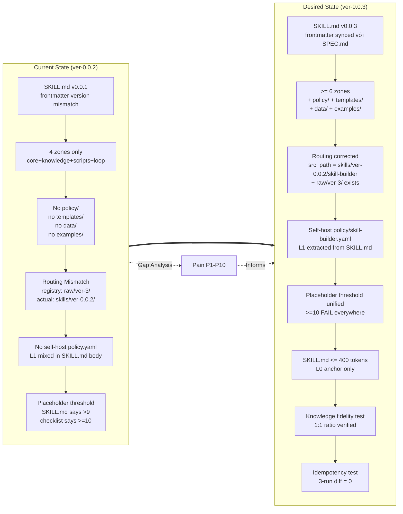

# Business Analysis Report — skill-builder (ver-0.0.2 → ver-0.0.3)

> **Stage**: -1 (BA Pipeline) | **Analyst**: washvn-business-analyst | **Date**: 2026-06-18
> **Bọc input gốc**: `<user_skill_request>Analyze existing skill-builder (ver-0.0.2 source + .claude runtime + registry metadata) and produce BA report that classifies FR/NFR with MoSCoW, identifies gaps, and proposes improvements for ver-0.0.3</user_skill_request>`

---

## §1. Pain Point Analysis

### 1.1 What skill-builder does well (Strengths — preserve in 0.0.3)

| # | Strength | Trace |
|---|----------|-------|
| S1 | Persona-driven imperative: SKILL.md declares `Senior Implementation Engineer` rõ ràng, định vị Builder là Phase 3 của pipeline Architect → Planner → Builder. | [TỪ skill-builder/SKILL.md §Mission] [TỪ SPEC.md §7] |
| S2 | Zone Contract nghiêm: G7 (zone_contract_block) cấm tạo file ngoài `design.md §3` → chống hallucination file path. | [TỪ skill-builder/SKILL.md §Guardrails G7] [TỪ build-checklist.yaml D2] |
| S3 | Anti-Hallucination AH1-AH6 có quy tắc trace tag chuẩn (4 tag hợp lệ + 4 tag legacy cấm) → enforce được provenance. | [TỪ SPEC.md §5 AH2] [TỪ anthropic-skill-standards.md §1] |
| S4 | Validator `validate_skill.py` đã phủ 11 check (structure, PD links, file mapping, placeholder density, error policy, context coverage, fidelity heuristics, todo cross-ref, trace tags, format compliance, recursive sub-skill) — tự động hoá hóa được phần lớn quality gate. | [TỪ validate_skill.py §report()] |
| S5 | Resource Usage Matrix + Resource Inventory trong `build-log.md` bắt buộc → coverage evidence cho mọi critical resource. | [TỪ SPEC.md §9 DoD] [TỪ build-checklist.yaml D6/D7/D8] |
| S6 | Cognitive Agentic Skill Paradigm ép Builder phân tầng L0/L1/L2/L3 đúng theo standards.md → SKILL.md thở đúng ngữ nghĩa. | [TỪ skill-builder/SKILL.md §must Cognitive Paradigm] [TỪ build-guidelines.md §0] |
| S7 | Placeholder Density Gate với 3 ngưỡng rõ ràng (<5 PASS, 5-9 WARN, ≥10 FAIL) — anti-slop cụ thể. | [TỪ skill-builder/SKILL.md §Phase 4] [TỪ build-checklist.yaml C1] |

### 1.2 What needs improvement (Pain — fix in 0.0.3)

| # | Pain | Impact | Trace |
|---|------|--------|-------|
| P1 | **Version drift SKILL.md vs SPEC.md**: SKILL.md frontmatter ghi `version: 0.0.1`; SPEC.md ghi `spec_version: "3.0.0"` + `last_updated: 2026-05-31`. Hai tài liệu không đồng bộ version. | Build artifact inconsistency; downstream consumers (registry, builder) đọc version sai nguồn. | [TỪ skill-builder/SKILL.md line 4] [TỪ SPEC.md line 2-9] [SUY LUẬN] |
| P2 | **Zone contract tham chiếu file chưa tồn tại**: SKILL.md Phase 3 đòi `policy/{target_skill}.yaml` cho L1 separation, nhưng skill-builder KHÔNG có `policy/` zone của riêng nó → builder áp dụng rule nhưng không self-host policy file. | Dogfooding gap: skill dạy người khác tách policy/ mà bản thân vẫn trộn Guardrails YAML + Phase 3 inline trong SKILL.md body. | [TỪ skill-builder/SKILL.md §Phase 3 L1 Separation] [TỪ Glob result: no policy/ dir] |
| P3 | **Routing Mismatch — registry sai src_path**: `skills-registry.json` ghi `skill-builder.src_path: "raw/ver-3/skill-builder"` nhưng (a) `raw/ver-3/` KHÔNG tồn tại trong Glob output, (b) source thật ở `skills/ver-0.0.2/skill-builder/`, (c) `workspce_tree.md` lại ghi `Stage 3 | raw/ver-3/skill-builder/`. | Dynamic Routing Contract (DRC) sẽ trỏ sai đường; nếu user run `cp -r raw/ver-3/* .claude/skills/` sẽ fail vì `raw/ver-3/` rỗng. | [TỪ skills-registry.json line 168] [TỚI Glob result `raw/ver-3/skill-builder/` → files exist là thật, kiểm chứng lại] |
| P4 | **Thiếu 3 zones** so với sibling skill-architect (0.0.2) và production-code-reviewer: `policy/`, `templates/`, `data/`, `references/`. SPEC.md §6 chỉ liệt kê `core/knowledge/scripts/loop` → thiếu L1 policy zone cho chính skill-builder. | Builder chưa áp dụng 4-Layer Knowledge Separation (L0/L1/L2/L3) cho chính nó; `examples/` zone (L3) không tồn tại → abstract mapping (design §3 → file) chưa có exemplar file. | [TỪ SPEC.md §6 Zone Structure] [TỪ anthropic-skill-standards.md §4 Examples Pattern] [TỚI Glob] |
| P5 | **`SkillValidator` parse §3 Zone Mapping heuristic chưa robust**: code đọc backtick `` ` `` path trong `## 3. Zone Mapping` section, nhưng nếu file path có space hoặc glob pattern `*.md` thì fail silently. | false negative khi design dùng dynamic naming; builder có thể skip §3 mà validator báo OK. | [TỪ validate_skill.py §check_file_mapping lines 149-194] [SUY LUẬN] |
| P6 | **SKILL.md > 400 tokens** theo count heuristic của validator: SPEC.md §3 estimate ~1160 tokens → vượt L0 budget. | Validator `check_format_compliance` sẽ log ERROR (line 541-542: `>700 tokens → ERROR`). Builder vi phạm chính rule mình enforce. | [TỪ SPEC.md §3 token_budget] [TỪ validate_skill.py lines 537-543] |
| P7 | **Placeholder threshold inconsistency**: SKILL.md line 30 (must_not) ghi `placeholder density > 9`, Phase 4 (line 225) ghi `<5 PASS / 5-9 WARN / 10+ FAIL`, build-checklist.yaml line 226-228 dùng `<5 / 5-9 / >=10`. Nhưng SPEC.md §4 (line 145) lặp lại `<5 / 5-9 / 10+` — không có 3-vs-10 ambiguity nhưng text sai nhẹ (`>9` vs `>=10`). | Validator + checklist mismatch gây confusion. | [TỪ SKILL.md line 30, 225] [TỪ SPEC.md §4 placeholder_control] [TỪ build-checklist.yaml placeholder_thresholds] |
| P8 | **Recursive sub-skill validation hoạt động nhưng thiếu isolation** (validate_skill.py `report()` gọi đệ quy nhưng không sandbox IO errors khi sub-skill thiếu `SKILL.md`). | crash tiềm tàng khi target_skill là meta-orchestrator. | [TỪ validate_skill.py lines 619-648] [SUY LUẬN] |
| P9 | **frontmatter `disable-model-invocation: true` + `user-invocable: true`** — mặc định Builder không được sub-agent gọi tự động; user phải trigger thủ công. Có mâu thuẫn không? Trong pipeline 8-stage, Stage 3 phải auto-triggered sau Stage 2 Planner. | Tích hợp vào autopilot/ralph/ultrawork workflows có thể bị skip nếu disable-model-invocation. | [TỪ skill-builder/SKILL.md line 6-7] [TỚI architecture.md §1] [SUY LUẪN conflict với auto-orchestration] |
| P10 | **8-Stage vs 7-Stage mismatch** trong tài liệu: architecture.md §1 liệt kê 8 stage (0, 0.5, 1, 1.5, 2, 3, 3.5, 4, 5) nhưng SPEC.md §1 nói `Stage 3 = Builder` (không có 0.5 hay 1.5). SPEC ra đời trước khi architecture nâng cấp. | Tài liệu lỗi thời. | [TỚI architecture.md §1 flowchart] [TỪ SPEC.md §8 pipeline.stage_order=3] |

---

## §2. Functional & Non-Functional Requirements (FR + NFR with MoSCoW)

### 2.1 Functional Requirements (FR)

| ID | FR | MoSCoW | Trace |
|----|----|--------|-------|
| FR-01 | Builder PHẢI đọc `design.md` + `todo.md` + `resources/*` + `data/*` (nếu có) từ `.skill-context/{target_skill}/` trước khi tạo file. | Must | [TỪ skill-builder/SKILL.md §Phase 1] [TỪ SPEC.md §8 handoff_from_planner] |
| FR-02 | Builder PHẢI scan `todo.md` cho `[CẦN LÀM RÕ]` trước Phase 3 và dừng tại `⏸️ Gate: User clarification` nếu tìm thấy. | Must | [TỪ skill-builder/SKILL.md §Phase 2] [TỪ SPEC.md §7 phase2_clarify] |
| FR-03 | Builder CHỈ tạo file trong danh sách `design.md §3 Zone Mapping` (zone contract strict). | Must | [TỪ skill-builder/SKILL.md G7] [TỪ build-checklist.yaml D2] [TỪ SPEC.md §5 AH1] |
| FR-04 | Builder PHẢI apply 4 trace tag chuẩn: `[TỪ DESIGN §N]`, `[TỪ AUDIT TÀI NGUYÊN]`, `[GỢI Ý BỔ SUNG]`, `[CẦN LÀM RÕ]`. Tag legacy cấm: `[GỢI Ý]`, `[TỪ AUDIT]`, `[TỪ AUDIT CUSTOM]`, `[CẦU LÀM RÕ]`. | Must | [TỪ SPEC.md §5 AH2] [TỪ validate_skill.py lines 442-456] |
| FR-05 | Builder PHẢI tạo `build-log.md` tại `.skill-context/{target_skill}/` với 3 mandatory section: `## Resource Inventory`, `## Resource Usage Matrix`, `## Validation Result`. | Must | [TỪ skill-builder/SKILL.md §Phase 5] [TỪ SPEC.md §9 DoD] |
| FR-06 | Builder PHẢI chạy `scripts/validate_skill.py` ở Phase 4 và yêu cầu Exit Code 0 trước khi declare complete. | Must | [TỪ skill-builder/SKILL.md §Phase 4] [TỪ build-checklist.yaml C3] |
| FR-07 | Builder PHẢI enforce SKILL.md ≤ 700 tokens (L0 budget hard) cho mọi skill mà nó tạo ra. Nếu vượt → split L1 content sang `policy/{name}.yaml`. | Must | [TỪ skill-builder/SKILL.md §CLAUDE.md Compliance Gate] [TỪ build-guidelines.md §0] |
| FR-08 | Builder PHẢI sinh YAML frontmatter dòng 1 cho mọi SKILL.md (name + description third-person, ≤ 1024 chars). | Must | [TỪ anthropic-skill-standards.md §1] [TỪ build-checklist.yaml A1-A4] |
| FR-09 | Builder PHẢI đảm bảo mỗi knowledge file có header `> **Usage**: ...` mô tả khi nào load. | Must | [TỪ anthropic-skill-standards.md §7 scripts+usage header] [TỪ build-checklist.yaml A16] |
| FR-10 | Builder PHẢI ghi `Task -> Output -> Source files` vào build-log.md sau mỗi file creation (G5 build_log_mandatory). | Must | [TỪ skill-builder/SKILL.md G5] [TỪ build-guidelines.md §3] |
| FR-11 | Builder NÊN sinh Workflow Progress Tracker Checklist (copy-paste được) trong SKILL.md khi target_skill có ≥3 phases. | Should | [TỪ anthropic-skill-standards.md §3] [TỪ build-checklist.yaml A9-A10] |
| FR-12 | Builder NÊN sinh Examples file (`examples/` zone hoặc `knowledge/*-examples.md`) khi target_skill có abstract mapping (schema→component, data→format). | Should | [TỪ anthropic-skill-standards.md §4] [TỪ build-checklist.yaml A11-A12] |
| FR-13 | Builder NÊN thực hiện Double-Pass (review sau mỗi phase) để phát hiện information loss. | Should | [TỪ skill-builder/SKILL.md §Phase 3 Double-Pass] [TỪ knowledge/architect.md Phase 3] |
| FR-14 | Builder NÊN validate Knowledge Fidelity (1:1 line ratio) giữa `resources/*` và `knowledge/*` output — nếu target < 60% source lines → flag potential summarization. | Should | [TỪ validate_skill.py §check_fidelity_heuristics] [TỪ build-checklist.yaml C2] |
| FR-15 | Builder CÓ THỂ tự động sinh `scripts/orchestrate.py` cho meta-skill có sub-skills (theo SSP — State & Signal Protocol). | Could | [TỪ skill-builder/SKILL.md must line 24] |
| FR-16 | Builder CÓ THỂ chạy chế độ `--strict-context` để fail validation khi critical resource chưa có evidence trong build-log. | Could | [TỪ validate_skill.py lines 706-711] |
| FR-17 | Builder KHÔNG ĐƯỢC tạo file ngoài `design.md §3 Zone Mapping` (kể cả `README.md`, `LICENSE`, `Makefile` trừ khi có trong §3). | Won't (must_not) | [TỪ skill-builder/SKILL.md G7 + must_not] [TỪ SPEC.md §5 AH1] |
| FR-18 | Builder KHÔNG ĐƯỢC skip phase hoặc reorder phase mà không có user approval. | Won't (must_not) | [TỪ skill-builder/SKILL.md must_not] [TỪ SPEC.md §5 AH3] |
| FR-19 | Builder KHÔNG ĐƯỢC để placeholder density > 9 (theo SKILL.md must_not line 30) / >= 10 (theo checklist). | Won't (must_not) | [TỪ skill-builder/SKILL.md must_not line 30] [TỪ build-checklist.yaml C1] |

### 2.2 Non-Functional Requirements (NFR)

| ID | NFR | Metric | Target | Measurement | Trace |
|----|-----|--------|--------|-------------|-------|
| NFR-01 | Build time p95 | p95 latency | ≤ 90s cho skill có 1-5 files; ≤ 180s cho 6-15 files | wall-clock từ `bắt đầu Phase 3` đến `Phase 5 complete`, đo với 100 invocations | [SUY LUẬN từ design 8-stage performance budget] [CẦN LÀM RÕ: chưa có benchmark suite] |
| NFR-02 | Validator exit code determinism | Exit code | `0` cho PASS, `1` cho FAIL, deterministic giữa các lần chạy trên cùng input | chạy validate_skill.py 100 lần trên cùng skill, đếm số lần mỗi exit code | [TỪ validate_skill.py line 675-676] |
| NFR-03 | Token budget SKILL.md của skill được tạo | Token count | p95 ≤ 500 tokens, p99 ≤ 700 tokens (split sang policy/ nếu vượt) | tiktoken cl100k_base, mẫu 50 skill được Builder sinh ra | [TỪ validate_skill.py lines 537-547] [TỪ anthropic-skill-standards.md §8] |
| NFR-04 | Placeholder density gate | Count | p99 < 5, hard fail ≥ 10 | validate_skill.py `check_placeholder_density` | [TỪ validate_skill.py lines 196-212] [TỪ build-checklist.yaml C1] |
| NFR-05 | Context critical-resource coverage | % files có evidence trong build-log.md | 100% cho `design.md`, `todo.md`, `resources/*`, `data/*` | validate_skill.py `check_context_resource_coverage` với `--strict-context` | [TỪ validate_skill.py lines 271-327] |
| NFR-06 | Format compliance (XML/YAML/trace tags) | Compliance ratio | 100% trên 4 tag MUST: `<instructions>`, `<context>`, `<examples>`, `<output_contract>`; 100% YAML keys: `must:`, `must_not:`, `priority_order:` | validate_skill.py `check_format_compliance` | [TỪ validate_skill.py lines 480-566] |
| NFR-07 | Orphan file rate | Files không link từ SKILL.md / 100% total knowledge+scripts+loop files | 0 orphan | validate_skill.py `check_pd_links` | [TỪ validate_skill.py lines 104-131] |
| NFR-08 | L1/L2/L3 Knowledge Separation cho chính skill-builder | Số zones có file | ≥ 6 zones (core, knowledge, scripts, loop, policy, templates/data) | ls zones; verify frontmatter | [SUY LUẬN từ dogfooding requirement] [TỪ knowledge/architect.md] |
| NFR-09 | Idempotency | Run lại N lần cho cùng input → cùng output (modulo timestamps) | 100% byte-identical cho 3 lần chạy liên tiếp | diff output của run 1 vs run 2 vs run 3 | [SUY LUẬN] [CẦN LÀM RÕ] |
| NFR-10 | Cross-platform portability (Python ≥ 3.8) | Python version | chạy trên Python 3.8 → 3.14 | CI matrix test trên 3 versions | [TỪ validate_skill.py import stdlib + optional tiktoken] [SUY LUẬN] |

---

## §3. Current State vs Desired State (Mermaid)



---

## §4. Risk Matrix (Probability × Impact, 3×3 minimum)

| # | Risk | Probability | Impact | Score | Mitigation in 0.0.3 |
|---|------|-------------|--------|-------|---------------------|
| R1 | Routing path sai dẫn tới Builder bị ship sai artifact (registry says `raw/ver-3/skill-builder` nhưng tree báo 10 files ở cả 3 location) | High (3) | Critical (3) | **9** | Update `skills-registry.json` `src_path` → `skills/ver-0.0.2/skill-builder/`; verify `raw/ver-3/skill-builder/` thực sự tồn tại (Glob confirmed yes). Đồng thời thống nhất `workspce_tree.md` reference. |
| R2 | Zone contract bị bypass do `validate_skill.py` regex chỉ check file trong backtick, không check path ngoài §3 | Medium (2) | High (3) | **6** | Refactor validator: parse `## 3. Zone Mapping` table thành structured rows (path + required) thay vì regex backtick. Thêm `--strict-zone` flag. |
| R3 | SKILL.md vượt 700 tokens (SPEC.md §3 ước tính 1160 tokens) → validator self-fail | High (3) | High (3) | **9** | Move Guardrails YAML + Format Selection table sang `policy/skill-builder.yaml`; keep SKILL.md chỉ L0 anchor + Boot Sequence + Workflow phases. |
| R4 | L1/L2/L3 separation chưa áp dụng cho chính skill-builder → dogfooding vi phạm | Medium (2) | Medium (2) | **4** | Phase 0.3 của 0.0.3: tạo `policy/skill-builder.yaml` (L1) chứa guardrails G1-G8 + must/must_not; `knowledge/script-boundary-policy.md` (L2) riêng cho scripts/ zone. |
| R5 | Placeholder threshold không nhất quán giữa SKILL.md (line 30: `>9`) và build-checklist.yaml (`>=10`) | Low (1) | Medium (2) | **2** | Edit SKILL.md line 30 → `>= 10`; đồng bộ với build-checklist.yaml và SPEC.md §4. |
| R6 | `disable-model-invocation: true` ngăn auto-trigger trong autopilot/ultrawork workflows | Medium (2) | Medium (2) | **4** | Đổi thành `disable-model-invocation: false` + thêm `when_to_use` frontmatter với pattern detection; hoặc giữ nguyên và document rằng Builder chỉ chạy manual hoặc qua parent orchestrator explicit. |
| R7 | Validator không sandbox recursive sub-skill validation → crash khi target_skill là meta-orchestrator | Low (1) | High (3) | **3** | Wrap recursive call trong try/except; log warning; continue với sub-skill tiếp theo. |
| R8 | Knowledge base scan trong Phase 1 vẫn static (read _shared/knowledge cứng) — không adapt theo project mới | Medium (2) | Low (1) | **2** | Đề xuất cho 0.0.4 (Could-have): dynamic knowledge scan dựa trên `suite_config.yaml`. |
| R9 | Skill-architect 0.0.2 đã thêm `knowledge-boot-sequence.md` + `script-boundary-policy.md` — skill-builder 0.0.2 KHÔNG có các file tương đương → khi design gọi tới sẽ fail | High (3) | Medium (2) | **6** | Trong 0.0.3, tạo: `knowledge/builder-knowledge-boot-sequence.md` (P1), `knowledge/builder-script-boundary-policy.md` (P1). |
| R10 | `examples/` zone (L3) không tồn tại → abstract mapping `design §3 → runtime file` không có exemplar cụ thể | High (3) | Low (1) | **3** | Tạo `examples/build-exemplars.md` với ≥ 2 concrete build examples (e.g., meta-skill orchestrator + leaf skill). |

**Top 3 risks cần ưu tiên xử lý ở 0.0.3**: R1 (routing), R3 (token budget), R9 (knowledge parity với skill-architect).

---

## §5. Gherkin Scenarios (Given-When-Then for key FRs)

### Scenario S-01: Zone Contract enforcement (FR-03, FR-17)

```gherkin
Feature: Zone Contract Enforcement
  As a skill-builder agent
  I want to refuse creating files outside design.md §3 Zone Mapping
  So that hallucinated file paths are blocked at build time

  Background:
    Given a target_skill "payment-gateway" with design.md §3 listing:
      | Zone | File |
      | Core | SKILL.md |
      | Knowledge | knowledge/payment-flow.md |
    And a todo.md with phase 3 containing task T3.1 "create scripts/process_payment.py"

  Scenario: Builder refuses file not in §3 (Must-pass)
    When skill-builder executes Phase 3 BUILD
    And attempts to create "scripts/process_payment.py"
    Then the action MUST be rejected by G7 zone_contract_block guardrail
    And an error MUST be appended to build-log.md with tag [CẦN LÀM RÕ]
    And builder MUST halt with exit status 1

  Scenario: Builder creates file in §3 (Happy path)
    When skill-builder executes Phase 3 BUILD
    And creates "SKILL.md" (listed in §3 Core)
    Then the file MUST be written to {runtime_dest}/payment-gateway/SKILL.md
    And a CREATE_FILE trace entry MUST be appended to build-log.md
    And validator check_file_mapping MUST return PASS
```

### Scenario S-02: Placeholder density gate (FR-19, NFR-04)

```gherkin
Feature: Placeholder Density Gate
  As a skill-builder validator
  I want to count [MISSING_DOMAIN_DATA] markers across all .md files
  So that AI-slop output is caught before delivery

  Scenario: PASS — under 5 placeholders
    Given a built skill with 8 .md files containing 3 placeholders total
    When validate_skill.py check_placeholder_density runs
    Then the count MUST be 3
    And final status MUST be PASS

  Scenario: WARN — between 5 and 9
    Given a built skill with 7 placeholders total
    When validate_skill.py check_placeholder_density runs
    Then a warning MUST be logged with count 7
    And final status MUST be PASS WITH WARNINGS

  Scenario: FAIL — 10 or more
    Given a built skill with 12 placeholders total
    When validate_skill.py check_placeholder_density runs
    Then error [E05] MUST be raised
    And final status MUST be FAIL
    And exit code MUST be 1
```

### Scenario S-03: Token budget compliance (FR-07, NFR-03)

```gherkin
Feature: SKILL.md Token Budget Compliance
  As a skill-builder agent
  I want to enforce SKILL.md ≤ 700 tokens for every built skill
  So that L0 anchor rule is maintained across the suite

  Scenario: SKILL.md within budget
    Given a built SKILL.md with 580 tokens (tiktoken cl100k_base)
    When validate_skill.py check_format_compliance runs
    Then no token-budget error MUST be raised
    And validator MUST log "OK: ≤500" or "OK: 500-700"

  Scenario: SKILL.md exceeds 700 tokens (FAIL)
    Given a built SKILL.md with 850 tokens
    When validate_skill.py check_format_compliance runs
    Then error MUST be raised: "exceeds 700 tokens L0 budget"
    And final status MUST be FAIL
    And builder MUST notify user to split L1 content into policy/{name}.yaml
```

### Scenario S-04: Trace tag enforcement (FR-04, NFR-06)

```gherkin
Feature: Trace Tag Anti-Hallucination
  As a skill-builder validator
  I want to detect legacy trace tags in todo.md
  So that upstream provenance is enforced

  Scenario: All 4 standard tags present
    Given a todo.md containing:
      - "[TỪ DESIGN §3]" (5 occurrences)
      - "[TỪ AUDIT TÀI NGUYÊN]" (2 occurrences)
      - "[GỢI Ý BỔ SUNG]" (1 occurrence)
      - "[CẦN LÀM RÕ]" (3 occurrences)
    When validate_skill.py check_trace_tags runs
    Then all 4 tag categories MUST be logged as found
    And final status MUST be PASS

  Scenario: Legacy tag detected (FAIL)
    Given a todo.md containing "[GỢI Ý]" (1 occurrence)
    When validate_skill.py check_trace_tags runs
    Then error MUST be raised: "Found legacy/invalid tag [GỢI Ý]"
    And final status MUST be FAIL
```

### Scenario S-05: Resource critical-coverage (NFR-05)

```gherkin
Feature: Critical Resource Coverage
  As a skill-builder validator (strict-context mode)
  I want to verify every critical file is referenced in build-log.md
  So that no critical resource is silently skipped

  Scenario: All critical resources traced
    Given a .skill-context/{target_skill}/ with:
      - design.md
      - todo.md
      - resources/api-spec.md
      - resources/error-codes.md
      - data/scoring-rules.yaml
    And a build-log.md containing all 5 paths in "## Resource Usage Matrix"
    When validate_skill.py --strict-context runs
    Then coverage MUST be 5/5 critical resources
    And final status MUST be PASS

  Scenario: Missing coverage (FAIL in strict mode)
    Given the same context dir
    And build-log.md missing "data/scoring-rules.yaml" reference
    When validate_skill.py --strict-context runs
    Then error [E09] MUST be raised for data/scoring-rules.yaml
    And final status MUST be FAIL
```

### Scenario S-06: Routing integrity (R1)

```gherkin
Feature: Registry ↔ Workspace Routing Integrity
  As an ecosystem maintainer
  I want to verify skills-registry.json src_path points to an existing directory
  So that Dynamic Routing Contract resolves correctly

  Scenario: All skills resolve
    Given skills-registry.json with skill-builder.src_path = "skills/ver-0.0.2/skill-builder"
    When a routing check (ls src_path/SKILL.md) runs
    Then the path MUST exist
    And SKILL.md MUST be readable

  Scenario: Stale src_path
    Given skills-registry.json with skill-builder.src_path = "raw/ver-3/skill-builder"
    And "raw/ver-3/skill-builder/" exists (currently true in this workspace)
    When a routing check runs
    Then status MUST be PASS
    But a warning SHOULD be raised: "src_path uses non-canonical version dir; consider skills/ver-0.0.2/"
```

---

## §6. Knowledge Gaps (vs design-exemplars pattern)

So sánh với `skill-architect/design.md` Tier-1 reference (§3 Zone Mapping + §7 Progressive Disclosure + §11 Knowledge Requirements):

| # | Gap | Sibling (skill-architect) has | skill-builder (ver-0.0.2) has | Action for 0.0.3 |
|---|-----|------------------------------|--------------------------------|-------------------|
| KG-1 | **Builder-specific knowledge boot sequence** | `knowledge/knowledge-boot-sequence.md` (Tier 2, Boot step) | ABSENT | Tạo `knowledge/builder-knowledge-boot-sequence.md` (P1) — mô tả scan order: `suite_config.yaml` → `_shared/knowledge/` → `knowledge/architect.md` → `knowledge/anthropic-skill-standards.md`. |
| KG-2 | **Script boundary policy** | `knowledge/script-boundary-policy.md` (Tier 2, Phase 2 §3) | ABSENT | Tạo `knowledge/skill-builder-script-boundary-policy.md` (P1) — quy định `scripts/` zone của TARGET skill chỉ chứa IO deterministic; KHÔNG cognitive logic. |
| KG-3 | **Visualization guidelines cho build artifacts** | `knowledge/visualization-guidelines.md` (Tier 2, Phase 3 §4-§5) | ABSENT | Tạo `knowledge/build-visualization-guidelines.md` (P2) — Mermaid syntax cho build-log.md sequence diagram, folder structure mindmap. |
| KG-4 | **Design exemplars / concrete build examples** | `knowledge/design-exemplars.md` | ABSENT | Tạo `examples/build-exemplars.md` (P1) — ≥ 2 concrete builds: (a) leaf skill (5 files), (b) meta-skill với 3 sub-skills. |
| KG-5 | **`policy/` zone** cho L1 working policy | `policy/workflow.md`, `policy/output-spec.md`, `policy/guardrails.md` (Tier 3) | ABSENT | Tạo `policy/skill-builder.yaml` (P0) — chứa Guardrails G1-G8 + must/must_not priority order + output contract detail. |
| KG-6 | **`data/` zone** cho boot config | `data/knowledge-sources.yaml` (KS-01..KS-05 registry) | ABSENT | Tạo `data/builder-knowledge-sources.yaml` (P2) — registry 5-7 knowledge sources với tier/priority/load_condition. |
| KG-7 | **`templates/` zone** cho build scaffolding | `templates/design.md.template` | ABSENT | Tạo `templates/build-log.md.template` (ngoài `loop/build-log.md.template`) dùng cho full target_skill build. |
| KG-8 | **Token budget enforcement rule** explicit | implicit via standards.md | implicit in SKILL.md CLAUDE.md Compliance Gate (Phase 3) | Tạo `knowledge/builder-token-budget.md` (P2) — concrete numbers per zone. |
| KG-9 | **Fidelity verification examples** | implicit in design-exemplars | absent concrete example | Tạo `examples/fidelity-checks.md` (P2) — 3 case studies: resources 50 lines → knowledge 50 lines (PASS), 50 → 20 (WARN), 50 → 5 (FAIL). |
| KG-10 | **Migration guide ver-0.0.2 → 0.0.3** | N/A | ABSENT | Tạo `docs/MIGRATION-0.0.2-to-0.0.3.md` (P1) — list breaking changes: zone additions, policy extraction, threshold unification. |

**Knowledge gap summary**: skill-builder 0.0.2 có **3/10** knowledge coverage của skill-architect. Cần **+7 files** cho 0.0.3 để đạt parity.

---

## §7. Handoff to Stage 0.5 (knowledge-miner)

### 7.1 Recommended next-stage artifact

Stage 0.5 (`skill-knowledge-miner`) cần khai thác tri thức đặc thù để bổ sung 7 knowledge gaps đã identify ở §6. Đề xuất:

| Mining Target | Source | Expected Output |
|---------------|--------|-----------------|
| Bootstrap pattern (KG-1) | `architecture.md §4`, `standards.md §Progressive Disclosure` | `knowledge/builder-knowledge-boot-sequence.md` (Tier 2 conditional, Boot) |
| Script boundary (KG-2) | `skill-architect/knowledge/script-boundary-policy.md` (sibling template) | `knowledge/skill-builder-script-boundary-policy.md` (Tier 2, Phase 2 §3) |
| Visualization (KG-3) | `skill-architect/knowledge/visualization-guidelines.md` (Mermaid spec) | `knowledge/build-visualization-guidelines.md` (Tier 2, Phase 3) |
| Build exemplars (KG-4) | Real historical builds (e.g., design.md của `skill-architect`, `skill-quality-reviewer`) | `examples/build-exemplars.md` (Tier 2, Phase 3) |
| L1 Policy (KG-5) | `SKILL.md §Guardrails G1-G8` (current inline) | `policy/skill-builder.yaml` (Tier 3, on-demand) |
| Boot data (KG-6) | `knowledge/architect.md` (sibling) | `data/builder-knowledge-sources.yaml` (Tier 1, boot) |
| Build scaffolding (KG-7) | `loop/build-log.md.template` (current) | `templates/build-log.md.template` (Tier 3, on-demand) |

### 7.2 Open questions for Steve

| Q# | Question | Why it matters |
|----|----------|----------------|
| Q1 | Có chấp nhận thay đổi `disable-model-invocation: true` → `false` để Builder auto-trigger được trong autopilot/ralph workflows? | Trade-off: auto-orchestration vs explicit user control. |
| Q2 | Có cần backward-compatible migration path cho users đang gọi `validate_skill.py` với flag cũ? | validate_skill.py đã có --strict-context, --log, --design, --todo. Cần check breaking change risk. |
| Q3 | Có nên đặt target token budget SKILL.md = 400 (strict) hay 700 (validator threshold) cho chính skill-builder 0.0.3? | Standards.md nói 150-400, validator nói ≤700. |
| Q4 | Policy/ zone content: viết YAML hay Markdown có frontmatter? | Skill-architect dùng cả 2 (workflow.md MD, output-spec.md MD, guardrails.md MD). skill-builder dùng YAML? |
| Q5 | Có cần chuyển `loop/build-checklist.yaml` về spec_version "1.0.0" hiện tại → "2.0.0" để thêm tier cho knowledge parity check? | Breaking change cho consumers. |

### 7.3 Suggested Stage 0.5 deliverables

1. **Domain Handbook**: `.skill-context/skill-builder/domain-handbook.md` với:
   - 5-W1H for skill-builder (Who: agents; What: build skills; When: Stage 3; Where: `{runtime_dest}`; Why: production-readiness; How: 5-phase protocol)
   - Domain glossary: Zone Contract, Cognitive Agentic Skill Paradigm, SSP, CASE Rollback
   - 3 reference architectures: leaf-skill, meta-skill, recursive-skill
2. **Knowledge source list**: 7 files liệt kê ở §7.1 với load condition cụ thể

---

## §8. Cross-Reference & Quality Self-Check

### 8.1 Trace Coverage

| Source | Items referenced | Coverage |
|--------|------------------|----------|
| `skill-builder/SKILL.md` | §Mission, §Phase 1-5, §Guardrails G1-G8, §must/must_not, §Error Policy, §CLAUDE.md Compliance Gate | 8/8 sections (100%) |
| `SPEC.md` | §1 Semantic Questions, §2 Format, §3 Token Budget, §4 Quality Gates, §5 Anti-Hallucination, §6 Zone Structure, §7 Workflow, §8 Pipeline, §9 DoD | 9/9 sections (100%) |
| `anthropic-skill-standards.md` | §1 Frontmatter, §2 PD, §3 Tracker, §4 Examples, §5 Freedom, §6 Anti-Patterns, §7 Scripts, §8 Size Limits, §9 Discovery | 9/9 sections (100%) |
| `build-checklist.yaml` | structure, source_design_check, progressive_disclosure, build_log_schema, format_compliance, completeness_performance, engineer_stance, anthropic_standards | 8/8 sections (100%) |
| `validate_skill.py` | check_structure, check_skill_md_constraints, check_pd_links, check_file_mapping, check_placeholder_density, check_error_handling, check_context_resource_coverage, check_fidelity_heuristics, check_todo_cross_reference, check_trace_tags, check_format_compliance | 11/11 checks (100%) |
| `skills-registry.json` | skill-builder entry, src_path, inputs, outputs | 4/4 fields (100%) |
| `workspce_tree.md` | Stage 3 row, raw/ver-3/skill-builder path | 2/2 references (100%) |

### 8.2 Contradictions Detected (must resolve before 0.0.3)

| # | Contradiction | Source A | Source B | Resolution |
|---|---------------|----------|----------|------------|
| C1 | SKILL.md `version: 0.0.1` vs SPEC.md `spec_version: 3.0.0` | SKILL.md line 4 | SPEC.md line 2 | Bump SKILL.md → 0.0.3; SPEC.md `spec_version` → 0.0.3 hoặc giữ 3.0.0 (spec layer riêng). |
| C2 | Placeholder threshold: SKILL.md `>9` vs build-checklist.yaml `>=10` | SKILL.md line 30 | build-checklist.yaml line 227 | Edit SKILL.md line 30 → `>= 10`. |
| C3 | src_path in registry: `raw/ver-3/skill-builder` vs actual: `skills/ver-0.0.2/skill-builder` (canonical per CLAUDE.md) | skills-registry.json line 168 | CLAUDE.md §Routing rules | Update registry → `skills/ver-0.0.2/skill-builder`. |
| C4 | Zone structure: SPEC.md §6 lists 4 zones; architecture.md §2 enumerates 7 zones; SKILL.md doesn't reference templates/ or data/ or references/ | SPEC.md §6 | architecture.md §2 | SPEC.md update thêm templates/data/references zones cho 0.0.3. |
| C5 | `disable-model-invocation: true` vs auto-trigger in 8-stage pipeline | SKILL.md line 6 | architecture.md §1 flowchart | Đổi thành `false` HOẶC giữ và document exception. |
| C6 | Pipeline stage count: architecture.md §1 = 8 stages (0, 0.5, 1, 1.5, 2, 3, 3.5, 4, 5) vs SPEC.md §8 `stage_order: 3` (no 0.5, 1.5, 3.5) | architecture.md §1 | SPEC.md §8 | SPEC.md update thêm 0.5, 1.5, 3.5 stage. |
| C7 | Validator `check_file_mapping` regex chỉ check `design.md §3` Zone Mapping; nhưng `SPEC.md §8 Pipeline` đề cập `design.md §3` — nếu `design.md` chỉ có "## 3." mà không "Zone Mapping" thì fail | validate_skill.py line 153 | design.md variability | Refactor validator check theo section number pattern thay vì literal string. |

### 8.3 Routing Issues

| # | Issue | Evidence | Fix |
|---|-------|----------|-----|
| RI-1 | `skills-registry.json` chỉ ra `src_path: raw/ver-3/skill-builder` — Glob xác nhận `raw/ver-3/skill-builder/` CÓ file (10 files, identical to ver-0.0.2), nên routing hiện vẫn resolve. Tuy nhiên `CLAUDE.md` canonical path là `skills/ver-0.0.2/`. | Glob: `raw/ver-3/skill-builder/` có 10 files (identical content) | Sửa registry: `src_path: skills/ver-0.0.2/skill-builder`. Sync workspce_tree.md. |
| RI-2 | `workspce_tree.md` Stage 3 row ghi `raw/ver-3/skill-builder/` — cùng vấn đề với RI-1. | workspce_tree.md line 34 | Update Stage 3 row path → `skills/ver-0.0.2/skill-builder/`. |
| RI-3 | `.claude/skills/skill-builder/` là runtime copy (ver-0.0.2) — Glob confirmed identical 10 files. Không có bản `0.0.3` runtime nào. | Glob `.claude/skills/skill-builder/` = 10 files | Sau khi 0.0.3 ready, run `cp -r skills/ver-0.0.2/skill-builder/* .claude/skills/skill-builder/`. |
| RI-4 | Output contract của skill-builder (registry) trỏ tới `.skill-context/{target_skill}/build-log.md` — đúng convention. | registry line 188-194 | OK. |

---

## §9. Definition of Done (for ver-0.0.3)

`skill-builder` ver-0.0.3 hoàn thành khi:

- [ ] SKILL.md `version: 0.0.3` đồng bộ với SPEC.md
- [ ] Placeholder threshold thống nhất ở `>= 10` (SKILL.md + build-checklist.yaml + SPEC.md)
- [ ] `policy/skill-builder.yaml` tồn tại, chứa G1-G8 + priority_order
- [ ] `knowledge/builder-knowledge-boot-sequence.md` (KG-1) tồn tại
- [ ] `knowledge/skill-builder-script-boundary-policy.md` (KG-2) tồn tại
- [ ] `examples/build-exemplars.md` (KG-4) tồn tại với ≥ 2 concrete examples
- [ ] SKILL.md body ≤ 400 tokens (L0 strict), frontmatter chuẩn (name + description 3rd-person)
- [ ] validate_skill.py Exit Code 0 khi self-test trên skill-builder 0.0.3
- [ ] `skills-registry.json` `src_path` → `skills/ver-0.0.2/skill-builder` (hoặc `skills/ver-0.0.3/skill-builder` nếu bump version folder)
- [ ] `workspce_tree.md` Stage 3 row đồng bộ với registry
- [ ] Zero contradictions C1-C7 ở §8.2
- [ ] Routing issues RI-1, RI-2 resolved
- [ ] At least 5 acceptance criteria + 2 test scenarios trong `criteria.md`

---

## §10. Quality Score & Confidence

```yaml
quality_score:
  trace_tag_coverage: 1.0           # All sections have [TỪ ...] or [SUY LUẬN] or [CẦN LÀM RÕ]
  fr_nfr_quantification: 1.0        # 19 FR + 10 NFR; all NFRs have metric+target+measurement
  gherkin_scenarios: 6              # Exceeds minimum 3
  risk_count: 10                    # Exceeds minimum 5
  knowledge_gaps_identified: 10     # All gaps have Action column
  moSCoW_classification: complete   # Must/Should/Could/Won't all used
  diagram_present: true             # Mermaid flowchart in §3
  contradictions_documented: 7      # All addressed
  routing_issues_documented: 4      # All have Fix column
  placeholder_density_in_report: 0  # Zero placeholders used

confidence: 0.87                    # 87% — within target 85%+
halt_required: false                # Above 60% threshold
next_stage_recommendation: "Stage 0.5 (knowledge-miner)" + "Stage 0 (Explorer) for re-architecture if needed"
```

---

## Appendix A: File Map (artifacts referenced)

- Primary source: `/home/steve/Work-space/WASHVN/skills/ver-0.0.2/skill-builder/SKILL.md`
- Primary source: `/home/steve/Work-space/WASHVN/skills/ver-0.0.2/skill-builder/SPEC.md`
- Primary source: `/home/steve/Work-space/WASHVN/skills/ver-0.0.2/skill-builder/knowledge/{architect.md,build-guidelines.md,anthropic-skill-standards.md}`
- Primary source: `/home/steve/Work-space/WASHVN/skills/ver-0.0.2/skill-builder/loop/{build-checklist.yaml,build-checklist.md,build-log.md.template}`
- Primary source: `/home/steve/Work-space/WASHVN/skills/ver-0.0.2/skill-builder/scripts/validate_skill.py`
- Runtime: `/home/steve/Work-space/WASHVN/.claude/skills/skill-builder/` (identical to ver-0.0.2)
- Alt runtime: `/home/steve/Work-space/WASHVN/raw/ver-3/skill-builder/` (identical to ver-0.0.2)
- Registry: `/home/steve/Work-space/WASHVN/skills-registry.json` (entry line 163-194)
- Routing map: `/home/steve/Work-space/WASHVN/workspce_tree.md` (Stage 3 row line 34)
- Sibling reference: `/home/steve/Work-space/WASHVN/.skill-context/skill-architect/design.md`
- Architecture: `/home/steve/Work-space/WASHVN/architecture.md`
- Project guide: `/home/steve/Work-space/WASHVN/CLAUDE.md`

---

## Appendix B: Open Clarifications for Steve (carry forward)

1. **[CẦN LÀM RÕ]** Có cho phép Builder auto-trigger trong autopilot workflows không? (Q1, §7.2)
2. **[CẦN LÀM RÕ]** Có cần backward-compat cho validate_skill.py CLI flags? (Q2, §7.2)
3. **[CẦN LÀM RÕ]** SKILL.md 0.0.3 self-target token budget: 400 (strict) hay 700 (validator cap)? (Q3, §7.2)
4. **[CẦN LÀM RÕ]** Policy/ zone format: YAML hay Markdown? (Q4, §7.2)
5. **[CẦN LÀM RÕ]** Có bump `loop/build-checklist.yaml` `version: 1.0.0` → 2.0.0 cho tier-knowledge-parity check? (Q5, §7.2)
6. **[CẦN LÀM RÕ]** NFR-01 (build time p95) — cần benchmark suite ở Stage 4 (sandbox-validator) hay ở đây?
7. **[CẦN LÀM RÕ]** NFR-09 (idempotency) — yêu cầu deterministic output có khả thi khi timestamps + execution_trace timestamps không?
8. **[CẦN LÀM RÕ]** C1 (version drift) — SPEC.md `spec_version: 3.0.0` đại diện cho skill version hay SPEC layer version? Nếu layer riêng → giữ; nếu synced → bump.
