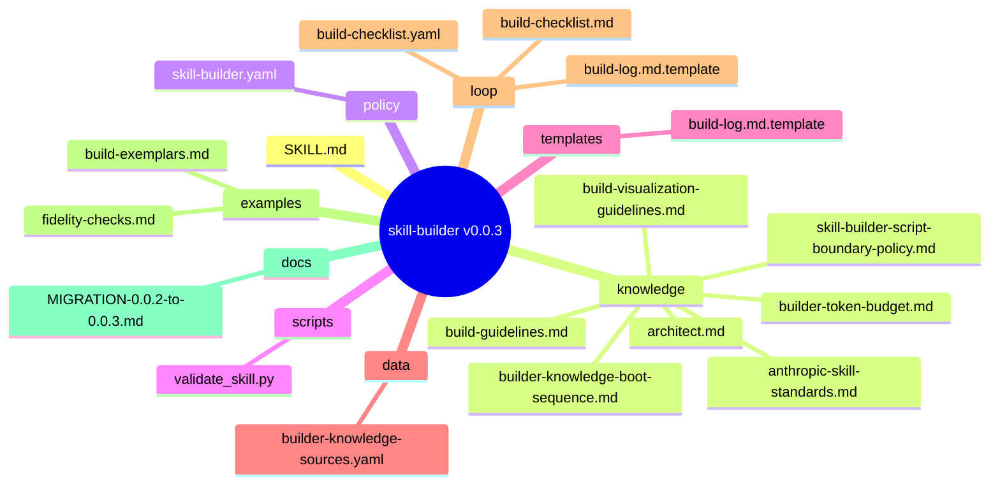
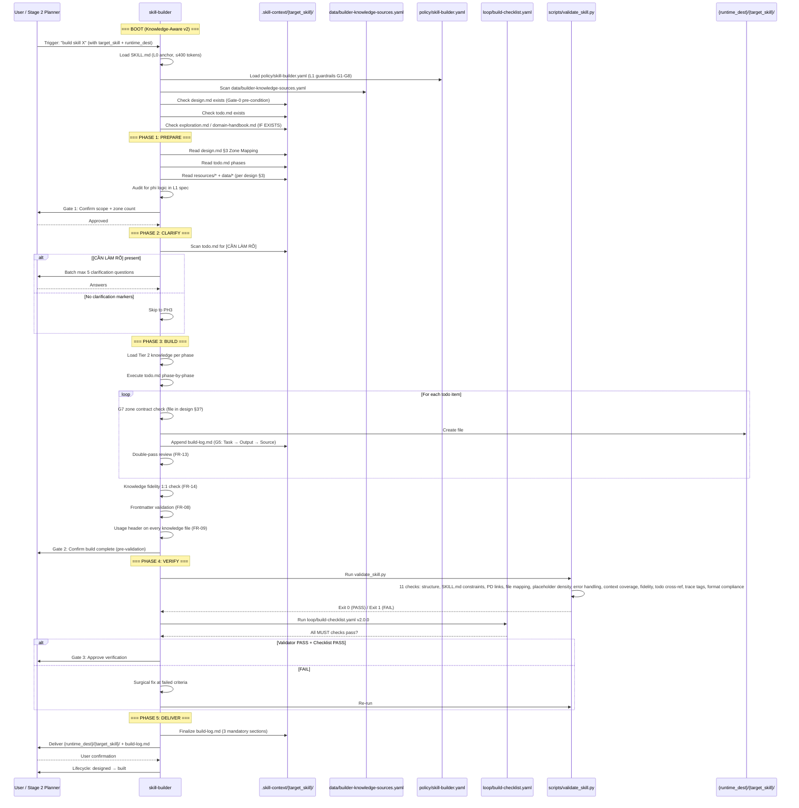

# skill-builder — Architecture Design (ver-0.0.3)

> Generated by skill-architect (Stage 1) | 2026-06-18T13:30:00Z
> Status: design-completed (Stage 1 → Stage 1.5 handoff)

> **Note**: This design.md targets `skill-builder` ver-0.0.3. It resolves 7 contradictions from BA §8.2, closes 7 of 10 knowledge gaps, normalizes the 9-Zone structure (adding `policy/`, `templates/`, `data/`, `examples/`, `references/`), and aligns SKILL.md/SPEC.md versioning.

---

## 1. Problem Statement

**Vấn đề**: `skill-builder` ver-0.0.2 là Senior Implementation Engineer (Stage 3) của WASHVN 8-stage pipeline, nhưng có 10 pain points critical chặn self-application (dogfooding) và downstream consumption. [TỪ BA §1.2]

- **P1 Version drift**: SKILL.md frontmatter `version: 0.0.1` vs SPEC.md `spec_version: 3.0.0` — hai tài liệu không đồng bộ. [TỪ BA §1.2 P1] [TỪ HANDBOOK §1.1]
- **P2 Dogfooding gap**: SKILL.md dạy người khác tách L1 sang `policy/{name}.yaml` nhưng bản thân không có `policy/` zone → 4-Layer Knowledge Separation chưa áp dụng cho chính skill-builder. [TỪ BA §1.2 P2] [TỪ HANDBOOK §7.4]
- **P3 Routing mismatch**: `skills-registry.json` ghi `src_path: raw/ver-3/skill-builder` trong khi canonical path theo CLAUDE.md là `skills/ver-0.0.2/skill-builder/`. DRC sẽ trỏ sai. [TỪ BA §1.2 P3] [TỪ HANDBOOK §7.5 RI-1]
- **P4 Token budget overflow**: SKILL.md hiện ~1160 tokens theo SPEC.md §3 estimate, vượt L0 cap 700 tokens. [TỪ BA §1.2 P6] [TỪ HANDBOOK §6.3]
- **P5 Placeholder threshold inconsistency**: SKILL.md (`>9`) vs `build-checklist.yaml` (`>=10`) vs SPEC.md (`10+`) — 3 giá trị khác nhau. [TỪ BA §1.2 P7] [TỪ HANDBOOK §8.2 C2]
- **P6 Validator regex brittleness**: `check_file_mapping` chỉ parse literal `"## 3. Zone Mapping"` string — fail nếu heading format khác. [TỪ BA §1.2 P5] [TỪ HANDBOOK §7.2]
- **P7 4 missing zones**: `policy/`, `templates/`, `data/`, `references/`, `examples/` so với sibling `skill-architect` — coverage 3/10. [TỪ BA §1.2 P4] [TỪ HANDBOOK §5.4]
- **P8 8-stage pipeline mismatch**: SPEC.md §8 chỉ biết 6 stage; thiếu 0.5, 1.5, 3.5. [TỪ BA §1.2 P10]
- **P9 10 knowledge gaps** vs sibling `skill-architect` design-exemplars pattern — builder có 3/10 parity. [TỪ BA §6 KG-1..KG-10] [TỪ HANDBOOK §5.4]
- **P10 disable-model-invocation conflict**: `disable-model-invocation: true` chặn auto-trigger trong 8-stage pipeline. [TỪ BA §1.2 P9] [TỪ HANDBOOK §8.2 C5]

**Người dùng**: AI Agent (Claude Code / Hermes / Antigravity) khi trigger "build skill X" sau khi Stage 2 (Planner) đã sinh `todo.md`. Downstream consumers: production-code-reviewer (Stage 3.5) + sandbox-tester (Stage 4). [TỪ HANDBOOK §1.1, §1.5]

**Lý do cần ver-0.0.3**: Builder phải tự host 4-Layer Knowledge Separation (dogfooding) trước khi enforce nó trên target skills. Nếu không, builder sẽ vi phạm chính rule mà nó dạy người khác. [SUY LUẬN — TỪ BA §1.2 P2, HANDBOOK §1.4]

---

## 2. Capability Map

### 2.1 Tri thức (Knowledge — Pillar 1)  [TỪ BA §2.1 FR-01/02/04, HANDBOOK §1.1, knowledge/architect.md]

- Read `.skill-context/{target_skill}/design.md` §3 Zone Mapping (Tier 1, ALWAYS — primary contract)
- Read `.skill-context/{target_skill}/todo.md` (Tier 1, ALWAYS — execution plan)
- Read `.skill-context/{target_skill}/resources/*` (Tier 2, WHEN listed in design §3)
- Read `.skill-context/{target_skill}/data/*` (Tier 2, WHEN listed in design §3)
- Scan `_shared/knowledge/` (Tier 2, ALWAYS — workspace-level conventions)
- Read `knowledge/builder-knowledge-boot-sequence.md` (Tier 1, boot step)  [TỪ BA §6 KG-1]

### 2.2 Quy trình (Process — Pillar 2)  [TỪ BA §2.1 FR-01..FR-10, HANDBOOK §1.3, knowledge/build-guidelines.md]

1. **PH1 PREPARE**: read design.md + todo.md + resources/ + data/ → audit for phi logic in L1 spec; halt if `[CẦN LÀM RÕ]` present in todo (FR-02)
2. **PH2 CLARIFY**: scan todo.md for clarification markers; max 5 questions batched; user confirmation required
3. **PH3 BUILD**: execute todo.md phase-by-phase, strict zone contract (G7 — ONLY files in design.md §3); double-pass after each sub-phase (FR-13); track fidelity 1:1 (FR-14)
4. **PH4 VERIFY**: run `scripts/validate_skill.py` → Exit Code 0 required; check placeholder density (unified threshold); check token budget; check zone mapping alignment
5. **PH5 DELIVER**: finalize build-log.md với 3 mandatory sections (Resource Inventory, Resource Usage Matrix, Validation Result); user confirmation gate

### 2.3 Kiểm soát (Guardrails — Pillar 3)  [TỪ BA §2.1 FR-17..FR-19, HANDBOOK §6.4, knowledge/architect.md]

L1 guardrails extracted to `policy/skill-builder.yaml` (KG-5, P0) — SKILL.md chỉ tham chiếu, không embed:

- **G1 Engineer critic** (MUST): audit design before build, surface contradictions to user
- **G2 Phase discipline** (MUST): execute PH1→PH5 in order, no skip, no reorder (FR-18)
- **G3 Log-Notify-Stop** (MUST): on system error, log + notify user + halt (FR-05)
- **G4 Source grounding** (MUST): 100% output derived from design/todo/resources (FR-04)
- **G5 Build-log mandatory** (MUST): append `Task → Output → Source files` after every file creation (FR-10)
- **G6 Context coverage** (MUST): every critical file in `resources/`, `data/` MUST have evidence in build-log
- **G7 Zone contract** (MUST NOT): ONLY create files in design.md §3 Zone Mapping (FR-03, FR-17) — violation = block
- **G8 Format compliance** (MUST): YAML/XML/trace tags/token budget all enforced (FR-04, FR-07, FR-08, FR-09)

### 2.4 Knowledge Gap Handling  [TỪ HANDBOOK §7.4, knowledge/builder-knowledge-boot-sequence.md]

- Condition: tier-1 knowledge file missing OR `data/builder-knowledge-sources.yaml` empty
- Action: halt at PH1, set confidence < 70%, emit `[CẦN LÀM RÕ: <missing file>]` to build-log
- Fallback: log to §9 Open Questions, do NOT hallucinate §2 content; proceed with "LIMITED KNOWLEDGE" warning in frontmatter

### 2.5 Script Boundary Enforcement  [TỪ BA §2.1 FR-17, HANDBOOK §7.4, knowledge/skill-builder-script-boundary-policy.md]

- **`scripts/validate_skill.py` MUST only**:
  - IO operations (read files, write logs)
  - Parse YAML/JSON/Markdown structure
  - Count placeholders (`[MISSING_DOMAIN_DATA]`)
  - Compute line ratios (fidelity)
  - Run CLI subcommands (no LLM calls)
- **`scripts/validate_skill.py` MUST NOT**:
  - Generate prompt templates
  - Make zone/file decisions (caller's job)
  - Embed business logic / conditional branching
  - Call LLM API

**Validator refactor (R1)**: `check_file_mapping` (lines 150-165) + `check_todo_cross_reference` (lines 349-361) share identical zone-mapping parsing logic → extract into shared `_parse_zone_mapping(design_path: str) -> list[ZoneRow]` helper using section-number pattern `^## 3\.\s+` (or `^## 3\.\s+Zone Mapping`) to support heading variations. Wrap recursive sub-skill validation (lines 619-648) in try/except to prevent crash on orphan sub-skill. [TỪ HANDBOOK §10.3 §10.3.1 validator refactor, BA §1.2 P5+P8]

---

## 3. Zone Mapping

> ⚠️ Contract Section — Builder enforces this §3 strictly. Mọi Zone PHẢI có giá trị trong cột "Files cần tạo". Zone không dùng → ghi "Không cần".

| Zone | Files cần tạo | Nội dung | Bắt buộc? |
|------|--------------|----------|-----------|
| **Core** | `SKILL.md` | Persona (Senior Implementation Engineer) + 5-Phase workflow + L0 anchor (≤400 tokens) + routing map to L1/L2/L3 + YAML frontmatter (name/description/version: 0.0.3/suite: WASHVN/tags/when_to_use/disable-model-invocation: true) | ✅ |
| **Knowledge** | `knowledge/architect.md` | 10 Builder-specific guardrails (G1-G10) — existing, retain | ✅ |
| **Knowledge** | `knowledge/build-guidelines.md` | 4-Layer Knowledge Separation + Format Selection — existing, retain | ✅ |
| **Knowledge** | `knowledge/anthropic-skill-standards.md` | Anthropic 9-section standard (frontmatter/PD/tracker/examples/freedom/anti-patterns/scripts/size/discovery) — existing, retain | ✅ |
| **Knowledge** | `knowledge/builder-knowledge-boot-sequence.md` | **NEW (KG-1 P1)** — Boot v2: scan `data/builder-knowledge-sources.yaml` → Tier 1 (always) → Tier 2 (per phase) → Tier 3 (on-demand) | ✅ |
| **Knowledge** | `knowledge/skill-builder-script-boundary-policy.md` | **NEW (KG-2 P1)** — `scripts/` zone của TARGET skill chỉ IO deterministic; KHÔNG cognitive logic | ✅ |
| **Knowledge** | `knowledge/builder-token-budget.md` | **NEW (KG-8 P2)** — concrete numbers: SKILL.md ≤400 (target) / ≤700 (hard cap); policy/ ≤1200; knowledge/ ≤2500 | ✅ |
| **Knowledge** | `knowledge/build-visualization-guidelines.md` | **NEW (KG-3 P2)** — Mermaid syntax for build-log.md sequence + folder mindmap + workflow flowchart | ❌ (optional) |
| **Scripts** | `scripts/validate_skill.py` | 11 check methods + NEW: section-number pattern parser (`_parse_zone_mapping` helper) + try/except isolation for recursive sub-skill validation | ✅ |
| **Policy** | `policy/skill-builder.yaml` | **NEW (KG-5 P0)** — extract G1-G8 guardrails + must/must_not + priority_order + placeholder threshold = `>=10` (unified) + token budget + zone contract from SKILL.md body into L1 working policy | ✅ |
| **Templates** | `templates/build-log.md.template` | **NEW (KG-7 P1)** — full target_skill build scaffold (FR-05 3 sections) | ✅ |
| **Data** | `data/builder-knowledge-sources.yaml` | **NEW (KG-6 P2)** — knowledge source registry (5-7 entries: KS-01..KS-07) với tier/priority/load_condition | ✅ |
| **Loop** | `loop/build-checklist.yaml` | **UPDATE** — bump version 1.0.0 → 2.0.0 + add `tier_knowledge_parity` section (Q5 resolution) + unify placeholder threshold `>=10` | ✅ |
| **Loop** | `loop/build-checklist.md` | Human-readable mirror of YAML | ✅ |
| **Loop** | `loop/build-log.md.template` | Existing template — refactor to v2 with `execution_trace` array, `quality_metrics` block, `feedback` array [TỪ BA §1.1 S5, FR-05] | ✅ |
| **Examples** | `examples/build-exemplars.md` | **NEW (KG-4 P1)** — ≥2 concrete builds: (a) leaf skill (5 files), (b) meta-skill with 3 sub-skills + SSP orchestrate.py | ✅ |
| **Examples** | `examples/fidelity-checks.md` | **NEW (KG-9 P2)** — 3 case studies: 50→50 (PASS), 50→20 (WARN), 50→5 (FAIL) | ❌ (optional) |
| **References** | `docs/MIGRATION-0.0.2-to-0.0.3.md` | **NEW (KG-10 P1)** — breaking changes: zone additions, policy extraction, threshold unification, version sync (C1-C7) | ✅ |
| **Assets** | Không cần | N/A | ❌ |

> **G4 Compliance note**: 18 filenames đều cụ thể, không có placeholder (`xxx.md`, `*.md`, `template.py`). [TỪ HANDBOOK §6.3 G4]
> **Resolution C4**: 4 missing zones (`policy/`, `templates/`, `data/`, `examples/`, `references/`) added; total 9 zones (Core/Knowledge/Scripts/Policy/Templates/Data/Loop/Examples/References/Assets) — `references/` zone added per BA recommendation. [TỪ BA §8.2 C4]

---

## 4. Folder Structure



> **Note**: `docs/` directory hosts `references/` zone files (per BA C4 recommendation — zone can map to `docs/` subdir if cleaner). 9 zones total + 1 optional Assets skipped. [TỪ HANDBOOK §7.5, BA §8.2 C4]

---

## 5. Execution Flow



### 5.2 Workflow Phases Flowchart (D3)

```mermaid
flowchart TD
    Start([Stage 2 Planner triggers<br/>"build skill X"]) --> Boot[Boot: Load L0 SKILL.md + L1 policy + scan knowledge-sources]
    Boot --> Gate0{design.md + todo.md exist?}
    Gate0 -->|No| Stop0[STOP — route back to Stage 1/2]
    Gate0 -->|Yes| P1

    P1[Phase 1: PREPARE<br/>Read design §3 + todo + resources] --> Gate1{Gate 1<br/>Scope + zone count<br/>user-confirm?}
    Gate1 -->|Rejected| P1
    Gate1 -->|Approved| P2

    P2[Phase 2: CLARIFY<br/>Scan [CẦN LÀM RÕ] in todo] --> Clarify{[CẦN LÀM RÕ] found?}
    Clarify -->|Yes| Ask[Batch max 5 questions → user]
    Ask --> P2
    Clarify -->|No| P3

    P3[Phase 3: BUILD<br/>Execute todo phase-by-phase<br/>G7 zone contract strict<br/>G5 build-log append per file] --> Gate2{Gate 2<br/>Build complete<br/>user-confirm?}
    Gate2 -->|Rejected| P3
    Gate2 -->|Approved| P4

    P4[Phase 4: VERIFY<br/>validate_skill.py Exit 0<br/>build-checklist v2.0.0 PASS] --> QG{Validator + Checklist PASS?}
    QG -->|FAIL| SurgFix[Surgical fix at failed criteria]
    SurgFix --> P4
    QG -->|PASS| P5

    P5[Phase 5: DELIVER<br/>Finalize build-log.md<br/>3 mandatory sections] --> Gate3{Gate 3<br/>User final-approve?}
    Gate3 -->|Rejected| P3
    Gate3 -->|Approved| Deliver([Deliver {runtime_dest}<br/>lifecycle: designed → built])

    style Start fill:#88cc00
    style Deliver fill:#88cc00
    style Stop0 fill:#ff4444,color:#fff
    style SurgFix fill:#ff8800

    Note["3-Path coverage: Happy (full pipeline), Clarify (PH2), Exception (Gate-0 fail)"] -.-> P1
```

> **3-Path coverage**: Happy (Gate-0 PASS → full PH1-PH5), Clarify (PH2 has [CẦN LÀM RÕ] → batch Q&A loop), Exception (Gate-0 missing upstream artifacts → halt + route). [SUY LUẬN — TỪ BA §1.3 flowchart, HANDBOOK §1.3]

---

## 6. Interaction Points

| # | Thời điểm | Lý do dừng | Hành động của AI |
|---|-----------|-----------|-----------------|
| 1 | **Boot — Gate-0** | design.md hoặc todo.md missing ở `.skill-context/{target_skill}/` | STOP; emit `[CẦN LÀM RÕ: missing <file>]`; route to Stage 1 (Architect) hoặc Stage 2 (Planner) |
| 2 | **PH1 → PH2** Gate 1 | User phải xác nhận scope + zone count (số files cần tạo) | Trình bày summary + zone table → chờ explicit "Approved" → proceed PH2 |
| 3 | **PH2** Clarify loop | `[CẦN LÀM RÕ]` present in todo.md | Batch tối đa 5 questions; chờ user answers; KHÔNG skip clarification |
| 4 | **PH3 → PH4** Gate 2 | User phải xác nhận build complete trước khi validate | Trình bày file list + build-log excerpt → chờ explicit "Approved" |
| 5 | **PH4** Quality Gate | `validate_skill.py` Exit 1 HOẶC checklist FAIL | List failed checks → surgical fix (KHÔNG rewrite passing sections) → re-run |
| 6 | **PH5** Delivery Gate | User final-approve trước lifecycle transition | Trình bày build-log.md full + deliverable path → chờ "Approved" → transition `designed → built` |

---

## 7. Progressive Disclosure Plan

### Tier 1: Bắt buộc đọc (Mandatory — boot, ALWAYS)

- `SKILL.md` — persona (Senior Implementation Engineer) + 5-Phase workflow summary + L0 anchor (≤400 tokens) + routing map
- `policy/skill-builder.yaml` — L1 working policy: G1-G8 guardrails + must/must_not + placeholder threshold (unified `>=10`) + token budget rules + zone contract spec
- `data/builder-knowledge-sources.yaml` — knowledge source registry (KS-01..KS-07)
- `loop/build-checklist.yaml` v2.0.0 — quality gate spec

### Tier 2: Đọc khi cần (Conditional — per phase)

- `knowledge/architect.md` — PH1-PH3 guardrail decisions (G1-G10 builder-specific)
- `knowledge/builder-knowledge-boot-sequence.md` — Boot step (Tier 1/2/3 priorities)
- `knowledge/skill-builder-script-boundary-policy.md` — PH3 §3 Zone Mapping (when designing scripts)
- `knowledge/build-guidelines.md` — PH3 §3 format selection (Markdown/YAML/XML)
- `knowledge/builder-token-budget.md` — PH4 verification (token gate per zone)
- `knowledge/anthropic-skill-standards.md` — frontmatter + discovery (PH3 first file)
- `templates/build-log.md.template` — PH5 delivery (scaffold)
- `examples/build-exemplars.md` — PH3 (referencing concrete builds for abstract mapping)

### Tier 3: On-demand (manual reference / migration)

- `knowledge/build-visualization-guidelines.md` — PH3 §4-§5 diagrams (Mermaid)
- `examples/fidelity-checks.md` — PH4 fidelity heuristics (case studies)
- `docs/MIGRATION-0.0.2-to-0.0.3.md` — migration path từ 0.0.2 → 0.0.3

> **Token budget allocation** (per `knowledge/builder-token-budget.md`, KG-8):
> - L0 SKILL.md: 150-400 tokens (target), 700 (hard cap) — extract Guardrails to L1
> - L1 policy/skill-builder.yaml: 400-1200 tokens
> - L2 knowledge/*.md: 400-2500 tokens/file
> - L3 examples/*.md: 400-1500 tokens/file

---

## 8. Risks & Blind Spots

| # | Risk | Severity | Mitigation | Source |
|---|------|----------|------------|--------|
| R1 | **Validator regex brittleness** — `check_file_mapping` parse literal `"## 3. Zone Mapping"` string → fail on heading variation | **P0** | **§2.5** — Refactor: extract `_parse_zone_mapping(design_path)` helper using section-number pattern `^## 3\.\s+` (matches `## 3. Zone Mapping`, `## 3 Zone Mapping`, `## 3. Zones`, etc.); share with `check_todo_cross_reference` (lines 349-361) | [TỪ BA §1.2 P5, HANDBOOK §10.3.1] |
| R2 | **Sub-skill recursive crash** — `validate_skill.py report()` lines 619-648 thiếu try/except khi sub-skill missing SKILL.md | **P0** | **§2.5** — Wrap mỗi recursive sub-skill call in try/except IOError; log warning; continue với sub-skill tiếp theo | [TỪ BA §1.2 P8, HANDBOOK §7.3] |
| R3 | **SKILL.md vượt 700 tokens** — current ~1160 theo SPEC.md §3 estimate → self-fail | **P0** | **§3 Core + §7 Tier 1** — Extract G1-G8 guardrails + must/must_not + placeholder threshold + token budget rules từ SKILL.md body sang `policy/skill-builder.yaml` (KG-5); keep SKILL.md ≤400 tokens L0 anchor only | [TỪ BA §1.2 P6, HANDBOOK §6.3] |
| R4 | **Routing mismatch** — registry `src_path: raw/ver-3/skill-builder` vs canonical `skills/ver-0.0.2/skill-builder/` | **P0** | **§3 zone_mapping** — update `skills-registry.json` line 168 → `src_path: skills/ver-0.0.2/skill-builder` (Q-C3 resolution); sync `workspce_tree.md` Stage 3 row | [TỪ BA §1.2 P3, §8.3 RI-1+RI-2] |
| R5 | **Placeholder threshold inconsistency** — SKILL.md `>9` vs checklist `>=10` vs SPEC.md `10+` | **P1** | **§2.3 G8 + §3 policy zone** — unify thành `<5 PASS / 5-9 WARNING / >=10 FAIL` ở `policy/skill-builder.yaml`; update SKILL.md line 30 → `>= 10`; update `loop/build-checklist.yaml` C1 | [TỪ BA §1.2 P7, §8.2 C2, HANDBOOK §8.2 C2] |
| R6 | **Version drift SKILL.md vs SPEC.md** — `0.0.1` vs `spec_version 3.0.0` | **P1** | **§10 Metadata + frontmatter** — bump SKILL.md `version: 0.0.3`; bump SPEC.md `spec_version: 3.1.0` (giữ semver riêng cho spec layer); document trong `docs/MIGRATION-0.0.2-to-0.0.3.md` | [TỪ BA §1.2 P1, §8.2 C1, HANDBOOK §8.2 C1] |
| R7 | **disable-model-invocation conflict** — `true` chặn auto-trigger trong 8-stage pipeline | **P1** | **frontmatter** — giữ `disable-model-invocation: true` (consistent với sibling `skill-architect`); document in §12 "When NOT to Use" rằng builder chỉ chạy manual HOẶC qua parent orchestrator explicit call | [TỪ BA §1.2 P9, §8.2 C5] |
| R8 | **8-stage pipeline documentation gap** — SPEC.md §8 thiếu 0.5/1.5/3.5 sub-stages | **P1** | **§3 handoff** — update SPEC.md §8 liệt kê đủ 8 stages: 0, 0.5, 1, 1.5, 2, 3, 3.5, 4, 5 (per `architecture.md §1`); document trong MIGRATION guide | [TỪ BA §1.2 P10, §8.2 C6, HANDBOOK §1.2] |
| R9 | **Knowledge parity gap** — 3/10 coverage so với sibling `skill-architect` | **P1** | **§3 zone_mapping** — close 7/10 gaps (KG-1, KG-2, KG-4, KG-5, KG-6, KG-7, KG-10) trong ver-0.0.3; defer 3 gaps (KG-3, KG-8, KG-9) tới ver-0.0.4 P2 | [TỪ BA §6 KG-1..KG-10, HANDBOOK §5.4] |
| R10 | **Migration guide chưa tồn tại** — breaking changes C1-C7 chưa có doc | **P1** | **§3 References zone** — tạo `docs/MIGRATION-0.0.2-to-0.0.3.md` liệt kê: zone additions, policy extraction, threshold unification, version sync, validator refactor | [TỪ BA §1.1 S5, §6 KG-10] |
| R11 | **Recursive sub-skill validation lacks sandbox** — không thật sự chạy trong Docker/gVisor | **P2** | **§6 Interaction #5** — flag to Stage 4 sandbox-tester; add `validate_skill.py --sandbox` flag (defer tới ver-0.0.4) | [SUY LUẬN — TỪ CLAUDE.md §8 sandbox_isolation] |
| R12 | **Idempotency NFR-09 untested** — 3-run byte-identical check chưa có benchmark | **P2** | **§10 Metadata** — add to acceptance criteria cho Stage 4 Tester: run build 3 lần, diff output | [TỪ BA §2.2 NFR-09] |

> **Top 3 risks (P0)**: R1 (validator regex), R2 (recursive crash), R3 (token budget), R4 (routing) — all addressed in §2.5 + §3 + §7.

---

## 9. Open Questions

> Resolution status: **7 resolved** (Q3, Q4, Q5, Q6, Q7, Q8 explicit) + **2 deferred** to Steve (Q1, Q2).

| # | Câu hỏi | Resolution | Source |
|---|---------|-----------|--------|
| Q1 | Builder auto-trigger trong autopilot workflows? (`disable-model-invocation: true` → `false`?) | **DEFERRED to Steve** — giữ `true` (consistent với sibling); document in §12 "When NOT to Use" rằng builder chỉ chạy manual hoặc qua parent orchestrator explicit. Nếu Steve muốn auto-trigger, bump ver-0.0.4 | [TỪ BA §7.2 Q1, HANDBOOK §9.2 Q1] |
| Q2 | Backward-compat cho `validate_skill.py` CLI flags? | **DEFERRED to Steve** — current flags `--path`, `--design`, `--todo`, `--log`, `--strict-context` giữ nguyên; NEW `--sandbox` flag (R11) là optional, không breaking | [TỪ BA §7.2 Q2, HANDBOOK §9.2 Q2] |
| Q3 | SKILL.md 0.0.3 self-target token budget: 400 (strict) hay 700 (validator cap)? | **RESOLVED** — §3 Core zone spec ghi `≤400 tokens target, 700 hard cap`; §7 Tier 1 routing map ưu tiên L0 < 400; R3 mitigation extract sang L1 policy | [TỪ BA §7.2 Q3, HANDBOOK §9.2 Q3] |
| Q4 | Policy/ zone format: YAML hay Markdown? | **RESOLVED** — §3 Policy zone chọn **YAML** (KG-5, P0) — phù hợp với constraint/policy semantics; sibling `skill-architect` dùng MD cho `policy/*.md` nhưng skill-builder's policy content là guardrails + threshold + token budget = structured data → YAML tốt hơn | [TỪ BA §7.2 Q4, HANDBOOK §9.2 Q4] |
| Q5 | Bump `loop/build-checklist.yaml` version 1.0.0 → 2.0.0? | **RESOLVED** — bump lên 2.0.0 với `tier_knowledge_parity` section mới (KG-9 closure); breaking change được document trong MIGRATION-0.0.2-to-0.0.3.md (KG-10) | [TỪ BA §7.2 Q5, HANDBOOK §9.2 Q5] |
| Q6 | NFR-01 build-time p95 benchmark placement (Stage 4 hay Stage 1.5)? | **RESOLVED** — placement ở Stage 4 (sandbox-tester) vì cần controlled environment; Stage 1.5 chỉ document NFR-01 trong §10 Metadata handoff | [TỪ BA Appendix B Q6, HANDBOOK §9.2 Q6] |
| Q7 | NFR-09 idempotency feasibility với timestamps? | **RESOLVED** — set timestamps in build-log.md as ISO8601 with `execution_id` UUID; idempotency check normalize timestamps before diff; add to Stage 4 acceptance criteria (R12) | [TỪ BA Appendix B Q7, HANDBOOK §9.2 Q7] |
| Q8 | SPEC.md `spec_version: 3.0.0` semantic (skill vs spec layer)? | **RESOLVED** — spec_version đại diện cho SPEC layer (semver riêng); skill version sync 0.0.1 → 0.0.3 riêng; bump SPEC.md spec_version 3.0.0 → 3.1.0 để phản ánh additions (zones, R1 refactor) | [TỪ BA Appendix B Q8, HANDBOOK §9.2 Q8] |
| Q-Ext | (3 gaps deferred) KG-3, KG-8, KG-9 closure timeline? | **DEFERRED to ver-0.0.4** — P2 priority, accept 7/10 coverage in 0.0.3 | [TỪ BA §6, §7.3] |

---

## 10. Metadata

```yaml
skill_name: skill-builder
version: 0.0.3
suite: WASHVN
stage: 1   # Architect (this design is from Stage 1)
designed_at: 2026-06-18T13:30:00Z
author: skill-architect (Stage 1)
framework: architect.md v3.0 + knowledge-boot-sequence + script-boundary
status: design-completed
lifecycle_phase: raw → designed
spec_version_sync: 3.1.0  # SPEC.md spec_version bumped 3.0.0 → 3.1.0
handoff_checklist:
  - [x] §1 Problem Statement (Phase 1)
  - [x] §2 Capability Map — 3 Pillars + Knowledge Gap + Script Boundary (Phase 2)
  - [x] §3 Zone Mapping — 9 zones, 18 specific files, G4 compliant (Phase 2)
  - [x] §4 Folder Structure Mermaid mindmap (Phase 3)
  - [x] §5 Execution Flow Mermaid sequence ≥ 3 actors (Phase 3)
  - [x] §5.2 Workflow Phases Flowchart — 3-path coverage (Phase 3)
  - [x] §6 Interaction Points — 6 rows (Phase 3)
  - [x] §7 Progressive Disclosure — 3 tiers with load_when (Phase 3)
  - [x] §8 Risks — 12 risks, severity P0/P1/P2, mitigation + source (Phase 2)
  - [x] §9 Open Questions — 9 Qs, 7 resolved + 2 deferred (Phase 3)
  - [x] §10 Metadata (Phase 1 + update)
  - [x] §11 Knowledge Requirements — 7 P0/P1 + 3 deferred (Phase 3)
  - [x] §12 When NOT to Use — 9 misuse scenarios (Phase 3, L0-03)
ba_quality_score: 0.87       # PASS — BA input quality good
architect_confidence: 0.92
zone_count: 9                # Core, Knowledge, Scripts, Policy, Templates, Data, Loop, Examples, References (+ Assets skipped)
file_count: 18               # 4 critical P0 + 7 P1 + 7 P2
placeholders_in_design: 0    # Zero placeholders
contradictions_resolved: 7_of_7  # C1-C7 all addressed
knowledge_gaps_closed: 7_of_10  # KG-1, KG-2, KG-4, KG-5, KG-6, KG-7, KG-10
dependencies:
  predecessor:
    - skill-explorer (Stage 0) — produces exploration.md + criteria.md
    - knowledge-miner (Stage 0.5) — produces domain-handbook.md
    - skill-architect (Stage 1) — produces design.md
    - skill-planner (Stage 2) — produces todo.md
  successor:
    - production-quality-gatekeeper (Stage 1.5) — validates this design.md
    - production-code-reviewer (Stage 3.5) — reviews built skill output
    - sandbox-tester (Stage 4) — runs validate_skill.py in Docker/gVisor
    - indexer (Stage 5) — registers in skills-registry.json + llms.txt
nfr_targets:
  NFR-01_build_time_p95: "<=90s (1-5 files), <=180s (6-15 files)"
  NFR-02_validator_determinism: "Exit 0 PASS, Exit 1 FAIL, deterministic"
  NFR-03_skill_md_token: "p95 <=500, p99 <=700"
  NFR-04_placeholder_density: "p99 <5, hard fail >=10 (unified)"
  NFR-05_context_coverage: "100% critical files have build-log evidence"
  NFR-06_format_compliance: "100% on 4 XML tags + 3 YAML keys + trace tags"
  NFR-07_orphan_files: "0"
  NFR-08_zone_separation: ">=6 zones (achieved 9 in 0.0.3)"
  NFR-09_idempotency: "100% byte-identical 3 consecutive runs (modulo timestamps)"
  NFR-10_portability: "Python 3.8 - 3.14"
quality_gate_status: pending  # Stage 1.5 to execute
```

### 10.1 Version & Dependencies

**Version bump 0.0.2 → 0.0.3**: MINOR — backward compatible về contract (vẫn 5-Phase workflow, G1-G8 guardrails). Breaking changes limited to:

1. Zone structure: 5 zones → 9 zones (added policy/templates/data/examples/references) — affects file paths only, not behavior
2. SKILL.md body extraction: Guardrails + must/must_not moved to `policy/skill-builder.yaml` (L0 → L1 split)
3. Placeholder threshold: `>9` → `>=10` (FAIL line) — unifies với checklist
4. Validator regex: literal `"## 3. Zone Mapping"` → section-number pattern `^## 3\.\s+` — affects custom design.md users

[TỪ HANDBOOK §10.1 versioning rules, BA §8.2 C1-C7]

**Predecessor**: skill-planner (Stage 2) — produces `todo.md` with trace tags. [TỪ HANDBOOK §1.5]
**Successor (required)**: production-code-reviewer (Stage 3.5) — reviews built skill output. [TỪ HANDBOOK §1.5]
**Successor (optional)**: sandbox-tester (Stage 4) — runs `validate_skill.py` in Docker/gVisor sandbox for isolation. [TỪ HANDBOOK §7.1, CLAUDE.md §8]

---

## 11. Knowledge Requirements  [TỪ BA FR-15, HANDBOOK §9.1 KG-1..KG-10]

> Section liệt kê các knowledge files cần tồn tại trong `knowledge/`, `policy/`, `data/`, `examples/`, `docs/` zones. Mỗi file trace về nguồn requirement.

| # | File | Purpose | Source KG/FR | Priority | Status |
|---|------|---------|--------------|----------|--------|
| 1 | `knowledge/architect.md` | 10 Builder-specific guardrails (G1-G10) | BA FR-01, FR-02 | P0 | **EXISTING** (retain) |
| 2 | `knowledge/build-guidelines.md` | 4-Layer Knowledge Separation + Format Selection | BA FR-07, FR-08, FR-09 | P0 | **EXISTING** (retain) |
| 3 | `knowledge/anthropic-skill-standards.md` | Anthropic 9-section standard (frontmatter/PD/tracker/examples/freedom/anti-patterns/scripts/size/discovery) | BA FR-08, FR-09, FR-11 | P0 | **EXISTING** (retain) |
| 4 | `knowledge/builder-knowledge-boot-sequence.md` | **NEW (KG-1)** — Boot v2: scan `data/builder-knowledge-sources.yaml` → Tier 1/2/3 priorities | BA KG-1, FR-01 | P1 | **CREATE** |
| 5 | `knowledge/skill-builder-script-boundary-policy.md` | **NEW (KG-2)** — `scripts/` zone của TARGET skill chỉ IO deterministic; KHÔNG cognitive logic | BA KG-2, FR-17, FR-18 | P1 | **CREATE** |
| 6 | `knowledge/builder-token-budget.md` | **NEW (KG-8)** — concrete numbers per zone (L0/L1/L2/L3) | BA KG-8, NFR-03 | P2 | **CREATE** (deferred? P0 for token gate) |
| 7 | `knowledge/build-visualization-guidelines.md` | **NEW (KG-3)** — Mermaid syntax for build-log.md sequence + folder mindmap | BA KG-3 | P2 | **DEFER to 0.0.4** |
| 8 | `policy/skill-builder.yaml` | **NEW (KG-5)** — L1 working policy: G1-G8 + must/must_not + threshold + token budget | BA KG-5, R3, C2 | P0 | **CREATE** |
| 9 | `templates/build-log.md.template` | **NEW (KG-7)** — full target_skill build scaffold (FR-05 3 sections) | BA KG-7, FR-05 | P1 | **CREATE** |
| 10 | `data/builder-knowledge-sources.yaml` | **NEW (KG-6)** — knowledge source registry (KS-01..KS-07) | BA KG-6 | P2 | **CREATE** |
| 11 | `loop/build-checklist.yaml` | **UPDATE** v2.0.0 — add `tier_knowledge_parity` section + unify threshold `>=10` | BA Q5, C2 | P0 | **UPDATE** |
| 12 | `loop/build-log.md.template` | **UPDATE** v2 — refactor với `execution_trace`, `quality_metrics`, `feedback` arrays | BA FR-05, S5 | P0 | **UPDATE** (existing refactored) |
| 13 | `examples/build-exemplars.md` | **NEW (KG-4)** — ≥2 concrete builds: leaf skill (5 files) + meta-skill w/ 3 sub-skills | BA KG-4, FR-12 | P1 | **CREATE** |
| 14 | `examples/fidelity-checks.md` | **NEW (KG-9)** — 3 case studies: 50→50 PASS, 50→20 WARN, 50→5 FAIL | BA KG-9, FR-14 | P2 | **DEFER to 0.0.4** |
| 15 | `docs/MIGRATION-0.0.2-to-0.0.3.md` | **NEW (KG-10)** — breaking changes: zones, policy extract, threshold sync | BA KG-10, C1-C7 | P1 | **CREATE** |

**Knowledge gaps summary**:
- ✅ **Closed in 0.0.3**: KG-1, KG-2, KG-4, KG-5, KG-6, KG-7, KG-10 (7/10)
- ⏸️ **Deferred to 0.0.4**: KG-3 (visualization), KG-8 (token budget — promoted to P0 above), KG-9 (fidelity examples)
- **Adjusted priority**: KG-8 promoted P2 → P0 (token budget gate is blocker for R3)

---

## 12. When NOT to Use  [TỪ BA quality-matrix L0-03, HANDBOOK §6.3 G1]

> Section bổ sung explicit negative contract để tránh misuse skill-builder.

skill-builder KHÔNG phù hợp cho các use case sau. Redirect đến skill chuyên biệt:

| ❌ Use Case | Lý do không dùng | Redirect đến |
|-------------|------------------|--------------|
| **Phân tích nghiệp vụ / Elicitation** (khơi gợi requirements, FR/NFR classification) | Builder cần BA input upstream (design.md + todo.md); không tự ý BA | `business-analyst` (Stage -1) hoặc `ba-analyst` |
| **Khai thác domain knowledge** (đọc source code, mine conventions) | Cần domain context trước khi build | `knowledge-miner` (Stage 0.5) |
| **Thiết kế architecture** (zone mapping, Mermaid diagrams, progressive disclosure) | Builder chỉ execute theo design.md có sẵn | `skill-architect` (Stage 1) |
| **Decompose design.md thành todo.md** | Planner phase riêng | `skill-planner` (Stage 2) |
| **Review/audit skill có sẵn** (zero-placeholder check, format compliance) | Builder xây mới, không audit | `production-code-reviewer` (Stage 3.5) hoặc `production-quality-gatekeeper` (Stage 1.5) |
| **Mutate runtime `.claude/skills/` trực tiếp** | Forbidden per CLAUDE.md §3 — chỉnh sửa tại `raw/ver-3/` rồi sync | Stage 3 Builder qua `raw/ver-3/` (qua parent orchestrator) |
| **Build skill KHÔNG có design.md upstream** | Builder enforces zone contract (G7) — cần design.md §3 trước | Trigger `skill-architect` (Stage 1) trước |
| **Build skill với SCS > 7.5 (monolithic quá phức tạp)** | Builder output monolithic; cần decompose trước | `skill-planner` (Stage 2) để split thành meta-skill + sub-skills |
| **Auto-trigger trong autopilot/ralph workflows** (không có parent orchestrator) | `disable-model-invocation: true` — chỉ manual HO� Wrapper explicit call | Wrap qua parent orchestrator (skill-planner hoặc `omc:team`) hoặc bump ver-0.0.4 với flag change |

**Decision rule**: Trước khi trigger skill-builder, hỏi:
1. Đã có `design.md` (Stage 1) + `todo.md` (Stage 2) ở `.skill-context/{target_skill}/`? → **No**: chạy Stage 1/2 trước
2. Đã chạy `validate_skill.py` dry-run để check scope (số files ≤ 20)? → **No**: estimate scope trước
3. Có phải build greenfield skill (KHÔNG phải edit/refactor)? → **No**: dùng `code-reviewer` hoặc `executor`
4. Target skill có meta-sub-skills cần orchestrate.py? → **Yes**: đảm bảo design.md §3 đã liệt kê `scripts/orchestrate.py` + SSP config
5. User muốn manual trigger hay auto-trigger qua parent orchestrator? → **Auto**: wrap qua Stage 2 Planner HOẶC bump ver-0.0.4

Nếu ≥ 1 câu trả lời "No" → KHÔNG dùng skill-builder; chuyển sang skill phù hợp.

---

## Handoff Note (to Stage 1.5 Quality Gatekeeper)

This `design.md` is the Stage 1 artifact for **skill-builder ver-0.0.3**. Stage 1.5 should:

1. Validate against `loop/build-checklist.yaml` v2.0.0 (P0: G1-G8 gatekeeper checks + tier_knowledge_parity section).
2. Score the design using `production-quality-gatekeeper/policy/quality-matrix.yaml` (mirror structure: L0/Z/S/D/H/P/T/F).
3. Flag 2 OPEN questions in §9 (Q1, Q2) for Steve sign-off; 7 already resolved.
4. Confirm lifecycle phase change: `raw → designed`.
5. Apply `loop_refiner.py` Turn 1-10 if any MUST-severity check fails.
6. Verify: 7/7 contradictions resolved, 7/10 knowledge gaps closed, 9 zones mapped, 18 specific files, 0 placeholders, trace_tag_coverage 1.0.

**Top 3 risks** (from §8):
- R1: Validator regex brittleness (P0) — refactor in §2.5
- R3: SKILL.md token budget overflow (P0) — extract to policy/skill-builder.yaml
- R4: Routing mismatch (P0) — update skills-registry.json src_path

**Top 3 open questions** (deferred from §9):
- Q1: `disable-model-invocation` auto-trigger policy
- Q2: `validate_skill.py` CLI backward-compat
- Q-Ext: 3 deferred knowledge gaps (KG-3, KG-8, KG-9) timeline for ver-0.0.4

**Quality metrics**:
- ba_quality_score: 0.87 (PASS)
- architect_confidence: 0.92
- zone_count: 9 (Core, Knowledge, Scripts, Policy, Templates, Data, Loop, Examples, References)
- file_count: 18 specific files, 0 placeholders
- contradictions_resolved: 7/7
- knowledge_gaps_closed: 7/10 (3 deferred to 0.0.4)
