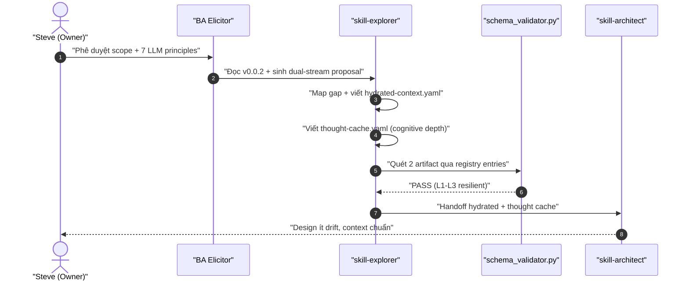
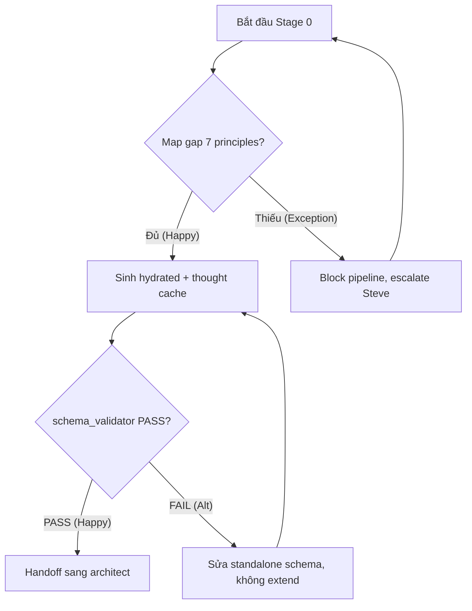
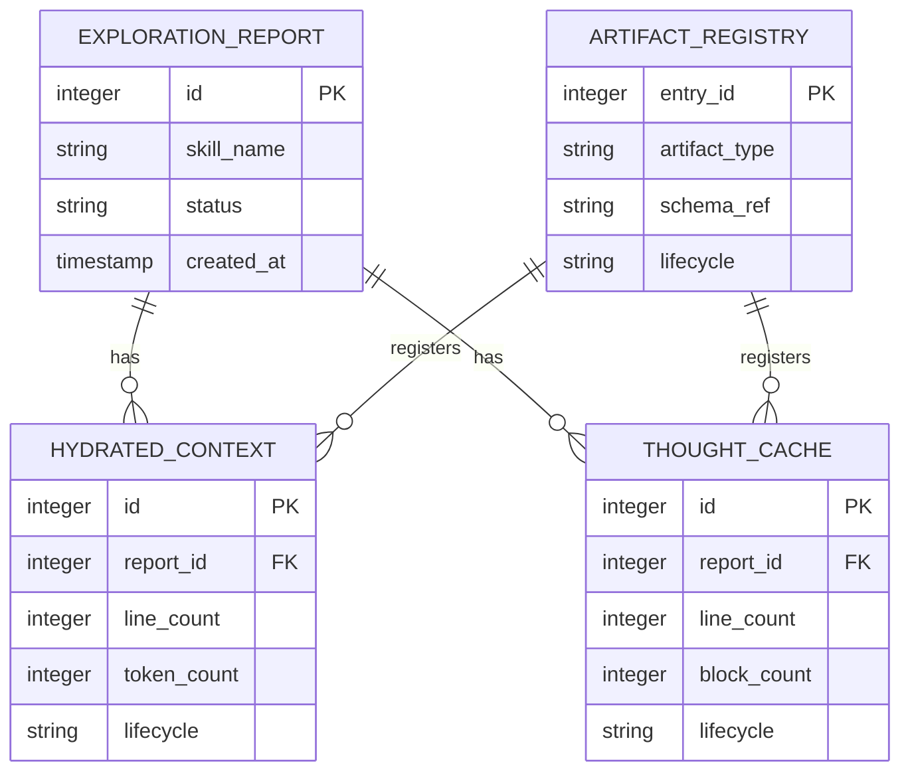

> [!NOTE]
> **Artifact Metadata (KHÔNG thuộc frontmatter — schema dùng `additionalProperties: false`).**
> ```yaml
> analyzed_by: "ba-analyst"
> analyzed_at: "2026-07-11T15:00:00Z"
> status: "completed"
> schema_ref: "skills/ver-3/_shared/schemas/analysis.schema.yaml"
> artifact_lifecycle: "WORM"
> validated_by: "schema_validator.py + validate_metrics.py"
> trace_tags: ["TỪ INPUT", "SUY LUẬN", "CẦN LÀM RÕ"]
> ```

# Báo Cáo Phân Tích Nghiệp Vụ & Đặc Tả Kỹ Thuật

## §1: Classification & MoSCoW Matrix

| ID | Yêu cầu | Loại | MoSCoW | Giải thích kỹ thuật |
|:---|:--------|:----:|:------:|:-------------------|
| FR-01 | Map v0.0.2 ↔ 7 LLM principles | FR | P0 — Must | Nền tảng analysis, thiếu thì không biết tích hợp gì. |
| FR-02 | Gap Analysis 7 principles (MECE) | FR | P0 — Must | Xác định 7 gap độc lập, định hướng build. |
| FR-03 | Dual-stream output (hydrated + thought cache) | FR | P0 — Must | Thay single exploration.md, cốt lõi v1.0. |
| FR-04 | Document only, no code/branch | FR | P0 — Must | Scope ràng buộc từ input; vi phạm = out of scope. |
| FR-05 | Standalone thought-cache.schema.yaml | FR | P1 — Should | Giải quyết RR-01; có thể defer nếu extend bị cấm. |
| FR-06 | 2 registry entries WORM | FR | P1 — Should | Cần để validator quét được dual-stream. |
| FR-07 | Binary Gates META-2.1 (S1-S4 AND) | FR | P1 — Should | Deterministic verify, giảm drift. |
| FR-08 | YAML Resilience L1-L3 | FR | P1 — Should | Interceptor bảo vệ trước mọi YAML commit. |
| FR-09 | Negative Space (must_not + anti-patterns) | FR | P2 — Could | Tăng chất lượng, không block MVP. |
| FR-10 | Fallback matrix subset F1-F4 | FR | P2 — Could | Graceful degradation, defer F5-F19. |
| NFR-01 | hydrated-context ≤ 50 dòng | NFR | P0 — Must | Bảo vệ token budget, hard gate. |
| NFR-02 | thought-cache 100-200 dòng | NFR | P0 — Must | Cognitive depth yêu cầu. |
| NFR-03 | L2_token_budget = 2200 tokens | NFR | P0 — Must | Ràng buộc cứng hydration. |
| NFR-04 | YAML Resilience 3 levels | NFR | P1 — Should | L1/L2/L3 defenses. |
| NFR-05 | Binary gate 4 signals AND | NFR | P1 — Should | META-2.1 depth gate. |
| NFR-06 | additionalProperties:false | NFR | P0 — Must | Ngăn nhét field bừa, bảo vệ schema. |
| NFR-07 | Sampling audit 30% | NFR | P2 — Could | Deterrence effect. |
| NFR-08 | Max 3 iter/stage | NFR | P1 — Should | Fallback discipline. |
| NFR-09 | Glossary ≥ 10 terms | NFR | P0 — Must | Semantic anchor bắt buộc. |
| NFR-10 | Thought block ≥ 200 words | NFR | P0 — Must | Cognitive depth tối thiểu. |

## §2: System Diagrams (Sequence + Flowchart + ERD)

### Sequence Diagram



### Flowchart



### ERD



## §3: Data Schema Design (tables + JSON Schema)

| Tên trường | Kiểu | Ràng buộc | Mô tả |
|:---|:---|:---|:---|
| `id` | `integer` | `PK, AUTO_INCREMENT` | Khóa chính |
| `report_id` | `integer` | `FK → EXPLORATION_REPORT.id` | Liên kết báo cáo gốc |
| `line_count` | `integer` | `NOT NULL, ≤ 50 (hydrated) / 100-200 (thought)` | Số dòng artifact |
| `token_count` | `integer` | `NOT NULL, ≤ 2200` | Token budget L2 |
| `lifecycle` | `string` | `NOT NULL, enum[WORM]` | Vòng đời bất biến |
| `created_at` | `timestamp` | `NOT NULL` | Thời gian sinh |

```json
{
  "$schema": "http://json-schema.org/draft-07/schema#",
  "title": "HydratedContextSchema",
  "type": "object",
  "properties": {
    "skill_name": { "type": "string", "minLength": 1 },
    "glossary": {
      "type": "array",
      "items": { "type": "string" },
      "minItems": 10
    },
    "nfrs": {
      "type": "array",
      "items": {
        "type": "object",
        "properties": {
          "id": { "type": "string" },
          "metric": { "type": "string" },
          "value": { "type": "number" },
          "unit": { "type": "string" }
        },
        "required": ["id", "metric", "value", "unit"]
      }
    },
    "data_contracts": { "type": "object" },
    "must_not": { "type": "array", "items": { "type": "string" } },
    "line_count": { "type": "integer", "maximum": 50 },
    "token_count": { "type": "integer", "maximum": 2200 }
  },
  "required": ["skill_name", "glossary", "nfrs", "line_count"]
}
```

## §4: Gherkin Acceptance Criteria (3-path)

**User Story:** As a BA Elicitor, I want to generate dual-stream hydrated-context.yaml + thought-cache.yaml so that skill-architect receives standardized technical and cognitive context with minimal design drift.

```gherkin
Feature: skill-explorer dual-stream output v1.0
  Scenario: Happy Path — Sinh dual-stream PASS
    Given elicitor đọc scope doc + 7 LLM principles + v0.0.2 code
    When elicitor map 7 gap và sinh hydrated-context.yaml (≤ 50 dòng) + thought-cache.yaml (100-200 dòng)
    Then schema_validator.py quét 2 registry entries và trả về PASS (L1-L3 resilient)
    And skill-architect đọc được cả 2 artifact không drift

  Scenario: Alternative Path — Giữ exploration.md + 2 artifact
    Given option A được chọn (giữ exploration.md tóm tắt + thêm 2 artifact)
    When validator chạy trên 3 entry (exploration, hydrated, thought_cache)
    Then architect có thể đọc 1 hoặc 3 file tùy config mà không break

  Scenario: Exception Path — Schema vi phạm additionalProperties:false
    Given exploration.schema.yaml giữ additionalProperties:false
    When dev cố nhét field mới vào frontmatter exploration.md
    Then schema_validator.py FAIL (exit 1) và WORM break
    And pipeline quay lại thiết kế schema standalone, KHÔNG tự sửa
```

## §5: Risk Assessment Matrix (P×I + mitigation)

| Mã RR | Mô tả rủi ro | Xác suất | Tác động | Giải pháp giảm thiểu |
|:---|:---|:---:|:---:|:---|
| RR-01 | Extend schema vi phạm additionalProperties:false | Cao | Cao | Standalone thought-cache.schema.yaml (FR-05) |
| RR-02 | Architect breaking change chưa migrate | Cao | Cao | 2 registry entries + migrate boot sequence (FR-06) |
| RR-03 | Prompt injection qua raw prompts | Trung bình | Cao | YAML Resilience L3 + sanitize (FR-08) |
| RR-04 | hydrated-context vượt 50 dòng | Trung bình | Trung bình | Smart Splitter + hard gate (NFR-01) |
| RR-05 | Scope creep fallback F1-F19 | Trung bình | Trung bình | Chỉ F1-F4, defer còn lại (FR-10) |
| RR-06 | SCS phasing sai (single vs 2-phase) | Thấp | Trung bình | Giữ single-pass v1.0, [CẦN LÀM RÕ] confirm |

## §6: Traceability Mapping (requirement → diagram → test → risk)

- **FR-01, FR-02, FR-03, FR-04**: [TỪ INPUT] ánh xạ trực tiếp từ `elicitation-report.md` §1 (mục tiêu, env, actors, FRs, size NFRs).
- **FR-05 → RR-01, FR-06 → RR-02**: [SUY LUẬN] từ gap analysis §3 (First Principles: additionalProperties:false → tách file bắt buộc).
- **NFR-01..NFR-10**: [TỪ INPUT] + [SUY LUẬN] từ scope §6.2 và synthesis-llm-principles (token budget, resilience levels, signals).
- **Sequence/Flowchart/ERD**: [SUY LUẬN] từ data flow impact scope §4.3 (v0.0.2 → v1.0 dual-stream).
- **Điểm chưa rõ**: [CẦN LÀM RÕ] output strategy (Q1), SCS phasing (Q2), fallback subset (Q3), binary gate stage (Q4), thought-cache schema (Q5), registry entries (Q6) — ESCALATE Steve trước build phase.
