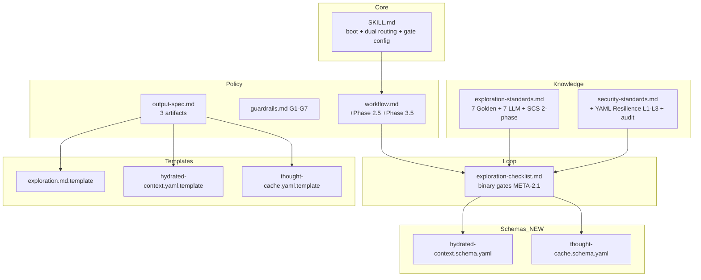
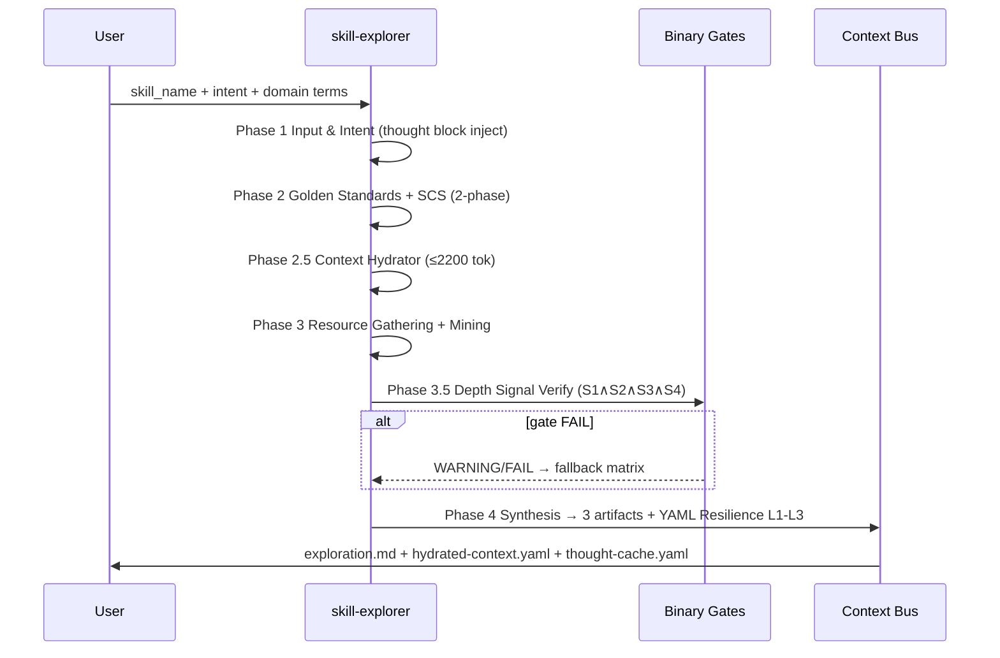
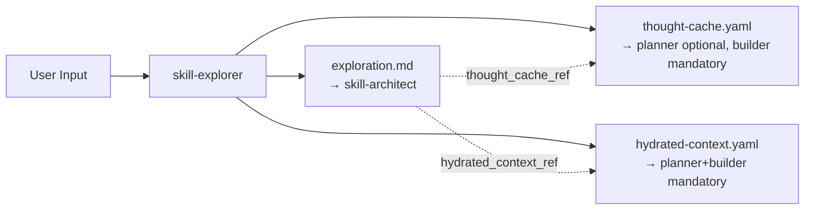
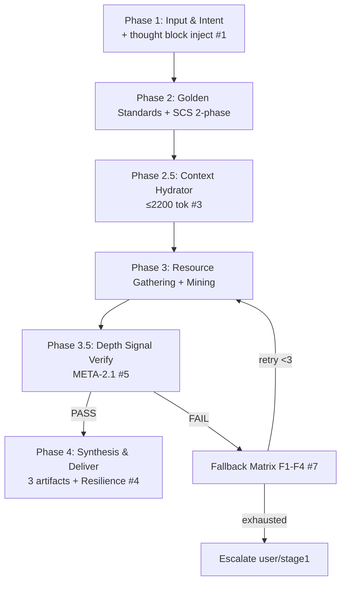

# Architecture Design — skill-explorer v1.0

> Single-stream → dual-stream + 7 LLM principles. Additive, zero-breaking upgrade from v0.0.2.

---

## §1. Overview & Design Decisions

skill-explorer là **Stage 0** của pipeline WASHVN. v1.0 nâng cấp output từ 1 artifact (`exploration.md`) lên **3 artifact** (report + technical stream + cognitive stream) và tích hợp 7 LLM principles vào workflow + quality gates.

### Design Decisions (traceable)

| # | Decision | Rationale | Trace |
|:--|:---------|:----------|:------|
| DD-1 | **Additive output**: giữ `exploration.md` + thêm `hydrated-context.yaml` + `thought-cache.yaml` | Runtime architect chỉ đọc `exploration.md` (SKILL.md:36) → additive không ảnh hưởng architect, breaking về zero | [TỪ SCOPE §10 Q3][SUY LUẬN A2] |
| DD-2 | **Extend schema additively**: thêm `hydrated_context_ref` vào exploration.schema.yaml, giữ `additionalProperties:false` | Schema đã có `thought_cache_ref`, chỉ thiếu hydrated ref | [TỪ HANDBOOK §2.F Q1][SUY LUẬN A1] |
| DD-2b | **Architect KHÔNG đổi cho v1.0**: 2 artifact mới chỉ consume bởi planner+builder | Runtime `.agents/skills/skill-architect/SKILL.md` (4915B) boot chỉ đọc `exploration.md` (line 36). Additive vẫn tương thích; architect bỏ qua 2 artifact mới — chấp nhận được (YAGNI). Nếu cần architect dùng hydrated-context → Stage-1 follow-up task riêng | [SUY LUẬN A2 verified against .agents/skills/skill-architect/SKILL.md:36] |
| DD-3 | **2 standalone schemas** cho hydrated-context + thought-cache | Cognitive lifecycle ≠ technical lifecycle | [TỪ BA REQ-05][SUY LUẬN Q4] |
| DD-4 | **Dual-stream separation** technical (inline Context Bus) vs cognitive (file ref) | Planner cần technical mandatory, cognitive optional; Builder cần cả 2 | [TỪ BA REQ-03][principle #4] |
| DD-5 | **Binary gates thay soft checklist** (META-2.1 S1∧S2∧S3∧S4) | Soft checklist → LLM padding, không verify bằng script | [TỪ BA REQ-07,15][principle #5] |
| DD-6 | **+2 workflow phases**: 2.5 Context Hydrator, 3.5 Depth Signal Verification | v0.0.2 không có hydration/depth-verify step | [TỪ BA REQ-03][principle #3,#5] |
| DD-7 | **Fallback subset F1-F4** cho v1.0, full F1-F19 deferred | Scope sizing v1.0; critical cases đủ bảo vệ | [TỪ BA REQ-10][SUY LUẬN Q6] |
| DD-8 | **SCS 2-phase**: Stage 0.5 pre-pass mandatory, Stage 1.5 validate optional v1.0 | Cân bằng độ chính xác vs scope | [SUY LUẬN Q5] |

---

## §2. Architecture Diagram

### Component Diagram



### Sequence Diagram



### Data Flow



---

## §3. Zone Mapping

> Chi tiết đầy đủ tại `zone-map.yaml`. Tóm tắt: [TỪ SCOPE §7][REQ-01→04]

```yaml
zones:
  core: [SKILL.md]
  knowledge: [exploration-standards.md, security-standards.md]
  policy: [workflow.md, guardrails.md, output-spec.md]
  loop: [exploration-checklist.md]
  scripts: [init_context.py]
  templates: [exploration.md.template, hydrated-context.yaml.template, thought-cache.yaml.template]
  data: [search-blacklist.yaml]
  schemas: [hydrated-context.schema.yaml, thought-cache.schema.yaml]   # NEW zone
```

---

## §4. Data Contracts

> Chi tiết đầy đủ tại `data-contracts.yaml`. [REQ-05,06,11,12,16,19,20]

- **exploration.md**: markdown + frontmatter; validate qua `exploration.schema.yaml` (extended additive: +`hydrated_context_ref`). `additionalProperties:false` giữ nguyên [REQ-16].
- **hydrated-context.yaml**: ≤50 lines hard gate [REQ-11]; glossary ≥10 terms [REQ-19]; standalone schema.
- **thought-cache.yaml**: 100-200 lines soft gate [REQ-12]; thought_block ≥200 words [REQ-20]; standalone schema [REQ-05].
- **artifact_registry.yaml**: 2 WORM entries (hydrated + thought) [REQ-06].

---

## §5. Workflow Design



```yaml
phases:
  - id: 1
    name: "Input & Intent Analysis"
    adds: "thought block injection (semantic anchor)"
    trace: "[REQ-01][principle #1]"
  - id: 2
    name: "Golden Standards & SCS"
    adds: "SCS 2-phase (0.5 pre-pass mandatory, 1.5 optional)"
    trace: "[SUY LUẬN Q5][principle #1,#3]"
  - id: 2.5
    name: "Context Hydrator"
    adds: "hydrated-context.yaml ≤2200 tokens hard gate"
    trace: "[REQ-03,13][principle #3]"
  - id: 3
    name: "Resource Gathering & Mining"
    adds: "sampling audit 30% default"
    trace: "[REQ-17][SUY LUẬN Q8]"
  - id: 3.5
    name: "Depth Signal Verification"
    adds: "META-2.1 binary gate S1∧S2∧S3∧S4"
    trace: "[REQ-07,15][principle #5][SUY LUẬN Q7]"
  - id: 4
    name: "Synthesis & Deliver"
    adds: "3 artifacts, YAML Resilience L1-L3 pre-commit"
    trace: "[REQ-03,08,14][principle #4,#7]"
```

---

## §6. Quality Gates Architecture

> Chi tiết chain tại `data-contracts.yaml §gates`. [REQ-07,08,14,15,17,18]

```yaml
gates:
  META_2_1:                 # [REQ-07,15][principle #5]
    type: hard
    condition: "s1 AND s2 AND s3 AND s4"
    verify: "regex/script mechanical"
    signals:
      s1: 'must_not OR "không" in block'
      s2: '"?" in block'
      s3: 'any(user|dev|agent|người) in block'
      s4: 'constraint OR "ràng buộc" in block'
    fail: "WARNING (word<100) | FAIL (missing signal)"
  L2_token_budget: {type: hard, limit: 2200, fail: "request compression"}   # [REQ-13]
  YAML_Resilience:          # [REQ-08,14][principle #7]
    L1_syntax: "yaml.safe_load → auto-repair max2 → Hard Halt"
    L2_schema: "required keys+types → auto-repair max2 → Hard Halt"
    L3_crossref: "path exists+non-empty → critical:Halt | non-critical:degrade"
  sampling_audit: {default: "30%", on_fail: "100%", relax: "8 PASS→15%"}    # [REQ-17]
  max_iterations_per_stage: 3   # [REQ-18]
```

---

## §7. Negative Space Design

> [REQ-09][principle #6]

```yaml
negative_space:
  must_not:                 # trong mọi stage design
    - "Gộp technical + cognitive vào 1 artifact (single-stream anti-pattern)"
    - "Dùng soft checklist thay binary gate"
    - "Thought block <200 từ"
    - "Hallucinate API/cấu trúc khi thiếu source docs"
    - "Edit source ngoài .skill-context/"
    - "Tự quyết khi confidence <70% (skip HITL)"
  anti_patterns_section: "riêng biệt, KHÔNG gộp vào must_not"
  s1_negation_gate: "part of META-2.1 (deterministic)"
  guardrails_expanded: "G1-G5 → G1-G7 (+G6 dual-stream-integrity, +G7 depth-gate)"
```

---

## §8. Graceful Degradation Design

> [REQ-10][principle #7]

```yaml
fallback_matrix_v1:
  max_iterations_per_stage: 3
  history_mode: append-only
  cases:
    - {id: F1, name: missing_skill_context, trigger: "skill_name not found", action: "ask user context", severity: major}
    - {id: F2, name: ambiguous_intent, trigger: "confidence <70%", action: "halt, present analysis, ask confirm", severity: major}
    - {id: F3, name: prompt_injection, trigger: "L1 fail after 2 attempts", action: "Hard Halt", severity: critical}
    - {id: F4, name: schema_validation_fail, trigger: "L2 fail after 2 attempts", action: "Hard Halt escalate stage1", severity: critical}
  non_critical_dangling_ref: "degraded mode, không block"
```

---

## §9. Open Questions Resolution

| Q | Decision | Rationale | Trace |
|:--|:---------|:----------|:------|
| Q1 | Extend `exploration.schema.yaml` additive (+`hydrated_context_ref`), giữ `additionalProperties:false` | Đọc file: đã có `thought_cache_ref`, chỉ thiếu hydrated ref → additive an toàn | [SUY LUẬN A1] verified |
| Q2 | Không update skill-architect cho v1.0 (option a) | Runtime `.agents/skills/skill-architect/SKILL.md` (4915B, không phải stub) boot đọc **chỉ** `exploration.md` (line 36). Additive tương thích ngược: architect vẫn chạy trên exploration.md, bỏ qua 2 artifact mới. Nếu muốn architect dùng hydrated-context → tạo Stage-1 follow-up task wiring | [SUY LUẬN A2] verified against .agents/skills/skill-architect/SKILL.md:36 |
| Q3 | **Additive**: giữ exploration.md + 2 artifact mới | Giảm breaking change, report tổng vẫn dùng được | [TỪ SCOPE §10] |
| Q4 | **Standalone** thought-cache.schema.yaml | Cognitive depth khác technical, lifecycle riêng | [REQ-05] |
| Q5 | **2-phase** SCS: 0.5 mandatory, 1.5 optional v1.0 | Cân bằng chính xác vs scope | [SUY LUẬN] |
| Q6 | **Subset F1-F4** cho v1.0, full deferred | Critical cases đủ, scope sizing | [REQ-10] |
| Q7 | **Implement META-2.1 ngay Stage 0** | Quality gate cốt lõi, không defer | [SUY LUẬN] |
| Q8 | Default **30%**, 100% on FAIL, 15% sau 8 PASS | Rate cân bằng cost/coverage cho exploration stage | [REQ-17] |

---

## §10. Risk Assessment

| Edge | Treatment | Coverage |
|:-----|:----------|:---------|
| E1 skill_name không kebab-case | validate_skill_name() reject | ✅ scripts |
| E2 context dir đã tồn tại | resume, safe_create_file SKIPPED (no overwrite) | ✅ scripts |
| E3 --split trên chưa decomposed | in info, return 0 | ✅ scripts |
| E4 YAML syntax lỗi | L1 auto-repair max2 → Hard Halt | ✅ gate |
| E5 thiếu 1/4 signal | binary FAIL → WARNING/FAIL | ✅ gate |
| E6 confidence <70% | halt, HITL (G5) | ✅ fallback F2 |
| E7 web fetch fail | degrade → internal resources, mark uncertainty flag in report | ✅ fallback |
| E8 thought-cache >200 lines | soft warning, không block | ✅ gate |
| E9 schema chưa update dual | validator fail → escalate stage1 | ✅ fallback F4 |

**Coverage: 9/9 edge cases · 20/20 REQ · 8/8 Q resolved · 6 anti-patterns.**

> **Blocker resolution:** A1 verified (exploration.schema.yaml: `additionalProperties:false`, has `thought_cache_ref`, missing `hydrated_context_ref` → additive). A2 verified against runtime `.agents/skills/skill-architect/SKILL.md:36` (reads exploration.md only → architect unchanged). A3 decided (additive, Q3).
