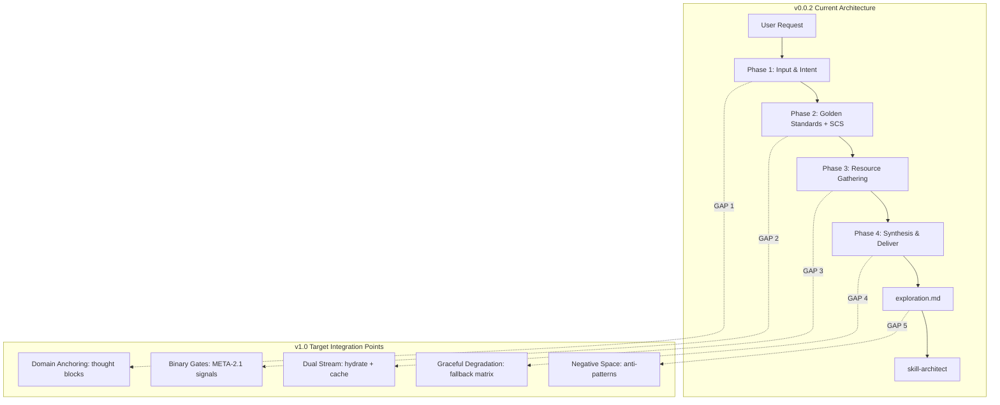

# Scope Document — Xây dựng Main Skill-Explorer v1.0

**Date**: 2026-07-11
**Status**: Initial
**Feature**: skill-explorer-main-build
**Context Source 1**: `skills/ver-0.0.2/skill-explorer/` (reference implementation v0.0.1)
**Context Source 2**: `synthesis-llm-principles.md` (7 nguyên lý LLM core WASHVN)

---

## §1: Problem Summary

Xây dựng phiên bản **main (v1.0)** của skill `skill-explorer` — skill chịu trách nhiệm Stage 0 (Exploration) trong pipeline WASHVN. Hiện tại:

- **Active version**: `.agents/skills/skill-explorer/` (v0.0.1) — identical to `skills/ver-0.0.2/skill-explorer/` (backup reference)
- **Mục tiêu**: Nâng cấp từ v0.0.1 lên v1.0 bằng cách tích hợp **7 nguyên lý LLM cốt lõi** từ `synthesis-llm-principles.md` vào thiết kế hiện tại
- **Tài liệu bổ trợ**: 
  1. Kiến trúc v0.0.2 làm foundation code
  2. 7 LLM Principles làm design guidance cho main upgrade

---

## §2: Entry Point

| Type | Path | Version | Vai trò |
|------|------|---------|---------|
| Active Skill | `.agents/skills/skill-explorer/SKILL.md` | v0.0.1 | Entry point của skill hiện tại |
| Reference | `skills/ver-0.0.2/skill-explorer/` | v0.0.1 (backup) | Cấu trúc tham chiếu, identical |
| Design Principles | `synthesis-llm-principles.md` | N/A | 7 nguyên lý thiết kế cho main upgrade |

### Directory Structure v0.0.2 (reference):

```
skill-explorer/
├── SKILL.md              ← Boot config, 4 phases, must/must_not
├── data/
│   └── search-blacklist.yaml
├── knowledge/
│   ├── exploration-standards.md    ← 7 Golden Standards + SCS
│   └── security-standards.md       ← Prompt Injection + Docker sandbox
├── loop/
│   └── exploration-checklist.md    ← Quality gate checklist
├── policy/
│   ├── workflow.md           ← 4-phase workflow chi tiết
│   ├── guardrails.md         ← G1-G5 guardrails
│   └── output-spec.md        ← 8-section output contract
├── scripts/
│   └── init_context.py       ← Context init + Smart Splitter
└── templates/
    └── exploration.md.template  ← 8-section exploration report
```

---

## §3: Scope Definition

### 3.1 Problem Area

Khu vực cần phân tích — **toàn bộ skill-explorer**:
- **Core logic** (SKILL.md, policy/)
- **Domain knowledge** (knowledge/)
- **Templates & output** (templates/, output-spec.md)
- **Orchestration scripts** (scripts/init_context.py)
- **Quality gates** (loop/exploration-checklist.md)

### 3.2 Boundary

**IN SCOPE**:
- Phân tích mapping giữa v0.0.2 architecture và 7 LLM principles
- Xác định gap: v0.0.2 thiếu những gì so với 7 principles
- Đề xuất hướng tích hợp cho main build
- Chỉ document findings — KHÔNG code, KHÔNG tạo branch

**OUT OF SCOPE**:
- Không sửa SKILL.md, policy files, templates
- Không chạy init_context.py
- Không tạo micro-skill mới
- Không deploy

---

## §4: Impact Analysis

### 4.1 Direct Impact

| Component | File | Impact |
|-----------|------|--------|
| SKILL.md | `skill-explorer/SKILL.md` | Cần update boot config: dual context ingestion, binary gates, thought blocks |
| exploration-standards.md | `skill-explorer/knowledge/exploration-standards.md` | Cần mở rộng 7 Golden Standards với 7 LLM principles |
| security-standards.md | `skill-explorer/knowledge/security-standards.md` | Cần thêm YAML Resilience Layer, sampling audit |
| output-spec.md | `skill-explorer/policy/output-spec.md` | Cần thêm §9 metadata cho dual-stream output |
| exploration.md.template | `skill-explorer/templates/exploration.md.template` | Cần restructuring: thêm hydrated-context.yaml và thought-cache.yaml |
| exploration-checklist.md | `skill-explorer/loop/exploration-checklist.md` | Cần thêm binary gates, META-2.1 depth signals |
| init_context.py | `skill-explorer/scripts/init_context.py` | Cần update để init dual context (hydrated + thought cache) |

### 4.2 Indirect Impact

| Component | File | Impact |
|-----------|------|--------|
| skill-architect | `.agents/skills/skill-architect/` | Output format thay đổi → architect phải đọc schema mới |
| skill-planner | `.agents/skills/skill-planner/` | Hydrated-context đầu vào thay đổi |
| skill-builder | `.agents/skills/skill-builder/` | Planner handoff thay đổi format |
| shared schemas | `_shared/schemas/exploration.schema.yaml` | Schema có thể cần update |
| shared validators | `_shared/validators/schema_validator.py` | Validator cần update nếu schema đổi |

### 4.3 Data Flow Impact

```
v0.0.2 (As-Is):
  User Input → skill-explorer → exploration.md (single stream) → skill-architect

v1.0 (To-Be với Dual Stream):
  User Input → skill-explorer
    ├── hydrated-context.yaml (technical contracts ~30-50 lines)
    └── thought-cache.yaml (cognitive depth ~100-200 lines)
  → skill-architect (đọc cả 2 streams)
```

---

## §5: Call Chain



---

## §6: Data Flow

### 6.1 Input (v0.0.2 → v1.0 evolution)

| Input | v0.0.2 | v1.0 Target |
|-------|--------|-------------|
| User description | Skill name + short intent | Skill name + intent + domain terms |
| Context resources | Raw grep + web search | Grep + web + **thought block injection** |
| Security constraints | XML boundaries | XML + **YAML Resilience L1-L3** |
| Quality checks | Checklist only | Checklist + **binary gates + sampling audit** |

### 6.2 Output (change from single to dual stream)

```yaml
v0.0.2 Output:
  - .skill-context/{target_skill}/exploration.md     # Single monolithic report
  - .skill-context/{target_skill}/criteria.md         # Test criteria

v1.0 Target Output:
  - .skill-context/{target_skill}/exploration.md      # Report (simplified)
  - .skill-context/{target_skill}/hydrated-context.yaml  # NEW: ~30-50 lines YAML
  - .skill-context/{target_skill}/thought-cache.yaml     # NEW: ~100-200 lines YAML
  - .skill-context/{target_skill}/criteria.md            # Updated
```

### 6.3 Dependencies

| Dependency | Location | Impact Level |
|------------|----------|--------------|
| exploration.schema.yaml | `_shared/schemas/` | **HIGH** — must update schema for dual stream |
| schema_validator.py | `_shared/validators/` | **MEDIUM** — validator must support new fields |
| framework.md | `_shared/knowledge/` | **LOW** — reference only |
| skill-architect | `.agents/skills/skill-architect/` | **HIGH** — downstream consumer |

---

## §7: Affected Components

### 7.1 Files (trực tiếp cần thay đổi khi build)

| # | File | Thay đổi đề xuất |
|---|------|------------------|
| 1 | `.agents/skills/skill-explorer/SKILL.md` | Thêm domain anchoring boot sequence, dual context routing, binary gates config |
| 2 | `.agents/skills/skill-explorer/knowledge/exploration-standards.md` | Mở rộng 7 Golden Standards → tích hợp 7 LLM principles; thêm SCS 2-phase (Stage 0.5 + Stage 1.5) |
| 3 | `.agents/skills/skill-explorer/knowledge/security-standards.md` | Thêm YAML Resilience Layer (L1 syntax, L2 schema, L3 cross-ref), sampling audit (30%→100%) |
| 4 | `.agents/skills/skill-explorer/policy/output-spec.md` | Restructure: 3 output artifacts thay vì 1 |
| 5 | `.agents/skills/skill-explorer/policy/workflow.md` | Thêm Phase 2.5 (context hydration), Phase 3.5 (depth signal verification) |
| 6 | `.agents/skills/skill-explorer/templates/exploration.md.template` | Thêm YAML blocks cho hydrated context + thought cache references |
| 7 | `.agents/skills/skill-explorer/loop/exploration-checklist.md` | Thêm binary gate checks: META-2.1 (S1-S4), YAML resilience pass/fail |

### 7.2 Functions/APIs

| Function | File | Impact |
|----------|------|--------|
| `handle_single_init()` | `init_context.py` | Cần init thêm 2 files (hydrated-context.yaml, thought-cache.yaml) |
| `handle_split_run()` | `init_context.py` | Split logic cần copy cả hydrated + thought cache xuống micro-skill |
| `parse_frontmatter()` | `init_context.py` | Schema frontmatter thay đổi |
| Frontmatter validator | `schema_validator.py` | New required fields for dual stream |

---

## §8: Evidence

<evidence>
  <file>skills/ver-0.0.2/skill-explorer/SKILL.md</file>
  <line>12-27</line>
  <finding>v0.0.2 must/must_not: 7 rules, không đề cập Dual Context, Binary Gates, hoặc thought blocks</finding>
</evidence>

<evidence>
  <file>skills/ver-0.0.2/skill-explorer/SKILL.md</file>
  <line>73-104</line>
  <finding>4 phases: Input → Golden Standards → Resource Gathering → Synthesis. Không có hydration phase hoặc depth signal verification phase</finding>
</evidence>

<evidence>
  <file>skills/ver-0.0.2/skill-explorer/knowledge/exploration-standards.md</file>
  <line>8-47</line>
  <finding>7 Golden Standards tập trung vào skill engineering quality, không có LLM-specific principles (domain anchoring, cognitive depth, semantic activation)</finding>
</evidence>

<evidence>
  <file>skills/ver-0.0.2/skill-explorer/knowledge/exploration-standards.md</file>
  <line>67-77</line>
  <finding>SCS score là single-pass (Stage 0). Không có 2-phase như synthesis-llm-principles yêu cầu: Stage 0.5 pre-pass + Stage 1.5 validate</finding>
</evidence>

<evidence>
  <file>skills/ver-0.0.2/skill-explorer/knowledge/security-standards.md</file>
  <line>1-48</line>
  <finding>Security chỉ có XML boundaries + Docker sandbox. Thiếu: YAML Resilience Layer (L1-L3), sampling audit, fallback matrix (F1-F19)</finding>
</evidence>

<evidence>
  <file>skills/ver-0.0.2/skill-explorer/templates/exploration.md.template</file>
  <line>1-146</line>
  <finding>Template có 8 sections, single output file. Không có dual stream separation (hydrated-context.yaml + thought-cache.yaml)</finding>
</evidence>

<evidence>
  <file>skills/ver-0.0.2/skill-explorer/policy/output-spec.md</file>
  <line>10-25</line>
  <finding>Output contract chỉ định 1 artifact duy nhất (exploration.md). Handoff đơn tuyến tới skill-architect</finding>
</evidence>

<evidence>
  <file>skills/ver-0.0.2/skill-explorer/loop/exploration-checklist.md</file>
  <line>7-28</line>
  <finding>Checklist dạng soft questions, KHÔNG phải binary pass/fail gates. Không có META-2.1 depth signals, không có YAML resilience checks</finding>
</evidence>

<evidence>
  <file>skills/ver-0.0.2/skill-explorer/scripts/init_context.py</file>
  <line>77-111</line>
  <finding>handle_single_init chỉ tạo 1 exploration.md + resources/. Không init hydrated-context.yaml hay thought-cache.yaml</finding>
</evidence>

<evidence>
  <file>synthesis-llm-principles.md</file>
  <line>11-27</line>
  <finding>Domain Anchoring (#1): LLM cần semantic anchors (glossary, thought blocks >200 từ, stakeholder empathy). v0.0.2 có glossary nhưng không có thought blocks</finding>
</evidence>

<evidence>
  <file>synthesis-llm-principles.md</file>
  <line>44-58</line>
  <finding>Dual Context Ingestion (#4): Technical (hydrated-context.yaml) + Cognitive (thought-cache.yaml) là 2 streams riêng biệt. v0.0.2 chỉ có 1 stream</finding>
</evidence>

<evidence>
  <file>synthesis-llm-principles.md</file>
  <line>122-137</line>
  <finding>Binary Mechanical Gates (#5): Tất cả gates phải nhị phân, deterministic. META-2.1 v2.0: S1 AND S2 AND S3 AND S4 = PASS. v0.0.2 không có gates dạng này</finding>
</evidence>

<evidence>
  <file>synthesis-llm-principles.md</file>
  <line>251-269</line>
  <finding>Negative Space (#6): must_not lists, anti-patterns, S1 Negation Density. v0.0.2 có must_not trong template §4 nhưng thiếu anti-patterns section riêng</finding>
</evidence>

<evidence>
  <file>synthesis-llm-principles.md</file>
  <line>147-163</line>
  <finding>Graceful Degradation (#7): Fallback matrix F1-F19, max 3 iterations per stage, append-only history. v0.0.2 không có fallback matrix</finding>
</evidence>

---

## §9: Confidence Assessment

| Khu vực | Confidence | Lý do |
|---------|-----------|-------|
| v0.0.2 structure mapping | 95% | Đã đọc toàn bộ file tree và nội dung |
| Gap analysis giữa v0.0.2 và 7 principles | 90% | synthesis-llm-principles rõ ràng, so sánh trực tiếp được |
| Impact on downstream skills | 75% | Chưa đọc chi tiết skill-architect để xác nhận schema compatibility |
| init_context.py changes | 85% | Code đã đọc, logic rõ, nhưng chưa test runtime |
| exploration.schema.yaml changes | 65% | Chưa tìm thấy schema file thực tế — **UNCERTAIN** |

**Overall Confidence**: **82%** (medium-high — phù hợp để document với uncertainty flags)

**Uncertainty Flags**:
- [CẦN LÀM RÕ] `_shared/schemas/exploration.schema.yaml` — cần verify schema hiện tại để biết breaking changes
- [CẦN LÀM RÕ] `_shared/validators/schema_validator.py` — cần đọc code để biết có hỗ trợ multi-artifact validation không
- [CẦN LÀM RÕ] skill-architect SKILL.md — cần verify format đầu vào hiện tại

---

## §10: Open Questions

| # | Câu hỏi | Liên quan đến |
|---|---------|---------------|
| 1 | exploration.schema.yaml hiện tại có hỗ trợ multi-artifact output không? | Schema compatibility |
| 2 | skill-architect hiện tại đọc exploration.md ở format nào? Có cần update không? | Downstream breaking change |
| 3 | Có nên giữ exploration.md như báo cáo tổng + thêm 2 artifact mới, hay thay thế hoàn toàn bằng 3 artifact riêng? | Output strategy |
| 4 | thought-cache.yaml có cần schema riêng hay dùng chung exploration.schema.yaml? | Schema design |
| 5 | SCS score: có nên giữ single-pass (Stage 0) hay chuyển sang 2-phase (Stage 0.5 + Stage 1.5) như synthesis-llm-principles đề xuất? | Pipeline redesign |
| 6 | Fallback matrix: cần implement bao nhiêu fallback cases (F1-F19) cho v1.0? Hay chỉ subset critical? | Scope sizing |
| 7 | Binary gates META-2.1: có implement ngay trong Stage 0 hay chỉ ở downstream? | Phasing |
| 8 | Sampling audit: 30% default rate có phù hợp với exploration stage không? | Rate tuning |

---

## Summary of Key Gaps (v0.0.2 → v1.0)

| # | Nguyên lý | v0.0.2 Status | v1.0 Required | Priority |
|---|-----------|---------------|---------------|----------|
| 1 | Domain Anchoring | ❌ Thiếu thought blocks | Thêm thought-cache.yaml, glossary 10+ terms | **HIGH** |
| 2 | Semantic over Ceremony | ⚠️ Có template nhưng thin content | Thêm data contracts, binary gates | **HIGH** |
| 3 | Context Pre-processing | ❌ Không có hydration step | Thêm Phase 2.5: Context Hydrator | **HIGH** |
| 4 | Dual Knowledge Stream | ❌ Single stream | hydrated-context.yaml + thought-cache.yaml | **HIGH** |
| 5 | Binary Mechanical Gates | ❌ Checklist mềm | META-2.1 signals, YAML Resilience L1-L3 | **MEDIUM** |
| 6 | Negative Space | ⚠️ Có must_not cơ bản | Thêm anti-patterns section, S1 gate | **MEDIUM** |
| 7 | Graceful Degradation | ❌ Không có fallback | Fallback matrix (subset F1-F19) | **MEDIUM** |

**Document Status**: Context Complete — No Code Changes Made

---

> **Document generated by**: context-before-fix skill
> **Skill version**: 1.0.0
> **Date**: 2026-07-11
> **NO CODE CHANGES — Context ready for build phase**
