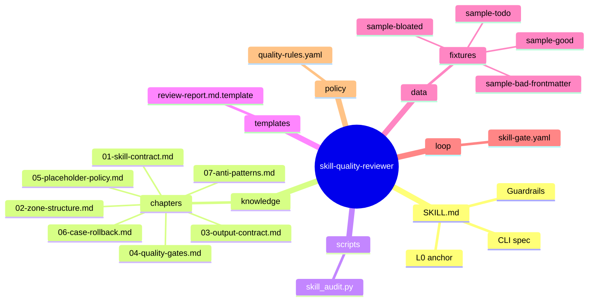
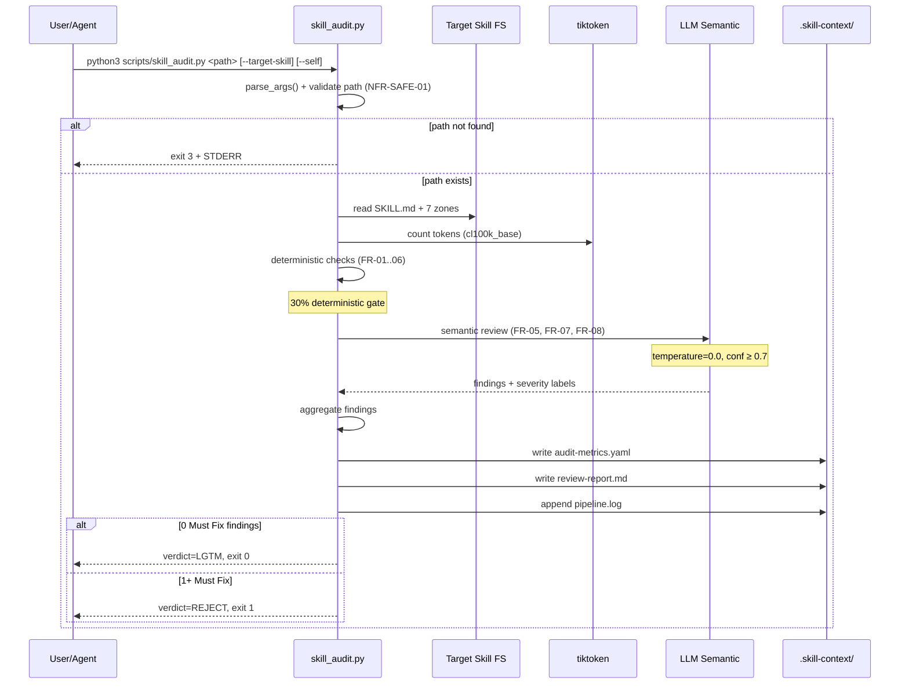
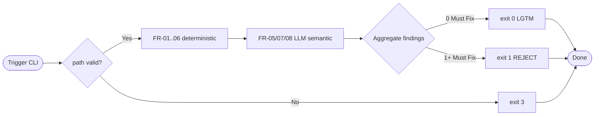

# Design — skill-quality-reviewer

> Generated by skill-architect-agent | 2026-06-18
> Status: GREEN — DESIGN COMPLETED
> Pipeline position: Stage 3.5 (Skill Reviewer, thay thế production-code-reviewer)

---

## 1. Problem Statement [TỪ BA §1 + HANDBOOK §1.1]

**Vấn đề (Pain Point)**: WASHVN Master Skill Suite có 11+ skill vật lý, mỗi skill phải tuân thủ chuẩn 7-Zone + 8-key frontmatter + L0 anchor 700 tokens + DRC schema + PD Tier 1-4. Reviewer hiện tại `production-code-reviewer` chỉ review Python code, KHÔNG review được Skill package (markdown + yaml). Mỗi lần Stage 3 (Builder) xong phải review thủ công → tốn effort, dễ sót violations, không reproducible.

**Người dùng (User)**: 
- AI Agent (Stage 3.5 self-check + Stage 4 sandbox trigger) [TỪ BA §1.2]
- Developer (Steve) khi audit skill mới trước khi sync ra `.claude/skills/` [TỪ HANDBOOK §1.2]

**Expected Output**: 
- `review-report.md` (4 severity labels: Must Fix / Optional / FYI / Nit) [TỪ BA FR-08 + HANDBOOK §3.2]
- `audit-metrics.yaml` (deterministic scores cho từng AC) [TỪ BA FR-09]
- `pipeline.log` (append) [TỪ BA FR-11]

**Lý do cần skill (Why)**:
- Tự động hoá 70% verification bằng deterministic script + 30% semantic LLM review [TỪ BA NFR-DETERM-01]
- Bắt buộc cho mọi skill mới trước khi registry vào `skills-registry.json` [TỪ HANDBOOK §6.7]
- Cung cấp reproducible audit trail cho CASE rollback decisions [TỪ HANDBOOK §7.7]

**Trigger Keywords**: "review skill", "audit skill", "skill quality", "check 7-zone", "validate frontmatter", "scan placeholders" [SUY LUẬN từ BA FR list]

---

## 2. Capability Map

### 2.1 Tri thức (Knowledge — Pillar 1) [TỪ HANDBOOK §5]

| # | Knowledge | Source | Format |
|---|-----------|--------|--------|
| K1 | 7-Zone structure (Core/Knowledge/Scripts/Templates/Data/Loop/Policy; Assets optional) | `raw/ver-3/_shared/knowledge/framework.md §1` | Markdown |
| K2 | SKILL.md contract (8 required frontmatter keys, L0 anchor ≤ 700 tokens) | `raw/ver-3/_shared/rules/suite-rules.md` + `CLAUDE.md §10` | Markdown |
| K3 | DRC (Dynamic Routing Contract) schema | `raw/ver-3/_shared/rules/suite-rules.md §54` + `standards.md §3.2` | YAML |
| K4 | Placeholder detection patterns (TODO/FIXME/XXX/TBD/pass/mock/NotImplementedError) | `raw/ver-3/_shared/knowledge/placeholder-policy.md §2.3` | YAML regex list |
| K5 | Progressive Disclosure Tier 1-4 semantics | `framework.md §4` + observed `ver-0.0.2/SKILL.md routing` | Markdown |
| K6 | Severity labels (Must Fix/Optional/FYI/Nit) | `raw/ver-3/production-code-reviewer/policy/review-rules.yaml §9-21` | YAML |
| K7 | Token counting (tiktoken cl100k_base) | `format-standards.md §4` | Python |
| K8 | WASHVN anti-patterns (10 observed violations) | `HANDBOOK Appendix A` | Markdown |

### 2.2 Quy trình (Process — Pillar 2) [TỪ BA §1 + HANDBOOK §7.5]

```yaml
process:
  deterministic_phase:
    weight: 30%
    steps:
      - "Step 1: Parse YAML frontmatter (FR-01) — pyyaml ≥ 6.0"
      - "Step 2: Count tokens SKILL.md via tiktoken (FR-02)"
      - "Step 3: Detect 7-Zone presence (FR-03) — pathlib"
      - "Step 4: Scan placeholder regex trong scripts/*.py (FR-04)"
      - "Step 5: Validate DRC schema (FR-06) — pyyaml.safe_load"
    output: "audit-metrics.yaml (deterministic part)"
    
  semantic_phase:
    weight: 70%
    steps:
      - "Step 6: LLM review với temperature=0.0 (FR-05, FR-07, FR-08)"
      - "Step 7: Build review-report.md from findings"
      - "Step 8: Append pipeline.log"
    output: "review-report.md (semantic labels)"
    
  exit_codes:
    0: "LGTM — no Must Fix findings"
    1: "REJECT — 1+ Must Fix findings"
    3: "ERROR — target path not found (NFR-SAFE-01)"
```

### 2.3 Kiểm soát (Guardrails — Pillar 3) [TỪ HANDBOOK §7.4-§7.7]

```yaml
guardrails:
  G1_safety:
    must: "Read-only on target_path (NFR-SAFE-01: 0 side-effects)"
    enforcement: "No file write to target_path; chỉ write vào .skill-context/"
  
  G2_self_loop:
    must: "Hardcode skip self-path unless --self flag (RISK-03)"
  
  G3_archive:
    must: "Archive production-code-reviewer (31 files) trước khi xóa (RISK-05)"
  
  G4_call_site:
    must: "Update Stage 3.5 call site từ production-code-reviewer → skill-quality-reviewer (RISK-06)"
  
  G5_tokenizer:
    must: "tiktoken cl100k_base + char/3 fallback cho VI (RISK-02)"
```

---

## 3. Zone Mapping [TỪ HANDBOOK §1.4 + BA §1.4]

> Contract Section — Planner đọc §3 để decompose thành Tasks.
> Mọi Zone PHẢI có tên file cụ thể (G4 compliance, không placeholder).

| Zone | Files cần tạo | Nội dung | Bắt buộc? |
|------|--------------|----------|-----------|
| Core (SKILL.md) | `SKILL.md` | L0 anchor, persona, CLI, guardrails | ✅ |
| Knowledge | `knowledge/chapters/01-skill-contract.md` | FR-01: 8-key frontmatter spec | ✅ |
| Knowledge | `knowledge/chapters/02-zone-structure.md` | FR-03: 7-Zone detection rules | ✅ |
| Knowledge | `knowledge/chapters/03-output-contract.md` | FR-06: DRC schema | ✅ |
| Knowledge | `knowledge/chapters/04-quality-gates.md` | 20-point quality gates + acceptance matrix | ✅ |
| Knowledge | `knowledge/chapters/05-placeholder-policy.md` | FR-04: placeholder regex + severity | ✅ |
| Knowledge | `knowledge/chapters/06-case-rollback.md` | Confidence < 0.7 → REJECT | ✅ |
| Knowledge | `knowledge/chapters/07-anti-patterns.md` | 10 WASHVN anti-patterns | ✅ |
| Scripts | `scripts/skill_audit.py` | Single-file orchestrator (~150 LOC) | ✅ |
| Templates | `templates/review-report.md.template` | Markdown skeleton with 4 severity labels | ✅ |
| Data | `data/fixtures/sample-good/` | Fixture: skill đầy đủ 7 zones, đạt LGTM | ✅ |
| Data | `data/fixtures/sample-bad-frontmatter/` | Fixture: thiếu version + suite → REJECT | ✅ |
| Data | `data/fixtures/sample-bloated/` | Fixture: SKILL.md > 700 tokens | ✅ |
| Data | `data/fixtures/sample-todo/` | Fixture: scripts/ chứa TODO | ✅ |
| Loop | `loop/skill-gate.yaml` | Selftest gate, AC-01 verifier | ✅ |
| Policy | `policy/quality-rules.yaml` | Severity assignment cho từng finding | SHOULD |
| Assets | Không cần | N/A (v1 scope, optional) | ❌ |

> **Lưu ý 7 vs 8 zones**: Theo [HANDBOOK §9.1 Gap #3] — check 7 zones (Assets optional). Policy zone bonus Optional. Decision đã chốt trong BA Gap #3.

---

## 4. Folder Structure [TỪ §3 Zone Mapping]



---

## 5. Execution Flow [TỪ §2.2 + HANDBOOK §7.5]





---

## 6. Interaction Points [SUY LUẬN từ BA risk matrix]

| # | Thời điểm | Lý do dừng | Hành động của AI |
|---|-----------|-----------|-----------------|
| 1 | Khi confidence LLM < 0.7 | Semantic uncertainty (NFR-DETERM-02) | Ghi finding "Confidence too low, manual review required" — không auto-REJECT |
| 2 | Khi target_path nằm ngoài `raw/ver-3/` hoặc `skills/` | An toàn — tránh scan nhầm system dirs | In warning + ask confirm trước khi continue |
| 3 | Khi phát hiện disable-model-invocation: false cho pipeline skill | Security risk [TỪ HANDBOOK §5.3] | Must Fix severity — recommend set true |

---

## 7. Progressive Disclosure Plan [TỪ HANDBOOK §5.4 + BA FR-07]

```yaml
tier1_mandatory:
  - SKILL.md                                    # Persona + CLI + guardrails
  - templates/review-report.md.template         # Output skeleton
  - policy/quality-rules.yaml                   # Severity assignment
  
tier2_conditional:
  - knowledge/chapters/01-skill-contract.md     # WHEN: frontmatter check
  - knowledge/chapters/02-zone-structure.md     # WHEN: zone detection
  - knowledge/chapters/04-quality-gates.md      # WHEN: gate verification
  - knowledge/chapters/05-placeholder-policy.md # WHEN: placeholder scan
  
tier3_on_demand:
  - knowledge/chapters/03-output-contract.md    # WHEN: DRC validation
  - knowledge/chapters/06-case-rollback.md      # WHEN: confidence rollback
  - knowledge/chapters/07-anti-patterns.md      # WHEN: heuristic pattern matching
  - loop/skill-gate.yaml                        # WHEN: selftest mode (AC-01)
```

---

## 8. Risks & Blind Spots [TỪ BA §5 Risk Matrix + HANDBOOK §7]

| # | Risk | Severity | Mitigation | Trace |
|---|------|----------|------------|-------|
| R1 | Stage 3.5 call site chưa update từ production-code-reviewer → skill-quality-reviewer | P0 | Grep `.claude/skills/*/SKILL.md` cho tên cũ; update trong cùng PR; smoke test e2e [TỪ BA RISK-06] | [TỪ BA §5] |
| R2 | LLM verdict variance (semantic 70% part) | P1 | temperature=0.0, prompt template versioned, confidence ≥ 0.7 gate [TỪ BA RISK-01] | [TỪ BA §5] |
| R3 | 7 vs 8 zones confusion | P1 | Document rõ 7 zones; Assets optional, Policy bonus Optional [TỪ BA RISK-04] | [TỪ BA §5] |
| R4 | Self-review infinite loop | P1 | Hardcode skip self-path unless `--self` flag [TỪ BA RISK-03] | [TỪ BA §5] |
| R5 | Archive thiếu files skill cũ (31 files) | P1 | `cp -r` + verify file count = 31 trước khi delete [TỪ BA RISK-05] | [TỪ BA §5] |
| R6 | Token heuristic sai cho VI có dấu | P2 | tiktoken cl100k_base + char/3 fallback [TỪ BA RISK-02] | [TỪ BA §5] |
| R7 | PyYAML version mismatch | P2 | Pin `pyyaml>=6.0`, test 3.10/3.12/3.14 [TỪ BA RISK-07] | [TỪ BA §5] |

---

## 9. Open Questions [TỪ HANDBOOK §9]

| # | Câu hỏi | Nguồn | Trạng thái |
|---|---------|-------|-----------|
| 1 | Default token budget 700 (BA) hay 600 (skill-architect)? [TỪ HANDBOOK §9.2] | HANDBOOK §9.2 | ✅ Đã chốt 700 theo BA |
| 2 | Placeholder threshold: 0 (RFC) hay <5% (BLD-03)? [TỪ HANDBOOK §9.3] | HANDBOOK §9.3 | ✅ Đã chốt detection-only, severity scale theo context |
| 3 | Archive path: `.skill-context/_archive/` hay `_subagent-staging/`? [TỪ HANDBOOK §9.5] | HANDBOOK §9.5 | ❓ CẦN LÀM RÕ từ Steve |
| 4 | Frontmatter check 8 keys (BA) hay 10+ keys (HANDBOOK §9.6)? [TỪ HANDBOOK §9.6] | HANDBOOK §9.6 | ✅ Đã chốt 8 + bonus cho disable-model-invocation, user-invocable |
| 5 | Có cần tạo `_shared/schemas/drc.schema.yaml`? [TỪ HANDBOOK §9.9] | HANDBOOK §9.9 | ❓ CẦN LÀM RÕ — out of scope v1 |
| 6 | Script stdout khi selftest nên in tiếng Việt hay tiếng Anh? | User preference | ❓ CẦN LÀM RÕ |
| 7 | Self-test AC-05: có cần test token < 700 VÀ frontmatter hợp lệ không? | BA §AC-05 | ✅ Cả hai, exit 0 |
| 8 | LLM reviewer có cần cache knowledge chapters không? | Performance | ❓ CẦN LÀM RÕ |
| 9 | Ver-0.0.1 vs ver-0.0.2 SKILL.md standard conflict | HANDBOOK §5.3 | ✅ Ver-0.0.2 = chuẩn mới, ưu tiên |

---

## 10. Metadata

```yaml
skill_name: skill-quality-reviewer
version: 0.0.1
suite: WASHVN
created: 2026-06-18T12:30:00Z
author: skill-architect-agent
framework: skill-architect v3.0 + production-quality-gatekeeper
status: GREEN — DESIGN COMPLETED
renamed_from: production-code-reviewer
pipeline_position: Stage 3.5
target_runtime: raw/ver-3/skill-quality-reviewer/ (sync to .claude/skills/ + .agents/skills/ sau Stage 4)
handoff_checklist:
  - [x] design.md hoàn thiện (10/10 sections)
  - [x] Quality Matrix đã ghi (6 dimensions, 7 ACs)
  - [x] Migration plan từ production-code-reviewer (Step 1-5)
  - [x] Open Questions được flag (3 cần Steve confirm)
  - [ ] Sẵn sàng cho Stage 2 (Planner) — sau khi user xác nhận design

version: 0.0.1
dependencies:
  python: ">= 3.10"
  external:
    - "pyyaml >= 6.0"
    - "tiktoken (cl100k_base)"

exit_codes:
  0: LGTM (no Must Fix)
  1: REJECT (1+ Must Fix)
  3: ERROR (path not found)
```

---

## 11. Migration Plan (rename production-code-reviewer → skill-quality-reviewer) [TỪ user decision]

```bash
# Step 1: Archive skill cũ (production-code-reviewer) — 31 files
mkdir -p .skill-context/_archive/production-code-reviewer-2026-06-18
cp -r skills/ver-0.0.2/production-code-reviewer .skill-context/_archive/production-code-reviewer-2026-06-18/
cp -r raw/ver-3/production-code-reviewer .skill-context/_archive/production-code-reviewer-2026-06-18-raw/
# Verify count = 31 trước khi delete [RISK-05 mitigation]

# Step 2: Xóa skill cũ (sau verify)
rm -rf skills/ver-0.0.2/production-code-reviewer
rm -rf raw/ver-3/production-code-reviewer

# Step 3: Tạo skill mới tại raw/ver-3/skill-quality-reviewer/
# (sau khi Stage 3 build xong, sync sang skills/ver-0.0.2/)
# cp -r raw/ver-3/skill-quality-reviewer skills/ver-0.0.2/

# Step 4: Update registry
# - Xóa production-code-reviewer khỏi skills-registry.json
# - Thêm skill-quality-reviewer vào skills-registry.json

# Step 5: Update workspce_tree.md (Stage 3.5 row)
# Stage 3.5 | raw/ver-3/skill-quality-reviewer/ | SKILL.md | Review Skill package

# Step 6: Grep call sites cập nhật
# grep -r "production-code-reviewer" .claude/ .agents/ raw/ver-3/_shared/
# → replace all → skill-quality-reviewer
```

---

## 12. References [TỪ HANDBOOK §8.1]

```yaml
sources:
  primary:
    - path: ".skill-context/skill-quality-reviewer/ba-report.md"
      use: "FR + NFR + AC + Risk matrix"
    - path: ".skill-context/skill-quality-reviewer/domain-handbook.md"
      use: "Glossary, conventions, citation map"
  
  secondary:
    - path: "raw/ver-3/_shared/knowledge/framework.md"
      sections: ["§1 Zones", "§4 PD", "§6 Naming"]
    - path: "raw/ver-3/_shared/rules/suite-rules.md"
      sections: ["frontmatter", "DRC", "priority hierarchy"]
    - path: "raw/ver-3/_shared/knowledge/placeholder-policy.md"
      sections: ["§2.3 detection patterns"]
    - path: "raw/ver-3/production-code-reviewer/policy/review-rules.yaml"
      sections: ["§9-21 severity labels"]
    - path: "raw/ver-3/_shared/knowledge/format-standards.md"
      sections: ["§4 token budget", "§5 trace tags"]
  
  legacy_archived:
    - path: "skills/ver-0.0.2/production-code-reviewer/"
      status: "Archived to .skill-context/_archive/production-code-reviewer-2026-06-18/"
    - path: "raw/ver-3/production-code-reviewer/"
      status: "Archived to .skill-context/_archive/production-code-reviewer-2026-06-18-raw/"
```

---

*End of design.md. Handoff to Stage 1.5 (Quality Gatekeeper) → Stage 2 (Planner).*
