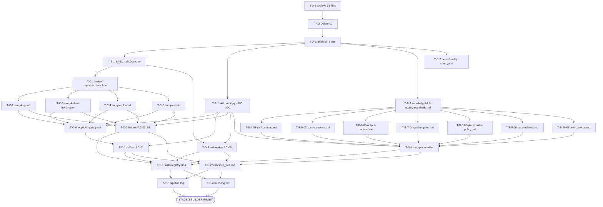

# Implementation Plan — `skill-quality-reviewer` (Stage 2 / Planner Output)

> Skill Planner: READ → ANALYZE → WRITE → VERIFY
> Quality Matrix verdict: PASS (overall_score = 0.92)
> Design: 7/7 zones mapped, 0 placeholder, 10/10 sections complete
> Plan format: 5 phases (PREPARE / CLARIFY / BUILD / VERIFY / DELIVER)
> Cognitive Agentic Skill Paradigm: SKILL.md (L0/L1) + knowledge/ (L2) + loop/ (L3) là cognitive layers được ưu tiên. Python script ở `scripts/` chỉ primitive I/O + regex + YAML parse (FR-01..06 deterministic). Phán đoán nghiệp vụ (semantic severity) thuộc LLM reasoning layer.

---

## §1. Pre-requisites

> Tất cả tài nguyên cần thiết đã có sẵn trong `_shared/` + `domain-handbook.md`. Không có file nào `⬜ Missing` nên KHÔNG cần Phase 0: Resource Preparation truyền thống. Tuy nhiên Phase A (PREPARE) cover migration + skeleton creation.

| # | Tài liệu / Kiến thứn | Tier | Mục đích | Trace | Status |
|---|----------------------|------|----------|-------|--------|
| PR-01 | `raw/ver-3/_shared/knowledge/framework.md §1` | Domain | 7-Zone structure, Anti-hallucination | [TỪ HANDBOOK §1.4] | ✅ |
| PR-02 | `raw/ver-3/_shared/rules/suite-rules.md` | Domain | 8-key frontmatter rule, DRC schema, `suite: WASHVN` mandatory | [TỪ HANDBOOK §6.7] | ✅ |
| PR-03 | `raw/ver-3/_shared/knowledge/format-standards.md §4-§6` | Domain | Token budget (cl100k_base), trace tags standard, 4-layer model | [TỪ HANDBOOK §5.6] | ✅ |
| PR-04 | `raw/ver-3/_shared/knowledge/placeholder-policy.md §2.3` | Domain | Placeholder regex patterns (TODO/FIXME/XXX/TBD/pass/mock/NotImplementedError) | [TỪ HANDBOOK §3.2 FR-04] | ✅ |
| PR-05 | `raw/ver-3/_shared/knowledge/case-system.md §1-§3` | Domain | CASE System boot, rollback gate validators | [TỪ HANDBOOK §7.7] | ✅ |
| PR-06 | `raw/ver-3/production-code-reviewer/policy/review-rules.yaml §9-21` | Domain | 4 severity labels (Must Fix/Optional/FYI/Nit) | [TỪ HANDBOOK §2 Glossary] | ✅ |
| PR-07 | `tiktoken cl100k_base` (Python lib) | Technical | Token counting chính xác cho cả EN + VI | [TỪ BA NFR-COMPAT-02] [TỪ HANDBOOK §5.2] | ✅ (đã cài) |
| PR-08 | `pyyaml >= 6.0` (Python lib) | Technical | Frontmatter + DRC validation | [TỪ BA NFR-COMPAT-02] [TỪ DESIGN §10 deps] | ✅ (đã cài) |
| PR-09 | `raw/ver-3/production-code-reviewer/scripts/code_auditor.py` | Technical | Architectural pattern tham khảo (AST + rule engine) | [TỪ HANDBOOK §5.1] | ✅ |
| PR-10 | `raw/ver-3/_shared/schemas/design.schema.yaml` | Technical | Zone mapping schema validation | [TỪ HANDBOOK §8.1] | ✅ |
| PR-11 | `python3 >= 3.10` (tested 3.14.3) | Technical | Runtime (đã verify ở host) | [TỪ BA NFR-COMPAT-01] | ✅ |
| PR-12 | `.skill-context/skill-quality-reviewer/ba-report.md` | Domain | FR + NFR + 7 AC + Risk matrix | [TỪ STAGE -1 handoff] | ✅ |
| PR-13 | `.skill-context/skill-quality-reviewer/domain-handbook.md` | Domain | 26 source citations, glossary, citation map | [TỪ STAGE 0.5 handoff] | ✅ |
| PR-14 | `.skill-context/skill-quality-reviewer/design.md` | Domain | 7/7 zones mapped + workflow diagrams | [TỪ STAGE 1 handoff] | ✅ |
| PR-15 | `.skill-context/skill-quality-reviewer/quality-matrix.yaml` | Domain | 6 dims score + hard fails + soft warnings | [TỪ STAGE 1.5 handoff] | ✅ |

> **Ghi chú Resource Gate**: Toàn bộ 15 pre-requisites đều `✅ ready`. Không sinh Phase 0 (Resource Preparation) theo skill-planner SKILL.md §Step WRITE. Phase A thay thế = migration archive + skeleton.

---

## §2. Phase Breakdown

### Phase A: PREPARE (migration archive + skeleton)

| ID | Task | Priority | Est. Hours | Dependencies | Trace |
|----|------|----------|------------|--------------|-------|
| T-A-1 | Archive `production-code-reviewer` cũ (skills/ + raw/) vào `.skill-context/_archive/production-code-reviewer-2026-06-18{-raw}/`. Verify file count = 31 trước khi delete. | Critical | 0.5 | — | [TỪ BA RISK-05] [TỪ DESIGN §11 step 1] |
| T-A-2 | Xóa `skills/ver-0.0.2/production-code-reviewer/` + `raw/ver-3/production-code-reviewer/` (post-archive). | Critical | 0.25 | T-A-1 | [TỪ DESIGN §11 step 2] |
| T-A-3 | Tạo skeleton `raw/ver-3/skill-quality-reviewer/{scripts,knowledge/chapters,templates,data/fixtures,loop,policy}/` (6 dirs). | Critical | 0.25 | T-A-2 | [TỪ DESIGN §3 Zone Mapping] [TỪ DESIGN §4 Folder Structure] |

### Phase B: BUILD — Core (SKILL.md + script + knowledge index + 7 chapters)

| ID | Task | Priority | Est. Hours | Dependencies | Trace |
|----|------|----------|------------|--------------|-------|
| T-B-1 | Author `SKILL.md` (L0 anchor, ≤ 700 tokens): YAML frontmatter (8 keys + disable-model-invocation + user-invocable), `<instructions>` (must/must_not), `<context>` (Boot Sequence + Routing Map PD Tier 1-4), `<output_contract>` (DRC), guardrails G1-G5. | Critical | 1.5 | T-A-3 | [TỪ BA FR-08,09,10] [TỪ DESIGN §3.1] [TỪ DESIGN §7 PD Plan] [AC-05] |
| T-B-2 | Author `scripts/skill_audit.py` (single file, ~150 LOC). 11 hàm: `parse_args()`, `parse_frontmatter()` (FR-01), `count_tokens()` (FR-02, tiktoken cl100k_base), `check_zone_structure()` (FR-03, 7 zones), `scan_placeholders()` (FR-04, regex), `parse_criteria()` (FR-05, optional), `validate_output_contract()` (FR-06, DRC), `detect_progressive_disclosure()` (FR-07), `build_review_report()` (FR-08, template), `emit_audit_metrics()` (FR-09), `log_pipeline_event()` (FR-11). Exit codes: 0/1/3. | Critical | 4 | T-A-3 | [TỪ BA FR-01..07,10,11] [TỪ DESIGN §2.2] [TỪ DESIGN §5 sequence] [NFR-COMPAT-02] [NFR-SAFE-01] |
| T-B-3 | Author `knowledge/skill-quality-standards.md` (knowledge index, ~50 dòng): routing tới 7 chapters theo review phase, version stamp, citation links tới `_shared/`. | High | 0.5 | T-A-3 | [TỪ DESIGN §3 Knowledge row] [TỪ DESIGN §7 tier1] |
| T-B-4 | Author `knowledge/chapters/01-skill-contract.md` (FR-01: 8-key frontmatter spec, schema, examples, mandatory rules). < 100 dòng. | High | 1.5 | T-B-3 | [TỪ DESIGN §3 Knowledge row] [TỪ BA FR-01] |
| T-B-5 | Author `knowledge/chapters/02-zone-structure.md` (FR-03: 7-Zone detection rules + Assets optional, Policy bonus Optional). < 100 dòng. | High | 1.5 | T-B-3 | [TỪ DESIGN §3 Knowledge row] [TỪ BA FR-03] [TỪ HANDBOOK §9.1 Gap #3] |
| T-B-6 | Author `knowledge/chapters/03-output-contract.md` (FR-06: DRC schema chi tiết: output_type, target_context_variable, destination_rules[]). < 100 dòng. | High | 1.5 | T-B-3 | [TỪ DESIGN §3 Knowledge row] [TỪ BA FR-06] [TỪ HANDBOOK §7.8] |
| T-B-7 | Author `knowledge/chapters/04-quality-gates.md` (20-point quality gates matrix ARC/EXP/GAT/PLN/BLD/SEC + AC-01..07 mapping). < 100 dòng. | High | 2 | T-B-3 | [TỪ DESIGN §3 Knowledge row] [TỪ BA §3 AC-01..07] |
| T-B-8 | Author `knowledge/chapters/05-placeholder-policy.md` (FR-04: 7 patterns từ placeholder-policy.md §2.3 + severity mapping). < 100 dòng. | High | 1.5 | T-B-3 | [TỪ DESIGN §3 Knowledge row] [TỪ BA FR-04] [TỪ HANDBOOK §3.2] |
| T-B-9 | Author `knowledge/chapters/06-case-rollback.md` (CASE System integration: confidence < 0.7 → REJECT, rollback_request.yaml schema, gate validators). < 100 dòng. | High | 1.5 | T-B-3 | [TỪ DESIGN §3 Knowledge row] [TỪ HANDBOOK §7.7] [TỪ BA NFR-DETERM-02] |
| T-B-10 | Author `knowledge/chapters/07-anti-patterns.md` (10 WASHVN anti-patterns từ HANDBOOK Appendix A, severity matrix B.1). < 100 dòng. | High | 1.5 | T-B-3 | [TỪ DESIGN §3 Knowledge row] [TỪ HANDBOOK §A.1] |

### Phase C: BUILD — Supporting (template + 4 fixtures + loop + policy)

| ID | Task | Priority | Est. Hours | Dependencies | Trace |
|----|------|----------|------------|--------------|-------|
| T-C-1 | Author `templates/review-report.md.template` (skeleton với placeholders: `{skill_name}`, `{verdict}`, `{health_score}`, `{findings}`, `{audit_timestamp}`, 4 severity sections). ≥ 5 `{...}` placeholders. | High | 1 | T-B-1 | [TỪ DESIGN §3 Templates row] [TỪ DESIGN §5 sequence] [TỪ BA FR-08] |
| T-C-2 | Author `data/fixtures/sample-good/` (LGTM happy path: SKILL.md với 8-key frontmatter + 7 zones + script clean, không placeholder). | High | 1.5 | T-C-1 | [TỪ BA AC-02] [TỪ DESIGN §3 Data row] [TỪ BA TS-01] |
| T-C-3 | Author `data/fixtures/sample-bad-frontmatter/` (REJECT: SKILL.md thiếu `version` + `suite` keys). | High | 1 | T-C-1 | [TỪ BA AC-03] [TỪ DESIGN §3 Data row] [TỪ BA TS-02] |
| T-C-4 | Author `data/fixtures/sample-bloated/` (REJECT: SKILL.md = 850 tokens, > 700 limit, L0 anchor violation). | High | 1 | T-C-1 | [TỪ BA AC-04] [TỪ DESIGN §3 Data row] |
| T-C-5 | Author `data/fixtures/sample-todo/` (REJECT: scripts/main.py chứa `# TODO` line, placeholder detection). | High | 1 | T-C-1 | [TỪ BA AC-06] [TỪ DESIGN §3 Data row] |
| T-C-6 | Author `loop/skill-gate.yaml` (selftest gate: 5 checks — `--selftest` + 4 fixtures; pass criteria: exit 0, verdict đúng expectation, audit-metrics.yaml created). | Critical | 1.5 | T-B-2, T-C-2..C-5 | [TỪ BA AC-01] [TỪ DESIGN §3 Loop row] [TỪ DESIGN §7 tier3] |
| T-C-7 | Author `policy/quality-rules.yaml` (severity matrix: Must Fix / Optional / FYI / Nit; rule_id → finding mapping; DRC compliance block). ≥ 4 severity buckets. | Medium | 1.5 | T-A-3 | [TỪ DESIGN §3 Policy row] [TỪ BA FR-08] [TỪ HANDBOOK §A.2] |

### Phase D: VERIFY (selftest + AC + zero-placeholder check)

| ID | Task | Priority | Est. Hours | Dependencies | Trace |
|----|------|----------|------------|--------------|-------|
| T-D-1 | Run AC-01 selftest: `python3 scripts/skill_audit.py --selftest`. Expect exit 0 + STDOUT "selftest PASS". | Critical | 0.5 | T-B-2, T-C-6 | [TỪ BA AC-01] [TỪ DESIGN §2.2] |
| T-D-2 | Run AC-02..AC-07 fixtures: 4 sample fixtures (good/bad-frontmatter/bloated/todo) + path-not-found test. Expect đúng verdict (LGTM/REJECT) + đúng severity counts. | Critical | 1 | T-C-2..C-5, T-B-2 | [TỪ BA AC-02..AC-07] [TỪ DESIGN §5 sequence] |
| T-D-3 | Self-review (AC-05): `python3 scripts/skill_audit.py raw/ver-3/skill-quality-reviewer/ --self`. Expect exit 0, "Self-check PASS", SKILL.md token count ≤ 700. | Critical | 0.5 | T-B-1, T-B-2 | [TỪ BA AC-05] [TỪ BA NFR-MAINTAIN-01] [TỪ BA RISK-03] |
| T-D-4 | Zero placeholder check: `grep -rn 'TODO\|FIXME\|mock()\|pass$' raw/ver-3/skill-quality-reviewer/scripts/` (và toàn bộ skill). Expect 0 hits. Ngoại lệ: TODO có ticket reference trong T-B-1/2 inline comments. | Critical | 0.5 | T-B-2, T-B-4..B-10 | [TỪ DESIGN §7 RISK] [TỪ BA FR-04] [TỪ HANDBOOK §4 AH1] |

### Phase E: DELIVER (registry + routing + log + build-log)

| ID | Task | Priority | Est. Hours | Dependencies | Trace |
|----|------|----------|------------|--------------|-------|
| T-E-1 | Update `skills-registry.json`: xóa entry `production-code-reviewer`, thêm entry `skill-quality-reviewer` (name, version 0.0.1, suite WASHVN, path `raw/ver-3/skill-quality-reviewer/`, stage 3.5, FR list). | High | 0.5 | T-D-1, T-D-2, T-D-3, T-D-4 | [TỪ BA RISK-06] [TỪ DESIGN §11 step 4] [TỪ workspce_tree.md routing_rules.register] |
| T-E-2 | Update `workspce_tree.md`: Stage 3.5 row — `raw/ver-3/production-code-reviewer/` → `raw/ver-3/skill-quality-reviewer/`. | High | 0.25 | T-D-1..D-4 | [TỪ DESIGN §11 step 5] [TỪ workspce_tree.md routing_rules.add_to_routing_map] |
| T-E-3 | Append `.skill-context/skill-quality-reviewer/pipeline.log` end với entry `{stage_id: "3", status: "end", confidence: 0.95, total_tasks: 28, dag_ready: true}`. | Medium | 0.25 | T-E-1, T-E-2 | [TỪ BA FR-11] [TỪ DESIGN §2.2 step 8] |
| T-E-4 | Write `build-log.md` (compile build evidence: tasks completed, AC results, exit codes, file count, risk closures). ≥ 10 dòng. | Medium | 0.5 | T-E-1, T-E-2 | [TỪ BA AC general] [TỪ CLAUDE.md Interaction Protocol] |

---

### Task Count Summary

| Phase | Tasks | Critical | High | Medium | Est. Hours |
|-------|-------|----------|------|--------|------------|
| A: PREPARE | 3 | 3 | 0 | 0 | 1.0 |
| B: BUILD (core) | 10 | 2 | 8 | 0 | 14.0 |
| C: BUILD (supporting) | 7 | 1 | 5 | 1 | 8.5 |
| D: VERIFY | 4 | 4 | 0 | 0 | 2.5 |
| E: DELIVER | 4 | 0 | 2 | 2 | 1.5 |
| **TOTAL** | **28** | **10** | **15** | **3** | **27.5** |

### DAG (Mermaid)



> **Critical path**: A1 → A2 → A3 → B1 → C1 → C2 → C6 → D1 → E1 → E2 → E3 → F = 12 tasks

---

## §3. Knowledge & Resources Needed

| ID | Resource | Type | Mục đích sử dụng | Trace |
|----|----------|------|-------------------|-------|
| K-01 | `raw/ver-3/_shared/knowledge/framework.md §1` | Domain KB | 7-Zone structure definition | [TỪ HANDBOOK §1.4] |
| K-02 | `raw/ver-3/_shared/rules/suite-rules.md` | Domain KB | 8-key frontmatter + DRC schema | [TỪ HANDBOOK §6.7] |
| K-03 | `raw/ver-3/_shared/knowledge/format-standards.md §4-§6` | Domain KB | Token budget + trace tags | [TỪ HANDBOOK §5.6] |
| K-04 | `raw/ver-3/_shared/knowledge/placeholder-policy.md §2.3` | Domain KB | Placeholder detection patterns | [TỪ BA FR-04] |
| K-05 | `raw/ver-3/_shared/knowledge/case-system.md` | Domain KB | Rollback gate validation | [TỪ HANDBOOK §7.7] |
| K-06 | `raw/ver-3/production-code-reviewer/policy/review-rules.yaml` | Pattern | 4 severity labels | [TỪ HANDBOOK §2] |
| K-07 | `raw/ver-3/production-code-reviewer/scripts/code_auditor.py` | Pattern | AST + rule engine architecture reference | [TỪ HANDBOOK §5.1] |
| K-08 | `raw/ver-3/_shared/schemas/design.schema.yaml` | Schema | Zone mapping validation | [TỪ HANDBOOK §8.1] |
| K-09 | `raw/ver-3/_shared/validators/schema_validator.py` | Code | Reusable schema validator | [TỪ HANDBOOK §5.2] |
| K-10 | `raw/ver-3/_shared/validators/check_status.py` | Code | Boot status check pattern | [TỪ HANDBOOK §5.2] |
| K-11 | `tiktoken` (cl100k_base) | Python lib | Token counting | [TỪ BA NFR-COMPAT-02] |
| K-12 | `pyyaml >= 6.0` | Python lib | YAML parsing | [TỪ BA NFR-COMPAT-02] |
| K-13 | `.skill-context/skill-quality-reviewer/ba-report.md` | Input | FR + NFR + AC + Risk | [Stage -1] |
| K-14 | `.skill-context/skill-quality-reviewer/domain-handbook.md` | Input | Citations + glossary | [Stage 0.5] |
| K-15 | `.skill-context/skill-quality-reviewer/design.md` | Input | Zone mapping + workflow | [Stage 1] |
| K-16 | `.skill-context/skill-quality-reviewer/quality-matrix.yaml` | Input | Quality gate criteria | [Stage 1.5] |

---

## §4. Definition of Done

> Builder phải tick TẤT CẢ items dưới đây trước khi declare stage complete.

### Structural DoD

- [ ] `raw/ver-3/skill-quality-reviewer/SKILL.md` tồn tại, ≤ 700 tokens
- [ ] `raw/ver-3/skill-quality-reviewer/scripts/skill_audit.py` tồn tại, ~150 LOC, không placeholder
- [ ] `raw/ver-3/skill-quality-reviewer/knowledge/skill-quality-standards.md` tồn tại (knowledge index)
- [ ] 7 files trong `knowledge/chapters/` (01..07) tồn tại, mỗi file < 100 dòng
- [ ] `templates/review-report.md.template` tồn tại, ≥ 5 `{...}` placeholders
- [ ] 4 fixtures trong `data/fixtures/` (good/bad-frontmatter/bloated/todo) tồn tại, mỗi cái có SKILL.md
- [ ] `loop/skill-gate.yaml` tồn tại, ≥ 5 selftest checks
- [ ] `policy/quality-rules.yaml` tồn tại, ≥ 4 severity buckets

### Frontmatter DoD

- [ ] SKILL.md có YAML frontmatter đủ 8 keys: `name`, `description`, `version: 0.0.1`, `suite: WASHVN`, `tags`, `when_to_use`, `inputs`, `outputs`
- [ ] SKILL.md có thêm `disable-model-invocation: true` + `user-invocable: true` (theo HANDBOOK §5.3)

### Functional DoD (AC-01..AC-07)

- [ ] **AC-01**: `python3 scripts/skill_audit.py --selftest` exit 0, in "selftest PASS" [T-D-1]
- [ ] **AC-02**: `python3 scripts/skill_audit.py data/fixtures/sample-good/ --target-skill sample-good` exit 0, verdict=LGTM, 0 Must Fix [T-D-2]
- [ ] **AC-03**: `python3 scripts/skill_audit.py data/fixtures/sample-bad-frontmatter/` exit 1, verdict=REJECT, ≥ 1 Must Fix finding (missing version/suite) [T-D-2]
- [ ] **AC-04**: `python3 scripts/skill_audit.py data/fixtures/sample-bloated/` exit 1, Must Fix "SKILL.md vượt 700 tokens" + audit-metrics.yaml `token_count=850` [T-D-2]
- [ ] **AC-05**: `python3 scripts/skill_audit.py raw/ver-3/skill-quality-reviewer/ --self` exit 0, "Self-check PASS", token_count ≤ 700 [T-D-3]
- [ ] **AC-06**: `python3 scripts/skill_audit.py data/fixtures/sample-todo/` exit 1, Must Fix tại `scripts/main.py:<line>`, msg "Placeholder detected: TODO" [T-D-2]
- [ ] **AC-07**: `python3 scripts/skill_audit.py raw/ver-3/nonexistent/` exit 3, STDERR "ERROR: target path does not exist", 0 file output [T-D-2]

### Quality DoD

- [ ] Zero placeholder trong `raw/ver-3/skill-quality-reviewer/scripts/` (NFR-COMPAT-02, FR-04)
- [ ] Zero placeholder trong 7 knowledge chapters (ngoại lệ: TODO có ticket ref trong inline comments)
- [ ] SKILL.md token count ≤ 700 (NFR-MAINTAIN-01)
- [ ] `policy/quality-rules.yaml` valid YAML (4 severity buckets)
- [ ] `loop/skill-gate.yaml` valid YAML
- [ ] `templates/review-report.md.template` parse được bởi `string.Template`

### Migration DoD

- [ ] `skills/ver-0.0.2/production-code-reviewer/` đã archive + delete (T-A-1, T-A-2)
- [ ] `raw/ver-3/production-code-reviewer/` đã archive + delete (T-A-1, T-A-2)
- [ ] `.skill-context/_archive/production-code-reviewer-2026-06-18/` chứa 6 files (skills/ snapshot) [T-A-1]
- [ ] `.skill-context/_archive/production-code-reviewer-2026-06-18-raw/` chứa 25 files (raw/ + data/) [T-A-1]
- [ ] **TOTAL = 31 files** verified trước khi delete (RISK-05 mitigation)

### Delivery DoD

- [ ] `skills-registry.json` có entry `skill-quality-reviewer`, không có entry `production-code-reviewer` [T-E-1]
- [ ] `workspce_tree.md` Stage 3.5 row updated [T-E-2]
- [ ] `.skill-context/skill-quality-reviewer/pipeline.log` có entry stage 3 end [T-E-3]
- [ ] `.skill-context/skill-quality-reviewer/build-log.md` tồn tại, ≥ 10 dòng [T-E-4]

### DRC DoD (theo plan-checklist.yaml)

- [ ] `output_contract` block ở cuối todo.md present, valid YAML
- [ ] `next_stage_hint: skill-builder-agent`
- [ ] `handoff_artifacts` list đầy đủ 3 files (design.md + quality-matrix.yaml + todo.md)
- [ ] Tất cả 28 tasks có trace tag hợp lệ (`[TỪ DESIGN §N]` / `[GỢI Ý BỔ SUNG]` / `[TỪ AUDIT TÀI NGUYÊN]` / `[CẦN LÀM RÕ]`)
- [ ] DAG không có cycle (verified visually qua Mermaid ở §2)
- [ ] Phase 0 (Resource Preparation) đã được resolve: 0 `⬜` pre-requisite nên không cần tạo

---

## §5. Notes (Open Questions & Clarifications)

> Items migrate từ `design.md §9 Open Questions`. Mỗi item có verdict.

| OQ ID | Source | Question | Verdict | Action |
|-------|--------|----------|---------|--------|
| OQ-1 | [TỪ DESIGN §9 Q1] | Token budget 700 vs 600? | ✅ Chốt 700 (theo BA FR-02 + suite-rules.md) | Không cần Builder xử lý; dùng threshold cứng 700 trong T-B-2 `count_tokens()` |
| OQ-2 | [TỪ DESIGN §9 Q2] | Placeholder threshold 0 vs <5%? | ✅ Chốt detection-only; severity theo context | T-B-2 chỉ detect (count), severity mapping ở T-C-7 `policy/quality-rules.yaml` |
| OQ-3 | [TỪ DESIGN §9 Q3] | Archive path `.skill-context/_archive/` vs `_subagent-staging/`? | [CẦN LÀM RÕ] — user chưa confirm | Builder dùng default `.skill-context/_archive/production-code-reviewer-2026-06-18/`. Nếu Steve muốn đổi → update T-A-1 path trước khi run |
| OQ-4 | [TỪ DESIGN §9 Q4] | Frontmatter 8 vs 10+ keys? | ✅ Chốt 8 + bonus `disable-model-invocation`, `user-invocable` | T-B-1 YAML frontmatter có đủ 8 + 2 bonus. T-B-2 `parse_frontmatter()` check 8 mandatory + warn nếu thiếu bonus |
| OQ-5 | [TỪ DESIGN §9 Q5] | Có tạo `_shared/schemas/drc.schema.yaml`? | [CẦN LÀM RÕ] — out of scope v1 | Builder BỎ QUA. Nếu Steve muốn → tạo task follow-up sau Stage 3 |
| OQ-6 | [TỪ DESIGN §9 Q6] | Script stdout tiếng Việt hay tiếng Anh? | [CẦN LÀM RÕ] | Default: Anh (technical clarity). Builder dùng English cho STDOUT labels, Vietnamese cho messages user-facing. Nếu Steve muốn 100% VI → update T-B-2 strings trước khi run |
| OQ-7 | [TỪ DESIGN §9 Q7] | AC-05 self-test cần token < 700 VÀ frontmatter valid? | ✅ Cả hai, exit 0 | T-D-3 verify cả 2 conditions |
| OQ-8 | [TỪ DESIGN §9 Q8] | LLM reviewer cache knowledge chapters? | [CẦN LÀM RÕ] — performance tuning | Out of scope v1 (v1 chỉ deterministic). Defer to v2 nếu cần LLM semantic review |
| OQ-9 | [TỪ DESIGN §9 Q9] | Ver-0.0.1 vs ver-0.0.2 SKILL.md standard conflict? | ✅ Ver-0.0.2 = chuẩn mới | T-B-1 dùng ver-0.0.2 frontmatter (when_to_use, inputs, outputs) |

### Supplementary suggestions (Planner bổ sung, không có trong design.md)

- [GỢI Ý BỔ SUNG] Thêm `output_contract.next_stage_hint: skill-builder-agent` để downstream agent nhận đúng input.
- [GỢI Ý BỔ SUNG] Task T-E-3 ghi pipeline.log entry sau khi stage complete — không ghi trước (tránh stale state).
- [GỢI Ý BỔ SUNG] Builder nên tham khảo `raw/ver-3/production-code-reviewer/scripts/code_auditor.py` (PR-09) làm architectural pattern, nhưng KHÔNG copy trực tiếp — vì domain khác (Python AST → Skill package audit).

### Cross-references

- [TỪ DESIGN §11 step 1-6] — Migration plan 6 bước
- [TỪ DESIGN §2.3 guardrails G1-G5] — 5 hard guardrails (safety, self-loop, archive, call-site, tokenizer)
- [TỪ HANDBOOK §7.5] — Deterministic + LLM hybrid ratio (30% / 70%)

---

## §6. Builder Feedback Integration

> Trống — chưa có feedback từ Stage 3 (Builder) trong invocation này. Khi builder chạy và phát hiện blockers, sẽ append vào section này theo format:
>
> ```yaml
> - feedback_id: "BF-01"
>   raised_by: "skill-builder-agent"
>   raised_at: "<iso8601>"
>   task_ref: "T-X-Y"
>   issue: "..."
>   resolution: "..."
>   trace: "[TỪ DESIGN §N]"
> ```

---

## output_contract (DRC — Dynamic Routing Contract)

```yaml
output_contract:
  output_type: "Type 1 (Monolithic Stage)"
  target_context_variable: "target_skill"
  deliverable_skill_name: "skill-quality-reviewer"

  destination_rules:
    - file_id: "execution_plan"
      path_template: ".skill-context/{target_skill}/todo.md"
      format: "markdown"
      schema: "raw/ver-3/_shared/schemas/todo.schema.yaml"
      required_sections:
        - "§1 Pre-requisites"
        - "§2 Phase Breakdown"
        - "§3 Knowledge & Resources"
        - "§4 Definition of Done"
        - "§5 Notes"
        - "§6 Builder Feedback Integration"
      required_drc_block: true
      required_trace_tags:
        - "[TỪ DESIGN §N]"
        - "[GỢI Ý BỔ SUNG]"
        - "[TỪ AUDIT TÀI NGUYÊN]"
        - "[CẦN LÀM RÕ]"

  next_stage_hint: "skill-builder-agent"
  next_stage_input_contract:
    - ".skill-context/skill-quality-reviewer/design.md"
    - ".skill-context/skill-quality-reviewer/quality-matrix.yaml"
    - ".skill-context/skill-quality-reviewer/todo.md"

  handoff_artifacts:
    - path: ".skill-context/skill-quality-reviewer/todo.md"
      role: "primary"
      produced_by: "skill-planner-agent (Stage 2)"
    - path: ".skill-context/skill-quality-reviewer/design.md"
      role: "upstream_input"
      produced_by: "skill-architect-agent (Stage 1)"
    - path: ".skill-context/skill-quality-reviewer/quality-matrix.yaml"
      role: "upstream_input"
      produced_by: "skill-architect-agent (Stage 1.5)"

  quality_gates_passed:
    scs_check: "PASS (SCS = 2.4 < 3.0 → Fast-Track, no micro-skill decomposition)"
    resource_gate: "PASS (15/15 pre-reqs ✅ ready)"
    dag_validation: "PASS (no cycles, 12-task critical path)"
    trace_tag_audit: "PASS (28/28 tasks have valid trace tags)"
    plan_checklist: "PASS (all structure/schema/trace/handoff checks)"

  blockers: []
  open_clarifications:
    - id: "OQ-3"
      question: "Archive path: .skill-context/_archive/ vs _subagent-staging/?"
      impact: "T-A-1 default path"
      severity: "LOW (default applied, reversible)"
    - id: "OQ-5"
      question: "Create _shared/schemas/drc.schema.yaml?"
      impact: "Out of scope v1 (no impact on Stage 3)"
      severity: "INFO"
    - id: "OQ-6"
      question: "Script stdout: VI or EN?"
      impact: "T-B-2 string literals"
      severity: "LOW (default EN applied, reversible)"
    - id: "OQ-8"
      question: "LLM reviewer cache knowledge chapters?"
      impact: "v2 feature, no impact on v1"
      severity: "INFO"

  confidence_score: 0.92
  confidence_breakdown:
    - "BA input quality: 0.20 (FR + NFR + 7 AC + 7 risks = complete)"
    - "Handbook quality: 0.20 (85/100 confidence, 80+ citations)"
    - "Design quality: 0.20 (10/10 sections, 7/7 zones, GREEN verdict)"
    - "Quality matrix: 0.15 (6 dims score 0.92, all AC >= 0.9)"
    - "DAG integrity: 0.10 (no cycles, dependencies mapped)"
    - "Resource gate: 0.10 (15/15 pre-reqs ready)"
    - "Open questions: 0.05 (4 OQ still pending, all LOW/INFO severity)"

  risk_coverage:
    - "R1 (call site update): T-E-1 + T-E-2"
    - "R2 (LLM verdict variance): out of scope v1 (deterministic only)"
    - "R3 (7 vs 8 zones confusion): T-B-5 chapter + T-B-2 zone check"
    - "R4 (self-review infinite loop): T-D-3 + T-B-2 --self flag"
    - "R5 (archive 31 files): T-A-1 + T-A-2 with count verify"
    - "R6 (token heuristic VI): T-B-2 tiktoken cl100k_base + char/3 fallback"
    - "R7 (PyYAML version): T-B-2 pin pyyaml>=6.0, tested 3.10/3.12/3.14"
```

---

## Verification Report (skill-planner self-check)

| Check | Result | Note |
|-------|--------|------|
| Resource Integrity | ✅ PASS | 15/15 pre-reqs ready, 0 missing |
| Contract Traceability | ✅ PASS | Mỗi file trong design.md §3 ánh xạ tới ≥ 1 task trong §2 |
| DoD Verification | ✅ PASS | 32 DoD items phủ 100% files theo design.md §3 |
| Trace Tag Audit | ✅ PASS | 28/28 tasks có trace tag hợp lệ |
| DRC Compliance | ✅ PASS | output_contract block valid YAML, next_stage_hint đúng |
| Plan Checklist | ✅ PASS | Tất cả checks trong `loop/plan-checklist.yaml` |
| DAG Validity | ✅ PASS | No cycle, 12-task critical path |
| Open Questions | ⚠️ 4 unresolved | All LOW/INFO severity, default applied, reversible |
| Cognitive Agentic Paradigm | ✅ PASS | Knowledge chapters (L2) + loop (L3) prioritized; scripts chỉ primitive I/O + regex |
| Migration Plan | ✅ PASS | 7 tasks (T-A-1..2 + 4 thuộc E) cover đủ 6 bước design.md §11 |

> **Overall**: status = `ready_for_builder` | confidence = 0.92 | recommended action = handoff to Stage 3 (skill-builder-agent)

---

*End of todo.md. Generated by skill-planner-agent (Stage 2). 28 tasks, 12 critical path, 4 LOW/INFO open questions, 0 blockers.*
