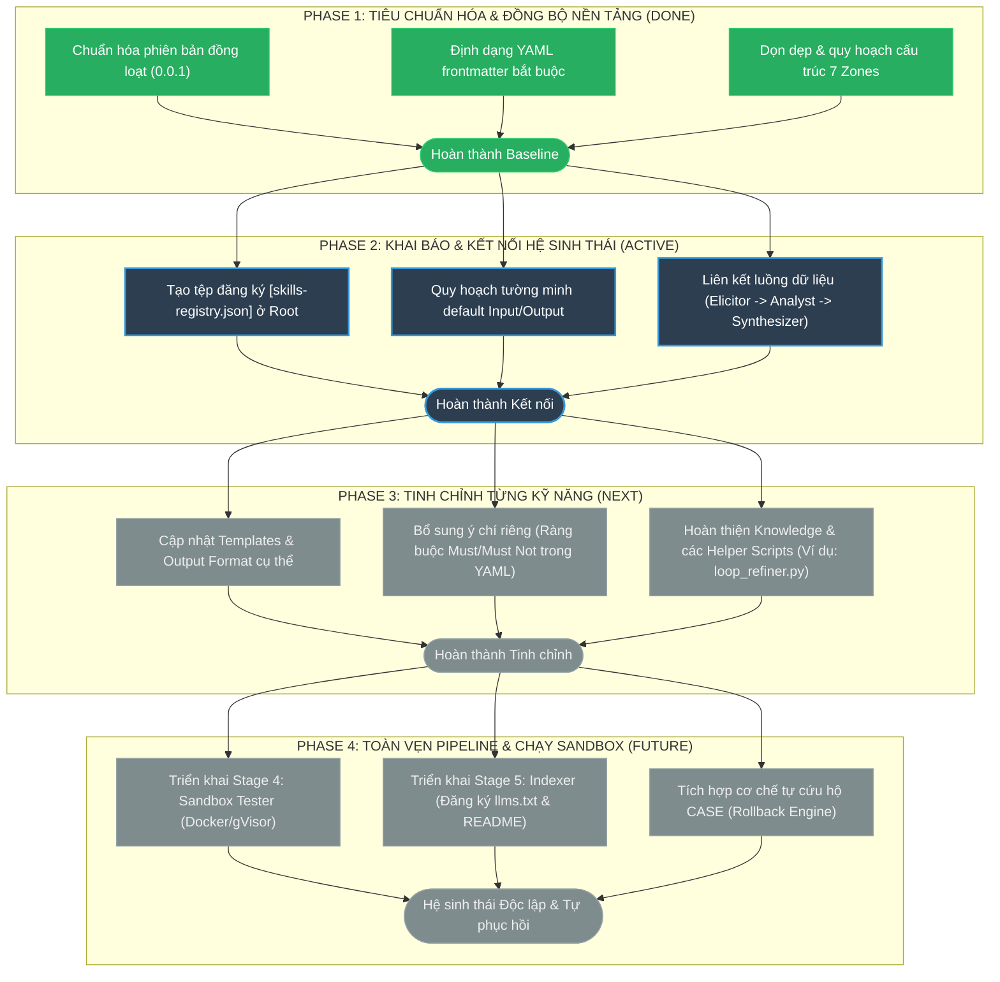

# 🗺️ WASHVN Master Skill Suite Evolution Roadmap

Tài liệu này vạch ra lộ trình (Roadmap) nâng cấp, tiêu chuẩn hóa và kết nối bộ **WASHVN Master Skill Suite** từ phiên bản thô sơ hiện tại (`ver-0.0.1`) để đạt tới mức chất lượng **Production-grade (ver-3.0.0)** với khả năng vận hành tự phục hồi qua hệ thống CASE.

---

## 1. 📊 Sơ đồ Lộ trình Phát triển (Mermaid Roadmap)

---

## 2. 🎯 Chi tiết các Giai đoạn (Roadmap Phases)

### 🟢 Giai đoạn 1: Tiêu chuẩn hóa & Đồng bộ nền tảng
*   **Mục tiêu**: Đảm bảo tất cả các kỹ năng đều chia sẻ chung một "ngôn ngữ định dạng" và cấu trúc vật lý.
*   **Hành động**:
    *   Thiết lập phiên bản baseline đồng loạt là `0.0.1` và định danh bộ suite là `WASHVN`.
    *   Tái cấu trúc thư mục của từng kỹ năng theo đúng chuẩn **7 Zones** (`assets/`, `data/`, `knowledge/`, `loop/`, `policy/`, `scripts/`, `templates/`).
    *   Chạy script [validate_suite_integrity.py](file:///home/steve/Work-space/WASHVN/skills/ver-0.0.1/scripts/validate_suite_integrity.py) để kiểm tra chéo tính toàn vẹn của liên kết.

### 🔵 Giai đoạn 2: Khai báo & Kết nối hệ sinh thái
*   **Mục tiêu**: Giúp AI/LLM và nhà phát triển nắm bắt được bản đồ hoạt động của cả hệ sinh thái mà không cần đọc từng file riêng lẻ.
*   **Hành động**:
    *   Tạo tệp đăng ký tập trung [skills-registry.json](file:///home/steve/Work-space/WASHVN/skills-registry.json) lưu tại root của dự án.
    *   Mô hình hóa chi tiết luồng truyền nhận dữ liệu: đầu ra của kỹ năng này là đầu vào của kỹ năng khác (ví dụ: `ba-elicitor` output chuyển tiếp làm input cho `ba-analyst`).
    *   Thiết lập các biến môi trường động để loại bỏ hoàn toàn các đường dẫn fix cứng (hardcode).

### 🟡 Giai đoạn 3: Tinh chỉnh từng kỹ năng
*   **Mục tiêu**: Nâng cấp chất lượng nghiệp vụ và độ nhạy bén của từng Persona AI trong bộ suite.
*   **Hành động**:
    *   **Templates & Formats**: Thiết kế lại các tệp mẫu (`.template`) để đảm bảo đầu ra cấu trúc hóa cao.
    *   **Ý chí riêng (Willpower)**: Định hình cụ thể các bộ quy tắc `must` và `must_not` trong YAML, giúp AI tự kiểm soát hành vi, phản biện thông minh và chặn các yêu cầu không lượng hóa được.
    *   **Helper Scripts**: Viết mã nguồn cho các validator nội bộ (như `loop_refiner.py` của `production-quality-gatekeeper`) để chạy vòng lặp tự tối ưu hóa.

### 🔴 Giai đoạn 4: Toàn vẹn Pipeline & Chạy Sandbox
*   **Mục tiêu**: Đóng kín quy trình phát triển kỹ năng tự động hoàn toàn không có sự can thiệp thủ công từ con người.
*   **Hành động**:
    *   Xây dựng **Stage 4 (Sandbox Tester)**: Thực thi thử nghiệm thực tế các đoạn mã do Stage 3 viết ra bên trong container Docker biệt lập để phát hiện lỗi runtime trước khi cài đặt.
    *   Xây dựng **Stage 5 (Indexer)**: Tự động cập nhật chỉ mục hệ sinh thái (`llms.txt`, `README.md`).
    *   Kích hoạt cơ chế tự phục hồi **CASE System** để tự động rollback về các Stage trước nếu phát hiện chất lượng đầu ra bị sụt giảm.

---

## 3. 📝 Hướng dẫn Sử dụng Tệp Đăng ký `skills-registry.json`

Tệp [skills-registry.json](file:///home/steve/Work-space/WASHVN/skills-registry.json) ở root đóng vai trò là "Sổ cái cấu trúc" (Ecosystem Registry) của bộ suite. Cả con người và AI có thể sử dụng tệp này để:

1.  **Khám phá Kỹ năng (Skill Discovery)**: Xác định nhanh danh sách các kỹ năng đang khả dụng và vai trò của chúng.
2.  **Định tuyến luồng công việc (Dynamic Routing)**: Lấy mẫu đường dẫn đầu vào (`inputs`) và đường dẫn đầu ra (`outputs`) tương ứng dưới thư mục `.skill-context/` để tự động chuỗi hóa các tác vụ.
3.  **Tự động hóa Đồng bộ (Orchestration & Sync)**: Cung cấp thông tin đường dẫn gốc (`src_path`) để các script tự động sao chép (sync) mã nguồn sang môi trường cài đặt của các IDE Agent (Claude Code hoặc Antigravity).

---

> [!NOTE]
> Lộ trình này là tài liệu sống, sẽ được cập nhật liên tục khi các Stage 4 và Stage 5 chuyển từ trạng thái `planned` sang `built` và `installed`. Tham khảo kiến trúc tổng quan tại [architecture.md](file:///home/steve/Work-space/WASHVN/architecture.md).
