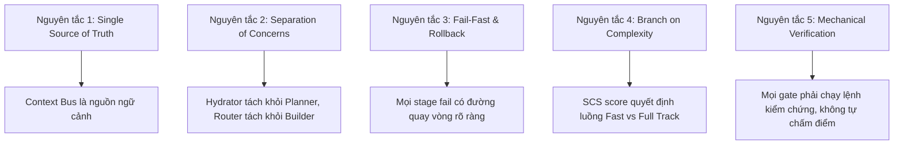
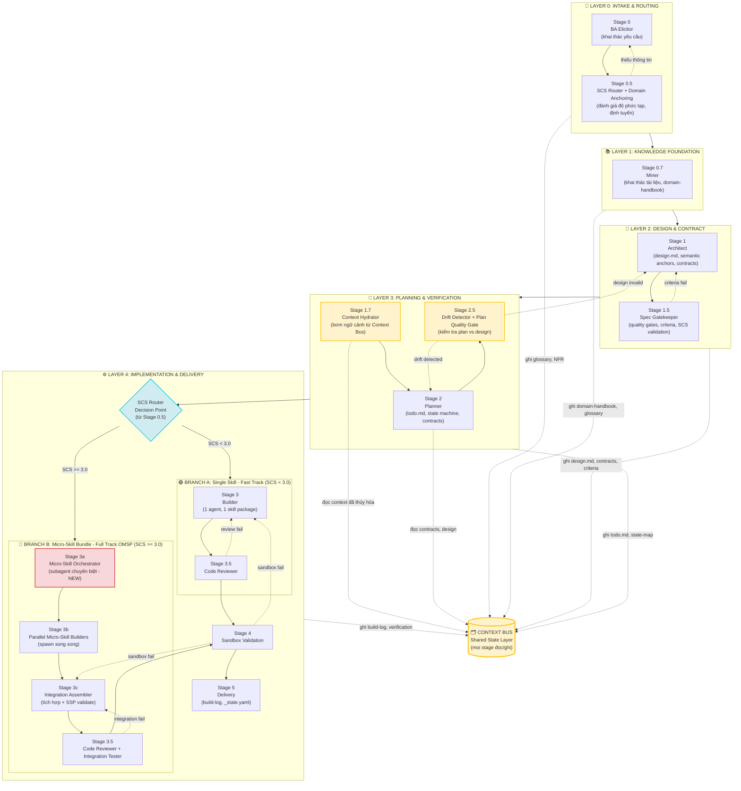
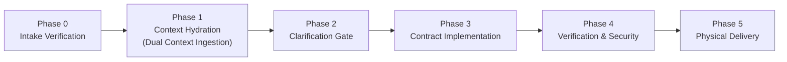
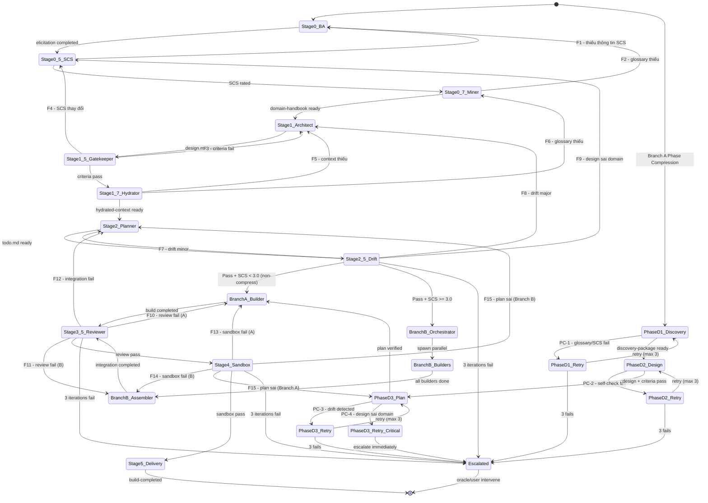
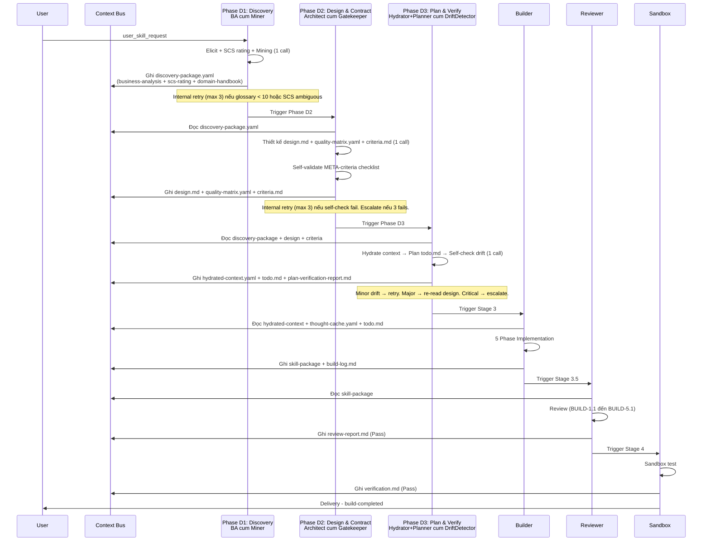
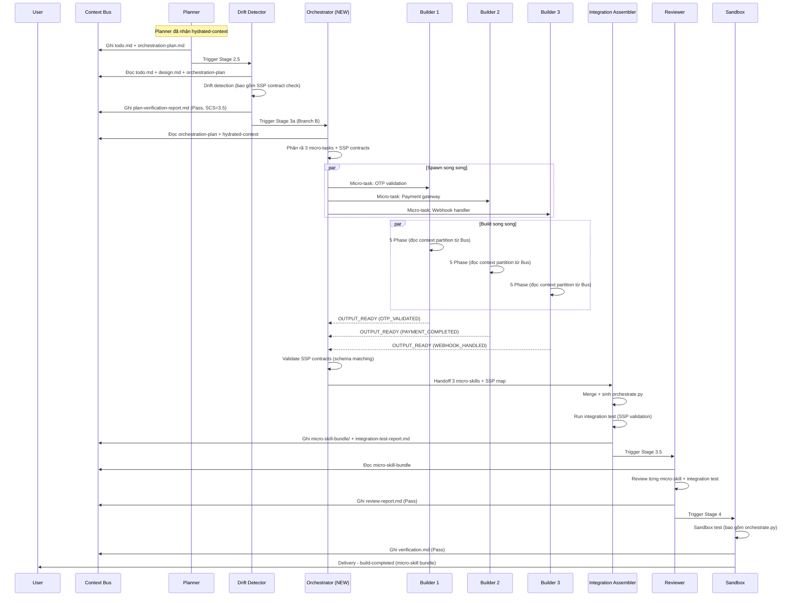
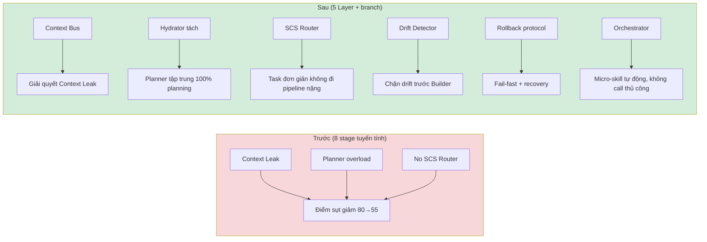

# 🏗️ Tài liệu Thiết kế Kiến trúc Hệ thống Build-Workflow (v2.0)

> [!IMPORTANT]
> Tài liệu này thiết kế lại toàn bộ kiến trúc pipeline build-workflow nhằm giải quyết **3 lỗi cấu trúc cốt lõi** đã được phát hiện: (1) Context Leak do không có Context Bus chung, (2) Planner bị overload do gộp hydration + planning, (3) không có SCS Router khiến task đơn giản đi qua pipeline nặng. Bổ sung **5 thành phần mới** (Context Bus, SCS Router, Context Hydrator, Drift Detector, YAML Resilience Layer), **cơ chế rollback chuẩn** qua `_state.yaml` protocol, và **tách nhánh 2 luồng** Single Skill vs Micro-Skill Bundle với subagent Orchestrator chuyên biệt.

---

## Mục lục

1. [Tổng quan Kiến trúc 5 Layer](#1-tổng-quan-kiến-trúc-5-layer)
2. [Sơ đồ Kiến trúc Tổng thể (Flowchart)](#2-sơ-đồ-kiến-trúc-tổng-thể)
3. [Mô hình Thực thể - Quan hệ (ER Diagram)](#3-mô-hình-thực-thể---quan-hệ-er-diagram)
4. [Chi tiết 5 Layer và các Stage](#4-chi-tiết-5-layer-và-các-stage)
5. [Branch Splitting: 2 Luồng Xây dựng](#5-branch-splitting-2-luồng-xây-dựng)
6. [Đặc tả Micro-Skill Orchestrator Agent (orchestrator-agent-spec.md)](orchestrator-agent-spec.md) (Tập tin tách biệt)
7. [Đặc tả State & Shared Layer (Context Bus, Fallback, _state.yaml) (protocols-and-state-spec.md)](protocols-and-state-spec.md) (Tập tin tách biệt)
8. [Sơ đồ Trạng thái Pipeline (State Diagram)](#10-sơ-đồ-trạng-thái-pipeline-state-diagram)
9. [Sơ đồ Chuỗi thực thi 2 luồng (Sequence Diagram)](#11-sơ-đồ-chuỗi-thực-thi-2-luồng-sequence-diagram)
10. [Ma trận Chốt chặn Chất lượng (Quality Gates Matrix) (quality-gates-matrix.md)](quality-gates-matrix.md) (Tập tin tách biệt)
11. [Phản biện Kiến trúc và Quyết định Thiết kế](#13-phản-biện-kiến-trúc-và-quyết-định-thiết-kế)
12. [Đặc tả Nâng cấp & Di trú (Skill Migration & Refactoring) (skill-migration-spec.md)](skill-migration-spec.md) (Tập tin tách biệt)
13. [Tóm tắt Triển khai](#tóm-tắt-triển-khai)

---

## 1. Tổng quan Kiến trúc 5 Layer

Hệ thống được tái cấu trúc từ 8 stage tuyến tính thành **5 Layer rõ ràng**, mỗi Layer có trách nhiệm độc lập và giao diện hợp đồng (contract) tường minh với Layer liền kề.

| Layer | Tên | Trách nhiệm | Thành phần |
|:---|:---|:---|:---|
| **L0** | Intake & Routing | Tiếp nhận yêu cầu, đánh giá độ phức tạp (SCS), định tuyến luồng | BA Elicitor, SCS Router (tích hợp Spec Gatekeeper), Context Bus init |
| **L1** | Knowledge Foundation | Khai thác tri thức, xây dựng domain-handbook, nạp glossary | Miner, Context Bus hydrate |
| **L2** | Design & Contract | Thiết kế static, semantic anchors, data contracts, quality gates | Architect, Spec Gatekeeper |
| **L3** | Planning & Verification | Thủy hóa ngữ cảnh cho Planner, lập kế hoạch, phát hiện drift | Context Hydrator, Planner, Drift Detector, Plan Quality Gate |
| **L4** | Implementation & Delivery | Branch A (Single Skill) hoặc Branch B (Micro-Skill Bundle) + Review + Sandbox | Builder / Micro-Skill Orchestrator, Code Reviewer, Sandbox |

> [!NOTE]
> **Hỗ trợ Dual-Mode (CREATE / UPDATE / REBUILD):** Hệ thống hỗ trợ song song 3 chế độ vận hành: (1) **CREATE**: Tạo skill mới từ đầu; (2) **UPDATE**: Cập nhật trực tiếp lên skill sẵn có (in-place modification); (3) **REBUILD**: Tái xây dựng lại một skill (nội bộ hoặc bên ngoài) theo chuẩn mới nhưng giữ nguyên ý chí thiết kế cũ.

> [!NOTE]
> **Phase Compression Mode (Branch A — Fast Track):** Trong Branch A (SCS < 3.0), 8 stages tuyến tính L0-L3 được gộp thành **3 phases** — mỗi phase là một agent combined role chạy trong một LLM call duy nhất:
> - **Phase D1 (Discovery):** BA cum Miner — gộp S0 (BA) + S0.5 (SCS) + S0.7 (Miner) → `discovery-package.yaml`
> - **Phase D2 (Design & Contract):** Architect cum Gatekeeper — gộp S1 (Architect) + S1.5 (Gatekeeper) → `design.md` + `quality-matrix.yaml` + `criteria.md`
> - **Phase D3 (Plan & Verify):** Hydrator+Planner cum DriftDetector — gộp S1.7 (Hydrator) + S2 (Planner) + S2.5 (Drift Detector) → `hydrated-context.yaml` + `todo.md` + `plan-verification-report.md`
>
> **Giảm LLM calls pre-Builder từ 8 → 3 (↓62.5%).** Số artifact GIỮ NGUYÊN (9 files). META-criteria chuyển từ external gate → self-applied checklist trong phase. Branch B giữ nguyên 13-stage pipeline. Xem `supplements/phase-compression-spec.md`.
>
> **KHÔNG áp dụng cho Branch B (Full Track OMSP).**

### Nguyên tắc thiết kế cốt lõi



---

## 2. Sơ đồ Kiến trúc Tổng thể



> [!NOTE]
> **Phase Compression Mode cho Branch A:** Trong Fast Track (SCS < 3.0), 8 stages L0-L3 được gộp thành 3 phases giải quyết over-engineering pipeline cho task đơn giản. Thay vì 8 LLM calls tuần tự (S0→S05→S07→S1→S15→S17→S2→S25), Branch A đi qua **3 Phase**:
> - **Phase D1** (Discovery) = S0 + S0.5 + S0.7 — 1 call
> - **Phase D2** (Design & Contract) = S1 + S1.5 — 1 call
> - **Phase D3** (Plan & Verify) = S1.7 + S2 + S2.5 — 1 call
>
> Mỗi phase có internal retry loop (max 3 iterations). Nếu 3 lần fail → escalate. Số artifact pipeline GIỮ NGUYÊN. META-criteria chuyển từ external gate → self-applied checklist. Branch B giữ nguyên 13-stage pipeline. Xem `supplements/phase-compression-spec.md`.

---

## 3. Mô hình Thực thể - Quan hệ (ER Diagram)

Sơ đồ ER dưới đây mô tả các artifact (file đầu ra) và quan hệ giữa chúng trong toàn pipeline.

```mermaid
erDiagram
    %% ===== INPUT ENTITIES =====
    USER_REQUEST ||--o{ BUSINESS_ANALYSIS : "sinh ra"
    BUSINESS_ANALYSIS ||--|| DOMAIN_HANDBOOK : "anchor bởi"
    
    %% ===== CONTEXT BUS =====
    CONTEXT_BUS ||--|| BUSINESS_ANALYSIS : "chứa ref"
    CONTEXT_BUS ||--|| DOMAIN_HANDBOOK : "chứa ref"
    CONTEXT_BUS ||--|| DESIGN_MD : "chứa ref"
    CONTEXT_BUS ||--|| QUALITY_MATRIX : "chứa ref"
    CONTEXT_BUS ||--|| TODO_MD : "chứa ref"
    CONTEXT_BUS ||--|| STATE_YAML : "track bởi"
    
    %% ===== DESIGN LAYER =====
    DESIGN_MD ||--|| QUALITY_MATRIX : "validated bởi"
    DESIGN_MD ||--o{ ZONE_MAP : "định nghĩa"
    DESIGN_MD ||--o{ DATA_CONTRACT : "định nghĩa"
    
    %% ===== PLANNING LAYER =====
    TODO_MD ||--o{ TASK : "chứa"
    TASK ||--|| DATA_CONTRACT : "tuân thủ"
    TASK ||--o{ MUST_NOT : "ràng buộc"
    TASK ||--|| VERIFICATION_CMD : "kiểm chứng bởi"
    
    %% ===== IMPLEMENTATION LAYER =====
    TODO_MD ||--o{ SKILL_PACKAGE : "sinh ra"
    SKILL_PACKAGE ||--|| SKILL_MD : "chứa L0-L1"
    SKILL_PACKAGE ||--o{ KNOWLEDGE_FILE : "chứa L2"
    SKILL_PACKAGE ||--o{ LOOP_CHECKLIST : "chứa L3"
    SKILL_PACKAGE ||--o{ SCRIPT_FILE : "chứa I/O utility"
    
    %% ===== MICRO-SKILL BUNDLE =====
    MICRO_SKILL_BUNDLE ||--o{ MICRO_SKILL : "chứa"
    MICRO_SKILL ||--|| SKILL_PACKAGE : "là một"
    MICRO_SKILL_BUNDLE ||--|| ORCHESTRATE_PY : "điều phối bởi"
    MICRO_SKILL_BUNDLE ||--|| SSP_CONTRACT : "giao tiếp qua"
    
    %% ===== VERIFICATION =====
    SKILL_PACKAGE ||--o| VERIFICATION_MD : "chứng minh bởi"
    SKILL_PACKAGE ||--o| SECURITY_REPORT : "audit bởi"
    SKILL_PACKAGE ||--o| BUILD_LOG : "ghi nhận bởi"
    SKILL_PACKAGE ||--o| REVIEW_REPORT : "review bởi"

    USER_REQUEST {
        string raw_text
        string domain_hint
    }
    BUSINESS_ANALYSIS {
        string domain_identified
        string[] glossary "10+ thuật ngữ"
        string[] nfr "Non-Functional Requirements"
        string[] stakeholders
        string[] edge_cases
    }
    DOMAIN_HANDBOOK {
        string[] keyword_triggers
        string[] anti_patterns
        string[] edge_case_repository
        string[] structural_exemplars
    }
    CONTEXT_BUS {
        string bus_id
        string pipeline_run_id
        string current_stage
        dict hydrated_context "glossary+NFR+design+contracts"
        string[] artifact_refs
        timestamp last_updated
    }
    DESIGN_MD {
        string semantic_anchors
        dict zone_mapping "§3"
        dict[] data_contracts
        string[] guardrails
        string[] clarifications
    }
    QUALITY_MATRIX {
        string scs_score "1.0-5.0"
        string mode "Fast-Track hoặc Full-Track"
        dict[] phases
        dict[] acceptance_criteria
    }
    TODO_MD {
        string[] task_ids
        dict[] state_transitions
        string back_link "design.md §3"
    }
    STATE_YAML {
        string current_stage
        string status
        int iteration_count
        dict[] fallback_history
        string context_bus_ref
    }
    SKILL_MD {
        string persona
        string[] must_rules
        string[] must_not_rules
        int token_budget "<= 700"
    }
    ORCHESTRATE_PY {
        string ssp_protocol
        dict[] micro_skill_routes
        string state_machine
    }
    SSP_CONTRACT {
        string signal_type
        dict input_schema
        dict output_schema
        string state_transition
    }
```



---

## 4. Chi tiết 5 Layer và các Stage

### Layer 0: Intake & Routing

#### Stage 0 - BA Elicitor

**Trách nhiệm:** Khai thác yêu cầu thô từ người dùng, xác định domain, liệt kê glossary, NFR, stakeholders, edge cases.

**Input:** `user_skill_request` (raw text)

**Output:** `business-analysis.md` (ghi vào Context Bus)

**Tiêu chí (từ `temps.md`):**
- Domain Ontology Awareness: xác định domain + 10+ glossary
- Stakeholder Empathy & Role Defining
- Edge-Case & Constraint Probing (Reverse Questioning 4 khía cạnh)
- Data-Driven & Quantifiable (NFR gắn metric)

**Fallback:** Nếu SCS Router (Stage 0.5) phát hiện thiếu thông tin → quay về Stage 0 để bổ sung elicitation.

#### Stage 0.5 - SCS Router + Domain Anchoring (TÍCH HỢP vào Spec Gatekeeper)

> [!NOTE]
> **Quyết định thiết kế quan trọng:** Theo phản biện của user, SCS Router KHÔNG phải là component riêng mà được **tích hợp vào Spec Gatekeeper (Stage 1.5)**. Tuy nhiên, để đảm bảo định tuyến sớm (trước khi Architect làm việc), SCS evaluation được thực hiện tại **Stage 0.5** như một pre-pass của Gatekeeper. Spec Gatekeeper chính thức (Stage 1.5) sẽ validate lại SCS score và sinh quality gates.

**Trách nhiệm:**
1. Đọc `business-analysis.md` từ Context Bus
2. Đánh giá **SCS (Skill Complexity Score) 1.0-5.0**
3. Định tuyến: SCS < 3.0 → Fast Track | SCS >= 3.0 → Full Track OMSP
4. Khởi tạo Context Bus session

**Output:** `scs-rating.yaml` (ghi vào Context Bus)

```yaml
scs_evaluation:
  score: 3.5
  mode: "Full-Track OMSP"
  rationale: "Tính năng auth + payment + 3 micro-skills cần thiết"
  routing_decision: "branch_b_micro_skill"
  context_bus_id: "cb_20260625_001"
```

**Fallback:** Nếu không đủ thông tin để đánh giá SCS → quay về Stage 0.

---

### Layer 1: Knowledge Foundation

#### Stage 0.7 - Miner

**Trách nhiệm:** Khai thác tài liệu tri thức, xây dựng `domain-handbook.md` với 4 thành phần cốt lõi (từ `temps2.md`):
1. Keyword Trigger Library (Domain Anchors + Context Triggers)
2. Success Criteria & Quality Gates (Binary Pass/Fail)
3. Error Boundaries & Anti-Patterns
4. Structural Exemplars (API/Data Contracts + Code mẫu)

**Input:** `business-analysis.md` + tài liệu thô của dự án

**Output:** `domain-handbook.md` (ghi vào Context Bus)

**Fallback:** Nếu domain-handbook thiếu glossary hoặc anti-patterns → quay về Stage 0 để elicitation sâu hơn.

---

### Layer 2: Design & Contract

#### Stage 1 - Architect

**Trách nhiệm:** Thiết kế `design.md` với:
- Semantic Anchors (thuật ngữ chuyên ngành từ domain-handbook)
- Guardrails & Negative Space (must_not)
- Deterministic Data Contracts (input_schema/output_schema)
- Zone Mapping (§3 - ranh giới thư mục)
- State-Oriented Workflow (State Machine design)

**Input:** Context Bus (business-analysis + domain-handbook)

**Output:** `design.md` + `quality-matrix.yaml` (ghi vào Context Bus)

**4 tiêu chí thiết kế (từ `design_analysis_and_framework.md`):**
1. Semantic Density over Ceremony
2. Deterministic Data Contracts
3. State-Oriented Workflow
4. Binary Quality Gates

**Fallback:** Nếu Spec Gatekeeper (Stage 1.5) reject design → quay về Stage 1 để revise. Nếu root cause là thiếu domain knowledge → quay về Stage 0.7 (Miner).

#### Stage 1.5 - Spec Gatekeeper

**Trách nhiệm:**
1. Validate lại SCS score từ Stage 0.5
2. Sinh bộ Quality Gates nhị phân cho toàn pipeline
3. Phân rã luồng thành phases (DAG) với Input/Output Contract
4. Nhị phân hóa tiêu chí + thiết lập `must_not`
5. Xuất Criteria Contract (YAML)

**Meta-criteria (từ `meta-criteria.md`):**
- META-1.1: Domain Anchoring Enforcement
- META-1.2: Phase deconstruction (3-5 phases min)
- META-2.1: **Semantic Depth Gate v2.0** — 4 Depth Signals (S1 Negation Density, S2 Reverse Question, S3 Multi-Stakeholder, S4 Constraint Anchoring) **AND** — xem `supplements/depth-gate-criteria.md`
- META-2.2: Reverse Questioning Framework
- META-3.1: Mechanical Pass/Fail Verification
- META-3.2: Negative Space & Guardrails
- META-3.3: Sandbox Testing & Evidence Preservation

**Output:** `criteria.md` + `quality-matrix.yaml` finalized (ghi vào Context Bus)

**Fallback:** Nếu criteria không đạt meta-criteria → quay về Stage 1 để revise design. Nếu SCS score thay đổi → re-route Branch.

> [!NOTE]
> **Re-validation rule:** Spec Gatekeeper (Stage 1.5) có nhiệm vụ RE-VALIDATE thought blocks từ Stage 0 (BA Elicitor) bằng META-2.1 v2.0. Nếu phát hiện Stage 0 thought block FAIL → ghi vào fallback_history và trigger fallback F2 (quay về Stage 0 để re-elicitation sâu hơn). Đây là lớp bảo vệ thứ hai chống slop: BA Elicitor có incentive "nhanh", Gatekeeper có incentive "chính xác".

---

### Layer 3: Planning & Verification

#### Stage 1.7 - Context Hydrator (MỚI - tách khỏi Planner)

> [!IMPORTANT]
> **Thành phần mới quan trọng nhất ở Layer 3.** Thay vì Planner vừa đọc domain-handbook vừa lên kế hoạch (phí 80% token cho việc đọc), Hydrator làm việc đó TRƯỚC. Planner nhận context đã được chuẩn bị → tập trung 100% vào logic planning.

**Trách nhiệm:**
1. Đọc từ Context Bus: `business-analysis.md`, `domain-handbook.md`, `design.md`, `quality-matrix.yaml`
2. Thủy hóa (hydrate) thành một **context package cô đọng** dành cho Planner
3. Trích xuất: 10+ glossary terms, NFRs, edge cases, data contracts, zone map, must_not list
4. Loại bỏ prose thừa, chỉ giữ semantic anchors
5. **KHÔNG chạm `thought-cache.yaml`** — Reflection Cache artifact song song chứa cognitive depth (thought blocks, empathy, reverse questions, defensive reasoning). Hydrator giữ tách biệt để bảo toàn depth cho Builder. Xem § 4.A.

**Input:** Context Bus (toàn bộ artifacts từ L0-L2)

**Output:** `hydrated-context.yaml` (ghi vào Context Bus, Planner đọc từ đây)

```yaml
hydrated_context:
  domain: "Fintech / Payment Gateways"
  glossary: ["OTP", "Nonce", "HMAC-SHA256", "Replay Attack", "Idempotency-Key", ...]
  nfr_metrics:
    - "Latency < 200ms"
    - "Rate Limit: 3 attempts / 5 min"
  data_contracts:
    - contract_id: "CONTRACT-OTP-001"
      input_schema: {...}
      output_schema: {...}
  zone_map: "design.md §3"
  must_not: ["Không log plain text OTP", "Không dùng Math.random()"]
  edge_cases: ["Expired OTP", "Brute-force", "Session hijacking"]
```

**Fallback:** Nếu phát hiện context không đủ (thiếu glossary, thiếu contracts) → quay về Stage 1 (Architect) hoặc Stage 0.7 (Miner) để bổ sung.

#### Stage 2 - Planner

**Trách nhiệm:** (Đã giảm tải - chỉ tập trung vào planning logic)
1. Đọc `hydrated-context.yaml` từ Context Bus (KHÔNG đọc lại domain-handbook trực tiếp)
2. Sinh `todo.md` với:
   - Mỗi task back-link trực tiếp với `design.md §3 Zone Mapping`
   - Định nghĩa input_schema/output_schema cho mỗi task
   - Mô tả state transitions
   - must_not cho task phức tạp (Priority >= High)
   - Câu lệnh CLI kiểm chứng cơ học
3. Nếu SCS >= 3.0: sinh thêm `orchestration-plan.md` (phân rã micro-skills + SSP contracts)

**Tiêu chí (từ `planner_analysis_and_criteria.md`):**
- PLAN-1.0: Upstream Context Fidelity
- PLAN-2.0: Semantic Density & Format (< 1200 tokens)
- PLAN-3.0: Deterministic Contracts & State Transitions
- PLAN-4.0: Negative Space & Guardrails
- PLAN-5.0: Mechanical Verification

**Fallback:** Nếu Plan Quality Gate (Stage 2.5) fail → quay về Stage 2 để revise. Nếu root cause là design mơ hồ → quay về Stage 1.

#### Stage 2.5 - Drift Detector + Plan Quality Gate (MỚI)

> [!IMPORTANT]
> **Cổng cuối trước khi Builder nhận bàn giao.** Drift Detector kiểm tra `todo.md` có bị "trôi dạt" khỏi ý định của `design.md` không. Một todo.md nhìn valid nhưng thực ra đang plan thứ khác so với design.

**Trách nhiệm:**
1. **Drift Detection:** So sánh semantic alignment giữa `todo.md` và `design.md`
   - Mọi task trong todo.md có back-link tới design.md §3?
   - Data contracts trong todo.md khớp với design.md?
   - State transitions trong todo.md khớp với design.md?
   - Không có task "lệch" sang zone không được design cho phép?
2. **Plan Quality Gate:** Validate todo.md theo 5 tiêu chí PLAN-1.0 đến PLAN-5.0
3. **Contract Alignment:** Kiểm tra input/output schema consistency

**Output:** `plan-verification-report.md` (Pass / Drift / Fail)

> [!IMPORTANT]
> **Semantic Sampling Audit Layer (MỚI — additive overlay):** Sau khi Drift Detector PASS, pipeline có thể kích hoạt lớp audit xác suất (~20% mặc định) kiểm tra **semantic meaning** thay vì chỉ structural pattern. Drift Detector kiểm tra pattern presence (có back-link không? contract khớp form không?) — Sampling Audit kiểm tra pattern meaning (back-link có ý nghĩa nghiệp vụ đúng không?). Giải quyết lỗ hổng "PASS-form nhưng FAIL-meaning".
>
> - **Sampling rate adaptive:** 20% default → 50% nếu escalation (2/5 gần nhất FAIL) → 10% nếu relaxation (5/5 PASS)
> - **Audit method:** Oracle subagent (default) hoặc Human (configurable) — trả lời 3 câu hỏi AUDIT-1→3
> - **Nếu PASS:** pipeline tiếp tục Stage 3. **Nếu FAIL:** trigger F8-EXT (MỚI) — ghi `audit-fail-report.md`, quay Stage 1 (design sai) hoặc Stage 0 (plan sai intent)
> - **Deterrent effect:** LLM biết có 20%抽查 will tự ép deeper thinking — probabilistic deterrent, không cần catch 100%
> - Xem chi tiết tại `protocols-and-state-spec.md § 8` (F8-EXT) và § 9 (`sampling_audit` block)

**Fallback logic (3 mức):**
- **Drift minor** (task lệch nhưng sửa được) → quay Stage 2 (re-plan)
- **Drift major** (todo.md plan sai domain so với design) → quay Stage 1 (revise design) HOẶC Stage 0.5 (re-evaluate SCS)
- **Plan Quality Gate fail** (thiếu contracts, thiếu must_not) → quay Stage 2

> [!NOTE]
> **YAML Resilience Layer (cross-cutting):** Mọi stage commit YAML artifact qua Context Bus đều đi qua YAML Resilience Layer — middleware tự động kiểm tra 3 cấp (syntax lint, schema validation, cross-reference check) trước khi commit. Nếu parse fail (Level 1) hoặc schema sai (Level 2) → auto-repair subagent (max 2 attempts). Nếu không sửa được → trigger fallback về stage gốc. Dangling ref (Level 3) → graceful warning, không Hard Halt. Mọi sự kiện ghi vào `_state.yaml.yaml_repair_history`. Xem chi tiết tại `protocols-and-state-spec.md § 11`.

### 4.A Reflection Cache (MỚI) — Cognitive Depth Artifact

> [!IMPORTANT]
> **Artifact bổ sung, song song với `hydrated-context.yaml`.** Reflection Cache lưu trữ toàn bộ cognitive depth artifacts từ Stage 0 (BA Elicitor) và Stage 1.5 (Spec Gatekeeper) dưới dạng file `thought-cache.yaml`. Giải quyết vấn đề: Hydrator hiện tại lược bỏ prose thừa, nhưng cùng với đó là mất toàn bộ depth context (thought blocks, stakeholder empathy, reverse questioning, defensive reasoning) — Builder code trong "khoảng trống ngữ nghĩa".

**Schema `thought-cache.yaml`:**
- `reflection_cache.business_thought_process[]` — thought blocks >200 từ (META-2.1), mỏ neo vector ngôn ngữ cho Domain Anchoring
- `reflection_cache.stakeholder_empathy[]` — role goals + pain points + empathy notes
- `reflection_cache.reverse_questions[]` — 4 khía cạnh probing từ Stage 0 (META-2.2)
- `reflection_cache.defensive_reasoning[]` — edge case + mitigation + rationale
- `reflection_cache.semantic_anchors` — domain anchor table, edge case repository, state machine export

**Lifecycle:**
| Artifact | Sinh bởi | Planner đọc | Builder đọc |
|:---|:---|:---|:---|
| `hydrated-context.yaml` | Stage 1.7 Hydrator | ✅ BẮT BUỘC | ✅ BẮT BUỘC |
| `thought-cache.yaml` | Stage 0 + Stage 1.5 | ⚡ TÙY CHỌN | ✅ **BẮT BUỘC** |

**Quy tắc:**
- Hydrator KHÔNG chạm `thought-cache.yaml` — giữ tách biệt để bảo toàn depth
- Builder Phase 1 thực hiện **Dual Context Ingestion**: đọc cả `hydrated-context.yaml` (technical contracts) VÀ `thought-cache.yaml` (cognitive depth)
- Nếu `thought-cache.yaml` thiếu → Fallback F18: quay Stage 0 (BA Elicitor) để Depth Recovery
- Xem chi tiết tại `protocols-and-state-spec.md § 8` (F16-F18) và § 7 (Rule 7-8)

> [!NOTE]
> **Phase Compression mode — Stage mapping (Branch A only):** Trong Phase Compression mode, 8 stages L0-L3 được collapse thành 3 phases:
> - **Phase D1** (Discovery): Stage 0 + Stage 0.5 + Stage 0.7
> - **Phase D2** (Design & Contract): Stage 1 + Stage 1.5
> - **Phase D3** (Plan & Verify): Stage 1.7 + Stage 2 + Stage 2.5
>
> Internal retry loop (max 3) thay thế fallback F1-F9 stage-specific. Nếu retry 3 lần fail → escalate (PC-4 cho critical design sai domain). Xem `supplements/phase-compression-spec.md` và `protocols-and-state-spec.md § 8` (PC-1 → PC-4).
>
> Branch B (Full Track OMSP) KHÔNG áp dụng Phase Compression — giữ nguyên 13-stage pipeline.

---

### Layer 4: Implementation & Delivery

Layer 4 phân nhánh tại **SCS Router Decision Point** (thông tin từ Stage 0.5, validate lại tại Stage 1.5):

#### Branch A: Single Skill - Fast Track (SCS < 3.0)

Xem chi tiết tại [Section 5.1](#51-branch-a--single-skill--fast-track-scs--30)

#### Branch B: Micro-Skill Bundle - Full Track OMSP (SCS >= 3.0)

Xem chi tiết tại [Section 5.2](#52-branch-b--micro-skill-bundle--full-track-omsp-scs--30)

#### Stage 3.5 - Code Reviewer (chung 2 nhánh)

**Trách nhiệm:** Review `review-report.md` theo:
- BUILD-1.1: Zone Contract
- BUILD-1.2: Fidelity Mapping
- BUILD-2.1: Placeholder Density
- BUILD-2.2: Cognitive-Code Separation
- BUILD-4.1: Executable Verification
- BUILD-5.1: Security Gate Verdict

**Fallback:** Review fail → quay về Stage 3 (Builder) hoặc Stage 3c (Integration Assembler cho Branch B).

#### Stage 4 - Sandbox Validation

**Trách nhiệm:** Chạy kiểm thử thực tế trong môi trường cô lập, xuất `verification.md` kèm log chạy test.

**Fallback:** Sandbox fail → quay về Stage 3 (re-build) hoặc Stage 2 (re-plan nếu plan sai).

#### Stage 5 - Delivery

**Trách nhiệm:** Đóng gói, sinh `build-log.md`, cập nhật `_state.yaml` thành `build-completed`.

---

## 5. Branch Splitting: 2 Luồng Xây dựng

```mermaid
flowchart LR
    DECISION{"SCS Score<br/>(từ Stage 0.5,<br/>validate Stage 1.5)"}
    
    DECISION -->|"SCS < 3.0<br/>Fast Track"| A["Branch A<br/>Single Skill"]
    DECISION -->|"SCS >= 3.0<br/>Full Track OMSP"| B["Branch B<br/>Micro-Skill Bundle"]
    
    %% Branch A flow
    A --> A1["Stage 3: Builder<br/>(1 agent)"]
    A1 --> A2["Output:<br/>1 SKILL.md + knowledge/ + scripts/"]
    A2 --> A3["Stage 3.5: Code Reviewer"]
    
    %% Branch B flow
    B --> B1["Stage 3a: Orchestrator<br/>(subagent chuyên biệt)"]
    B1 --> B2["Stage 3b: Parallel Builders<br/>(N micro-skill builders)"]
    B2 --> B3["Stage 3c: Integration Assembler<br/>(SSP validate + merge)"]
    B3 --> B4["Output:<br/>N micro-skills + orchestrate.py"]
    B4 --> B5["Stage 3.5: Code Reviewer<br/>+ Integration Tester"]
    
    A3 --> COMMON["Stage 4: Sandbox"]
    B5 --> COMMON
    COMMON --> DELIVERY["Stage 5: Delivery"]
    
    style DECISION fill:#d1ecf1,stroke:#0dcaf0,stroke-width:2px
    style B1 fill:#f8d7da,stroke:#dc3545,stroke-width:2px
```



### 5.1 Branch A — Single Skill — Fast Track (SCS < 3.0)

**Đặc điểm:**
- Task đơn giản, 1 domain, không cần chia micro-skill
- 1 Builder agent thực hiện toàn bộ
- Output: 1 skill package (SKILL.md + knowledge/ + loop/ + scripts/)

**Stage 3 (Builder) - 5 Phase (từ `build-stage-standards.md`):**


> [!IMPORTANT]
> **Phase 1 cập nhật — Dual Context Ingestion:** Builder Phase 1 đọc **cả hai** artifact:
> 1. `hydrated-context.yaml` (BẮT BUỘC) — technical contracts, glossary, NFR, data contracts, zone map
> 2. `thought-cache.yaml` (BẮT BUỘC — MỚI) — cognitive depth: thought blocks, stakeholder empathy, reverse questions, defensive reasoning
>
> Hai nguồn được merge thành single context package: technical scaffolding biết "phải code gì", cognitive depth biết "vì sao code như vậy" và "code cho ai". Domain Anchoring (Nguyên tắc #1) được khôi phục.
>
> Nếu `thought-cache.yaml` không tồn tại hoặc rỗng → Fallback F18: quay Stage 0 (BA Elicitor) Depth Recovery. Xem `protocols-and-state-spec.md § 8` và `§ 4.A`.

> [!IMPORTANT]
> **Phase Compression áp dụng cho Branch A:** Để giải quyết over-engineering pipeline cho task đơn giản, Branch A sử dụng **Phase Compression Mode** — 8 stages L0-L3 được gộp thành 3 phases (D1 Discovery, D2 Design & Contract, D3 Plan & Verify). Giảm LLM calls pre-Builder từ 8 → 3 (↓62.5%). META-criteria self-applied trong phase, không cần stage external gate. Chi tiết tại `supplements/phase-compression-spec.md`.

**Lợi ích Fast Track:**
- Bỏ qua Stage 3a (Orchestrator), 3b (Parallel Builders), 3c (Integration Assembler)
- Phase Compression gộp 8 pre-Builder stages → 3 phases (↓62.5% LLM calls)
- Giảm token cost ~50-60%
- Giảm thời gian pipeline ~50%
- Tránh overengineering cho task đơn giản

### 5.2 Branch B — Micro-Skill Bundle — Full Track OMSP (SCS >= 3.0)

**Đặc điểm:**
- Task phức tạp, đa domain, cần chia micro-skill
- Cần subagent chuyên biệt: **Micro-Skill Orchestrator**
- Output: N micro-skills + `orchestrate.py` (SSP protocol)

**Quy trình 3 sub-stage:**

#### Stage 3a - Micro-Skill Orchestrator (subagent chuyên biệt - MỚI)

> Thay vì người dùng phải call thủ công từng micro-skill, Orchestrator tự động điều phối toàn bộ bộ micro-skill.

**Trách nhiệm:**
1. Đọc `orchestration-plan.md` từ Stage 2 (Planner)
2. Phân rã thành N micro-tasks độc lập
3. Spawn N Micro-Skill Builder subagents **song song**
4. Quản lý **SSP (State & Signal Protocol)** giữa các micro-skill
5. Validate data contracts giữa các micro-skill output
6. Điều phối thứ tự phụ thuộc (DAG execution)

#### Stage 3b - Parallel Micro-Skill Builders

**Trách nhiệm:** Mỗi Micro-Skill Builder (là một Builder agent con) thực hiện:
- Đọc context từ Context Bus (phần liên quan đến micro-skill của nó)
- Build 1 micro-skill package theo 5 Phase chuẩn của Builder
- Output: 1 micro-skill (SKILL.md + knowledge/ + scripts/)

**Chạy song song:** N builders chạy đồng thời, mỗi builder có context riêng (partition từ Context Bus).

#### Stage 3c - Integration Assembler

**Trách nhiệm:**
1. Thu thập output từ N micro-skill builders
2. Validate **SSP contracts** giữa các micro-skill (input/output schema khớp)
3. Sinh `orchestrate.py` - script điều phối trạng thái giữa các micro-skill
4. Merge thành micro-skill bundle hoàn chỉnh
5. Sinh `integration-test-report.md`

**SSP (State & Signal Protocol) Contract:**
```yaml
ssp_contract:
  micro_skill_a:
    output_signal: "OTP_VALIDATED"
    output_schema:
      status: "APPROVED" | "REJECTED"
      nonce: string
    downstream: ["micro_skill_b"]
  micro_skill_b:
    input_signal: "OTP_VALIDATED"
    input_schema:
      status: string
      nonce: string
    output_signal: "TRANSACTION_COMPLETED"
    downstream: []
```

---

## 6. Micro-Skill Orchestrator Agent (MỚI)

> [!NOTE]
> Chi tiết Đặc tả và Sơ đồ Chuỗi thực thi của Subagent Micro-Skill Orchestrator đã được tách ra để quản lý riêng.
>
> 👉 Xem đặc tả chi tiết tại: [Đặc tả Micro-Skill Orchestrator Agent (orchestrator-agent-spec.md)](orchestrator-agent-spec.md)

---

## 7. Context Bus - Shared State Layer
## 8. Cơ chế Fallback / Rollback toàn tuyến
## 9. `_state.yaml` Protocol chuẩn

> [!NOTE]
> Đặc tả chi tiết về Context Bus Schema, Ma trận Fallback/Rollback và Pipeline State Protocol (`_state.yaml`) đã được di chuyển sang tài liệu quản lý trạng thái chuyên biệt.
>
> 👉 Xem đặc tả chi tiết tại: [Đặc tả State & Shared Layer (protocols-and-state-spec.md)](protocols-and-state-spec.md)

---

## 10. Sơ đồ Trạng thái Pipeline (State Diagram)



---

## 11. Sơ đồ Chuỗi thực thi 2 luồng (Sequence Diagram)

### 11.1 Branch A - Single Skill (Fast Track)

> [!NOTE]
> **Phase Compression Mode:** Diagram dưới thể hiện pipeline **sau Phase Compression** — 3 phases gộp (D1, D2, D3) thay cho 8 stages. Nếu không dùng Phase Compression, sequence giống Branch A cũ (8 stages riêng lẻ). Xem `supplements/phase-compression-spec.md`.



### 11.2 Branch B - Micro-Skill Bundle (Full Track OMSP)



---

## 12. Ma trận Chốt chặn Chất lượng (Quality Gates Matrix)

> [!NOTE]
> Mô hình phân rã Quality Gates theo Stage đã được tách ra nhằm giúp các Agent Code Reviewer / Spec Gatekeeper dễ dàng tải ngữ cảnh cô đọng.
>
> 👉 Xem chi tiết ma trận tại: [Ma trận Chốt chặn Chất lượng (quality-gates-matrix.md)](quality-gates-matrix.md)

---

## 13. Phản biện Kiến trúc và Quyết định Thiết kế

### 13.1 Giải quyết điểm phản biện #1: Rollback mechanism

**Vấn đề user nêu:** Hiện tại chỉ có Feedback Loop từ Ph2 về Stage 2, không có cơ chế rollback rõ ràng khi stage fail.

**Giải pháp đã thiết kế:**
- **Ma trận Fallback 15 trường hợp (F1-F15)** với đường quay vòng cụ thể cho mỗi stage
- **`_state.yaml` protocol chuẩn** cho toàn pipeline (không chỉ Builder) với:
  - `fallback_history` append-only
  - `stage_status` tracking từng stage
  - `iteration_count` + `max_iterations` (3) để escalate
  - `escalation` state để Oracle/user can thiệp
- **Quy tắc 3 iterations:** Sau 3 lần fallback về cùng stage → escalate
- **Root cause first:** Fallback về stage gần nhất, nếu lặp → fallback sâu hơn

### 13.2 Giải quyết điểm phản biện #2: SCS Router placement

**Vấn đề user nêu:** SCS Router nên là một phần của Spec Gatekeeper (Stage 1.5) vì Gatekeeper đã đọc toàn bộ design, tách thành component riêng gây thêm hop.

**Giải pháp đã thiết kế:**
- SCS Router KHÔNG phải component riêng mà được **tích hợp vào Spec Gatekeeper**
- Tuy nhiên, SCS evaluation thực hiện tại **Stage 0.5** (pre-pass) để định tuyến sớm trước khi Architect làm việc
- Spec Gatekeeper chính thức (Stage 1.5) **validate lại SCS score** và có thể re-route (F4)
- **Lý do 2-phase:** Định tuyến sớm (Stage 0.5) giúp Architect biết có cần sinh orchestration-plan hay không, tránh làm lại design. Validate lại (Stage 1.5) đảm bảo SCS score chính xác sau khi có design đầy đủ.

### 13.3 Giải quyết 3 vấn đề cốt lõi

| Vấn đề | Giải pháp | Thành phần |
|:---|:---|:---|
| **Context Leak** | Context Bus - shared state layer, mọi stage đọc/ghi | Context Bus (L0-L4) |
| **Planner overload** | Context Hydrator tách khỏi Planner | Stage 1.7 (MỚI) |
| **Không SCS Router** | SCS Router tích hợp Spec Gatekeeper, định tuyến Branch A/B | Stage 0.5 + Stage 1.5 |

### 13.4 Giải quyết yêu cầu tách nhánh 2 luồng

| Luồng | SCS | Stages | Subagent |
|:---|:---|:---|:---|
| **Branch A: Single Skill** | < 3.0 | Stage 3 → 3.5 → 4 → 5 | Builder (1 agent) |
| **Branch B: Micro-Skill Bundle** | >= 3.0 | Stage 3a → 3b → 3c → 3.5 → 4 → 5 | **Micro-Skill Orchestrator (MỚI)** + N Parallel Builders + Integration Assembler |

**Micro-Skill Orchestrator** thay thế việc call thủ công:
- Tự động đọc `orchestration-plan.md`
- Spawn N builders song song
- Quản lý SSP (State & Signal Protocol)
- Validate data contracts giữa micro-skills
- Trigger Integration Assembler

### 13.5 Lợi ích kiến trúc mới



### 13.6 Quyết định thiết kế #3: Hỗ trợ Khai thác và Nâng cấp Skill (Dual-Mode Pipeline)
### 13.7 Quyết định thiết kế #4: Chuyển Token Budget thành Soft Gate / Warning

> [!NOTE]
> Quyết định thiết kế liên quan đến Dual-Mode Pipeline hỗ trợ nâng cấp skill và Token Budget Soft Gate được di chuyển sang tài liệu di trú skill.
>
> 👉 Xem chi tiết tại: [Đặc tả Nâng cấp & Di trú (skill-migration-spec.md)](skill-migration-spec.md)

---

## 14. Khung Kiến trúc Khai thác và Nâng cấp Skill (Skill Migration & Refactoring Subsystem)

> [!NOTE]
> Khung kiến trúc và định nghĩa các Deconstructor Adapters phục vụ cho nâng cấp, chuyển đổi skill đã được phân tách thành module tài liệu riêng biệt.
>
> 👉 Xem đặc tả chi tiết tại: [Đặc tả Nâng cấp & Di trú (skill-migration-spec.md)](skill-migration-spec.md)

---

## Tóm tắt Triển khai

### Thứ tự ưu tiên triển khai các thành phần mới

| Ưu tiên | Thành phần | Layer | Phụ thuộc |
|:---|:---|:---|:---|
| **P0** | Context Bus + `_state.yaml` protocol | Cross-cutting | Không (foundation) |
| **P1** | SCS Router (tích hợp Spec Gatekeeper) | L0 + L2 | Context Bus |
| **P2** | Context Hydrator (tách khỏi Planner) | L3 | Context Bus |
| **P3** | Drift Detector + Plan Quality Gate | L3 | Hydrator + Planner |
| **P4** | Micro-Skill Orchestrator + Integration Assembler | L4 (Branch B) | Planner orchestration-plan |
| **P5** | Fallback matrix + Escalation protocol | Cross-cutting | `_state.yaml` |
| **P6** | Deconstructor Adapters + Miner Analyzer | L0 + L1 | Context Bus |
| **P7** | Delta Planning & In-place Builder | L3 + L4 | Planner + Builder |

### Files cần tạo/cập nhật

```
.skill-context/{target_skill}/
├── context-bus.yaml              # MỚI - Context Bus
├── _state.yaml                   # MỚI - Pipeline state protocol
├── scs-rating.yaml               # MỚI - SCS Router output
├── hydrated-context.yaml         # MỚI - Hydrator output
├── plan-verification-report.md   # MỚI - Drift Detector output
├── orchestration-plan.md         # MỚI - Planner output (Branch B)
├── orchestrator-log.md           # MỚI - Orchestrator trace
├── integration-test-report.md    # MỚI - Integration Assembler output
└── (existing artifacts)
```

```
.agents/
└── micro-skill-orchestrator.md   # MỚI - Subagent chuyên biệt
```

---

> [!TIP]
> **Bước tiếp theo:** Triển khai theo thứ tự ưu tiên P0 → P7. Bắt đầu với Context Bus + `_state.yaml` protocol vì mọi thành phần khác đều phụ thuộc vào nó. Sau khi P0-P3 hoàn thành, kiến trúc core đã giải quyết 3 vấn đề cốt lõi. P4 (Orchestrator) chỉ cần khi có task SCS >= 3.0 thực tế. P6 và P7 sẽ hỗ trợ đắc lực cho việc di động hóa và cập nhật các skill cũ.
```
