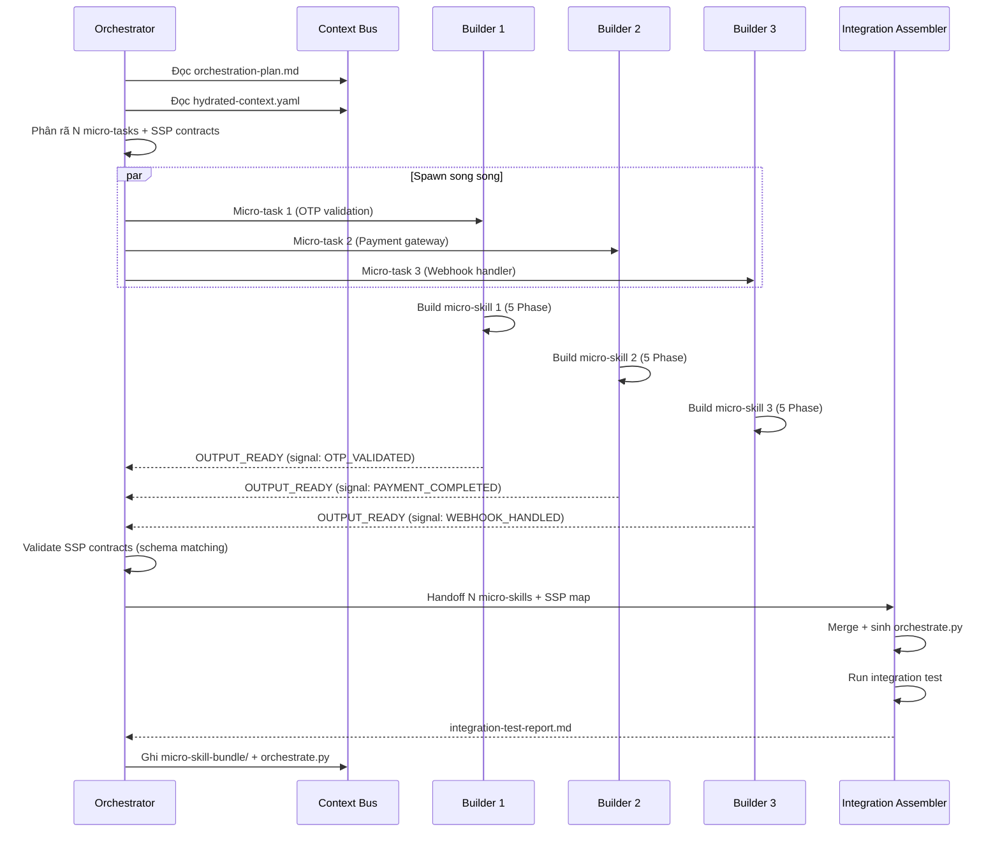

# 🤖 Đặc tả Micro-Skill Orchestrator Agent (Orchestrator Agent Specification)

> [!NOTE]
> Tài liệu này được tách ra từ [Tài liệu Thiết kế Kiến trúc Gốc (architecture-design.md)](architecture-design.md) để quản lý chi tiết về đặc tả và giao thức vận hành của Micro-Skill Orchestrator Subagent.
>
> **Mục lục điều hướng:**
> - [Quay lại Bản đồ Kiến trúc Trung tâm](architecture-design.md)
> - [Đặc tả State & Shared Layer (Context Bus, Fallback, _state.yaml)](protocols-and-state-spec.md)
> - [Đặc tả Nâng cấp & Di trú (Skill Migration & Refactoring)](skill-migration-spec.md)
> - [Ma trận Chốt chặn Chất lượng (Quality Gates Matrix)](quality-gates-matrix.md)

---

## 6. Micro-Skill Orchestrator Agent (MỚI)

Đặc tả subagent chuyên biệt điều phối bộ micro-skill thay vì call thủ công.

```yaml
agent_spec:
  name: "micro-skill-orchestrator"
  role: "Điều phối bộ micro-skill tự động thay vì call thủ công"
  trigger: "SCS >= 3.0 AND orchestration-plan.md tồn tại"
  
  responsibilities:
    - "Đọc orchestration-plan.md từ Context Bus (Stage 2 output)"
    - "Kiểm tra `_state.yaml` status. Nếu status = `degraded`, kích hoạt chế độ phòng vệ (defensive mode)"
    - "Phân rã thành N micro-tasks độc lập với ranh giới rõ ràng"
    - "Spawn N Micro-Skill Builder subagents song song (parallel execution)"
    - "Quản lý SSP (State & Signal Protocol) giữa các micro-skill"
    - "Validate data contracts giữa micro-skill output (schema matching)"
    - "Điều phối DAG execution (thứ tự phụ thuộc giữa micro-skills)"
    - "Thu thập kết quả, trigger Integration Assembler"
    - "Cập nhật _state.yaml với trạng thái từng micro-skill"
  
  inputs:
    - "orchestration-plan.md (từ Stage 2)"
    - "hydrated-context.yaml (từ Context Bus)"
    - "design.md §3 Zone Mapping (từ Context Bus)"
    - "_state.yaml (để check degraded status)"
  
  outputs:
    - "micro-skill-bundle/ (thư mục chứa N micro-skills)"
    - "orchestrate.py (SSP protocol script)"
    - "integration-test-report.md"
    - "orchestrator-log.md (trace từng micro-skill execution)"
  
  must:
    - "Bắt buộc sinh orchestrate.py khi SCS >= 3.0 (theo build-stage-standards.md)"
    - "Mọi micro-skill phải có SSP contract rõ ràng (input_signal, output_signal, downstream)"
    - "Khi status hệ thống là `degraded` (do hỏng tài liệu Non-Critical), bắt buộc thắt chặt kiểm duyệt SSP contract và sinh mã phòng vệ dự phòng (defensive code)"
    - "Validate schema matching giữa micro-skill A output và micro-skill B input"
    - "Spawn builders song song khi không có phụ thuộc (DAG parallel execution)"
    - "Đính kèm trace tag [MICRO-SKILL #N] cho mọi output"
  
  must_not:
    - "KHÔNG tự viết code micro-skill (chỉ điều phối, code do Builder subagent làm)"
    - "KHÔNG bypass data contracts giữa micro-skills"
    - "KHÔNG chạy micro-skill tuần tự khi có thể chạy song song (waste throughput)"
    - "KHÔNG bỏ qua SSP validation (semantic drift giữa micro-skills)"
    - "KHÔNG tự chấm 'PASS' - phải chạy integration test cơ học"
  
  ssp_protocol:
    description: "State & Signal Protocol - giao thức giao tiếp giữa micro-skills"
    signal_types:
      - "START: micro-skill bắt đầu"
      - "OUTPUT_READY: micro-skill sinh output hợp lệ"
      - "ERROR: micro-skill fail"
      - "HANDOFF: bàn giao output cho downstream micro-skill"
    state_transitions:
      - "IDLE -> SPAWNING -> RUNNING -> OUTPUT_READY -> HANDOFF -> COMPLETED"
      - "RUNNING -> ERROR -> RETRY (max 2) -> FAILED"
```


