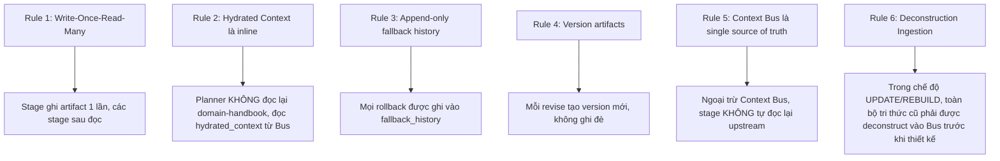
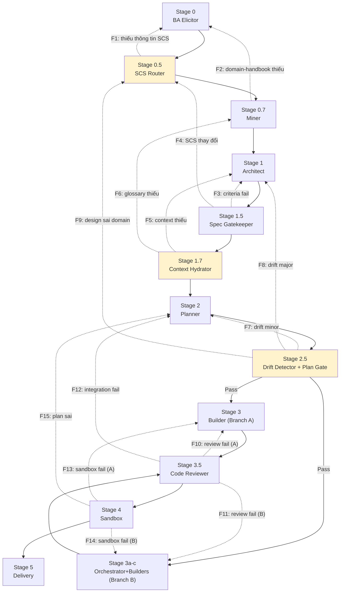

# 🗂️ Đặc tả State & Shared Layer (Protocols and State Specification)

> [!NOTE]
> Tài liệu này được tách ra từ [Tài liệu Thiết kế Kiến trúc Gốc (architecture-design.md)](architecture-design.md) để quản lý chi tiết về State, Context Bus và các giao thức Fallback/Rollback của hệ thống.
>
> **Mục lục điều hướng:**
> - [Quay lại Bản đồ Kiến trúc Trung tâm](architecture-design.md)
> - [Đặc tả Micro-Skill Orchestrator Agent](orchestrator-agent-spec.md)
> - [Đặc tả Nâng cấp & Di trú (Skill Migration & Refactoring)](skill-migration-spec.md)
> - [Ma trận Chốt chặn Chất lượng (Quality Gates Matrix)](quality-gates-matrix.md)

---

## 7. Context Bus - Shared State Layer

> [!IMPORTANT]
> **Thành phần quan trọng nhất của kiến trúc mới.** Context Bus là shared state layer - mọi stage ghi vào đó, mọi stage đọc từ đó. Giải quyết hoàn toàn Context Leak (vấn đề #1).

### Schema Context Bus
```yaml
context_bus:
  bus_id: "cb_20260625_001"
  pipeline_run_id: "run_001"
  created_at: "2026-06-25T10:00:00Z"
  last_updated: "2026-06-25T10:30:00Z"
  current_stage: "stage_2_planner"
  
  # ===== EXECUTION MODE & ROUTING =====
  execution_mode: "UPDATE"          # CREATE | UPDATE | REBUILD
  source_skill_path: "/path/to/source-skill"
  target_skill_path: "/path/to/target-skill"
  
  # ===== DECONSTRUCTED RAW CONTEXT (UPDATE / REBUILD only) =====
  deconstructed_context:
    original_persona: "Micro-skill khơi gợi, chuẩn hóa yêu cầu nghiệp vụ thô và lượng hóa NFR."
    advantages_and_intent: "Tự động phản biện, lượng hóa NFR và lọc chống prompt injection ở giai đoạn đầu vào."
    extracted_knowledge:
      - file_name: "elicitation-rules.md"
        content: "Quy tắc khơi gợi..."
    extracted_guardrails:
      original_must:
        - "Enforce XML boundaries (<user_skill_request>)."
      original_must_not:
        - "Không chấp nhận yêu cầu cảm tính không thể lượng hóa."
    extracted_contracts:
      - contract_id: "elicitation_report"
        path_template: ".skill-context/{feature_name}/ba-elicitor/elicitation-report.md"
        format: "markdown"

  # ===== ARTIFACTS (references to files) =====
  artifacts:
    business_analysis: ".skill-context/{target_skill}/business-analysis.md"
    domain_handbook: ".skill-context/{target_skill}/domain-handbook.md"
    scs_rating: ".skill-context/{target_skill}/scs-rating.yaml"
    design_md: ".skill-context/{target_skill}/design.md"
    quality_matrix: ".skill-context/{target_skill}/quality-matrix.yaml"
    criteria: ".skill-context/{target_skill}/criteria.md"
    hydrated_context: ".skill-context/{target_skill}/hydrated-context.yaml"
    todo_md: ".skill-context/{target_skill}/todo.md"
    orchestration_plan: ".skill-context/{target_skill}/orchestration-plan.md"
    plan_verification: ".skill-context/{target_skill}/plan-verification-report.md"
    build_log: ".skill-context/{target_skill}/build-log.md"
    verification: ".skill-context/{target_skill}/verification.md"
  
  # ===== HYDRATED CONTEXT (inline, không cần đọc lại file) =====
  hydrated_context:
    domain: "Fintech / Payment Gateways"
    glossary: ["OTP", "Nonce", "HMAC-SHA256", "Replay Attack", "Idempotency-Key", "Webhook", "2FA", "SMS Gateway", "Rate Limiting", "HMAC"]
    nfr_metrics:
      - {name: "Latency", value: "< 200ms"}
      - {name: "Rate Limit", value: "3 attempts / 5 min"}
      - {name: "Availability", value: "99.99%"}
    data_contracts:
      - contract_id: "CONTRACT-OTP-001"
        input_schema: {phone_number: "string E.164", otp_code: "string ^\\d{6}$", nonce: "string UUIDv4"}
        output_schema: {status: "APPROVED|REJECTED|BLOCKED", reason: "string|null"}
    zone_map: "core/, scripts/, knowledge/, loop/"
    must_not: ["Không log plain text OTP", "Không dùng Math.random()", "Không mock auth module"]
    edge_cases: ["Expired OTP", "Brute-force", "Session hijacking", "Replay attack"]
  
  # ===== SCS & ROUTING =====
  scs_score: 3.5
  routing_mode: "Full-Track OMSP"
  branch: "branch_b_micro_skill"
  
  # ===== STATE TRACKING =====
  state_yaml_ref: ".skill-context/{target_skill}/_state.yaml"
  fallback_history: []
```

### Quy tắc Context Bus



---

## 8. Cơ chế Fallback / Rollback toàn tuyến

> [!IMPORTANT]
> **Giải quyết điểm phản biện #1 của user:** Thiếu rollback mechanism rõ ràng. Bổ sung ma trận fallback toàn diện + `_state.yaml` protocol chuẩn cho toàn pipeline (không chỉ riêng Builder).

### Ma trận Fallback toàn tuyến



### Bảng Ma trận Fallback chi tiết

| ID | Stage Fail | Nguyên nhân | Quay về | Hành động |
|:---|:---|:---|:---|:---|
| **F1** | Stage 0.5 (SCS Router) | Thiếu thông tin đánh giá SCS | **Stage 0** | BA Elicitor bổ sung elicitation |
| **F2** | Stage 0.7 (Miner) | Domain-handbook thiếu glossary/anti-patterns | **Stage 0** | Re-elicitation sâu hơn |
| **F3** | Stage 1.5 (Spec Gatekeeper) | Criteria không đạt meta-criteria | **Stage 1** | Architect revise design.md |
| **F4** | Stage 1.5 (Spec Gatekeeper) | SCS score thay đổi sau khi đọc design | **Stage 0.5** | Re-evaluate SCS, re-route Branch |
| **F5** | Stage 1.7 (Hydrator) | Context không đủ (thiếu contracts) | **Stage 1** | Architect bổ sung data contracts |
| **F6** | Stage 1.7 (Hydrator) | Glossary thiếu (< 10 terms) | **Stage 0.7** | Miner bổ sung domain-handbook |
| **F7** | Stage 2.5 (Drift Detector) | Drift minor - task lệch nhưng sửa được | **Stage 2** | Planner re-plan todo.md |
| **F8** | Stage 2.5 (Drift Detector) | Drift major - todo.md plan sai domain | **Stage 1** | Architect revise design.md |
| **F9** | Stage 2.5 (Drift Detector) | Design sai domain (root cause) | **Stage 0.5** | Re-evaluate SCS + re-anchor domain |
| **F10** | Stage 3.5 (Reviewer) | Review fail - Branch A | **Stage 3** | Builder re-build |
| **F11** | Stage 3.5 (Reviewer) | Review fail - Branch B | **Stage 3c** | Integration Assembler re-assemble |
| **F12** | Stage 3.5 (Reviewer) | Integration fail (micro-skill mismatch) | **Stage 2** | Planner revise orchestration-plan |
| **F13** | Stage 4 (Sandbox) | Sandbox fail - Branch A | **Stage 3** | Builder re-build |
| **F14** | Stage 4 (Sandbox) | Sandbox fail - Branch B | **Stage 3c** | Integration Assembler re-assemble |
| **F15** | Stage 4 (Sandbox) | Plan sai (root cause) | **Stage 2** | Planner re-plan |

### Quy tắc Fallback

1. **Max 3 iterations per stage:** Sau 3 lần fallback về cùng stage → escalate to Oracle/user
2. **Append-only fallback history:** Mọi rollback ghi vào `_state.yaml.fallback_history`
3. **Root cause first:** Fallback về stage gần nhất trước, nếu повтор → fallback sâu hơn (root cause)
4. **Context Bus preserve:** Context Bus KHÔNG reset khi fallback, chỉ append version mới

---

## 9. `_state.yaml` Protocol chuẩn

> [!IMPORTANT]
> **Giải quyết điểm phản biện #1:** Bổ sung `_state.yaml` protocol chuẩn cho **toàn pipeline**, không chỉ riêng Builder.

```yaml
# _state.yaml - Pipeline State Protocol
pipeline_state:
  version: "2.0"
  run_id: "run_001"
  created_at: "2026-06-25T10:00:00Z"
  
  # ===== EXECUTION MODE =====
  execution_mode: "UPDATE"          # CREATE | UPDATE | REBUILD
  source_skill_ref: "/path/to/old-skill"
  
  # ===== CURRENT STATE =====
  current_stage: "stage_2_planner"
  previous_stage: "stage_1_7_hydrator"
  status: "in_progress"  # in_progress | completed | blocked | failed | escalated
  iteration_count: 1
  max_iterations: 3
  
  # ===== BRANCH ROUTING =====
  scs_score: 3.5
  branch: "branch_b_micro_skill"  # branch_a_single | branch_b_micro_skill
  routing_mode: "Full-Track OMSP"
  
  # ===== CONTEXT BUS =====
  context_bus_ref: ".skill-context/{target_skill}/context-bus.yaml"
  context_bus_id: "cb_20260625_001"
  
  # ===== ARTIFACTS REGISTRY =====
  artifacts:
    business_analysis: {path: ".skill-context/{target_skill}/business-analysis.md", status: "completed", version: 1}
    domain_handbook: {path: ".skill-context/{target_skill}/domain-handbook.md", status: "completed", version: 1}
    scs_rating: {path: ".skill-context/{target_skill}/scs-rating.yaml", status: "completed", version: 1}
    design_md: {path: ".skill-context/{target_skill}/design.md", status: "completed", version: 2}
    quality_matrix: {path: ".skill-context/{target_skill}/quality-matrix.yaml", status: "completed", version: 2}
    criteria: {path: ".skill-context/{target_skill}/criteria.md", status: "completed", version: 1}
    hydrated_context: {path: ".skill-context/{target_skill}/hydrated-context.yaml", status: "completed", version: 1}
    todo_md: {path: ".skill-context/{target_skill}/todo.md", status: "in_progress", version: 1}
    orchestration_plan: {path: null, status: "pending"}
  
  # ===== FALLBACK HISTORY (append-only) =====
  fallback_history:
    - event_id: "fb_001"
      timestamp: "2026-06-25T10:15:00Z"
      from_stage: "stage_1_5_gatekeeper"
      to_stage: "stage_1_architect"
      reason: "Criteria fail: META-3.1 Mechanical Verification missing"
      fallback_id: "F3"
      iteration: 1
    - event_id: "fb_002"
      timestamp: "2026-06-25T10:20:00Z"
      from_stage: "stage_1_5_gatekeeper"
      to_stage: "stage_1_architect"
      reason: "Criteria fail resolved, design.md v2 created"
      fallback_id: null
      iteration: 2
  
  # ===== STAGE STATUS TRACKING =====
  stage_status:
    stage_0_ba: {status: "completed", iterations: 1, completed_at: "2026-06-25T10:05:00Z"}
    stage_0_5_scs: {status: "completed", iterations: 1, completed_at: "2026-06-25T10:06:00Z"}
    stage_0_7_miner: {status: "completed", iterations: 1, completed_at: "2026-06-25T10:08:00Z"}
    stage_1_architect: {status: "completed", iterations: 2, completed_at: "2026-06-25T10:18:00Z"}
    stage_1_5_gatekeeper: {status: "completed", iterations: 2, completed_at: "2026-06-25T10:19:00Z"}
    stage_1_7_hydrator: {status: "completed", iterations: 1, completed_at: "2026-06-25T10:22:00Z"}
    stage_2_planner: {status: "in_progress", iterations: 1}
    stage_2_5_drift: {status: "pending"}
    stage_3_builder: {status: "pending"}
    stage_3_5_reviewer: {status: "pending"}
    stage_4_sandbox: {status: "pending"}
    stage_5_delivery: {status: "pending"}
  
  # ===== MICRO-SKILL TRACKING (Branch B only) =====
  micro_skill_tracking:
    enabled: true
    orchestrator_status: "pending"
    micro_skills:
      - {id: "ms_001", name: "otp-validation", builder_status: "pending", ssp_contract: "pending"}
      - {id: "ms_002", name: "payment-gateway", builder_status: "pending", ssp_contract: "pending"}
      - {id: "ms_003", name: "webhook-handler", builder_status: "pending", ssp_contract: "pending"}
    integration_status: "pending"
  
  # ===== ESCALATION =====
  escalation:
    triggered: false
    reason: null
    escalated_to: null  # oracle | user
```
