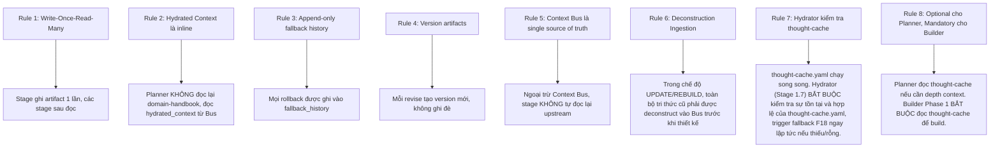
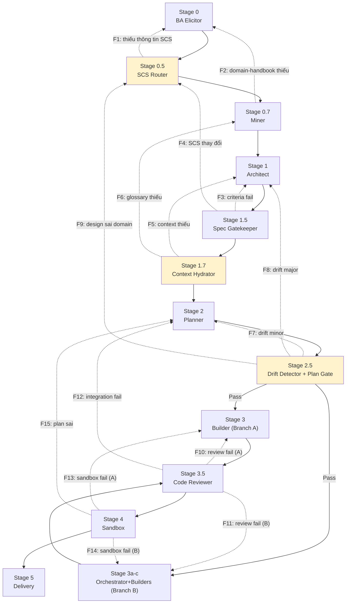

# 🗂️ Đặc tả State & Shared Layer (Protocols and State Specification)

> [!NOTE]
> Tài liệu này được tách ra từ [Tài liệu Thiết kế Kiến trúc Gốc (architecture-design.md)](architecture-design.md) để quản lý chi tiết về State, Context Bus và các giao thức Fallback/Rollback của hệ thống.
>
> **Mục lục điều hướng:**
> - [Quay lại Bản đồ Kiến trúc Trung tâm](architecture-design.md)
> - [Đặc tả Micro-Skill Orchestrator Agent](orchestrator-agent-spec.md)
> - [Đặc tả Nâng cấp & Di trú (Skill Migration & Refactoring)](skill-migration-spec.md)
> - [Ma trận Chốt chặn Chất lượng (Quality Gates Matrix)](quality-gates-matrix.md)

---

## 7. Context Bus - Shared State Layer

> [!IMPORTANT]
> **Thành phần quan trọng nhất của kiến trúc mới.** Context Bus là shared state layer - mọi stage ghi vào đó, mọi stage đọc từ đó. Giải quyết hoàn toàn Context Leak (vấn đề #1).

### Schema Context Bus
```yaml
context_bus:
  bus_id: "cb_20260625_001"
  pipeline_run_id: "run_001"
  created_at: "2026-06-25T10:00:00Z"
  last_updated: "2026-06-25T10:30:00Z"
  current_stage: "stage_2_planner"
  
  # ===== EXECUTION MODE & ROUTING =====
  execution_mode: "UPDATE"          # CREATE | UPDATE | REBUILD
  source_skill_path: "/path/to/source-skill"
  target_skill_path: "/path/to/target-skill"
  
  # ===== DECONSTRUCTED RAW CONTEXT (UPDATE / REBUILD only) =====
  deconstructed_context:
    original_persona: "Micro-skill khơi gợi, chuẩn hóa yêu cầu nghiệp vụ thô và lượng hóa NFR."
    advantages_and_intent: "Tự động phản biện, lượng hóa NFR và lọc chống prompt injection ở giai đoạn đầu vào."
    extracted_knowledge:
      - file_name: "elicitation-rules.md"
        content: "Quy tắc khơi gợi..."
    extracted_guardrails:
      original_must:
        - "Enforce XML boundaries (<user_skill_request>)."
      original_must_not:
        - "Không chấp nhận yêu cầu cảm tính không thể lượng hóa."
    extracted_contracts:
      - contract_id: "elicitation_report"
        path_template: ".skill-context/{feature_name}/ba-elicitor/elicitation-report.md"
        format: "markdown"

  # ===== ARTIFACTS (references to files) =====
  artifacts:
    business_analysis: ".skill-context/{target_skill}/business-analysis.md"
    domain_handbook: ".skill-context/{target_skill}/domain-handbook.md"
    scs_rating: ".skill-context/{target_skill}/scs-rating.yaml"
    design_md: ".skill-context/{target_skill}/design.md"
    quality_matrix: ".skill-context/{target_skill}/quality-matrix.yaml"
    criteria: ".skill-context/{target_skill}/criteria.md"
    hydrated_context: ".skill-context/{target_skill}/hydrated-context.yaml"
    todo_md: ".skill-context/{target_skill}/todo.md"
    orchestration_plan: ".skill-context/{target_skill}/orchestration-plan.md"
    plan_verification: ".skill-context/{target_skill}/plan-verification-report.md"
    thought_cache: ".skill-context/{target_skill}/thought-cache.yaml"
    sampling_audit_config: ".skill-context/{target_skill}/sampling-audit-config.yaml"
    audit_fail_report: ".skill-context/{target_skill}/audit-fail-report.md"  # conditional
    build_log: ".skill-context/{target_skill}/build-log.md"
    verification: ".skill-context/{target_skill}/verification.md"
  
  # ===== HYDRATED CONTEXT (inline, không cần đọc lại file) =====
  hydrated_context:
    domain: "Fintech / Payment Gateways"
    glossary: ["OTP", "Nonce", "HMAC-SHA256", "Replay Attack", "Idempotency-Key", "Webhook", "2FA", "SMS Gateway", "Rate Limiting", "HMAC"]
    nfr_metrics:
      - {name: "Latency", value: "< 200ms"}
      - {name: "Rate Limit", value: "3 attempts / 5 min"}
      - {name: "Availability", value: "99.99%"}
    data_contracts:
      - contract_id: "CONTRACT-OTP-001"
        input_schema: {phone_number: "string E.164", otp_code: "string ^\\d{6}$", nonce: "string UUIDv4"}
        output_schema: {status: "APPROVED|REJECTED|BLOCKED", reason: "string|null"}
    zone_map: "core/, scripts/, knowledge/, loop/"
    must_not: ["Không log plain text OTP", "Không dùng Math.random()", "Không mock auth module"]
    edge_cases: ["Expired OTP", "Brute-force", "Session hijacking", "Replay attack"]
  
  # ===== SCS & ROUTING =====
  scs_score: 3.5
  routing_mode: "Full-Track OMSP"
  branch: "branch_b_micro_skill"
  
  # ===== STATE TRACKING =====
  state_yaml_ref: ".skill-context/{target_skill}/_state.yaml"
  fallback_history: []
```

### Quy tắc Context Bus



---

## 8. Cơ chế Fallback / Rollback toàn tuyến

> [!IMPORTANT]
> **Giải quyết điểm phản biện #1 của user:** Thiếu rollback mechanism rõ ràng. Bổ sung ma trận fallback toàn diện + `_state.yaml` protocol chuẩn cho toàn pipeline (không chỉ riêng Builder).

### Ma trận Fallback toàn tuyến



### Bảng Ma trận Fallback chi tiết

| ID | Stage Fail | Nguyên nhân | Quay về | Hành động |
|:---|:---|:---|:---|:---|
| **F1** | Stage 0.5 (SCS Router) | Thiếu thông tin đánh giá SCS | **Stage 0** | BA Elicitor bổ sung elicitation |
| **F2** | Stage 0.7 (Miner) | Domain-handbook thiếu glossary/anti-patterns | **Stage 0** | Re-elicitation sâu hơn |
| **F3** | Stage 1.5 (Spec Gatekeeper) | Criteria không đạt meta-criteria | **Stage 1** | Architect revise design.md |
| **F4** | Stage 1.5 (Spec Gatekeeper) | SCS score thay đổi sau khi đọc design | **Stage 0.5** | Re-evaluate SCS, re-route Branch |
| **F5** | Stage 1.7 (Hydrator) | Context không đủ (thiếu contracts) | **Stage 1** | Architect bổ sung data contracts |
| **F6** | Stage 1.7 (Hydrator) | Glossary thiếu (< 10 terms) | **Stage 0.7** | Miner bổ sung domain-handbook |
| **F7** | Stage 2.5 (Drift Detector) | Drift minor - task lệch nhưng sửa được | **Stage 2** | Planner re-plan todo.md |
| **F8** | Stage 2.5 (Drift Detector) | Drift major - todo.md plan sai domain | **Stage 1** | Architect revise design.md |
| **F8-EXT** | Stage 2.5 (Semantic Audit) | Drift semantic detected — plan PASS form nhưng FAIL meaning | **Stage 1 / Stage 0** | Root cause: design sai → Stage 1 revise. Plan sai intent → Stage 0 re-elicitation. Ghi `audit-fail-report.md` |
| **F9** | Stage 2.5 (Drift Detector) | Design sai domain (root cause) | **Stage 0.5** | Re-evaluate SCS + re-anchor domain |
| **F10** | Stage 3.5 (Reviewer) | Review fail - Branch A | **Stage 3** | Builder re-build |
| **F11** | Stage 3.5 (Reviewer) | Review fail - Branch B | **Stage 3c** | Integration Assembler re-assemble |
| **F12** | Stage 3.5 (Reviewer) | Integration fail (micro-skill mismatch) | **Stage 2** | Planner revise orchestration-plan |
| **F13** | Stage 4 (Sandbox) | Sandbox fail - Branch A | **Stage 3** | Builder re-build |
| **F14** | Stage 4 (Sandbox) | Sandbox fail - Branch B | **Stage 3c** | Integration Assembler re-assemble |
| **F15** | Stage 4 (Sandbox) | Plan sai (root cause) | **Stage 2** | Planner re-plan |
| **F16** | Stage 0 (BA Elicitor) | `thought-cache.yaml` thiếu `business_thought_process` | **Stage 0** | BA Elicitor thực hiện elicitation sâu hơn, ép META-2.1 thought block |
| **F17** | Stage 1.5 (Spec Gatekeeper) | `thought-cache.yaml` thiếu `stakeholder_empathy` hoặc `reverse_questions` | **Stage 0** | BA Elicitor bổ sung stakeholder analysis + reverse questioning (META-2.2) |
| **F18** | Stage 1.7 (Hydrator) | `thought-cache.yaml` không tồn tại hoặc rỗng | **Stage 0** | BA Elicitor Depth Recovery — sinh thought-cache từ đầu (META-2.1 + empathy + reverse Q + defensive reasoning) |
| **F19** | Stage 0 (BA Elicitor) | Stage 0 thought block FAIL META-2.1 v2.0 (4 Depth Signals) | **Stage 0** | BA Elicitor bổ sung tư duy sâu — đảm bảo đủ S1 Negation + S2 Reverse Q + S3 Multi-Stakeholder + S4 Constraint Anchoring |

### Branch A Fallback Matrix — Phase Compression Mode

Khi Phase Compression được kích hoạt cho Branch A (Fast Track), fallback F1-F9 stage-specific được collapse thành 4 paths (PC-1 → PC-4) với internal retry loop:

| ID | Phase Fail | Nguyên nhân | Hành động |
|:---|:---|:---|:---|
| **PC-1** | Phase D1 (Discovery) | Glossary < 10 OR SCS ambiguous | Internal retry (max 3) — agent tự bổ sung elicitation |
| **PC-2** | Phase D2 (Design & Contract) | Self-check fail (META criteria) | Internal retry (max 3) — agent tự revise design |
| **PC-3** | Phase D3 (Plan & Verify) | Drift minor/major detected | Internal retry (max 3) — agent tự re-plan |
| **PC-4** | Phase D3 (Plan & Verify) | Design sai domain (critical) | Escalate — không retry |

**Collapsed mapping (F1-F9 → PC):**

| Fallback cũ | Stage gốc | Phase mới | Collapsed thành |
|:---|:---|:---|:---|
| F1, F2 | S0.5 / S0.7 | D1 Discovery | **PC-1** internal retry |
| F3, F4 | S1.5 | D2 Design & Contract | **PC-2** internal retry |
| F5, F6 | S1.7 | D3 Plan & Verify | **PC-3** internal retry |
| F7, F8 | S2.5 | D3 Plan & Verify | **PC-3** internal retry |
| F9 | S2.5 | D3 Plan & Verify | **PC-4** escalate |
| F15 | Stage 4 (Sandbox) | → Phase D3 | **PC-3** re-plan |

> [!IMPORTANT]
> **Branch B giữ nguyên F1-F15.** Phase Compression chỉ áp dụng cho Branch A (Fast Track, SCS < 3.0).

### Quy tắc Fallback

1. **Max 3 iterations per stage:** Sau 3 lần fallback về cùng stage → escalate to Oracle/user
2. **Append-only fallback history:** Mọi rollback ghi vào `_state.yaml.fallback_history`
3. **Root cause first:** Fallback về stage gần nhất trước, nếu повтор → fallback sâu hơn (root cause)
4. **Context Bus preserve:** Context Bus KHÔNG reset khi fallback, chỉ append version mới

---

## 9. `_state.yaml` Protocol chuẩn

> [!IMPORTANT]
> **Giải quyết điểm phản biện #1:** Bổ sung `_state.yaml` protocol chuẩn cho **toàn pipeline**, không chỉ riêng Builder.

```yaml
# _state.yaml - Pipeline State Protocol
pipeline_state:
  version: "2.0"
  run_id: "run_001"
  created_at: "2026-06-25T10:00:00Z"
  
  # ===== EXECUTION MODE =====
  execution_mode: "UPDATE"          # CREATE | UPDATE | REBUILD
  source_skill_ref: "/path/to/old-skill"
  
  # ===== CURRENT STATE =====
  current_stage: "stage_2_planner"
  previous_stage: "stage_1_7_hydrator"
  status: "in_progress"  # in_progress | completed | blocked | failed | escalated | degraded
  iteration_count: 1
  max_iterations: 3
  
  # ===== BRANCH ROUTING =====
  scs_score: 3.5
  branch: "branch_b_micro_skill"  # branch_a_single | branch_b_micro_skill
  routing_mode: "Full-Track OMSP"
  
  # ===== CONTEXT BUS =====
  context_bus_ref: ".skill-context/{target_skill}/context-bus.yaml"
  context_bus_id: "cb_20260625_001"
  
  # ===== ARTIFACTS REGISTRY =====
  artifacts:
    business_analysis: {path: ".skill-context/{target_skill}/business-analysis.md", status: "completed", version: 1}
    domain_handbook: {path: ".skill-context/{target_skill}/domain-handbook.md", status: "completed", version: 1}
    scs_rating: {path: ".skill-context/{target_skill}/scs-rating.yaml", status: "completed", version: 1}
    design_md: {path: ".skill-context/{target_skill}/design.md", status: "completed", version: 2}
    quality_matrix: {path: ".skill-context/{target_skill}/quality-matrix.yaml", status: "completed", version: 2}
    criteria: {path: ".skill-context/{target_skill}/criteria.md", status: "completed", version: 1}
    hydrated_context: {path: ".skill-context/{target_skill}/hydrated-context.yaml", status: "completed", version: 1}
    todo_md: {path: ".skill-context/{target_skill}/todo.md", status: "in_progress", version: 1}
    thought_cache: {path: ".skill-context/{target_skill}/thought-cache.yaml", status: "completed", version: 1}
    orchestration_plan: {path: null, status: "pending"}
  
  # ===== FALLBACK HISTORY (append-only) =====
  fallback_history:
    - event_id: "fb_001"
      timestamp: "2026-06-25T10:15:00Z"
      from_stage: "stage_1_5_gatekeeper"
      to_stage: "stage_1_architect"
      reason: "Criteria fail: META-3.1 Mechanical Verification missing"
      fallback_id: "F3"
      iteration: 1
    - event_id: "fb_002"
      timestamp: "2026-06-25T10:20:00Z"
      from_stage: "stage_1_5_gatekeeper"
      to_stage: "stage_1_architect"
      reason: "Criteria fail resolved, design.md v2 created"
      fallback_id: null
      iteration: 2
  
  # ===== STAGE STATUS TRACKING =====
  stage_status:
    stage_0_ba: {status: "completed", iterations: 1, completed_at: "2026-06-25T10:05:00Z"}
    stage_0_5_scs: {status: "completed", iterations: 1, completed_at: "2026-06-25T10:06:00Z"}
    stage_0_7_miner: {status: "completed", iterations: 1, completed_at: "2026-06-25T10:08:00Z"}
    stage_1_architect: {status: "completed", iterations: 2, completed_at: "2026-06-25T10:18:00Z"}
    stage_1_5_gatekeeper: {status: "completed", iterations: 2, completed_at: "2026-06-25T10:19:00Z"}
    stage_1_7_hydrator: {status: "completed", iterations: 1, completed_at: "2026-06-25T10:22:00Z"}
    stage_2_planner: {status: "in_progress", iterations: 1}
    stage_2_5_drift: {status: "pending"}
    stage_3_builder: {status: "pending"}
    stage_3_5_reviewer: {status: "pending"}
    stage_4_sandbox: {status: "pending"}
    stage_5_delivery: {status: "pending"}
  
  # ===== MICRO-SKILL TRACKING (Branch B only) =====
  micro_skill_tracking:
    enabled: true
    orchestrator_status: "pending"
    micro_skills:
      - {id: "ms_001", name: "otp-validation", builder_status: "pending", ssp_contract: "pending"}
      - {id: "ms_002", name: "payment-gateway", builder_status: "pending", ssp_contract: "pending"}
      - {id: "ms_003", name: "webhook-handler", builder_status: "pending", ssp_contract: "pending"}
    integration_status: "pending"
  
  # ===== ESCALATION =====
  escalation:
    triggered: false
    reason: null
    escalated_to: null  # oracle | user

  # ===== SAMPLING AUDIT TRACKING (MỚI) =====
  sampling_audit:
    enabled: true
    mode: "oracle"                # oracle | human
    sampling_rate: 30             # 15 | 30 | 100 (khởi tạo 30%, FAIL -> 100% lập tức, 8 PASS liên tiếp -> 15%)
    last_8_results:               # theo dõi cửa sổ trượt 8 kết quả gần nhất
      - "PASS"
      - "PASS"
      - "PASS"
      - "PASS"
      - "PASS"
      - "PASS"
      - "PASS"
      - "PASS"
    escalation_active: false      # true nếu có bất kỳ FAIL nào trong 8 lần gần nhất -> rate lên 100%
    audit_count_total: 12
    audit_count_fail: 2
    last_audit_id: "audit_20260625_001"
    last_audit_result: "FAIL"
    audit_fail_report: ".skill-context/{target_skill}/audit-fail-report.md"

  # ===== PHASE COMPRESSION (Branch A only) =====
  phase_compression:
    branch_a_enabled: true
    branch_b_full_pipeline: true
    current_phase: "D2_design_contract"        # D1_discovery | D2_design_contract | D3_plan_verify | completed
    current_phase_iteration: 2
    max_retry_per_phase: 3
    phase_retry_history:
      - event_id: "pr_001"
        timestamp: "2026-06-25T10:10:00Z"
        phase: "D1_discovery"
        iteration: 1
        reason: "Glossary chỉ có 5 terms (< 10)"
        resolved: true
        resolution: "Bổ sung elicitation — glossary đạt 12 terms"
      - event_id: "pr_002"
        timestamp: "2026-06-25T10:20:00Z"
        phase: "D2_design_contract"
        iteration: 1
        reason: "META-3.1: Mechanical verification command missing"
        resolved: false
        resolution: null
    stage_status_mode: "phase"        # "stage" (Branch B) | "phase" (Branch A)

---

## 11. YAML Resilience Layer (MỚI)

> [!IMPORTANT]
> **Middleware cross-cutting** giữa stage output và Context Bus commit. Không phải stage riêng — là interceptor tự động cho mọi thao tác ghi YAML artifact. Giải quyết Hard Halt scenario: một indentation lỗi trong Context Bus YAML có thể chặn toàn bộ downstream stage.

### 11.1 Placement

```
Stage N output
      │
      ▼
┌─────────────────────────────────┐
│   YAML Resilience Layer         │  ← interceptor, không phải stage
│   (pre-check → auto-repair →    │
│    graceful degradation)        │
└──────────┬──────────────────────┘
           │
           ▼
    Context Bus commit
```

- **Triển khai**: Hook trong `context_bus.commit(artifact)` — mọi stage gọi `commit()` đều đi qua layer này.
- **Không thay thế Context Bus** — là wrapper xung quanh commit hiện tại.
- **Không phải gate mới** — không chặn pipeline, chỉ sửa hoặc cảnh báo trước khi commit.

### 11.2 Pre-check Pipeline (3 Levels)

#### Level 1: Syntax Lint
- **Cơ chế**: Python `yaml.safe_load()` — helper script duy nhất.
- **Fail**: `yaml.safe_load()` raise exception → chuyển sang Auto-repair protocol (§11.3).

#### Level 2: Schema Validation
- **Cơ chế**: Duyệt parsed dict — kiểm tra required keys tồn tại, key types đúng, value constraints (vd: `score` 1.0-5.0).
- **Fail**: Key missing hoặc type/constraint sai → Auto-repair protocol.

#### Level 3: Cross-reference Check
- **Cơ chế**: Duyệt `context_bus.artifacts.*` và `_state.yaml.artifacts.*` — kiểm tra path tồn tại, file non-empty.
- **Fail**: Không phải hard error → **Graceful degradation** (§11.4).

### 11.3 Auto-repair Protocol

**Max 2 repair attempts per artifact.** Sau 2 lần fail → trigger fallback cho stage gốc re-generate artifact.

**Repair Subagent Contract:**
```yaml
repair_subagent:
  input:
    malformed_yaml: "string — nội dung YAML gốc (raw text)"
    artifact_type: "string — tên artifact (vd: hydrated-context.yaml)"
    expected_schema: "dict — schema kỳ vọng (từ Schemas Catalog §11.5)"
  output:
    repaired_yaml: "string — YAML đã sửa"
    repair_log:
      issue: "indentation error at line 23"
      fix: "adjusted nesting of `input_schema` from 3 to 4 spaces"
      confidence: 0.95
  constraints:
    - "Không thay đổi nội dung ngữ nghĩa — chỉ sửa indent và cấu trúc"
    - "Output phải parse được bằng yaml.safe_load()"
    - "Max tokens: 2000"
```

Mỗi lần repair được ghi vào `_state.yaml.yaml_repair_history`:
```yaml
yaml_repair_history:
  - event_id: "yr_001"
    timestamp: "2026-06-25T10:23:00Z"
    artifact: "hydrated-context.yaml"
    stage: "stage_1_7_hydrator"
    attempt: 1
    level: "syntax"
    issue: "Line 42: bad indentation"
    status: "repaired"
```

### 11.4 Graceful Degradation (Level 3 Cross-ref)

Khi Level 3 (cross-reference check) phát hiện dangling ref (liên kết hỏng), hệ thống sẽ phân loại tài liệu thành hai nhóm để xử lý riêng biệt nhằm tránh rác hệ thống âm thầm:

#### 11.4.1 Phân loại Reference
- **Critical Refs (Tài liệu tối quan trọng):** `design.md` (Stage 1), `hydrated-context.yaml` (Stage 1.7), `todo.md` (Stage 2), `orchestration-plan.md` (Stage 2 - đối với luồng Branch B).
- **Non-Critical Refs (Tài liệu bổ trợ):** `domain-handbook.md` (Stage 0.7), `quality-matrix.yaml` (Stage 1.5), `criteria.md` (Stage 1).

#### 11.4.2 Xử lý hành vi tương tác
1. **Đối với Critical Refs:** Hệ thống từ chối commit và dừng pipeline ngay lập tức (Hard Halt), kích hoạt fallback F1-F15 về stage chịu trách nhiệm tạo ra artifact đó.
2. **Đối với Non-Critical Refs:** Pipeline không Hard Halt, cho phép ghi nhận warning vào Context Bus, cập nhật trạng thái `_state.yaml.status` thành `degraded`. Downstream agents đọc Context Bus thấy trạng thái `degraded` sẽ tự động kích hoạt **chế độ code/plan phòng vệ (defensive mode)**, tự động suy luận hoặc sử dụng cấu hình mặc định (default values) an toàn.

```yaml
# Context Bus nhận thêm warning field:
artifact_warnings:
  - type: "dangling_ref"
    artifact_key: "quality-matrix"
    path: ".skill-context/{target_skill}/quality-matrix.yaml"
    severity: "warning"
    detail: "File không tồn tại — Sử dụng các cổng chất lượng mặc định và chạy ở chế độ phòng vệ (degraded)"
```

### 11.5 Schemas Catalog (9 artifacts)

Đặc tả YAML structure expectation cho các artifact chính:

| Artifact | Stage sinh | Required keys chính |
|:---|:---|:---|
| `scs-rating.yaml` | Stage 0.5 | `scs_evaluation.score`, `.mode`, `.rationale`, `.routing_decision`, `.context_bus_id` |
| `hydrated-context.yaml` | Stage 1.7 | `hydrated_context.domain`, `.glossary` (≥10), `.nfr_metrics`, `.data_contracts`, `.zone_map`, `.must_not`, `.edge_cases` |
| `quality-matrix.yaml` | Stage 1.5 | `scs_score`, `mode`, `phases` (≥3), `acceptance_criteria` (≥5) |
| `context-bus.yaml` | Cross-cutting | `context_bus.bus_id`, `.pipeline_run_id`, `.current_stage`, `.execution_mode`, `.artifacts` |
| `_state.yaml` | Cross-cutting | `pipeline_state.version`, `.run_id`, `.current_stage`, `.status`, `.stage_status` |
| `todo.md` | Stage 2 | `tasks[].id`, `.zone`, `.status` (YAML frontmatter) |
| `ssp-contract.yaml` | Stage 2/3a | `ssp_contract.*.output_signal`, `.output_schema`, `.downstream` |
| `orchestration-plan.md` | Stage 2 | `micro_skills` (≥2), `.dependencies`, `ssp_map` |
| `plan-verification-report.md` | Stage 2.5 | `verdict` (Pass/Drift/Fail), `drift_items` |

### 11.6 `_state.yaml` Extension Block

Bổ sung vào `_state.yaml`:

```yaml
# ===== YAML RESILIENCE =====
yaml_resilience:
  enabled: true
  pre_check_level: 3                        # 1=syntax, 2=schema, 3=cross-ref
  repair_attempts_this_run: 0
  repair_history:                           # append-only
    - event_id: "yr_001"
      timestamp: "2026-06-25T10:23:00Z"
      artifact: "hydrated-context.yaml"
      stage: "stage_1_7_hydrator"
      attempt: 1
      level: "syntax"
      issue: "Line 42: bad indentation"
      status: "repaired"
  graceful_warnings:
    - type: "dangling_ref"
      artifact_key: "orchestration_plan"
      path: ".skill-context/{target_skill}/orchestration-plan.md"
      severity: "warning"
```

### 11.7 Integration Rules

```yaml
integration_rules:
  rule_1: "Mọi thao tác ghi YAML artifact đều gọi yaml_resilience.pre_check(artifact, schema)"
  rule_2: "Layer PASS → commit proceeds bình thường"
  rule_3: "Layer FAIL (Level 1 syntax) → auto-repair (max 2 attempts)"
  rule_4: "Layer FAIL (Level 2 schema) → auto-repair (max 2 attempts)"
  rule_5: "Layer FAIL (Level 3 cross-ref): Nếu là Critical Ref -> Hard Halt và fallback về stage tạo artifact. Nếu là Non-Critical Ref -> Ghi graceful warning, chuyển status thành 'degraded' và commit vẫn proceed."
  rule_6: "Repair lần 2 fail → trigger fallback cho stage gốc re-generate artifact"
  rule_7: "Mọi repair event ghi vào _state.yaml.yaml_repair_history"
  rule_8: "Mọi graceful warning ghi vào _state.yaml.graceful_warnings"
```
```
