# 🛡️ Ma trận Chốt chặn Chất lượng (Quality Gates Matrix)

> [!NOTE]
> Tài liệu này được tách ra từ [Tài liệu Thiết kế Kiến trúc Gốc (architecture-design.md)](architecture-design.md) để quản lý chi tiết về ma trận chốt chặn chất lượng và các tiêu chuẩn kiểm duyệt qua từng Stage.
>
> **Mục lục điều hướng:**
> - [Quay lại Bản đồ Kiến trúc Trung tâm](architecture-design.md)
> - [Đặc tả State & Shared Layer (Context Bus, Fallback, _state.yaml)](protocols-and-state-spec.md)
> - [Đặc tả Micro-Skill Orchestrator Agent](orchestrator-agent-spec.md)
> - [Đặc tả Nâng cấp & Di trú (Skill Migration & Refactoring)](skill-migration-spec.md)

---

## 12. Ma trận Chốt chặn Chất lượng (Quality Gates Matrix)

```mermaid
graph TD
    subgraph GATES["Quality Gates theo Stage"]
        G0["Stage 0: BA<br/>BA-1.0 Domain Ontology<br/>BA-2.0 Stakeholder<br/>BA-3.0 Edge-Case<br/>BA-4.0 Quantifiable"]
        G05["Stage 0.5: SCS<br/>SCS-1.0 Score 1.0-5.0<br/>SCS-2.0 Routing decision"]
        G07["Stage 0.7: Miner<br/>MIN-1.0 Glossary 10+<br/>MIN-2.0 Anti-patterns<br/>MIN-3.0 Exemplars"]
        G1["Stage 1: Architect<br/>ARCH-1.0 Semantic Anchors<br/>ARCH-2.0 Data Contracts<br/>ARCH-3.0 Zone Mapping<br/>ARCH-4.0 State Machine"]
        G15["Stage 1.5: Gatekeeper<br/>META-1.1 Domain Anchor<br/>META-1.2 Phase deconstruct<br/>META-2.1 Thought Block<br/>META-2.2 Reverse Q<br/>META-3.1 Mechanical<br/>META-3.2 Negative Space<br/>META-3.3 Sandbox"]
        G17["Stage 1.7: Hydrator<br/>HYD-1.0 Glossary hydrate<br/>HYD-2.0 NFR hydrate<br/>HYD-3.0 Contracts hydrate"]
        G2["Stage 2: Planner<br/>PLAN-1.0 Context Fidelity<br/>PLAN-2.0 Semantic Density<br/>PLAN-3.0 Contracts+State<br/>PLAN-4.0 Negative Space<br/>PLAN-5.0 Mechanical Verify"]
        G25["Stage 2.5: Drift+Gate<br/>DRIFT-1.0 Back-link check<br/>DRIFT-2.0 Contract alignment<br/>DRIFT-3.0 State alignment<br/>DRIFT-4.0 Zone alignment"]
        G3["Stage 3: Builder<br/>BUILD-1.1 Zone Contract<br/>BUILD-1.2 Fidelity<br/>BUILD-2.1 Placeholder<br/>BUILD-2.2 Cognitive Sep<br/>BUILD-3.1 Token Budget (Soft Gate)<br/>BUILD-4.1 Executable<br/>BUILD-5.1 Security"]
        G3B["Stage 3a-c: Orchestrator<br/>ORCH-1.0 SSP contracts<br/>ORCH-2.0 Schema matching<br/>ORCH-3.0 Parallel exec<br/>ORCH-4.0 Integration test"]
        G35["Stage 3.5: Reviewer<br/>REV-1.0 All BUILD gates<br/>REV-2.0 Integration (B)"]
        G4["Stage 4: Sandbox<br/>SAND-1.0 verification.md<br/>SAND-2.0 Exit code 0"]
    end
```

