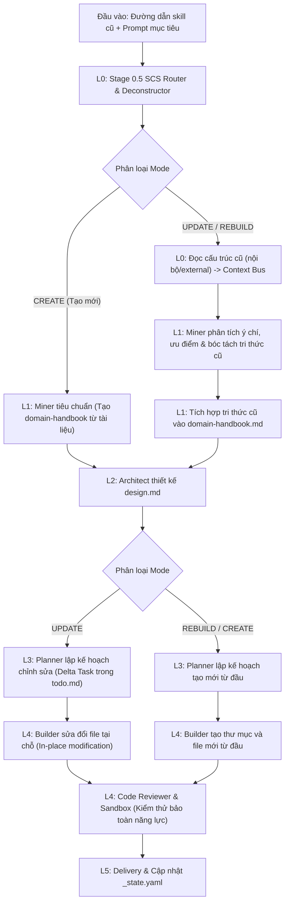

# 🚀 Đặc tả Nâng cấp & Di trú (Skill Migration & Refactoring Specification)

> [!NOTE]
> Tài liệu này được tách ra từ [Tài liệu Thiết kế Kiến trúc Gốc (architecture-design.md)](architecture-design.md) để quản lý chi tiết về kiến trúc di trú, nâng cấp và giải mã skill (Dual-Mode Pipeline).
>
> **Mục lục điều hướng:**
> - [Quay lại Bản đồ Kiến trúc Trung tâm](architecture-design.md)
> - [Đặc tả State & Shared Layer (Context Bus, Fallback, _state.yaml)](protocols-and-state-spec.md)
> - [Đặc tả Micro-Skill Orchestrator Agent](orchestrator-agent-spec.md)
> - [Ma trận Chốt chặn Chất lượng (Quality Gates Matrix)](quality-gates-matrix.md)

---

### 13.6 Quyết định thiết kế #3: Hỗ trợ Khai thác và Nâng cấp Skill (Dual-Mode Pipeline)
- **Vấn đề:** Ban đầu hệ thống chỉ thiết kế để tạo mới skill từ yêu cầu thô. Khi muốn tối ưu hóa hoặc chuẩn hóa một skill cũ (cả nội bộ và bên ngoài), hệ thống sẽ phải tạo lại từ đầu, gây lãng phí tri thức cũ và tăng nguy cơ ảo giác từ LLM.
- **Giải pháp:** Tích hợp bộ giải mã (Skill Deconstructor) vào Stage 0.5 để đọc cấu trúc nguồn. Miner (Stage 0.7) có nhiệm vụ bóc tách tri thức, ưu điểm và ý chí của skill cũ, đưa vào `domain-handbook.md`. Đối với chế độ `UPDATE`, Architect và Planner chỉ thiết kế phần Delta (chênh lệch) và Builder chỉnh sửa trực tiếp các file tại chỗ (in-place modification).

### 13.7 Quyết định thiết kế #4: Chuyển Token Budget thành Soft Gate / Warning kết hợp Refactor Loop (REV-3.0)
- **Vấn đề:** Ràng buộc Token Budget của `SKILL.md` (ví dụ `<= 700` tokens) nếu bị ép cứng và tự động cắt xén bởi Builder có thể phá hủy các ngữ cảnh nghiệp vụ đặc thù, gây ảo giác lớn cho các LLM vận hành phía sau (ai-loop, ai-poor).
- **Giải pháp:** Tiêu chí Token Budget được chuyển thành **Soft Gate (Warning)**. Builder/Reviewer sẽ không tự động cắt xén file gây mất mát nghiệp vụ. Tuy nhiên, nếu phát hiện cảnh báo vượt budget (hoặc cảnh báo placeholder ở `BUILD-2.1`) trong `build-log.md`, Stage 3.5 Code Reviewer sẽ tự động kích hoạt **subagent Refactor** để tự động dọn dẹp các placeholder hoặc tái cấu trúc nén `SKILL.md` (tách chi tiết sang thư mục `knowledge/`) trước khi bàn giao xuống Sandbox, giải quyết triệt để rác hệ thống một cách tự động.

---

## 14. Khung Kiến trúc Khai thác và Nâng cấp Skill (Skill Migration & Refactoring Subsystem)

### 14.1 Luồng thực thi chi tiết của Dual-Mode

### 14.2 Định nghĩa các Adapter giải mã (Deconstructor Adapters)
- **Internal Skill Adapter:** Khai thác file `SKILL.md` (phần frontmatter và XML tags), nạp nhanh tri thức trong `knowledge/` và checklists của `loop/`.
- **External Skill Adapter:** Đọc toàn bộ mã nguồn (.py, .js, .go), tệp prompts và cấu hình. Sử dụng LLM phân tích mục tiêu thực thi để chuyển đổi thành Metadata và Contracts chuẩn hóa cho hệ sinh thái mới.
