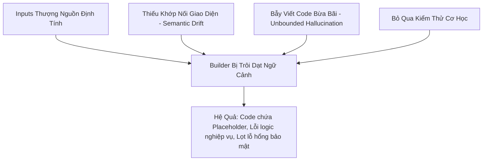
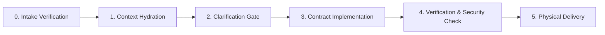

# 🏗️ Giai đoạn BUILD (Stage 3): Vai Trò, Chức Năng Chuyên Biệt & Tiêu Chí Chất Lượng

> [!IMPORTANT]
> Tài liệu này chuẩn hóa và định hình lại vai trò của **Stage 3 (Builder)** trong quy trình 8 giai đoạn của WASHVN. Builder không chỉ đơn thuần là "máy viết code" (typewriter), mà là một **Kỹ sư Triển khai Cấp cao (Senior Implementation Engineer)** có nhiệm vụ hiện thực hóa thiết kế tĩnh (`design.md`) và kế hoạch động (`todo.md`) thành một gói kỹ năng (Skill Package) hoàn chỉnh, an toàn, có khả năng tự chạy và kiểm chứng cơ học.

---

## 1. 🔍 Phân Tích Thực Trạng: Tại Sao Đầu Ra Của Builder Thường Bị "Slop"?

Dựa trên đối chiếu các tài liệu [planner_analysis_and_criteria.md](file:///home/stveve/Documents/workspace/build-workflow/Temps/planner_analysis_and_criteria.md) và [standards.md](file:///home/stveve/Documents/workspace/build-workflow/WASHVN/standards.md), chất lượng đầu ra của Stage 3 thường bị suy giảm ("code slop", mất tính nghiệp vụ, lỗi tích hợp) do các nguyên nhân chính sau:



1. **Rác Vào Thì Rác Ra (Input-Driven Quality Decay):** Nếu `design.md` (Stage 1) và `todo.md` (Stage 2) không cung cấp đủ cấu trúc dữ liệu (`input_schema`/`output_schema`) hoặc viết nhiệm vụ chung chung ("hãy cấu hình bảo mật"), LLM Builder buộc phải tự suy đoán (hallucinate).
2. **Trôi Dạt Ngữ Cảnh Chuyên Ngành (Semantic Drift):** Builder thường bỏ qua các từ khóa nghiệp vụ từ `domain-handbook.md` (Stage 0.5) và các ràng buộc phi chức năng (NFR) từ `business-analysis.md` (Stage -1). Kết quả là code được viết bằng ngôn từ kỹ thuật thuần túy nhưng ngây ngô về mặt nghiệp vụ.
3. **Mật Độ Placeholder Cao (Mock & Placeholder Slop):** Do thói quen vội vã, LLM thường để lại các đoạn comment như `// TODO: Implement later` hoặc viết các hàm mock tạm bợ để vượt qua các bước kiểm tra cú pháp nhanh.
4. **Mù Quáng Về Môi Trường & Bảo Mật (Execution Blindness):** Viết code không tương thích với môi trường chạy thực tế hoặc lọt các lỗi bảo mật nghiêm trọng (hardcode API key, SQL Injection, bypass token authentication) do không có cơ chế gác cổng (Quality Gate) cơ học.

---

## 2. 🎭 Vai Trò Của Stage BUILD Trong Flow Liền Mạch

Stage 3 (BUILD) đóng vai trò là **cầu nối chuyển hóa từ Thế giới Thiết kế (Static Design) sang Thế giới Thực thi (Physical Execution)**. Vai trò của Builder được định hình qua 4 khía cạnh chính:

```yaml
builder_roles:
  1. Senior_Implementation_Engineer:
      description: "Có quyền phản biện thiết kế thượng nguồn. Nếu phát hiện phi logic ở design.md hoặc todo.md, Builder phải tạm dừng và yêu cầu làm rõ (Clarification Loop) thay vì cố đấm ăn xôi."
  2. Contract_&_Zone_Guard:
      description: "Người bảo vệ cấu trúc hệ thống. Builder chỉ được tạo file trong đúng ranh giới của design.md §3 Zone Mapping. Nghiêm cấm tự tạo file nằm ngoài hợp đồng thiết kế."
  3. Cognitive_Agentic_Paradigm_Architect:
      description: "Người phân cấp tri thức cho LLM. Đảm bảo SKILL.md chứa luật mỏ neo (L0-L1), thư mục knowledge/ chứa tri thức on-demand (L2), thư mục loop/ chứa checklist (L3). File mã nguồn vật lý (scripts/) chỉ chứa các hàm tiện ích cơ học (I/O, API wrapper, math), không nhét tư duy logic cao cấp vào scripts."
  4. Integrated_Security_Gatekeeper:
      description: "Gác cổng bảo mật nội tại. Builder tự kích hoạt quy trình quét tĩnh (Static Analysis) đối với các tính năng nhạy cảm (auth, payment, upload) trước khi bàn giao cho Reviewer."
```

---

## 3. ⚙️ Chức Năng Chuyên Biệt Của Stage BUILD

Để thực hiện đúng vai trò, Stage BUILD phải tuân thủ quy trình thực thi **5 Phase tuần tự độc lập**:



### Phase 0: Thẩm Định Tính Toàn Vẹn Đầu Vào (Intake Integrity)
*   **Chức năng:** Tự động quét và đối chiếu sự tồn tại của 3 artifact bắt buộc: `design.md`, `quality-matrix.yaml`, và `todo.md`.
*   **Hành động:** Nếu thiếu bất kỳ file nào, Builder lập tức dừng (Halt) và báo lỗi cụ thể, tuyệt đối không tự ý khởi tạo hoặc viết code mò mẫm.

### Phase 1: Thủy Hóa Ngữ Cảnh Nghiệp Vụ (Context Hydration)
*   **Chức năng:** Bơm tri thức nghiệp vụ thượng nguồn vào bộ nhớ ngắn hạn.
*   **Hành động:** Đọc và nạp 10+ thuật ngữ chuyên ngành (Domain Glossary) từ `domain-handbook.md` và các chỉ số lượng hóa từ `business-analysis.md` để làm mỏ neo vector ngôn ngữ.

### Phase 2: Chốt Làm Rõ (Clarification Gate)
*   **Chức năng:** Giải quyết các điểm mơ hồ `[CẦN LÀM RÕ]` trong `todo.md` trước khi viết code.
*   **Hành động:** Tổng hợp tối đa 5 câu hỏi dạng `(bối cảnh, câu hỏi, dự đoán đầu ra)` trình lên người dùng/thiết kế. Khi có câu trả lời, ghi lại vào `design.md §Clarifications`.

### Phase 3: Hiện Thực Hóa Hợp Đồng (Contract Implementation)
*   **Chức năng:** Triển khai mã nguồn tuân thủ tuyệt đối cấu trúc thư mục (Zone Mapping).
*   **Hành động:**
    *   Tách biệt cấu trúc tri thức:
        *   **L0-L1 (SKILL.md):** Định hình Persona, Nhiệm vụ chính và Danh sách `must`/`must_not` (Khuyến nghị Token Budget < 700 tokens - dạng *Nice-to-Have* để tối ưu ngữ cảnh).
        *   **L2 (knowledge/):** Domain handbooks, API contracts.
        *   **L3 (loop/):** Checklist tự thẩm định nhị phân.
    *   Mã nguồn vật lý (`scripts/`): Viết mã nguồn sạch, mật độ placeholder bằng 0, không nhồi logic suy luận nghiệp vụ của Agent vào scripts Python.

### Phase 4: Tự Thẩm Định Nhị Phân & Quét Bảo Mật (Verification & Security Gate)
*   **Chức năng:** Kiểm chứng cơ học đầu ra thông qua mã lệnh chạy thực tế và quét bảo mật.
*   **Hành động:**
    *   Chạy script validator nội bộ (ví dụ: `scripts/validate_skill.py`).
    *   Đếm mật độ placeholder (`TODO`, `FIXME`, `...`, `pass`) trên toàn bộ code (Khuyến nghị < 5, đưa ra cảnh báo tối ưu nếu >= 10, không chặn build).
    *   Nếu phát hiện kỹ năng có tính năng nhạy cảm (`auth`, `payment`, `upload`), tự động kích hoạt `skill-security-reviewer` quét theo 5 danh mục OWASP (SEC-01 đến SEC-05) và sinh `security-review-report.md`.

### Phase 5: Bàn Giao Vật Lý (Physical Delivery)
*   **Chức năng:** Đóng gói và ghi nhận lịch sử thay đổi.
*   **Hành động:** Sinh `build-log.md` ghi rõ ma trận tương quan: `Task -> Output File -> Source Input`. Cập nhật trạng thái `_state.yaml` thành `build-completed` hoặc `build-blocked`.

---

## 4. 📊 Bộ Tiêu Chí Chất Lượng Nhị Phân (Binary Quality Gates for Stage 3)

Mọi gói kỹ năng được sinh ra từ Stage BUILD phải vượt qua bộ gác cổng chất lượng cơ học dưới đây trước khi bàn giao cho **Stage 3.5 (Code Reviewer)**:

| ID | Danh mục kiểm duyệt | Phân loại Gate | Tiêu chí Đạt (Pass) | Tiêu chí Không Đạt/Cảnh báo | Phương pháp kiểm chứng |
| :--- | :--- | :--- | :--- | :--- | :--- |
| **BUILD-1.1** | **Ranh giới thư mục (Zone Contract)** | Hard Gate (Bắt buộc) | 100% tệp tin được ghi hoặc sửa đổi nằm trong danh sách `design.md §3 Zone Mapping`. | Tự ý tạo thêm tệp tin nằm ngoài danh sách hoặc ghi đè sang các vùng bị cấm. | Quét cấu trúc cây thư mục đầu ra đối chiếu với §3. |
| **BUILD-1.2** | **Tính Toàn vẹn Logic (Fidelity mapping)** | Hard Gate (Bắt buộc) | Ánh xạ đầy đủ 1:1 các luật kinh doanh, trường dữ liệu từ spec gốc. (Nếu spec gốc có 10 rules, code phải triển khai đủ 10 rules). | Thiếu hụt logic nghiệp vụ, tự ý rút gọn hoặc bỏ qua các trường hợp biên được mô tả ở thượng nguồn. | So sánh số lượng rule định nghĩa trong `domain-handbook` và đích. |
| **BUILD-2.1** | **Mật độ Placeholder (Placeholder Density)** | Soft Gate (Nice-to-Have) | Tổng số từ khóa rác (`TODO`, `FIXME`, `pass`, `...`) trên toàn bộ gói kỹ năng **< 5**. | Tổng số từ khóa rác **>= 10** (Chỉ đưa ra cảnh báo tối ưu hóa, không chặn build). | Grep/Regex check tự động đếm số lần xuất hiện của các từ khóa. |
| **BUILD-2.2** | **Phân tách Nhận thức (Cognitive-Code Separation)** | Hard Gate (Bắt buộc) | Các file Python trong `scripts/` chỉ chứa hàm tiện ích hệ thống (I/O, mã hóa, CLI). Logic suy luận và Persona nằm ở `SKILL.md` và `knowledge/`. | Nhồi nhét prompt suy luận, cấu trúc Persona, hướng dẫn phân tích ngôn ngữ tự nhiên vào trong mã Python. | Kiểm tra thủ công hoặc AST Parser quét mã Python xem có chứa văn xuôi tự nhiên. |
| **BUILD-3.1** | **Ngân sách Token (Token Budget)** | Nice-to-Have (Mềm) | File `SKILL.md` sau khi tạo nên có dung lượng **<= 700 tokens** (lý tưởng từ 150-400 tokens để giữ context cô đọng). | File `SKILL.md` cồng kềnh, chứa prose dài dòng dẫn đến **> 700 tokens** (Chỉ đưa ra cảnh báo tối ưu, không chặn build). | Chạy hàm đếm token hoặc ước tính số ký tự (`chars / 3.5`). |
| **BUILD-3.2** | **Phân tầng Tri thức (L1 separation)** | Nice-to-Have (Mềm) | Nếu logic nghiệp vụ phức tạp, các luật `must`/`must_not` nên được tách riêng ra `policy/{name}.yaml` để nạp on-demand. | Nhồi nhét toàn bộ các quy luật vận hành chi tiết vào duy nhất một file `SKILL.md` gây loãng context (Không chặn build). | Kiểm tra sự tồn tại của thư mục `policy/` khi file SKILL chính quá lớn. |
| **BUILD-4.1** | **Đấu nối Cơ học (Executable Verification)** | Hard Gate (Bắt buộc) | Có log ghi nhận chạy lệnh validator vật lý thành công (Exit code 0). | Tự đánh giá "đã hoàn thành tốt" mà không chạy thử lệnh validator. | Kiểm tra sự tồn tại của file bằng chứng chạy thử (`verification.md`). |
| **BUILD-5.1** | **Chốt chặn Bảo mật (Security Gate Verdict)** | Hard Gate (Bắt buộc) | Có báo cáo quét bảo mật tĩnh `security-review-report.md`. Trạng thái: `status: passed`. | Phát hiện ít nhất 1 lỗi bảo mật nghiêm trọng (CRITICAL - ví dụ: lộ Token, SQL Injection) mà không dừng build. | Rà soát `security-review-report.md` tìm từ khóa `status: blocked` hoặc `CRITICAL`. |

---

## 5. 🛠️ Khung Ràng Buộc Vận Hành (Operational Guardrails for Builder)

Để lập trình hành vi cho LLM Builder một cách tối ưu và đồng bộ nhất, chúng ta áp dụng khung ràng buộc dưới dạng cấu hình YAML dưới đây:

```yaml
builder_operational_guardrails:
  priority_order:
    - intake_integrity         # 1. Đầu vào phải đầy đủ và hợp lệ
    - contract_compliance      # 2. Không vẽ thêm file ngoài Zone Mapping
    - cognitive_fidelity       # 3. Phân tầng tri thức rõ ràng (SKILL vs Scripts)
    - negative_space_lock      # 4. Triệt tiêu placeholders
    - security_gate            # 5. Phải quét tĩnh bảo mật nếu đụng chạm auth/payment/upload
    - mechanical_verification  # 6. Có bằng chứng log test thực tế

  must:
    - "Đọc đầy đủ `standards.md` và `meta-criteria.md` ở đầu session."
    - "Kiểm soát số lượng placeholder để tránh code slop (khuyến nghị < 5). Nếu vượt quá, Builder nên đề xuất tối ưu hóa thay vì bị chặn build cứng nhắc."
    - "Nếu kích hoạt cơ chế Micro-skills (SCS >= 3.0), bắt buộc phải sinh file `scripts/orchestrate.py` để điều phối trạng thái giữa các micro-skill bằng giao thức State & Signal Protocol (SSP)."
    - "Mọi file được sinh ra phải đính kèm trace tag [TỪ TODO #N] ở phần metadata hoặc 200 dòng đầu để đảm bảo tính minh bạch vết tích (Traceability)."

  must_not:
    - "Cấm viết code mò mẫm khi chưa làm rõ được các điểm `[CẦN LÀM RÕ]` trong todo list."
    - "Cấm sử dụng mock data hoặc mock logic cho các cấu phần liên quan đến Bảo mật (Authentication) và Quyền truy cập (Access Control)."
    - "Cấm viết các tệp tin cấu hình không có schema đối chiếu."
    - "Cấm bỏ qua Stage 3.5 Quality Gate (kiểm duyệt review-report.md trước khi chuyển giao)."
```

---

## 6. 🔄 Kết Luận & Hướng Dẫn Tích Hợp Vào Workflow

Giai đoạn BUILD (Stage 3) trong flow thiết kế mới không chỉ còn là bước thực thi thụ động, mà đã được nâng cấp thành một **cổng kiểm soát chất lượng tích hợp**. Bằng việc thắt chặt các tiêu chí về:
1. **Phân tách nhận thức (Cognitive-Code Separation):** Giúp code Python sạch và ổn định, trong khi SKILL.md đóng vai trò mỏ neo tri thức nhẹ nhàng và tập trung.
2. **Khớp nối giao diện nhị phân (Deterministic Contracts):** Triệt tiêu hoàn toàn lỗi trôi dạt ngữ cảnh (Semantic Drift) khi kết hợp các micro-skills.
3. **Cơ chế tự thẩm định thực tế (Verification & Security Gate):** Chặn đứng mã cẩu thả và lỗ hổng bảo mật ngay trước cửa ngõ của Code Reviewer.

> [!TIP]
> **Hành động tiếp theo:** 
> 1. Lưu tài liệu này thành file tiêu chuẩn cốt lõi tại [build-stage-standards.md](file:///home/stveve/Documents/workspace/build-workflow/WASHVN/docs/build-stage-standards.md) để các Builder Agents tham chiếu trực tiếp.
> 2. Cập nhật file cấu hình [skill-builder-agent.md](file:///home/stveve/Documents/workspace/build-workflow/WASHVN/.claude/agents/skill-builder-agent.md) và [SKILL.md](file:///home/stveve/Documents/workspace/build-workflow/WASHVN/.claude/skills/skill-builder/SKILL.md) của Builder để đưa các tiêu chí nhị phân và Phase 5 Security Gate ở trên vào làm luật bắt buộc (`must`).
