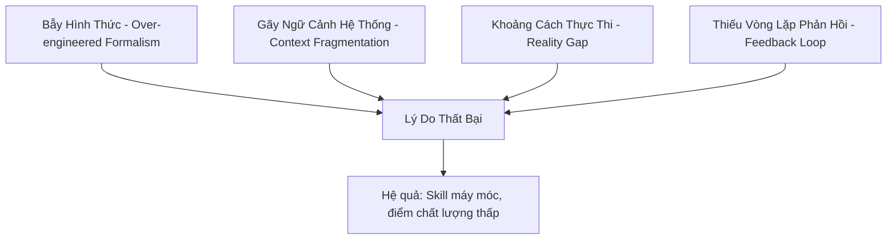
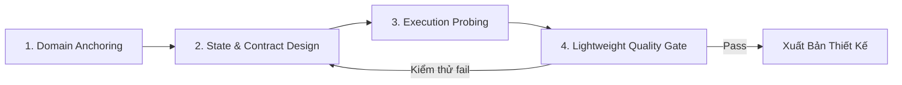

# Phân Tích Thực Trạng Thiết Kế Skill/Workflow & Đề Xuất Khung Thiết Kế Tối Ưu Cho LLM

## 1. Lý Do Thiết Kế Skill & Micro-Skill Hiện Tại Kém Hiệu Quả và Máy Móc

Qua đối chiếu thực nghiệm và phân tích các tài liệu tiêu chuẩn hiện tại trong workspace ([standards.md](file:///home/stveve/Documents/workspace/build-workflow/WASHVN/standards.md), [meta-criteria.md](file:///home/stveve/Documents/workspace/build-workflow/Temps/meta-criteria.md)), chúng tôi nhận diện được **4 điểm nghẽn cốt lõi** khiến LLM thiết kế ra các skill máy móc, rời rạc và chất lượng thấp:



### 1.1 Bẫy Hình Thức Quá Đà (Over-engineered Formalism)
*   **Thực trạng**: Các tài liệu tiêu chuẩn ép LLM tuân thủ quá nhiều định dạng phức tạp (như khối `<thought>` ngầm phải > 200 từ, cấu trúc YAML/XML lồng ghép nhiều tầng, danh sách 10 từ khóa bắt buộc...).
*   **Nguyên nhân**: Khi 80% năng lượng suy luận (cognitive capacity) và token của LLM bị tiêu tốn để thỏa mãn **luật hình thức và định dạng**, nó chỉ còn 20% năng lượng để giải quyết **bài toán nghiệp vụ thực tế**.
*   **Hậu quả**: Output nhìn rất đẹp, chuẩn XML/YAML nhưng rỗng tuếch về logic thực tế hoặc sinh ra các giải pháp ngây ngô.

### 1.2 Sự Rời Rạc Ngữ Cảnh (Context Fragmentation / Micro-skill Silos)
*   **Thực trạng**: Triết lý "chia nhỏ thành micro-skills" bị lạm dụng. Mỗi micro-skill được thiết kế độc lập.
*   **Nguyên nhân**: Khi chia quá nhỏ, LLM bị mất bức tranh tổng thể (Global Context). Nó không hiểu được trạng thái dữ liệu (state) thay đổi như thế nào trên toàn bộ hành trình workflow.
*   **Hậu quả**: Các micro-skills hoạt động độc lập thì tốt, nhưng khi ghép nối lại thì bị lệch pha về cấu trúc dữ liệu đầu ra/đầu vào (Data Contract mismatches), dẫn đến lỗi hệ thống hoặc trôi dạt ngữ cảnh (Semantic Drift).

### 1.3 Khoảng Cách Thực Thi (Reality Gap / Tool Blindness)
*   **Thực trạng**: LLM thiết kế các skill hoàn toàn "trên giấy" (chỉ thiết kế cấu trúc file, sơ đồ Mermaid) mà không có ý niệm thực tế về các công cụ vật lý hoặc môi trường thực thi (ví dụ: máy tính chạy hệ điều hành gì, phiên bản CLI nào có sẵn).
*   **Hậu quả**: Thiết kế ra những workflow rất lý tưởng nhưng không thể chạy được trong thực tế vì thiếu tool, phân quyền hoặc sai cú pháp CLI.

### 1.4 Thiếu Vòng Lặp Phản Hồi Tức Thì (Lack of Execution Feedback Loops)
*   **Thực trạng**: Pipeline hiện tại: `architect` (thiết kế static) $\rightarrow$ `planner` $\rightarrow$ `builder`.
*   **Nguyên nhân**: Giai đoạn thiết kế không có cơ chế "chạy thử nghiệm giả định" (simulation) hay kiểm thử tĩnh (dry-run). LLM thiết kế xong là bàn giao ngay mà không được tự kiểm chứng xem luồng thiết kế của mình có chạy thông suốt hay không.

---

## 2. Vai Trò Thực Sự của Giai Đoạn Thiết Kế Đối Với LLM

Đối với con người, thiết kế là để **dạy quy trình từng bước** (vì con người thiếu dữ liệu nền tảng). 
Nhưng đối với LLM, **nó đã có sẵn khối lượng tri thức khổng lồ** từ giai đoạn pre-training.

> [!IMPORTANT]
> **Vai trò thực sự của thiết kế đối với LLM không phải là viết hướng dẫn (tutorials/step-by-step), mà là:**
> 1.  **Thiết lập Mỏ neo Ngữ nghĩa (Semantic Anchors)**: Đánh thức đúng vùng tri thức chuyên gia sẵn có của LLM bằng thuật ngữ chuyên ngành (Domain Ontology).
> 2.  **Xác định Ranh giới và Luật Cứng (Guardrails & Negative Space)**: Định nghĩa rõ vùng cấm để LLM không suy đoán bừa bãi.
> 3.  **Chuẩn hóa Giao diện Truyền tin (Contracts)**: Định nghĩa chính xác cấu trúc dữ liệu đầu vào/đầu ra giữa các bước để đảm bảo tính tương hợp hoàn hảo.

---

## 3. Các Tiêu Chí Thực Sự Hiệu Quả Khi Thiết Kế Skill/Workflow Cho LLM

Thay vì tập trung vào hình thức, một bản thiết kế skill/workflow hiệu quả cho LLM cần đạt được các tiêu chí cốt lõi sau:

### Tiêu Chí 1: Mật Độ Tri Thức Hơn Hình Thức (Semantic Density over Ceremony)
*   **Giải thích**: Sử dụng các thuật ngữ chuyên ngành cực kỳ chính xác thay vì viết prompt dài dòng.
*   **Ví dụ**: Thay vì viết *"Hãy viết các ca kiểm thử bằng cách chia các trường dữ liệu thành các nhóm có cùng tính chất và kiểm tra giá trị ở biên"*, hãy viết: *"Sử dụng kỹ thuật Equivalence Partitioning và Boundary Value Analysis"*. Từ khóa chuyên ngành này sẽ kích hoạt ngay lập tức vùng vector tối ưu trong LLM.

### Tiêu Chí 2: Khớp Nối Cơ Học (Deterministic Data Contracts)
*   **Giải thích**: Đầu vào/đầu ra của mọi micro-skill phải được định nghĩa bằng các schema rõ ràng (ví dụ: JSON Schema hoặc YAML Contract cụ thể). LLM không được phép tự ý thay đổi cấu trúc này trong quá trình thực thi.
*   **Ví dụ**:
    ```yaml
    # Contract bắt buộc của Micro-skill A
    input_schema:
      project_path: string
      rules_file: string
    output_schema:
      status: "success" | "failure"
      findings: array of objects
    ```

### Tiêu Chí 3: Thiết Kế Hướng Trạng Thái (State-Oriented Workflow)
*   **Giải thích**: Thay vì thiết kế workflow theo kiểu chuỗi lệnh tuyến tính (A $\rightarrow$ B $\rightarrow$ C), hãy thiết kế theo hướng **State Machine (Máy trạng thái)**. Mỗi micro-skill nhận vào một trạng thái, biến đổi dữ liệu, và trả về trạng thái mới. Điều này giúp hệ thống tự phục hồi khi một bước bị lỗi.

### Tiêu Chí 4: Cơ Chế Tự Thẩm Định Nhị Phân (Binary Quality Gates)
*   **Giải thích**: Loại bỏ hoàn toàn các yêu cầu định tính chung chung (như "code sạch", "thiết kế tối ưu"). Thay vào đó, thiết kế phải chỉ ra được cách thức đo lường đầu ra bằng mã lệnh, exit codes hoặc regex cụ thể.

---

## 4. Giải Pháp: Tái Cấu Trúc Lại Pipeline Thiết Kế

Chúng tôi đề xuất dịch chuyển từ mô hình thiết kế tĩnh sang **Mô Hình Thiết Kế Thực Nghiệm Tinh Gọn (Lean & Interactive Design Framework)**:



### Bước 1: Domain Anchoring (Mỏ neo Nghiệp vụ)
*   Xác định rõ Domain và nạp Glossary. Chỉ cần định nghĩa ngắn gọn, cô đọng.

### Bước 2: Thiết Kế Trạng Thái và Hợp Đồng (State & Contract)
*   Vẽ sơ đồ trạng thái của workflow.
*   Định nghĩa rõ ràng cấu trúc dữ liệu lưu chuyển giữa các bước.

### Bước 3: Thử Nghiệm Thực Tế (Execution Probing)
*   Cho phép LLM chạy thử nghiệm tĩnh (dry-run) hoặc gọi các tool kiểm tra môi trường ngay trong lúc thiết kế để đảm bảo thiết kế khả thi.

### Bước 4: Chốt chặn Chất lượng Tinh gọn (Lightweight Gate)
*   Giảm bớt gánh nặng viết thought process quá dài. Hãy để LLM suy nghĩ tự nhiên, chỉ cần tập trung kiểm soát chất lượng đầu ra bằng một checklist nhị phân ngắn gọn.

---

> [!TIP]
> **Đề xuất hành động tiếp theo:**
> Chúng ta có thể tối giản hóa file [SKILL.md](file:///home/stveve/Documents/workspace/build-workflow/WASHVN/.claude/skills/skill-architect/SKILL.md) hiện tại của `skill-architect`, lược bỏ các luật hình thức rườm rà, và bổ sung thêm phần thiết kế **State Machine & Data Contracts** để LLM tập trung vào bản chất logic thay vì hình thức.
