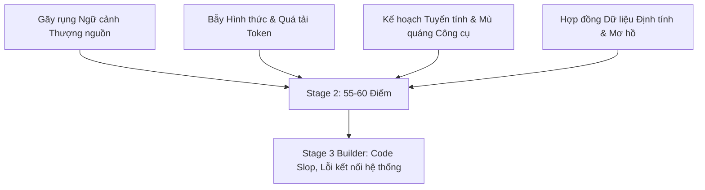
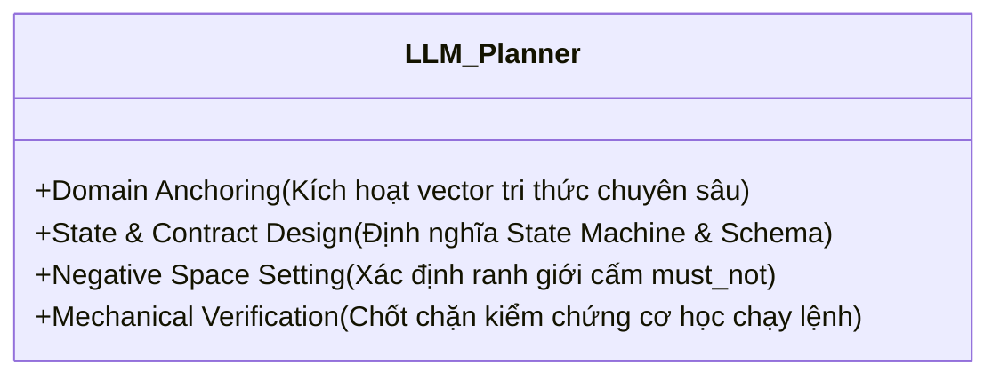

# Phân Tích Thực Trạng & Hệ Tiêu Chí Đánh Giá Cho Vai Trò LLM Planner (Stage 2)

Tài liệu này phân tích nguyên nhân cốt lõi của sự suy giảm điểm số từ **Stage 0 (Elicitation/Exploration - 80 điểm)** $\rightarrow$ **Stage 1 (Design - 75 điểm)** $\rightarrow$ **Stage 2 (Planner - 55-60 điểm)**, làm rõ vai trò thực sự của một Planner chuyên biệt cho LLM, và đề xuất bộ tiêu chí chất lượng nhị phân giúp chặn đứng lỗi ngầm trước khi bàn giao cho **Stage 3 (Builder)**.

---

## 1. 🔍 Phân Tích Thực Trạng: Tại Sao Điểm Số Giảm Dần Qua Từng Stage?

Qua khảo sát thực nghiệm và đối chiếu tài liệu [design_analysis_and_framework.md](file:///home/stveve/Documents/workspace/build-workflow/Temps/design_analysis_and_framework.md) cùng [meta-criteria.md](file:///home/stveve/Documents/workspace/build-workflow/Temps/meta-criteria.md), sự sụt giảm chất lượng tại Stage 2 (Planner) xuất phát từ 4 điểm nghẽn nghiêm trọng sau:



### 1.1 Gãy Rụng Ngữ Cảnh Thượng Nguồn (Context Leaks & Fragmentation)
* **Hiện tượng:** Planner không tận dụng được dữ liệu từ các tài liệu giai đoạn trước như Glossary (10+ từ khóa nghiệp vụ chuyên ngành) của `domain-handbook.md` (Stage 0.5), các quy luật phi chức năng (NFR - Non-Functional Requirements) từ `business-analysis.md` (Stage -1) và kịch bản biên từ `criteria.md` (Stage 0).
* **Hậu quả:** Kế hoạch thực thi (`todo.md`) bị "loãng", mất đi hơi thở nghiệp vụ chuyên sâu đã được khai thác rất tốt ở Stage 0 và 0.5, quay trở lại trạng thái thiết kế chung chung, hời hợt.

### 1.2 Bẫy Hình Thức & Quá Tải Năng Lực Duy Luận (Over-engineered Formalism)
* **Hiện tượng:** Luật hiện tại trong [SKILL.md](file:///home/stveve/Documents/workspace/build-workflow/WASHVN/.claude/skills/skill-planner/SKILL.md) và [skill-planner-agent.md](file:///home/stveve/Documents/workspace/build-workflow/WASHVN/.claude/agents/skill-planner-agent.md) ép Planner tuân thủ quá nhiều định dạng nặng nề (thought process bắt buộc > 200 từ, cấu trúc YAML lồng ghép nhiều tầng, trace tag nghiêm ngặt cho từng dòng...).
* **Hậu quả:** Phí phạm **80% năng lượng suy luận (cognitive context) và token** của LLM để thỏa mãn luật hình thức, chỉ còn **20% năng lượng** tập trung giải quyết bài toán phân tích logic và lường trước lỗi nghiệp vụ.

### 1.3 Kế Hoạch Tuyến Tính & Mù Quáng Công Cụ (Procedural Planning & Tool Blindness)
* **Hiện tượng:** Planner thiết kế các task theo kiểu tuyến tính (sửa file A $\rightarrow$ sửa file B $\rightarrow$ sửa file C) hoặc viết các chỉ thị mơ hồ ("Tạo file logic core", "Viết code sạch"). Đồng thời không kiểm tra sự khả thi của môi trường (CLI tools nào khả dụng, quyền hạn hệ thống...).
* **Hậu quả:** Builder không biết bắt đầu từ đâu, không có môi trường chạy thử và dễ sinh ra lỗi không tương thích môi trường ở pha chạy thực tế.

### 1.4 Hợp Đồng Dữ Liệu Định Tính (Qualitative Contract Mismatches)
* **Hiện tượng:** Không định nghĩa rõ Input/Output Contract cứng cho mỗi task. Bản kế hoạch cho phép Builder tự suy đoán cấu trúc dữ liệu truyền nhận giữa các module/tệp tin.
* **Hậu quả:** Khi ghép nối các micro-skills lại với nhau, hệ thống bị lệch pha cấu trúc dữ liệu đầu ra/đầu vào (Semantic Drift) khiến code bị break ở pha tích hợp.

---

## 2. 🎯 Vai Trò & Chức Năng Thực Sự Của Một LLM Planner Chuyên Biệt

Khác với con người (cần kế hoạch để học quy trình làm việc từng bước), **LLM đã có sẵn khối lượng tri thức khổng lồ nhưng thiếu ranh giới, định hướng và tiêu chí tự thẩm định.** 

Do đó, vai trò thực sự của một **LLM Planner** không phải là viết cẩm nang hướng dẫn (tutorials/step-by-step instructions), mà là thực hiện 4 chức năng cốt lõi sau:



1. **Domain Anchoring (Mỏ neo từ vựng chuyên môn):** 
   Đánh thức vùng tri thức nghiệp vụ ẩn của LLM Builder bằng cách nạp trực tiếp danh sách **Domain Glossary** và các **Business Rules** của domain đó vào đầu vào của mỗi tác vụ. 
2. **State & Contract Enforcement (Ràng buộc Trạng thái & Hợp đồng):** 
   Định nghĩa chính xác cấu trúc dữ liệu lưu chuyển (Data Schema dưới dạng YAML/JSON) và sự chuyển dịch trạng thái (State Transitions) của workspace. Builder không được phép tự chế tác cấu trúc này.
3. **Negative Space Definition (Không gian Loại trừ):** 
   Thiết lập ranh giới cứng bằng `must_not` (ví dụ: không dùng mock cho module bảo mật, không log plain text OTP, mật độ placeholder `...` hoặc `pass` bằng 0). Điều này thu hẹp không gian tìm kiếm vector của LLM, triệt tiêu slop.
4. **Mechanical Pass/Fail Verification (Chốt kiểm chứng cơ học):** 
   Cung cấp câu lệnh CLI chính xác (như `pytest`, `eslint`, `python scripts/check_contract.py`) để Builder tự chạy và lấy log thực tế làm bằng chứng kiểm thử nhị phân, tuyệt đối không cho phép Builder tự chấm "PASS" bằng lời nói suông.

---

## 3. 📊 Bộ Tiêu Chí Đánh Giá Cho Role Planner (Quality Gate 2.5)

Để đảm bảo đầu ra `todo.md` đạt chuẩn chất lượng cao nhất cho LLM Builder tiêu thụ, bản kế hoạch của Planner phải được đối chiếu và thẩm định tự động theo **5 tiêu chí nhị phân** sau:

```yaml
planner_quality_gate:
  criteria:
    - id: "PLAN-1.0"
      category: "Upstream Context Fidelity (Tính Trung thực Ngữ cảnh Thượng nguồn)"
      must:
        - "Mọi Task chính phải được liên kết (back-link) trực tiếp với một mục trong design.md §3 Zone Mapping."
        - "Phải trích xuất và đính kèm tối thiểu 10 từ khóa nghiệp vụ chuyên môn (Glossary) lấy từ domain-handbook.md vào ngữ cảnh chung."
        - "Các ràng buộc phi chức năng (NFR) từ business-analysis.md phải được ánh xạ thành các chốt chặn kỹ thuật trong task tương ứng."

    - id: "PLAN-2.0"
      category: "Semantic Density & Format (Mật độ Tri thức & Định dạng)"
      must:
        - "Tuyệt đối không viết mô tả văn xuôi dài dòng (prose), thay thế bằng thuật ngữ chuyên ngành chuẩn (ví dụ: dùng 'Equivalence Partitioning' thay vì giải thích chia nhóm giá trị)."
        - "Cấu trúc YAML Frontmatter của todo.md phải hợp lệ tuyệt đối theo todo.schema.yaml."
        - "Không vượt quá 1200 tokens đối với tài liệu todo.md chính (để bảo toàn token cho Builder suy luận)."

    - id: "PLAN-3.0"
      category: "Deterministic Contracts & State Transitions (Hợp đồng & Máy trạng thái)"
      must:
        - "Mỗi Task liên quan đến tạo/sửa file phải định nghĩa rõ input_schema và output_schema (cấu trúc dữ liệu cụ thể)."
        - "Mô tả rõ sự chuyển dịch trạng thái dữ liệu (State Transitions) của module trước và sau khi thực hiện task."

    - id: "PLAN-4.0"
      category: "Negative Space & Guardrails (Ranh giới Loại trừ)"
      must:
        - "Mỗi Task phức tạp (Priority >= High) phải có mục 'must_not' chỉ rõ các Anti-patterns nghiệp vụ và kỹ thuật cần tránh."
        - "Cấm hoàn toàn việc đề xuất viết placeholder, code rác hoặc bỏ trống logic."

    - id: "PLAN-5.0"
      category: "Mechanical Verification (Kiểm chứng Cơ học)"
      must:
        - "Mỗi Task phải đi kèm tối thiểu 1 câu lệnh CLI chạy được ngay trên workspace hiện tại để kiểm chứng kết quả."
        - "Output của lệnh kiểm chứng phải tạo ra bằng chứng vật lý (ví dụ: log file, test report) để nạp vào Stage 4 Sandbox."
```

---

## 4. 📝 Minh Họa: Plan Tệ (Qualitative Slop) vs. Plan Tốt (LLM-Optimized)

### ❌ Mẫu Kế hoạch Tệ (Gây gãy rụng và chất lượng thấp)
> Thường do Planner viết theo lối văn xuôi dành cho con người đọc, thiếu mỏ neo và tính cơ học:
```markdown
## Task 1: Thiết lập hệ thống kiểm thử
- Hãy viết các kịch bản kiểm thử cho module thanh toán OTP.
- Viết code thật sạch sẽ, tối ưu và kiểm tra xem OTP hoạt động đúng không.
- Chạy thử code và đảm bảo không có lỗi nào xảy ra.
- Tránh viết code cẩu thả.
```
*Lý do tệ:* Thiếu Glossary nghiệp vụ, từ ngữ định tính mơ hồ ("sạch sẽ, tối ưu"), không có cấu trúc hợp đồng dữ liệu, không có câu lệnh CLI chạy thực tế để lấy log nhị phân.

---

###  Mẫu Kế hoạch Tốt (Đạt chuẩn LLM-Optimized)
> Thiết lập mỏ neo ngữ nghĩa, ranh giới cứng và câu lệnh kiểm thử cơ học:
```markdown
### T1.1: Triển khai Logic Validate OTP (Zone: core/)
- **File đích:** `src/security/otp_service.py`
- **Mỏ neo Ngữ nghĩa:** OTP (One-Time Password), Nonce, Expiration Epoch, Replay Attack, Rate Limiting.
- **Hợp đồng Dữ liệu (Data Contract):**
  ```yaml
  input_schema:
    phone_number: string (E.164 format)
    otp_code: string (6 digits regex: ^\d{6}$)
    nonce: string (UUIDv4)
  output_schema:
    status: "APPROVED" | "REJECTED" | "BLOCKED"
    reason: string | null
  ```
- **Trạng thái Dữ liệu (State Transitions):**
  - `Draft` $\rightarrow$ `Pending_Verification` (khi gửi OTP) $\rightarrow$ `Verified` / `Expired` (sau khi chạy logic).
- **Ranh giới Loại trừ (Guardrails):**
  - **Must:** OTP code phải được băm HMAC-SHA256 trước khi lưu database. Giới hạn tối đa 3 lần validate sai trong 5 phút.
  - **Must Not:** Không ghi log OTP thuần (plain text) ra console hoặc tệp tin log. Không sử dụng thư viện ngẫu nhiên không an toàn (`Math.random()`).
- **Chốt Kiểm chứng Cơ học (Verification Gate):**
  - Thực thi: `pytest tests/test_otp_service.py::test_otp_validation_flow -v`
  - Bằng chứng lưu tại: `.skill-context/otp-refactor/verification.md`
```

---

## 5. 🛠️ Đề Xuất Cải Tiến Cho Kịch Bản Hiện Tại (Action Plan)

Để tích hợp hệ tiêu chuẩn này vào dự án `build-workflow`, chúng ta sẽ tiến hành cập nhật 2 file cấu hình cốt lõi của vai trò Planner:

1. **Cập nhật [SKILL.md](file:///home/stveve/Documents/workspace/build-workflow/WASHVN/.claude/skills/skill-planner/SKILL.md):** 
   - Lược bỏ bớt các yêu cầu hình thức rườm rà (thought process quá dài dòng không cần thiết).
   - Đưa hệ tiêu chuẩn **Domain Anchoring**, **Deterministic Contracts**, và **Verification Gate** vào Phase 2 (ANALYZE) và Phase 3 (WRITE).
2. **Cập nhật [skill-planner-agent.md](file:///home/stveve/Documents/workspace/build-workflow/WASHVN/.claude/agents/skill-planner-agent.md):**
   - Ràng buộc agent phải đọc đầy đủ tài liệu bối cảnh thượng nguồn (`domain-handbook.md`, `business-analysis.md`, `criteria.md`) trước khi sinh plan.
   - Thắt chặt luật kiểm duyệt đầu ra của `todo.md` để đảm bảo có đầy đủ cấu trúc Input/Output Schema và các lệnh chạy thử.
