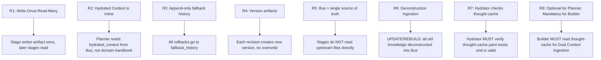

# Context Bus Rules (R1-R8)

> Role: **Registry** | Domain: **Protocol** | Design: **Contract**
> Source: `protocols-and-state-spec.md §7` (clean/)

| Rule | Description | Enforced by |
|:---|:---|:---|
| R1 | Write-Once-Read-Many | YAML Resilience Layer |
| R2 | Hydrated Context is inline | Context Bus schema |
| R3 | Append-only fallback history | `_state.yaml` protocol |
| R4 | Version artifacts | Context Bus commit hook |
| R5 | Bus = single source of truth | Architectural constraint |
| R6 | Deconstruction Ingestion | UPDATE/REBUILD path |
| R7 | Hydrator checks thought-cache | Stage 1.7 (F18 trigger) |
| R8 | Optional for Planner, Mandatory for Builder | Builder Phase 1 |
