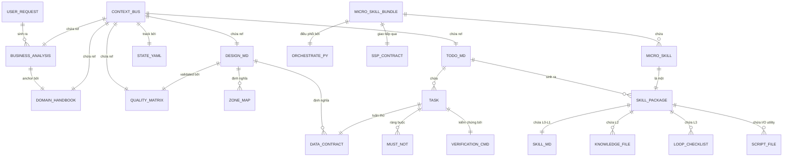

# Context Bus Schema

> Role: **Registry** | Domain: **Data** | Design: **Contract**
> Source: `protocols-and-state-spec.md §7`, `architecture-design.md §3` (clean/)

## ER Diagram — Artifact Relationships



## Schema

```yaml
context_bus:
  bus_id: "cb_20260625_001"
  pipeline_run_id: "run_001"
  created_at: "2026-06-25T10:00:00Z"
  last_updated: "2026-06-25T10:30:00Z"
  current_stage: "stage_2_planner"
  
  execution_mode: "UPDATE"          # CREATE | UPDATE | REBUILD
  source_skill_path: "/path/to/source"
  target_skill_path: "/path/to/target"
  
  deconstructed_context:            # UPDATE/REBUILD only
    original_persona, advantages_and_intent
    extracted_knowledge: [{file_name, content}]
    extracted_guardrails: {original_must, original_must_not}
    extracted_contracts: [{contract_id, path_template, format}]
  
  artifacts:                        # File references
    business_analysis: ".skill-context/{target}/business-analysis.md"
    domain_handbook: ".skill-context/{target}/domain-handbook.md"
    scs_rating: ".skill-context/{target}/scs-rating.yaml"
    design_md: ".skill-context/{target}/design.md"
    quality_matrix: ".skill-context/{target}/quality-matrix.yaml"
    criteria: ".skill-context/{target}/criteria.md"
    hydrated_context: ".skill-context/{target}/hydrated-context.yaml"
    todo_md: ".skill-context/{target}/todo.md"
    orchestration_plan: ".skill-context/{target}/orchestration-plan.md"
    plan_verification: ".skill-context/{target}/plan-verification-report.md"
    thought_cache: ".skill-context/{target}/thought-cache.yaml"
    build_log: ".skill-context/{target}/build-log.md"
    verification: ".skill-context/{target}/verification.md"
  
  hydrated_context: {domain, glossary, nfr_metrics, data_contracts, zone_map, must_not, edge_cases}
  scs_score, routing_mode, branch
  state_yaml_ref: ".skill-context/{target}/_state.yaml"
  fallback_history: []
```

## Required keys

- `bus_id`, `pipeline_run_id`, `current_stage`, `execution_mode`
- `artifacts` (at minimum: business_analysis through todo_md)
- `state_yaml_ref`