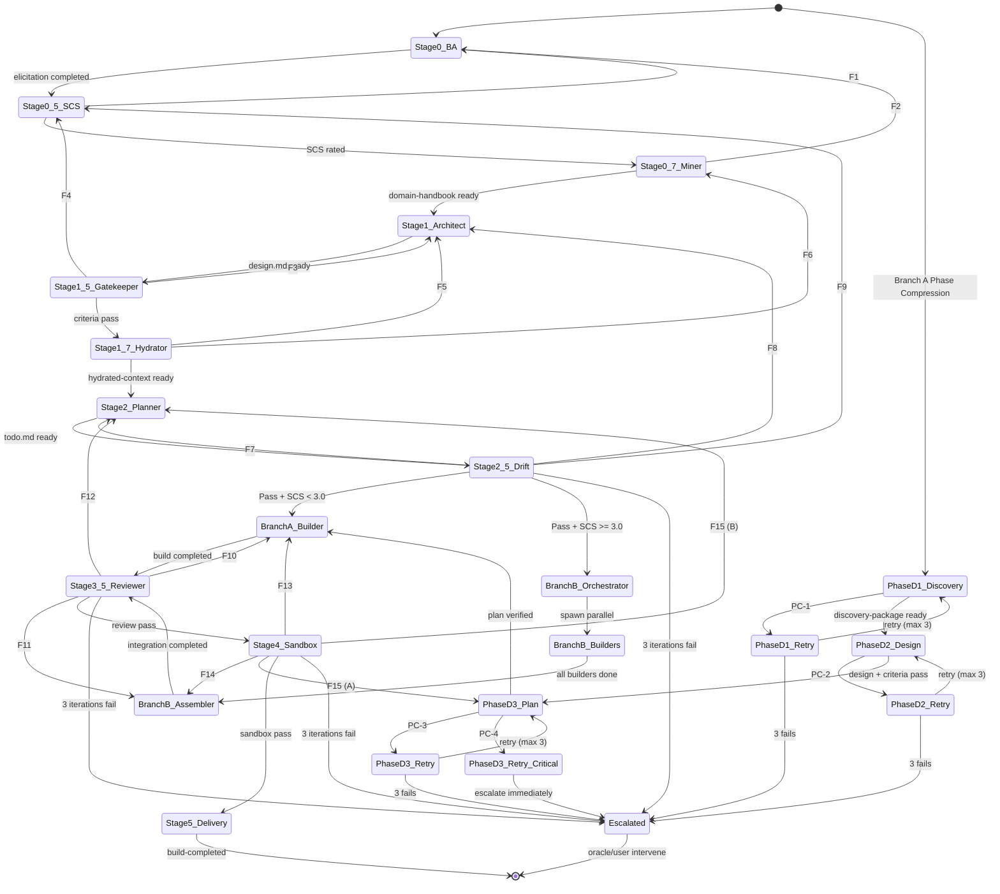

# Pipeline State Diagram

> Role: **Registry** | Domain: **Protocol** | Design: **Architecture**
> Source: `architecture-design.md §10` (clean/)

```mermaid
stateDiagram-v2
    [*] --> Stage0_BA
    [*] --> PhaseD1_Discovery : Branch A Phase Compression
    
    Stage0_BA --> Stage0_5_SCS : elicitation completed
    Stage0_5_SCS --> Stage0_BA : F1
    Stage0_5_SCS --> Stage0_7_Miner : SCS rated
    
    Stage0_7_Miner --> Stage0_BA : F2
    Stage0_7_Miner --> Stage1_Architect : domain-handbook ready
    
    Stage1_Architect --> Stage1_5_Gatekeeper : design.md ready
    Stage1_5_Gatekeeper --> Stage1_Architect : F3
    Stage1_5_Gatekeeper --> Stage0_5_SCS : F4
    Stage1_5_Gatekeeper --> Stage1_7_Hydrator : criteria pass
    
    Stage1_7_Hydrator --> Stage1_Architect : F5
    Stage1_7_Hydrator --> Stage0_7_Miner : F6
    Stage1_7_Hydrator --> Stage2_Planner : hydrated-context ready
    
    Stage2_Planner --> Stage2_5_Drift : todo.md ready
    Stage2_5_Drift --> Stage2_Planner : F7
    Stage2_5_Drift --> Stage1_Architect : F8
    Stage2_5_Drift --> Stage0_5_SCS : F9
    
    Stage2_5_Drift --> BranchA_Builder : Pass + SCS < 3.0
    Stage2_5_Drift --> BranchB_Orchestrator : Pass + SCS >= 3.0
    
    PhaseD1_Discovery --> PhaseD1_Retry : PC-1
    PhaseD1_Retry --> PhaseD1_Discovery : retry (max 3)
    PhaseD1_Retry --> Escalated : 3 fails
    PhaseD1_Discovery --> PhaseD2_Design : discovery-package ready
    
    PhaseD2_Design --> PhaseD2_Retry : PC-2
    PhaseD2_Retry --> PhaseD2_Design : retry (max 3)
    PhaseD2_Retry --> Escalated : 3 fails
    PhaseD2_Design --> PhaseD3_Plan : design + criteria pass
    
    PhaseD3_Plan --> PhaseD3_Retry : PC-3
    PhaseD3_Retry --> PhaseD3_Plan : retry (max 3)
    PhaseD3_Retry --> Escalated : 3 fails
    PhaseD3_Plan --> PhaseD3_Retry_Critical : PC-4
    PhaseD3_Retry_Critical --> Escalated : escalate immediately
    PhaseD3_Plan --> BranchA_Builder : plan verified
    
    BranchA_Builder --> Stage3_5_Reviewer : build completed
    BranchB_Orchestrator --> BranchB_Builders : spawn parallel
    BranchB_Builders --> BranchB_Assembler : all builders done
    BranchB_Assembler --> Stage3_5_Reviewer : integration completed
    
    Stage3_5_Reviewer --> BranchA_Builder : F10
    Stage3_5_Reviewer --> BranchB_Assembler : F11
    Stage3_5_Reviewer --> Stage2_Planner : F12
    Stage3_5_Reviewer --> Stage4_Sandbox : review pass
    
    Stage4_Sandbox --> BranchA_Builder : F13
    Stage4_Sandbox --> BranchB_Assembler : F14
    Stage4_Sandbox --> PhaseD3_Plan : F15 (A)
    Stage4_Sandbox --> Stage2_Planner : F15 (B)
    Stage4_Sandbox --> Stage5_Delivery : sandbox pass
    Stage5_Delivery --> [*] : build-completed
    
    Stage2_5_Drift --> Escalated : 3 iterations fail
    Stage3_5_Reviewer --> Escalated : 3 iterations fail
    Stage4_Sandbox --> Escalated : 3 iterations fail
    Escalated --> [*] : oracle/user intervene
```
