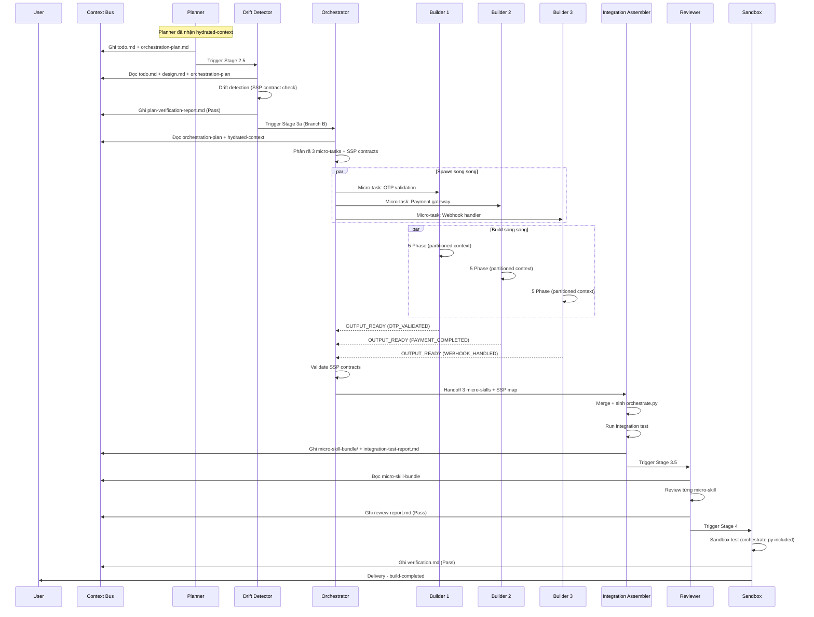

# Branch B Full Sequence

> Role: **Orchestrator** | Domain: **Execution** | Design: **Integration**
> Source: `architecture-design.md §11.2` (clean/)

```mermaid
sequenceDiagram
    participant U as User
    participant CB as Context Bus
    participant PL as Planner
    participant DD as Drift Detector
    participant OR as Orchestrator
    participant B1 as Builder 1
    participant B2 as Builder 2
    participant B3 as Builder 3
    participant IA as Integration Assembler
    participant RV as Reviewer
    participant SB as Sandbox

    Note over PL: Planner đã nhận hydrated-context
    PL->>CB: Ghi todo.md + orchestration-plan.md
    PL->>DD: Trigger Stage 2.5
    DD->>CB: Đọc todo.md + design.md + orchestration-plan
    DD->>DD: Drift detection (SSP contract check)
    DD->>CB: Ghi plan-verification-report.md (Pass)
    DD->>OR: Trigger Stage 3a (Branch B)
    
    OR->>CB: Đọc orchestration-plan + hydrated-context
    OR->>OR: Phân rã 3 micro-tasks + SSP contracts
    par Spawn song song
        OR->>B1: Micro-task: OTP validation
        OR->>B2: Micro-task: Payment gateway
        OR->>B3: Micro-task: Webhook handler
    end
    par Build song song
        B1->>B1: 5 Phase (partitioned context)
        B2->>B2: 5 Phase (partitioned context)
        B3->>B3: 5 Phase (partitioned context)
    end
    B1-->>OR: OUTPUT_READY (OTP_VALIDATED)
    B2-->>OR: OUTPUT_READY (PAYMENT_COMPLETED)
    B3-->>OR: OUTPUT_READY (WEBHOOK_HANDLED)
    
    OR->>OR: Validate SSP contracts
    OR->>IA: Handoff 3 micro-skills + SSP map
    IA->>IA: Merge + sinh orchestrate.py
    IA->>IA: Run integration test
    IA->>CB: Ghi micro-skill-bundle/ + integration-test-report.md
    IA->>RV: Trigger Stage 3.5
    
    RV->>CB: Đọc micro-skill-bundle
    RV->>RV: Review từng micro-skill
    RV->>CB: Ghi review-report.md (Pass)
    RV->>SB: Trigger Stage 4
    SB->>SB: Sandbox test (orchestrate.py included)
    SB->>CB: Ghi verification.md (Pass)
    SB->>U: Delivery - build-completed
```
