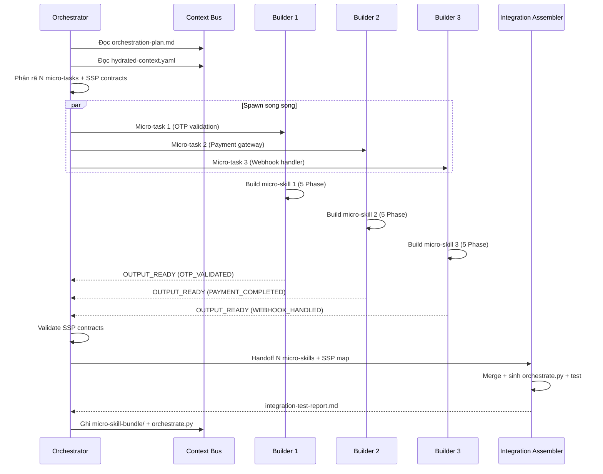

# Orchestrator Agent Spec

> Role: **Orchestrator** | Domain: **Execution** | Design: **Contract**
> Source: `orchestrator-agent-spec.md` (full) (clean/)

## Agent definition

```yaml
name: "micro-skill-orchestrator"
role: "Coordinate micro-skill bundle automatically"
trigger: "SCS >= 3.0 AND orchestration-plan.md exists"
```

## Responsibilities

- Read `orchestration-plan.md` from Context Bus
- Check `_state.yaml` status — if `degraded`, activate defensive mode
- Decompose into N independent micro-tasks with clear boundaries
- Spawn N Micro-Skill Builder subagents in parallel
- Manage SSP (State & Signal Protocol) between micro-skills
- Validate data contracts across micro-skill outputs
- Coordinate DAG execution order
- Collect results, trigger Integration Assembler
- Update `_state.yaml` with each micro-skill status

## Must / Must Not

**Must:**
- Generate `orchestrate.py` when SCS >= 3.0
- Every micro-skill must have SSP contract
- In degraded mode: tighten SSP + defensive code
- Validate schema matching between micro-skill output/input
- Spawn builders in parallel when no dependency

**Must not:**
- Write micro-skill code (only coordinate)
- Bypass data contracts between micro-skills
- Run micro-skills sequentially when parallel possible
- Skip SSP validation
- Self-certify PASS — must run mechanical tests

## Orchestrator Sequence



> See `branch-b-sequence.md` for full Branch B pipeline sequence
