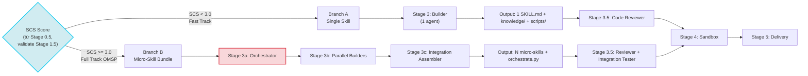
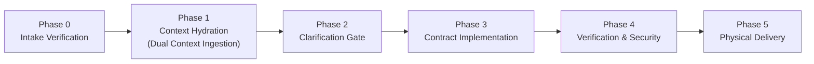

# Parallel Builders (Stage 3b)

> Role: **Coordinator** | Domain: **Execution** | Design: **Integration**
> Source: `architecture-design.md §5, §5.1` (clean/)

## Branch Splitting

## Builder 5 Phases

## Mechanism

After Orchestrator decomposes the bundle into micro-tasks:

1. Each micro-skill gets a **Builder subagent**
2. Builder reads its context partition from Context Bus (filtered by Orchestrator)
3. All independent micro-skills build **in parallel**
4. Each builder follows standard 5-Phase Builder pipeline

## Execution rules

- If micro-skills have no cross-dependency → **parallel** (default)
- If A → B dependency → A runs first, then B runs in parallel with others
- Orchestrator monitors all builders via SSP signals

## Output

Each micro-skill produces:
- `SKILL.md` + `knowledge/` + `scripts/` package
- SSP signal on completion

## Quality gates

| Gate | Check |
|:---|:---|
| ORCH-1.0 | SSP contracts defined for every micro-skill |
| ORCH-2.0 | Schema matching validated across contracts |
| ORCH-3.0 | Parallel execution (no unnecessary serialization) |
| ORCH-4.0 | Integration test run and passed |
