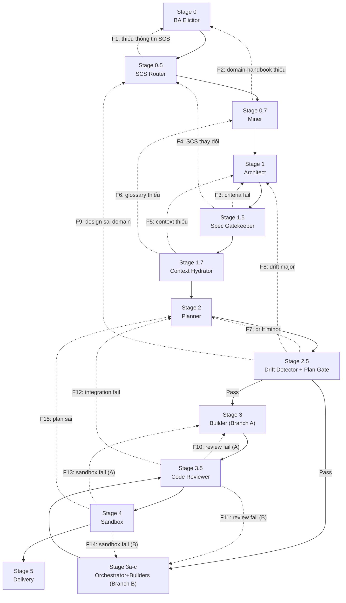

# Fallback Matrix (F1-F19)

> Role: **Gatekeeper** | Domain: **Protocol** | Design: **Fallback**
> Source: `protocols-and-state-spec.md §8` (full) (clean/)

## Fallback Flow

## Full fallback table

| ID | Stage Fail | Cause | Back to | Action |
|:---|:---|:---|:---|:---|
| **F1** | S0.5 SCS Router | Insufficient SCS info | Stage 0 | BA re-elicitation |
| **F2** | S0.7 Miner | Domain-handbook insufficient | Stage 0 | Re-elicitation |
| **F3** | S1.5 Gatekeeper | Criteria fails meta-criteria | Stage 1 | Architect revise design |
| **F4** | S1.5 Gatekeeper | SCS score changed | Stage 0.5 | Re-evaluate SCS, re-route |
| **F5** | S1.7 Hydrator | Context insufficient | Stage 1 | Architect add contracts |
| **F6** | S1.7 Hydrator | Glossary < 10 terms | Stage 0.7 | Miner expand domain-handbook |
| **F7** | S2.5 Drift Detector | Drift minor | Stage 2 | Planner re-plan |
| **F8** | S2.5 Drift Detector | Drift major | Stage 1 | Architect revise design |
| **F8-EXT** | S2.5 Semantic Audit | PASS-form, FAIL-meaning | S1 / S0 | Design revise or re-elicitation |
| **F9** | S2.5 Drift Detector | Design wrong domain | Stage 0.5 | Re-evaluate SCS |
| **F10** | S3.5 Reviewer | Review fail (Branch A) | Stage 3 | Builder re-build |
| **F11** | S3.5 Reviewer | Review fail (Branch B) | Stage 3c | Assembler re-assemble |
| **F12** | S3.5 Reviewer | Integration fail | Stage 2 | Planner revise orchestration-plan |
| **F13** | S4 Sandbox | Sandbox fail (Branch A) | Stage 3 | Builder re-build |
| **F14** | S4 Sandbox | Sandbox fail (Branch B) | Stage 3c | Assembler re-assemble |
| **F15** | S4 Sandbox | Plan wrong (root cause) | Stage 2 | Planner re-plan |
| **F16** | S0 BA | thought-cache missing thought_process | Stage 0 | Re-do elicitation |
| **F17** | S1.5 Gatekeeper | thought-cache missing empathy/questions | Stage 0 | Re-do stakeholder analysis |
| **F18** | S1.7 Hydrator | thought-cache missing/empty | Stage 0 | Depth Recovery |
| **F19** | S0 BA | thought block FAIL META-2.1 | Stage 0 | Deep thinking re-do |

## Common rules

- **Max 3 iterations** per stage → escalate
- **Append-only** `fallback_history` in `_state.yaml`
- **Root cause first**: nearest stage first, repeat → deeper fallback
- **Context Bus preserved** — only append new versions on fallback
