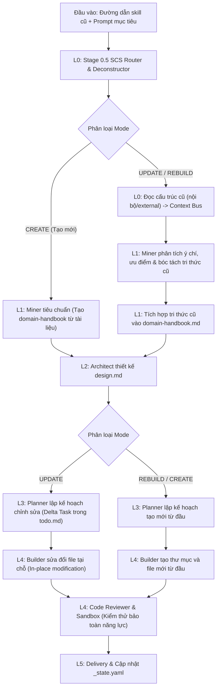

# Dual-Mode Pipeline (CREATE / UPDATE / REBUILD)

> Role: **Gatekeeper** | Domain: **Migration** | Design: **Architecture**
## Dual-Mode Flow



> Source: `skill-migration-spec.md §14.1` (clean/)

## Three execution modes

| Mode | When | What happens |
|:---|:---|:---|
| **CREATE** | New skill, no prior | Standard pipeline from Stage 0 |
| **UPDATE** | Existing WASHVN skill | Internal Deconstructor + Miner analyzes old → Delta Planning → In-place Builder |
| **REBUILD** | External/non-standard skill | External Deconstructor → full re-design → fresh Builder |

## Flow diagram

```
Input: old skill path + prompt

    ├── CREATE → Miner std → Architect → Planner std → Builder new
    │
    ├── UPDATE → Deconstructor (internal)
    │           → Miner analyze intent + knowledge
    │           → Architect design Delta
    │           → Planner Delta tasks
    │           → Builder patch in-place
    │
    └── REBUILD → Deconstructor (external)
                 → Miner convert to metadata
                 → Architect full re-design
                 → Planner standard
                 → Builder fresh
```

## Key difference

- **UPDATE**: Builder modifies existing files in-place (patches)
- **REBUILD/CREATE**: Builder creates new directory + files from scratch

> See `P7-delta-planning-and-builder/` for Delta planning details
