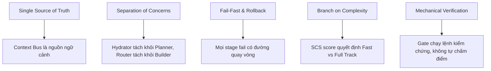
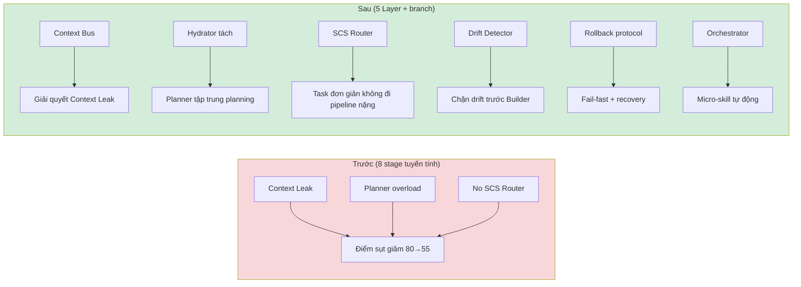

# Architecture Overview — 5-Layer Pipeline

> Design concern: **Architecture** | Applies to: **All phases P0-P7**

## 5 Layers

| Layer | Name | Responsibility | Components |
|:---|:---|:---|:---|
| **L0** | Intake & Routing | Receive requests, assess complexity, route | BA Elicitor, SCS Router |
| **L1** | Knowledge Foundation | Mine knowledge, build domain-handbook | Miner |
| **L2** | Design & Contract | Static design, semantic anchors, contracts | Architect, Spec Gatekeeper |
| **L3** | Planning & Verification | Context hydration, planning, drift detection | Hydrator, Planner, Drift Detector |
| **L4** | Implementation & Delivery | Build, review, sandbox, deliver | Builder / Orchestrator, Reviewer, Sandbox |

## 2 Branches

- **Branch A** (SCS < 3.0): Fast Track — Phase Compression (3 phases D1-D3)
- **Branch B** (SCS >= 3.0): Full Track OMSP — Orchestrator + N Parallel Builders

## 3 Execution Modes

- **CREATE**: New skill from scratch
- **UPDATE**: In-place modification of existing skill
- **REBUILD**: Reconstruct skill preserving original intent

## Design Principles

## Before vs After

> See `shared/pipeline-flowchart.md` for full pipeline view
