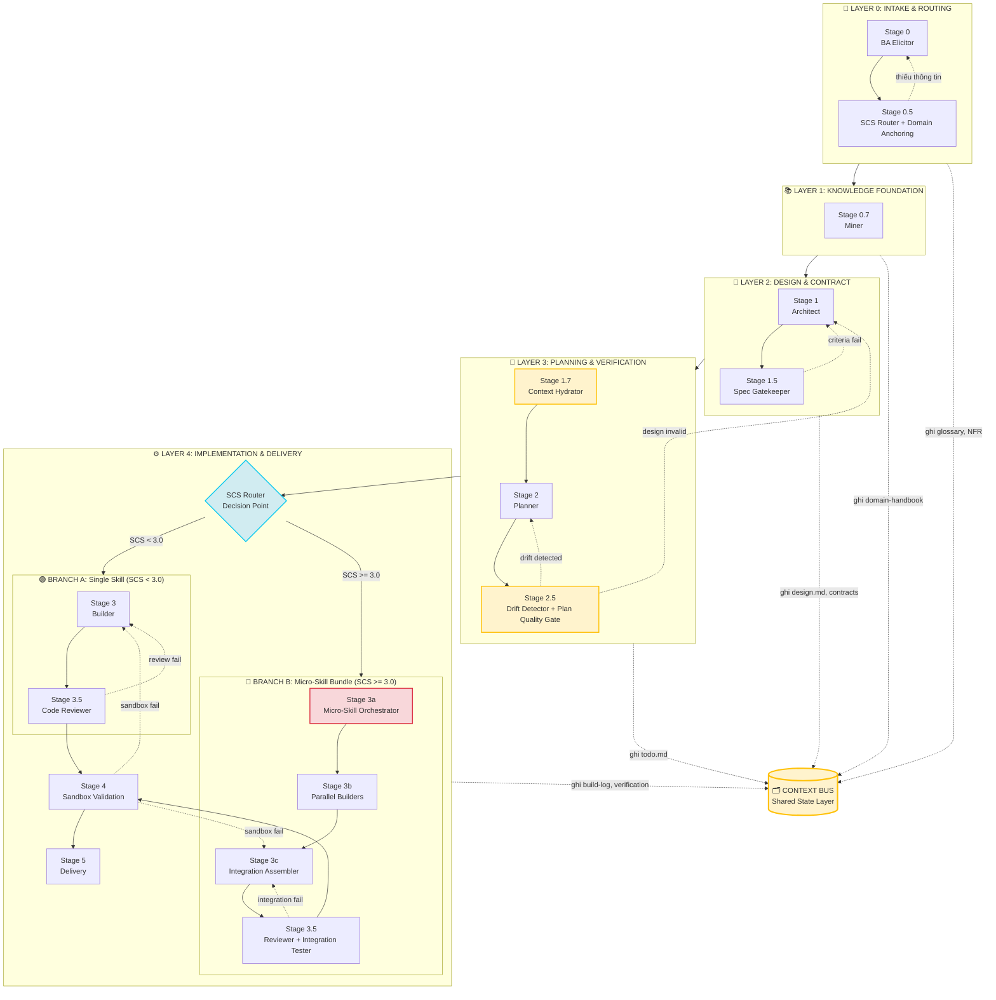

# Pipeline Flowchart

> Design concern: **Architecture** | Applies to: **All phases P0-P7**
> Source: `architecture-design.md §2` (clean/)

```mermaid
flowchart TB
    subgraph L0["🔬 LAYER 0: INTAKE & ROUTING"]
        direction TB
        S0["Stage 0<br/>BA Elicitor"]
        S05["Stage 0.5<br/>SCS Router + Domain Anchoring"]
        S0 --> S05
    end
    subgraph L1["📚 LAYER 1: KNOWLEDGE FOUNDATION"]
        direction TB
        S07["Stage 0.7<br/>Miner"]
    end
    subgraph L2["📐 LAYER 2: DESIGN & CONTRACT"]
        direction TB
        S1["Stage 1<br/>Architect"]
        S15["Stage 1.5<br/>Spec Gatekeeper"]
        S1 --> S15
    end
    subgraph L3["🧭 LAYER 3: PLANNING & VERIFICATION"]
        direction TB
        S17["Stage 1.7<br/>Context Hydrator"]
        S2["Stage 2<br/>Planner"]
        S25["Stage 2.5<br/>Drift Detector + Plan Quality Gate"]
        S17 --> S2 --> S25
    end
    subgraph L4["⚙️ LAYER 4: IMPLEMENTATION & DELIVERY"]
        direction TB
        ROUTE{"SCS Router<br/>Decision Point"}
        subgraph BRANCH_A["🟢 BRANCH A: Single Skill (SCS < 3.0)"]
            S3A["Stage 3<br/>Builder"]
            S35A["Stage 3.5<br/>Code Reviewer"]
            S3A --> S35A
        end
        subgraph BRANCH_B["🔴 BRANCH B: Micro-Skill Bundle (SCS >= 3.0)"]
            S3B0["Stage 3a<br/>Micro-Skill Orchestrator"]
            S3B1["Stage 3b<br/>Parallel Builders"]
            S3B2["Stage 3c<br/>Integration Assembler"]
            S35B["Stage 3.5<br/>Reviewer + Integration Tester"]
            S3B0 --> S3B1 --> S3B2 --> S35B
        end
        ROUTE -->|"SCS < 3.0"| BRANCH_A
        ROUTE -->|"SCS >= 3.0"| BRANCH_B
        S4["Stage 4<br/>Sandbox Validation"]
        S5["Stage 5<br/>Delivery"]
        S35A --> S4
        S35B --> S4
        S4 --> S5
    end
    CB[("🗂️ CONTEXT BUS<br/>Shared State Layer")]
    L0 --> L1 --> L2 --> L3 --> ROUTE
    L0 -.->|"ghi glossary, NFR"| CB
    L1 -.->|"ghi domain-handbook"| CB
    L2 -.->|"ghi design.md, contracts"| CB
    L3 -.->|"ghi todo.md"| CB
    L4 -.->|"ghi build-log, verification"| CB
    S25 -.->|"drift detected"| S2
    S25 -.->|"design invalid"| S1
    S15 -.->|"criteria fail"| S1
    S05 -.->|"thiếu thông tin"| S0
    S35A -.->|"review fail"| S3A
    S35B -.->|"integration fail"| S3B2
    S4 -.->|"sandbox fail"| S3A
    S4 -.->|"sandbox fail"| S3B2
    style CB fill:#fff3cd,stroke:#ffc107,stroke-width:3px
    style ROUTE fill:#d1ecf1,stroke:#0dcaf0,stroke-width:2px
    style S17 fill:#fff3cd,stroke:#ffc107,stroke-width:2px
    style S25 fill:#fff3cd,stroke:#ffc107,stroke-width:2px
    style S3B0 fill:#f8d7da,stroke:#dc3545,stroke-width:2px
```
