# Quality Gates Reference

> Design concern: **Quality** | Applies to: **All phases P0-P7**

## Quality Gates theo Stage

```mermaid
graph TD
    subgraph GATES["Quality Gates theo Stage"]
        G0["Stage 0: BA<br/>BA-1.0 Domain Ontology<br/>BA-2.0 Stakeholder<br/>BA-3.0 Edge-Case<br/>BA-4.0 Quantifiable"]
        G05["Stage 0.5: SCS<br/>SCS-1.0 Score 1.0-5.0<br/>SCS-2.0 Routing decision"]
        G07["Stage 0.7: Miner<br/>MIN-1.0 Glossary 10+<br/>MIN-2.0 Anti-patterns<br/>MIN-3.0 Exemplars"]
        G1["Stage 1: Architect<br/>ARCH-1.0 Semantic Anchors<br/>ARCH-2.0 Data Contracts<br/>ARCH-3.0 Zone Mapping<br/>ARCH-4.0 State Machine"]
        G15["Stage 1.5: Gatekeeper<br/>META-1.1 Domain Anchor<br/>META-1.2 Phase deconstruct<br/>META-2.1 Semantic Depth Gate v2.0<br/>(4 signals S1-S4 AND)<br/>META-2.2 Reverse Q<br/>META-3.1 Mechanical<br/>META-3.2 Negative Space<br/>META-3.3 Sandbox"]
        G17["Stage 1.7: Hydrator<br/>HYD-1.0 Glossary hydrate<br/>HYD-2.0 NFR hydrate<br/>HYD-3.0 Contracts hydrate<br/>---<br/>HYD-4.0 Depth Cache Presence<br/>HYD-4.1 thought-cache.yaml tồn tại<br/>HYD-4.2 thought-cache không rỗng"]
        G2["Stage 2: Planner<br/>PLAN-1.0 Context Fidelity<br/>PLAN-2.0 Semantic Density<br/>PLAN-3.0 Contracts+State<br/>PLAN-4.0 Negative Space<br/>PLAN-5.0 Mechanical Verify"]
        G25["Stage 2.5: Drift+Gate<br/>DRIFT-1.0 Back-link check<br/>DRIFT-2.0 Contract alignment<br/>DRIFT-3.0 State alignment<br/>DRIFT-4.0 Zone alignment<br/>---<br/>SAUDIT-1.0 Sampling audit enabled<br/>SAUDIT-1.1 Adaptive rate tracking<br/>SAUDIT-1.2 audit-fail-report.md generated on FAIL"]
        G3["Stage 3: Builder<br/>BUILD-1.1 Zone Contract<br/>BUILD-1.2 Fidelity<br/>BUILD-2.1 Placeholder<br/>BUILD-2.2 Cognitive Sep<br/>BUILD-3.1 Token Budget (Soft Gate)<br/>BUILD-4.1 Executable<br/>BUILD-5.1 Security<br/>---<br/>BUILD-6.0 Depth Context Loaded<br/>BUILD-6.1 thought-cache.yaml loaded<br/>BUILD-6.2 Business intent traceable"]
        G3B["Stage 3a-c: Orchestrator<br/>ORCH-1.0 SSP contracts<br/>ORCH-2.0 Schema matching<br/>ORCH-3.0 Parallel exec<br/>ORCH-4.0 Integration test"]
        G35["Stage 3.5: Reviewer<br/>REV-1.0 All BUILD gates<br/>REV-2.0 Integration (B)<br/>REV-3.0 Refactor Trigger"]
        G4["Stage 4: Sandbox<br/>SAND-1.0 verification.md<br/>SAND-2.0 Exit code 0"]
    end
```

## Gate per Stage (table)

| Stage | Gate IDs | Criteria summary |
|:---|:---|:---|
| **S0 BA Elicitor** | BA-1→4 | Domain ontology, stakeholder, edge-case, quantifiable |
| **S0.5 SCS Router** | SCS-1→2 | Score 1.0-5.0, routing decision |
| **S0.7 Miner** | MIN-1→3 | Glossary 10+, anti-patterns, exemplars |
| **S1 Architect** | ARCH-1→4 | Semantic anchors, data contracts, zone map, state machine |
| **S1.5 Gatekeeper** | META-1.1→3.3 | Domain anchor, phase deconstruction, Semantic Depth Gate v2, reverse Q, mechanical, negative space, sandbox |
| **S1.7 Hydrator** | HYD-1→4.2 | Glossary/NFR/contracts hydrate, thought-cache check |
| **S2 Planner** | PLAN-1→5 | Context fidelity, density, contracts, negative space, mechanical |
| **S2.5 Drift** | DRIFT-1→4, SAUDIT-1→1.2 | Back-link, contract/state/zone alignment, sampling audit |
| **S3 Builder** | BUILD-1.1→6.2 | Zone, fidelity, placeholder, cognitive sep, token budget, executable, security, depth context |
| **S3a-c Orchestrator** | ORCH-1→4 | SSP contracts, schema matching, parallel exec, integration |
| **S3.5 Reviewer** | REV-1→3 | All BUILD gates, integration, **REV-3.0 Refactor Trigger** |
| **S4 Sandbox** | SAND-1→2 | verification.md, exit code 0 |

## Cross-cutting

- **YAML-RES-1.0**: YAML Resilience pre-check on every artifact commit
- **HOOK-HEAL-1.0 (Advanced Prompt Gate)**: Native Prompt-based Hook with `continueOnBlock: true` on `Stop` / `SubagentStop` events. Automatically audits markdown format and YAML syntax structure, prompting the active agent to self-heal and repair formatting errors before closing the session.
- **HOOK-AUDIT-2.0 (Agent-based Verification)**: Native Agent-based Hook on `Stop` or `TaskCompleted` events to execute test suites and inspect audit logs dynamically inside a sandbox, enforcing strict build quality gates before task/session wrap-up.
- **Phase Self-Apply** (Branch A only): Stage gates become self-applied checklists in D1-D3 phases

> Source: `quality-gates-matrix.md` (clean/)
