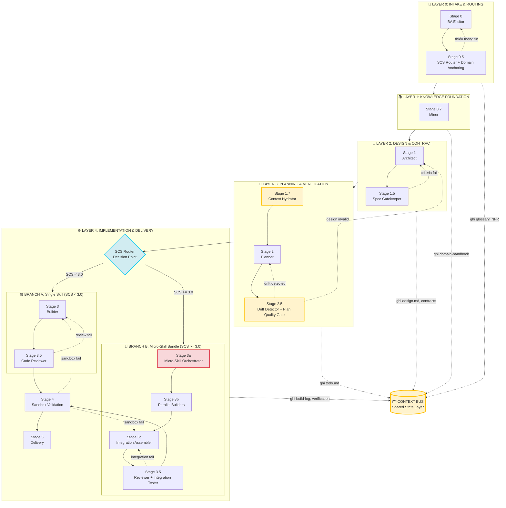
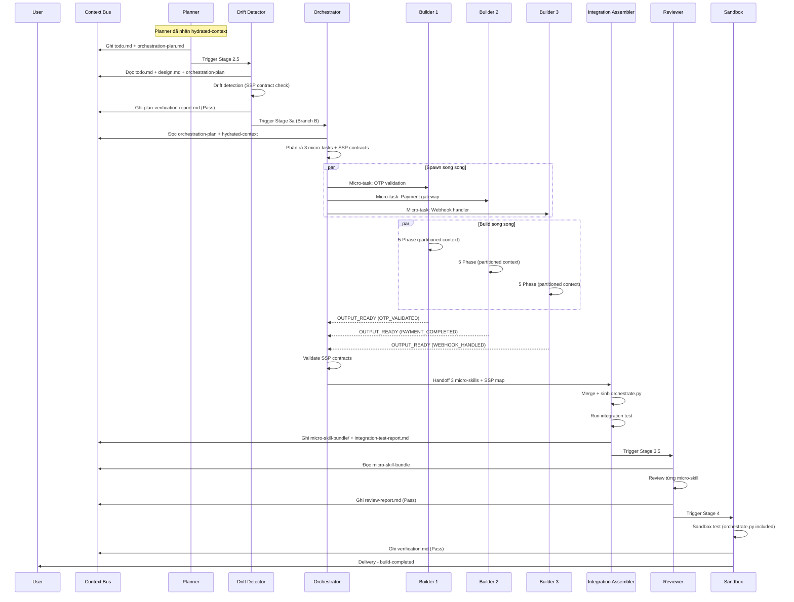
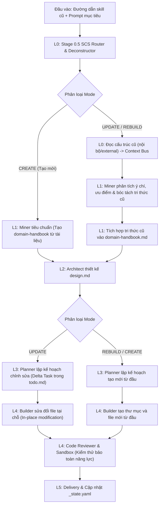
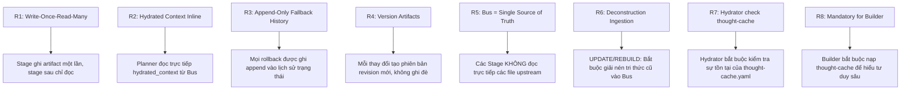
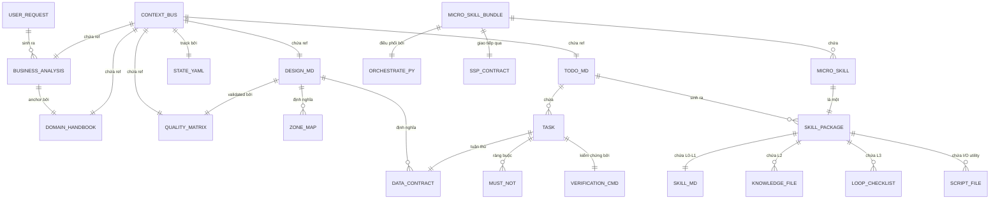
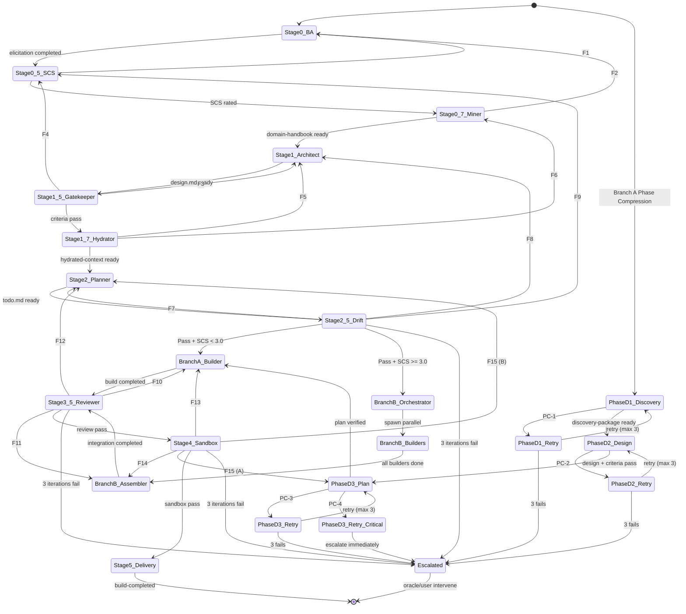

# 🏛️ MASTER SKILL SUITE ARCHITECTURE (VER_3.0.0)
## Hệ thống 5-Layer Pipeline, Phân rã Vật lý & Tự Phục Hồi

Tài liệu này định hình kiến trúc cho bộ **Master Skill Suite** phiên bản **Ver_3.0.0 (Production-Ready)** sử dụng **Mô hình 5-Layer Gated Pipeline**, hỗ trợ phân rã vật lý hoàn toàn (**Physical Micro-skills**) cho các tác vụ phức tạp, thiết lập chốt chặn chất lượng và cơ chế tự phục hồi tự động qua hệ thống **Context Bus** và **CASE Recovery**.

---

### 1. 🔄 TỔNG QUAN KIẾN TRÚC 5 LAYER (5-LAYER PIPELINE ARCHITECTURE)

Hệ thống được tổ chức thành **5 lớp chức năng (Layers)** độc lập từ khâu tiếp nhận yêu cầu cho đến khâu phân phối kỹ năng hoàn thiện:

| Layer | Tên Layer | Nhiệm vụ chính | Các Component chịu trách nhiệm |
|:---|:---|:---|:---|
| **L0** | Intake & Routing | Tiếp nhận yêu cầu thô từ người dùng, khơi gợi nghiệp vụ (BA Elicitation), đánh giá độ phức tạp (SCS) và điều phối nhánh thực thi thích hợp. | [BA Elicitor](file:///home/stveve/Documents/workspace/build-workflow/WASHVN/.agents/skills/ba-elicitor/SKILL.md), SCS Router |
| **L1** | Knowledge Foundation | Khai thác tri thức hiện hữu từ codebase, tài liệu và các skill cũ để xây dựng Cẩm nang Tri thức Dự án (Domain Handbook). | Miner Analyzer |
| **L2** | Design & Contract | Thiết kế kiến trúc tĩnh cho Skill dưới dạng bản vẽ 7 Zones, định rõ các hợp đồng dữ liệu (Data Contracts) và neo ngữ nghĩa (Semantic Anchors). | Architect, Spec Gatekeeper |
| **L3** | Planning & Verification | Nạp đầy đủ ngữ cảnh (Hydration), lập kế hoạch thực thi dạng đồ thị định hướng không chu trình (DAG) và kiểm tra độ lệch thiết kế (Drift Detection). | Context Hydrator, Planner, Drift Detector |
| **L4** | Implementation & Delivery | Triển khai mã nguồn (đơn khối hoặc song song), đánh giá chất lượng mã nguồn (Google Code Reviewer), kiểm thử sandbox cô lập và phân phối kỹ năng. | Builder / Orchestrator, Reviewer, Sandbox Tester |

#### 📊 Sơ đồ Dòng Chảy Pipeline (Pipeline Flowchart)



---

### 2. 🚦 CƠ CHẾ PHÂN LUỒNG: 2 BRANCHES & CHỈ SỐ SCS (SKILL COMPLEXITY SCORE)

Để tối ưu chi phí token và thời gian thực thi, hệ thống sử dụng điểm **SCS (Skill Complexity Score)** được tính toán tại Layer 0 để tự động rẽ nhánh tại Layer 4:

*   **Branch A (Fast-Track Mode | SCS < 3.0):** Dành cho các kỹ năng đơn giản, nén các bước Gatekeeper/Reviewer thành self-applied checklist, xây dựng duy nhất một file kỹ năng monolithic nhanh gọn.
*   **Branch B (Full-Track OMSP | SCS >= 3.0):** Dành cho các hệ thống phức tạp, bắt buộc phân rã thành một bó kỹ năng vật lý (**Micro-Skill Bundle**) giao tiếp thông qua giao thức **SSP (Shared State Protocol)**. Một Orchestrator sẽ điều phối hoạt động song song của các Builder trước khi Integration Assembler tích hợp lại.

#### ⏱️ Sơ đồ Tuần tự của Branch B (Branch B Sequence)


---

### 3. 🛠️ 3 CHẾ ĐỘ THI CÔNG (CREATE / UPDATE / REBUILD)

Hệ thống hỗ trợ 3 chế độ thi hành độc lập dựa trên thực trạng của Kỹ năng đầu vào:

| Chế độ | Điều kiện áp dụng | Mô hình hoạt động | Cơ chế Builder |
|:---|:---|:---|:---|
| **CREATE** | Tạo kỹ năng hoàn toàn mới, chưa từng tồn tại trong hệ thống. | Pipeline đi từ đầu: Elicitor $\rightarrow$ Miner $\rightarrow$ Architect $\rightarrow$ Planner $\rightarrow$ Builder. | Builder tạo mới thư mục và toàn bộ cấu trúc file từ đầu. |
| **UPDATE** | Nâng cấp hoặc sửa đổi một Kỹ năng chuẩn WASHVN đang có. | **Deconstructor** phân tích mã nguồn và bối cảnh cũ $\rightarrow$ **Miner** bóc tách tri thức và ý chí cũ $\rightarrow$ **Architect** lập bản vẽ delta $\rightarrow$ **Planner** lập delta-tasks $\rightarrow$ **Builder** vá lỗi tại chỗ. | Builder chỉnh sửa trực tiếp trên file hiện hữu (**In-place Modification/Patching**), bảo toàn logic cũ. |
| **REBUILD** | Tái cấu trúc một kỹ năng phi tiêu chuẩn (External/Legacy). | **Deconstructor** đọc cấu trúc ngoài $\rightarrow$ **Miner** chuyển đổi thành siêu dữ liệu (metadata) $\rightarrow$ **Architect** tái thiết kế toàn bộ $\rightarrow$ **Planner** lập kế hoạch chuẩn $\rightarrow$ **Builder** tạo mới. | Builder tạo mới thư mục và file dựa trên cấu trúc đã chuẩn hóa mới. |

#### 🗺️ Sơ đồ Dòng Chảy Chế Độ Kép (Dual-Mode Flow)


---

### 4. 🗂️ SỔ CÁI BỐI CẢNH & HỆ THỐNG CONTEXT BUS

Để triệt tiêu tình trạng trôi ngữ cảnh (Context Drift) và đảm bảo nguyên tắc **Single Source of Truth (SSoT)**, hệ thống giao tiếp thông qua **Context Bus** được quản lý tại thư mục trạng thái của kỹ năng: `.skill-context/{skill-name}/`.

#### 📌 Quy tắc Vận hành Context Bus (Rules R1-R8)


#### 📐 Sơ đồ ER Mối Quan Hệ Giữa Các Artifact


---

### 5. 🛡️ CHỐT CHẶN CHẤT LƯỢNG NGĂN NGỪA AI-SLOP (QUALITY GATES)

Hệ thống áp dụng các chốt chặn chất lượng tự động nghiêm ngặt bằng cách sử dụng các script kiểm tra cơ học thay vì để AI tự xác nhận:

```mermaid
graph TD
    subgraph GATES["Hệ Thống Quality Gates theo Stage"]
        G0["Stage 0: BA<br/>BA-1.0 Domain Ontology<br/>BA-2.0 Stakeholder<br/>BA-3.0 Edge-Case<br/>BA-4.0 Quantifiable"]
        G05["Stage 0.5: SCS<br/>SCS-1.0 Score 1.0-5.0<br/>SCS-2.0 Routing decision"]
        G07["Stage 0.7: Miner<br/>MIN-1.0 Glossary 10+<br/>MIN-2.0 Anti-patterns<br/>MIN-3.0 Exemplars"]
        G1["Stage 1: Architect<br/>ARCH-1.0 Semantic Anchors<br/>ARCH-2.0 Data Contracts<br/>ARCH-3.0 Zone Mapping<br/>ARCH-4.0 State Machine"]
        G15["Stage 1.5: Gatekeeper<br/>META-1.1 Domain Anchor<br/>META-1.2 Phase deconstruct<br/>META-2.1 Semantic Depth Gate v2.0<br/>META-2.2 Reverse Q<br/>META-3.1 Mechanical<br/>META-3.2 Negative Space<br/>META-3.3 Sandbox"]
        G17["Stage 1.7: Hydrator<br/>HYD-1.0 Glossary hydrate<br/>HYD-2.0 NFR hydrate<br/>HYD-3.0 Contracts hydrate<br/>---<br/>HYD-4.0 Depth Cache Presence<br/>HYD-4.1 thought-cache.yaml tồn tại<br/>HYD-4.2 thought-cache không rỗng"]
        G2["Stage 2: Planner<br/>PLAN-1.0 Context Fidelity<br/>PLAN-2.0 Semantic Density<br/>PLAN-3.0 Contracts+State<br/>PLAN-4.0 Negative Space<br/>PLAN-5.0 Mechanical Verify"]
        G25["Stage 2.5: Drift+Gate<br/>DRIFT-1.0 Back-link check<br/>DRIFT-2.0 Contract alignment<br/>DRIFT-3.0 State alignment<br/>DRIFT-4.0 Zone alignment<br/>---<br/>SAUDIT-1.0 Sampling audit enabled<br/>SAUDIT-1.1 Adaptive rate tracking<br/>SAUDIT-1.2 audit-fail-report.md generated on FAIL"]
        G3["Stage 3: Builder<br/>BUILD-1.1 Zone Contract<br/>BUILD-1.2 Fidelity<br/>BUILD-2.1 Placeholder<br/>BUILD-2.2 Cognitive Sep<br/>BUILD-3.1 Token Budget (Soft)<br/>BUILD-4.1 Executable<br/>BUILD-5.1 Security<br/>---<br/>BUILD-6.0 Depth Context Loaded<br/>BUILD-6.1 thought-cache.yaml loaded<br/>BUILD-6.2 Business intent traceable"]
        G3B["Stage 3a-c: Orchestrator<br/>ORCH-1.0 SSP contracts<br/>ORCH-2.0 Schema matching<br/>ORCH-3.0 Parallel exec<br/>ORCH-4.0 Integration test"]
        G35["Stage 3.5: Reviewer<br/>REV-1.0 All BUILD gates<br/>REV-2.0 Integration (B)<br/>REV-3.0 Refactor Trigger"]
        G4["Stage 4: Sandbox<br/>SAND-1.0 verification.md<br/>SAND-2.0 Exit code 0"]
    end
```



#### 📋 Chi tiết Tiêu Chí Nghiệm Thu của Các Gates
*   **BA-1.0 đến BA-4.0:** Phải làm rõ Domain Ontology (từ điển thuật ngữ), Stakeholder (đối tượng tác động), các trường hợp biên nguy cơ cao (Edge-Cases) và lượng hóa các yêu cầu phi chức năng (NFR).
*   **META-2.1 (Semantic Depth Gate v2.0):** Chốt chặn chất lượng bản vẽ kiến trúc. Kiểm tra xem `design.md` có đầy đủ 7 Zones hay không. Yêu cầu kết quả chấm điểm cơ học qua `loop_refiner.py` đạt **100% tiêu chuẩn** mới cấp chữ ký số `quality-matrix.yaml`.
*   **SAUDIT-1.0 (Sampling Audit):** Chốt chặn độ lệch thiết kế (Drift Gate). Cho phép kiểm tra ngẫu nhiên và theo tỷ lệ thích ứng. Nếu phát hiện sai khác giữa code/plan thực tế và bản vẽ kiến trúc, nó sẽ tạo `audit-fail-report.md` và buộc rollback.
*   **BUILD-2.1 (Zero Placeholder Rule):** Tuyệt đối không chấp nhận các đoạn mã giả, mock hoặc comments trì hoãn (`// TODO`, `pass`). Nếu phát hiện, mật độ placeholder > 0 sẽ lập tiếp đánh rớt bản build.
*   **SAND-1.0 (Sandbox Isolation):** Toàn bộ script kiểm thử (ít nhất 2 kịch bản từ `criteria.md`) phải được thực thi thành công (exit code 0) trong môi trường Docker/gVisor cô lập hoàn toàn trước khi cho phép cài đặt vào runtime.

---

### 6. 🔄 CHUYỂN TRẠNG THÁI & HỆ THỐNG TỰ PHỤC HỒI (STATE & FALLBACK PROTOCOL)

Khi bất kỳ Stage nào trong pipeline gặp lỗi validation thất bại hoặc điểm chất lượng nằm dưới ngưỡng an toàn (85%), hệ thống sẽ tự động dừng quy trình, ghi lại nhật ký lỗi và kích hoạt cơ chế quay lui (**CASE Fallback**).

#### 📉 Sơ đồ Chuyển Trạng thái và Phản hồi (State Transitions)


#### 📋 Ma trận Fallback (Fallback Matrix F1 - F19)

| ID | Stage Bị Lỗi | Nguyên Nhân Lỗi | Quay Về | Hành Động Phục Hồi |
|:---|:---|:---|:---|:---|
| **F1** | S0.5 SCS Router | Thiếu thông tin phân tích SCS | Stage 0 | Khơi gợi lại nghiệp vụ (BA re-elicitation) |
| **F2** | S0.7 Miner | Tài liệu Domain Handbook không đủ sâu | Stage 0 | Thu thập thêm thông tin/tài liệu đầu vào |
| **F3** | S1.5 Gatekeeper | Thiết kế (`design.md`) lỗi kiểm tra tĩnh | Stage 1 | Architect sửa lại bản thiết kế |
| **F4** | S1.5 Gatekeeper | Thay đổi điểm SCS trong lúc thiết kế | Stage 0.5 | Đánh giá lại SCS và rẽ nhánh lại |
| **F5** | S1.7 Hydrator | Context nạp bị thiếu | Stage 1 | Architect bổ dung hợp đồng/zone map |
| **F6** | S1.7 Hydrator | Glossary chứa ít hơn 10 thuật ngữ | Stage 0.7 | Miner bổ sung thuật ngữ chuyên môn |
| **F7** | S2.5 Drift Gate | Phát hiện sai lệch thiết kế mức độ nhỏ (Minor) | Stage 2 | Planner sắp xếp lại các task trong `todo.md` |
| **F8** | S2.5 Drift Gate | Phát hiện sai lệch thiết kế mức độ lớn (Major) | Stage 1 | Architect sửa đổi thiết kế `design.md` |
| **F8-EXT** | S2.5 Semantic Audit | Pass bề mặt nhưng sai nghĩa bản chất | S1 / S0 | Thiết kế lại hoặc khơi gợi lại yêu cầu từ đầu |
| **F9** | S2.5 Drift Gate | Thiết kế sai lệch Domain phân vùng | Stage 0.5 | Đánh giá lại SCS và phân vùng nghiệp vụ |
| **F10** | S3.5 Reviewer | Review code thất bại (Branch A) | Stage 3 | Builder sửa đổi và hoàn thiện mã nguồn |
| **F11** | S3.5 Reviewer | Review code thất bại (Branch B) | Stage 3c | Assembler lắp ghép và fix code tích hợp |
| **F12** | S3.5 Reviewer | Lỗi tích hợp luồng (Integration) | Stage 2 | Planner sửa đổi kế hoạch điều phối orchestration-plan |
| **F13** | S4 Sandbox | Lỗi sandbox chạy thử (Branch A) | Stage 3 | Builder vá lỗi thực thi |
| **F14** | S4 Sandbox | Lỗi sandbox chạy thử (Branch B) | Stage 3c | Assembler sửa lỗi tích hợp thực thi |
| **F15** | S4 Sandbox | Kế hoạch chạy thử bị sai (Lỗi gốc Planner) | Stage 2 | Planner tái lập kế hoạch `todo.md` |
| **F16** | S0 BA | `thought-cache` thiếu tư duy giải pháp | Stage 0 | Thực hiện lại khơi gợi nghiệp vụ chuyên sâu |
| **F17** | S1.5 Gatekeeper | `thought-cache` thiếu phân tích stakeholder | Stage 0 | Thu thập phân tích đối tượng tương tác |
| **F18** | S1.7 Hydrator | `thought-cache` bị trống hoặc thiếu | Stage 0 | Thực hiện quy trình Khôi phục Độ sâu (Depth Recovery) |
| **F19** | S0 BA | Phân tích tư duy sâu thất bại chặn bởi META-2.1 | Stage 0 | Thực hiện lại phiên Deep Thinking |

*Quy tắc giới hạn:* Hệ thống khống chế **tối đa 3 vòng lặp (iterations)** quay ngược cho mỗi lỗi. Nếu vượt quá, hệ thống sẽ chuyển sang trạng thái **Escalated** để nhà phát triển (Steve) can thiệp trực tiếp.

---

### 7. 📝 PROGRESSIVE DISCLOSURE & TOKEN ECONOMICS

Để đảm bảo không vượt quá giới hạn ngữ cảnh (Context Window) của Agent khi nạp nhiều micro-skills, hệ thống triển khai cơ chế **Progressive Disclosure**:

```yaml
progressive_disclosure_policy:
  skill-orchestrator:
    load_always: ["SKILL.md", "scripts/orchestrate.py"]
    load_on_demand: ["state/report.md"]
    token_budget: 400
  skill-sub-module-1:
    load_always: ["SKILL.md", "data/config.yaml"]
    token_budget: 350
  skill-sub-module-2:
    load_always: ["SKILL.md", "scripts/core.py"]
    token_budget: 350
  skill-sub-module-3:
    load_always: ["SKILL.md", "knowledge/domain-rules.md"]
    token_budget: 450
```

---

**Trạng thái tài liệu:** Đã được cập nhật và đồng bộ theo Kiến trúc Đặc tả 5-Layer Ver 3.0.0 chính thức của hệ sinh thái WASHVN.