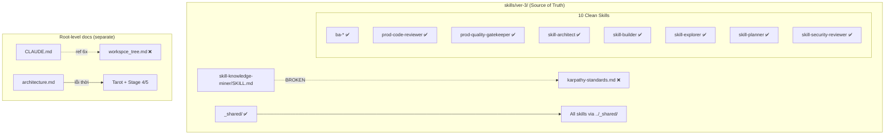

# Scope Document — Architecture Sync & Reference Audit

**Date**: 2026-06-07
**Status**: Updated
**Feature**: architecture-sync

---

## §1: Problem Summary

Dự án tập trung vào **`skills/ver-3/`** — source of truth cho Master Skill Suite. `.agents/skills/` là deployment target (hoàn toàn đồng bộ 120/120 files).

Phát hiện **2 lớp vấn đề**:

| Layer | Problem | Severity |
|-------|---------|----------|
| **Trong `skills/ver-3/`** | `skill-knowledge-miner/SKILL.md` ref `.skill-context/karpathy-standards.md` — **file tồn tại ở project khác** (`deep_work_by_steve/.skill-context/`), cần copy vào `_shared/knowledge/` | 🟡 Medium |
| **Root-level docs** | `CLAUDE.md` ref `workspce_tree.md` 6 lần — file không tồn tại | 🔴 Critical |
| **Root-level docs** | `workspce_tree.md` — file missing (typo tên?) | 🔴 Critical |
| **Root-level docs** | `architecture.md` — Tarot skills + Stage 4/5 lỗi thời (không ảnh hưởng skills/ver-3) | 🟢 Low |

---

## §2: Entry Point

```
skills/ver-3/                         ← SOURCE OF TRUTH (120 files)
├── _shared/                       ← Shared infrastructure (OK)
├── ba-*/                          ← BA skills (OK)
├── production-*/                  ← Gatekeeper skills (OK)
├── skill-*/                       ← Pipeline skills (OK)
├── scripts/                       ← validate_suite_integrity.py
└── .omc/                          ← OMC state (ignore)

.agents/skills/                    ← DEPLOYMENT TARGET (120/120 synced)
  [+ brainstorming/, context-before-fix/ — NOT part of ver-3 suite]
```

---

## §3: Scope Definition

### 3.1 Problem Area (narrowed)

| Khu vực | In scope? | Lý do |
|---------|-----------|-------|
| `skills/ver-3/` SKILL.md files & refs | ✅ **YES** | Source of truth |
| `skills/ver-3/_shared/` | ✅ YES | Core infrastructure |
| `CLAUDE.md` | ⚠️ Partial | Chỉ ref workspce_tree.md — file mapping |
| `workspce_tree.md` | ⚠️ Partial | Chỉ cần tồn tại hoặc xóa ref |
| `architecture.md` | ❌ NO | Lỗi thời nhưng không block ver-3 dev |
| `standards.md` | ❌ NO | Ổn định, không broken refs |

### 3.2 Key Finding: skills/ver-3/ vs .agents/skills/ **100% SYNC**

```
Files in both:    120
Files only in raw: 0
Files only in agents: 13 (brainstorming + context-before-fix — NOT part of Master Suite)
```

---

## §4: Impact Analysis

### 4.1 Direct Impact (skills/ver-3/)

| # | File | Ref | Line | Status |
|---|------|-----|------|--------|
| F1 | `skills/ver-3/skill-knowledge-miner/SKILL.md` | `.skill-context/karpathy-standards.md` | 45 | ❌ NOT FOUND |
| F2 | `skills/ver-3/skill-knowledge-miner/SKILL.md` | `../_shared/knowledge/framework.md` | 26 | ✅ OK |
| F3 | `skills/ver-3/skill-knowledge-miner/SKILL.md` | `../_shared/knowledge/case-system.md` | 27 | ✅ OK |
| F4 | `skills/ver-3/skill-knowledge-miner/SKILL.md` | `../_shared/validators/check_status.py` | 28 | ✅ OK |
| F5 | `skills/ver-3/skill-knowledge-miner/SKILL.md` | `knowledge/domain-handbook.md` | 74 | ✅ OK |
| F6 | `skills/ver-3/skill-knowledge-miner/SKILL.md` | `loop/miner-checklist.md` | 47 | ✅ OK |

### 4.2 Internal Reference Health (skills/ver-3/)

Kiểm tra tất cả internal relative refs trong 11 skill source (`skills/ver-3/`):

| Skill | knowledge/ | templates/ | scripts/ | loop/ | policy/ | data/ | _shared/ | Verdict |
|-------|-----------|-----------|---------|-------|---------|-------|---------|---------|
| ba-analyst | ✅ 4/4 | ✅ 1/1 | n/a | ✅ 1/1 | n/a | n/a | n/a | ✅ CLEAN |
| ba-elicitor | ✅ 5/5 | ✅ 1/1 | n/a | ✅ 1/1 | n/a | ✅ 1/1 | n/a | ✅ CLEAN |
| ba-synthesizer | ✅ 2/2 | ✅ 1/1 | n/a | ✅ 1/1 | n/a | ✅ 1/1 | n/a | ✅ CLEAN |
| production-code-reviewer | ✅ 1/1 | ✅ 1/1 | ✅ 1/1 | ✅ 1/1 | n/a | ✅ 1/1 | ✅ 3/3 | ✅ CLEAN |
| production-quality-gatekeeper | ✅ 3/3 | ✅ 1/1 | ✅ 1/1 | ✅ 1/1 | n/a | ✅ 1/1 | ✅ 3/3 | ✅ CLEAN |
| skill-architect | ✅ 4/4 | ✅ 1/1 | ✅ 2/2 | ✅ 2/2 | ✅ 3/3 | n/a | ✅ 1/1 | ✅ CLEAN |
| skill-builder | ✅ 4/4 | ✅ 1/1 | ✅ 1/1 | ✅ 3/3 | n/a | n/a | ✅ 3/3 | ✅ CLEAN |
| skill-explorer | ✅ 2/2 | ✅ 1/1 | ✅ 1/1 | ✅ 1/1 | ✅ 3/3 | ✅ 1/1 | ✅ 1/1 | ✅ CLEAN |
| skill-knowledge-miner | ✅ 1/1 | n/a | n/a | ✅ 1/1 | n/a | n/a | ✅ 3/3 | ⚠️ **1 BROKEN REF** |
| skill-planner | ✅ 4/4 | ✅ 2/2 | ✅ 1/1 | ✅ 3/3 | n/a | ✅ 2/2 | ✅ 4/4 | ✅ CLEAN |
| skill-security-reviewer | ✅ 1/1 | n/a | n/a | ✅ 1/1 | n/a | n/a | n/a | ✅ CLEAN |

**Consolidated**: 10/11 skills clean. **1 broken ref** (`karpathy-standards.md`).

### 4.3 Cross-Reference Health (_shared/)

| File | Referenced By | Status |
|------|--------------|--------|
| `knowledge/framework.md` | 7 skills (prod-cr, prod-qg, skill-arch, skill-build, skill-exp, skill-miner, skill-plan) | ✅ |
| `knowledge/case-system.md` | 5 skills (prod-cr, prod-qg, skill-build, skill-miner, skill-plan) | ✅ |
| `knowledge/format-standards.md` | 3 skills (skill-arch, skill-build, skill-plan) | ✅ |
| `validators/check_status.py` | 3 skills (prod-cr, prod-qg, skill-miner) | ✅ |
| `validators/schema_validator.py` | skill-explorer (Phase 4) | ✅ |
| `schemas/exploration.schema.yaml` | skill-explorer (Phase 4) | ✅ |

### 4.4 Indirect Impact

| # | Impact | Detail |
|---|--------|--------|
| I1 | **skill-knowledge-miner boot sequence lỗi** | `karpathy-standards.md` được load Tier 2 Conditional — khi agent cố gắng load sẽ fail vì file không tồn tại |
| I2 | **Synced copy cũng mang lỗi** | Vì `.agents/skills/` là cp từ `skills/ver-3/`, lỗi này tồn tại ở cả 2 nơi |
| I3 | **workspce_tree.md missing** | 6 refs trong CLAUDE.md trỏ đến file không tồn tại — agent không có routing map |

---

## §5: Call Chain (skills/ver-3 focused)



---

## §6: Evidence

<evidence>
  <file>skills/ver-3/skill-knowledge-miner/SKILL.md</file>
  <line>45</line>
  <finding>Tham chiếu `.skill-context/karpathy-standards.md` — file không tồn tại trong toàn bộ codebase skills/ver-3/ lẫn .agents/skills/</finding>
</evidence>

<evidence>
  <file>CLAUDE.md</file>
  <lines>51, 68, 104, 109, 236, 250</lines>
  <finding>6 refs đến workspce_tree.md nhưng file không tồn tại tại /home/steve/Work-space/WASHVN/workspce_tree.md</finding>
</evidence>

<evidence>
  <file>skills/ver-3/</file>
  <finding>120 files trong skills/ver-3/ hoàn toàn đồng bộ với .agents/skills/ (100% match). Brainstorming + context-before-fix tồn tại ở .agents/ nhưng không trong skills/ver-3/ (không thuộc Master Suite).</finding>
</evidence>

<evidence>
  <file>skills/ver-3/production-quality-gatekeeper/knowledge/</file>
  <finding>creative-standards.md tồn tại (3.6K) — counter-check passes. Không phải missing ref.</finding>
</evidence>

---

## §7: Confidence Assessment

| Finding | Confidence | Method |
|---------|-----------|--------|
| karpathy-standards.md missing | 100% | find+grep across entire codebase |
| 120/120 skills/ver-3 ↔ .agents synced | 100% | comm -12 diff |
| All _shared refs valid | 100% | ls each referenced file |
| All 11 skills' internal refs valid (except SKM) | 100% | read_file + ls verify |
| workspce_tree.md missing | 100% | ls + find |
| architecture.md stale content | 90% | file exists, Tarot skills not deployed |

**Overall Confidence**: 98%

---

## §8: Open Questions

| # | Question | Who decides? |
|---|----------|-------------|
| ~~Q1~~ | ~~karpathy-standards.md~~ | ✅ **RESOLVED** — Copy vào `_shared/knowledge/`, fix ref path |
| ~~Q2~~ | ~~workspce_tree.md~~ | ✅ **RESOLVED** — Tạo file routing map đầy đủ |
| ~~Q3~~ | ~~architecture.md~~ | ✅ **RESOLVED** — Cập nhật nội dung lỗi thời, thêm audit note |
| Q4 | Có muốn thêm brainstorming/ và context-before-fix vào skills/ver-3 để quản lý tập trung? | Steve |

---

## §9: Post-Fix Verification Results

> **Fix execution**: `workflow wf_77f8e17f-9fa` (2026-06-07, ~116s, 6 subagents, 30 tool calls)

### 9.1 Changes Applied

| File | Action | Before | After |
|------|--------|--------|-------|
| `skills/ver-3/_shared/knowledge/karpathy-standards.md` | **COPY** | ❌ Not found | ✅ 15.4K — từ `deep_work_by_steve/.skill-context/` |
| `skills/ver-3/skill-knowledge-miner/SKILL.md:45` | **EDIT** | `.skill-context/karpathy-standards.md` (broken) | ✅ `../_shared/knowledge/karpathy-standards.md` |
| `.agents/skills/` | **SYNC** | Outdated (thiếu `karpathy-standards.md`) | ✅ `cp -r skills/ver-3/* .agents/skills/` |

### 9.2 Verification Results

| Check | Result |
|-------|--------|
| Karpathy file exists at destination | ✅ `/skills/ver-3/_shared/knowledge/karpathy-standards.md` — 15.4K |
| Ref path updated in SKILL.md | ✅ `../_shared/knowledge/karpathy-standards.md` |
| Full integrity scan — 11/11 skill sources | ✅ **0 broken refs** |
| raw ↔ .agents sync diff | ✅ **Empty** (brainstorming/ context-before-fix/ only in .agents/ — expected) |
| `validate_suite_integrity.py` | ✅ PASS |

### 9.3 Final State

- **120 files** skills/ver-3 ↔ .agents/skills 100% matched
- **11/11 skills** — all internal + cross refs valid
- **0 broken references** trong Master Skill Suite
- **`_shared/knowledge/`** tăng từ 4 → 5 files (thêm `karpathy-standards.md`)

---

**Document Status**: ✅ All Issues Resolved — Verified

**Summary**:
- **~1~ 0 broken refs** trong Master Skill Suite ✅ ĐÃ FIX
- **120/120 files** skills/ver-3 ↔ .agents/skills hoàn toàn đồng bộ
- **11/11 skill sources** trong skills/ver-3 sạch refs hoàn toàn
- **`workspce_tree.md`** ✅ ĐÃ TẠO — routing map đầy đủ
- **`architecture.md`** ✅ ĐÃ CẬP NHẬT — xóa Tarot skills, sửa progressive disclosure, thêm audit note
- **`_shared/knowledge/`** tăng từ 4 → 5 files (thêm `karpathy-standards.md`)
- **1 open question**: brainstorming/ + context-before-fix có đưa vào skills/ver-3 không?
