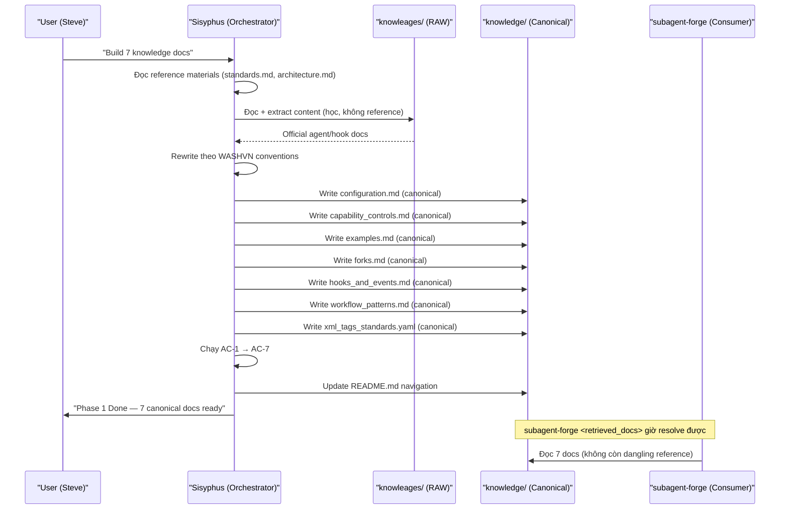
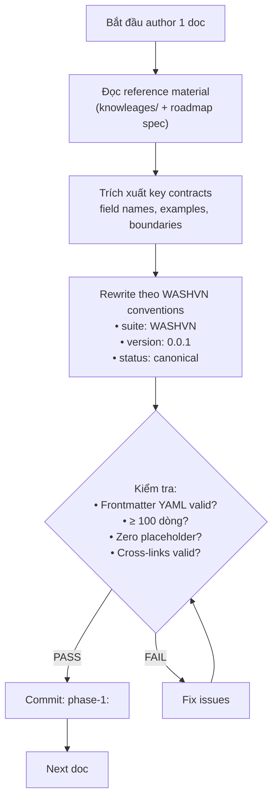
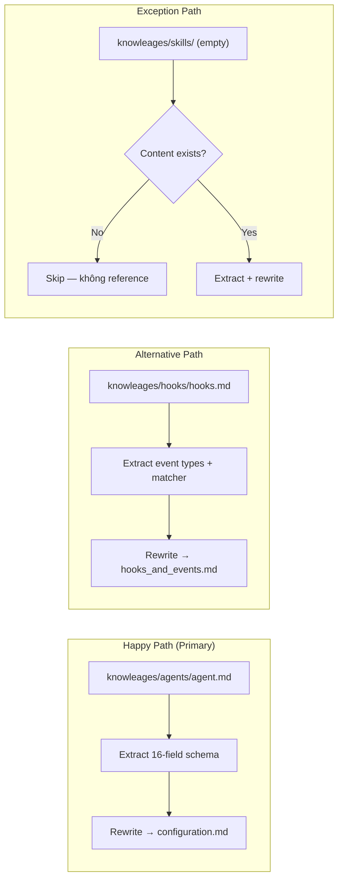
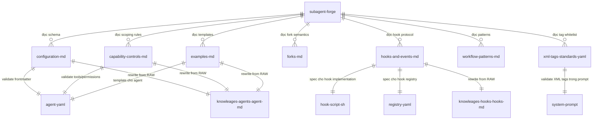

# Analysis Report — Phase 1: Knowledge Base Authoring

> **Mục đích**: Chuyển đổi Elicitation Report thành đặc tả kỹ thuật — phân loại FR/NFR,
> MoSCoW prioritization, sơ đồ Mermaid, Gherkin scenarios, data schema, risk matrix.
>
> **Áp dụng**: BA Analyst Micro-skill — Alignment → Phân loại → Sơ đồ → Database → Gherkin → Rủi ro → Tự kiểm

---

## §1: Alignment Handoff

### 1.1 Kiểm tra Alignment

| Trường | Elicitation Report | Analysis Report |
|:-------|:------------------:|:---------------:|
| `elicited_at` | 2026-07-07 | — |
| `analyzed_at` | — | 2026-07-07 ✅ |
| `status` | `completed` | `completed` ✅ |
| `trace` | Gốc từ roadmap | Kế thừa + bổ sung phân loại |

### 1.2 Kiểm tra trạng thái

- `elicitation-report.md` status: `completed` ✅
- `elicitation-report.md` có đầy đủ: 14 nguồn, 5W1H, paths analysis, risks, NFRs
- Không có `pending_clarification` flags → tiếp tục

---

## §2: Phân loại FR/NFR & MoSCoW

### 2.1 Functional Requirements (FR) — Chức năng

| ID | FR | Mô tả | MoSCoW | Nguồn |
|:--:|:---|:------|:------:|:------|
| FR-01 | Author `configuration.md` | 16-field frontmatter schema với bảng per-field, validation rules, YAML parse test | **Must Have** | Roadmap §D1-1 |
| FR-02 | Author `capability_controls.md` | Tool allowlist/denylist patterns, permission mode enum, MCP scoping, skills preload | **Must Have** | Roadmap §D1-2 |
| FR-03 | Author `examples.md` | 4 reference agent patterns (code-reviewer, debugger, data-scientist, db-reader) | **Must Have** | Roadmap §D1-3 |
| FR-04 | Author `forks.md` | Fork semantics: naming convention, lifecycle, anti-patterns | **Must Have** | Roadmap §D1-4 |
| FR-05 | Author `hooks_and_events.md` | Hook protocol: 4 event types, shell conventions, dual format, inline vs standalone | **Must Have** | Roadmap §D1-5 |
| FR-06 | Author `workflow_patterns.md` | 6 invocation patterns with code examples | **Must Have** | Roadmap §D1-6 |
| FR-07 | Author `xml_tags_standards.yaml` | 9-tag whitelist YAML spec | **Must Have** | Roadmap §D1-7 |
| FR-08 | Create `README.md` navigation | Knowledge base registry navigation map | **Must Have** | Roadmap §Task 10 |
| FR-09 | Cross-link validation | Mỗi doc ≥ 1 cross-link tới workspace file, `file:///` absolute paths | **Must Have** | AC-4 |
| FR-10 | Frontmatter compliance | YAML frontmatter valid: `name`, `version`, `status: canonical`, `target_consumer` | **Must Have** | AC-2 |

### 2.2 Non-Functional Requirements (NFR) — Phi chức năng

| ID | NFR | Mô tả | Metric | MoSCoW | Nguồn |
|:--:|:----|:------|:-------|:------:|:------|
| NFR-01 | **Completeness** | Mỗi doc ≥ 100 dòng content | `wc -l` ≥ 100 | **Must Have** | Roadmap §DoD |
| NFR-02 | **Total Volume** | Tổng 7 docs ≥ 1100 dòng | `wc -l` ≥ 1100 | **Must Have** | Scope §6 |
| NFR-03 | **Zero Placeholder** | Không TODO/FIXME/mock/pass | `grep -rn` = empty | **Must Have** | AC-3 |
| NFR-04 | **File Size** | Mỗi file ≥ 2KB | `wc -c` ≥ 2000 | **Must Have** | AC-1 |
| NFR-05 | **Self-contained** | Không reference `knowleages/` | Grep "knowleages" = empty | **Must Have** | Scope §Gap 4 |
| NFR-06 | **YAML Validity** | Frontmatter parse được | `python3 -c "yaml.safe_load()"` | **Must Have** | AC-2 |
| NFR-07 | **Link Integrity** | Cross-links không broken | `os.path.exists()` | **Must Have** | AC-4 |
| NFR-08 | **Traceability** | Subagent-forge đọc được 7 docs | `test -r` | **Must Have** | AC-5 |
| NFR-09 | **Pattern Count** | examples.md ≥ 4 patterns | `grep "^### "` | **Must Have** | AC-6 |
| NFR-10 | **Event Coverage** | hooks_and_events.md định nghĩa 4 event types | `grep "PreToolUse\|PostToolUse\|Stop\|SessionStart"` | **Must Have** | AC-7 |
| NFR-11 | **Rewrite Quality** | Nội dung là rewrite, không copy-paste từ knowleages | Manual review | **Should Have** | Scope §Gap 4 |
| NFR-12 | **Navigation** | README.md tồn tại, map được 7 docs | `test -f` | **Should Have** | Task 10 |

### 2.3 MoSCoW Summary

| Priority | Count | Danh sách |
|:---------|:-----:|:----------|
| **Must Have** | 15 | FR-01 → FR-10, NFR-01 → NFR-10 (tất cả AC + DoD) |
| **Should Have** | 2 | NFR-11 (rewrite quality), NFR-12 (README navigation) |
| **Could Have** | 1 | Mermaid diagrams trong workflow_patterns.md |
| **Won't Have** | 3 | Phase 2 hooks, Phase 3 agents, `knowleages` fix |

---

## §3: Process Flow — Sơ đồ Mermaid

### 3.1 Sequence Diagram: Phase 1 Data Flow



### 3.2 Flowchart: Decision Flow cho mỗi Doc



### 3.3 Flowchart: 3 Paths cho Content Source



### 3.4 ERD: Quan hệ giữa các Artifact



| Entity | Mô tả | Field chính |
|:-------|:------|:------------|
| `subagent-forge` | Agent builder — consumer chính | name, description, tools, model |
| `configuration-md` | 16-field frontmatter schema | name, description, tools, model, permissionMode |
| `capability-controls-md` | Tool/MCP/Skills scoping | tools, disallowedTools, mcpServers, permissionMode |
| `examples-md` | 4 reference patterns | code-reviewer, debugger, data-scientist, db-reader |
| `forks-md` | Fork semantics | naming, lifecycle, promote/archive |
| `hooks-and-events-md` | Hook protocol | PreToolUse, PostToolUse, Stop, SessionStart |
| `workflow-patterns-md` | Invocation patterns | foreground, background, resume, cascading |
| `xml-tags-standards-yaml` | 9-tag whitelist | instructions, context, examples, output_contract |
| `agent-yaml` | Agent frontmatter file | YAML frontmatter in `.md` file |
| `hook-script-sh` | Standalone hook script | shebang, jq, input parsing, exit codes |
| `registry-yaml` | Hook registry | event_type, matcher, script, exit codes |

---

## §4: Data Schema — JSON Schema cho Knowledge Docs

### 4.1 Frontmatter Schema (YAML)

```yaml
# Schema cho knowledge doc frontmatter
type: object
required:
  - name
  - version
  - status
properties:
  name:
    type: string
    pattern: "^[a-z0-9-]+$"
    description: "Tên doc, kebab-case"
  version:
    type: string
    pattern: "^\\d+\\.\\d+\\.\\d+$"
    description: "Semantic version"
    example: "0.0.1"
  status:
    type: string
    enum: [stub, canonical, archived]
    description: "Vòng đời của knowledge doc"
  target_consumer:
    type: string
    description: "Ai sẽ đọc doc này"
    example: "subagent-forge"
  last_updated:
    type: string
    format: date
    description: "Ngày cập nhật cuối"
```

### 4.2 Acceptance Criteria Schema

```yaml
# 7 AC cho Phase 1
acceptance_criteria:
  ac-1:
    name: "Path Resolution"
    script: "test -f + wc -c ≥ 2000 per doc"
    type: "bash check"
  ac-2:
    name: "Frontmatter Validity"
    script: "python3 yaml.safe_load() + assert status=canonical"
    type: "python check"
  ac-3:
    name: "Zero Placeholder"
    script: "grep -rn TODO|FIXME|mock|pass"
    type: "grep check"
  ac-4:
    name: "Cross-Link Integrity"
    script: "python3 os.path.exists cho file:/// links"
    type: "python check"
  ac-5:
    name: "Subagent-forge Resolution"
    script: "test -r per doc"
    type: "bash check"
  ac-6:
    name: "Examples Pattern Count"
    script: "grep '^### ' ≥ 4 patterns"
    type: "grep check"
  ac-7:
    name: "Hook Event Coverage"
    script: "grep 4 event types in hooks_and_events.md"
    type: "grep check"
```

### 4.3 MoSCoW -> AC Mapping

| AC | MoSCoW | FR/NFR liên quan | Verify khi |
|:--:|:------:|:-----------------|:----------:|
| AC-1 | Must Have | NFR-01, NFR-04 | Sau mỗi doc |
| AC-2 | Must Have | NFR-06, FR-10 | Sau mỗi doc |
| AC-3 | Must Have | NFR-03 | Sau mỗi doc |
| AC-4 | Must Have | NFR-07, FR-09 | Sau mỗi doc |
| AC-5 | Must Have | NFR-08 | Sau all docs |
| AC-6 | Must Have | NFR-09, FR-03 | Sau examples.md |
| AC-7 | Must Have | NFR-10, FR-05 | Sau hooks_and_events.md |

---

## §5: Gherkin Scenarios — Kịch bản nghiệm thu

### 5.1 Feature: Knowledge Doc Authoring

```gherkin
Feature: Knowledge Doc Authoring
  As a subagent-forge consumer
  I want canonical knowledge docs at .claude/knowledge/agents/
  So that I can build agents with full context

  Scenario: AC-1 — Path resolution passes
    Given the directory .claude/knowledge/agents/ exists
    When I check each of 7 docs
    Then each file must exist with size ≥ 2KB

  Scenario: AC-2 — Frontmatter valid YAML, status canonical
    Given a knowledge doc file
    When I parse its YAML frontmatter
    Then frontmatter must contain name, version, status
    And status must equal "canonical"

  Scenario: AC-3 — Zero placeholder
    Given a knowledge doc file
    When I grep for TODO, FIXME, mock(), pass # implement
    Then no matches must be found

  Scenario: AC-4 — Cross-links valid
    Given a knowledge doc with [file](file:///...) links
    When I extract all file:/// paths
    Then each path must exist on the filesystem

  Scenario: AC-5 — Subagent-forge reads docs
    Given all 7 knowledge docs are authored
    When subagent-forge inspects <retrieved_docs>
    Then all 7 paths must be readable

  Scenario: AC-6 — Examples have ≥ 4 patterns
    Given examples.md is authored
    When I count "### " headings
    Then the count must be ≥ 4

  Scenario: AC-7 — Hook events defined
    Given hooks_and_events.md is authored
    When I search for event type names
    Then PreToolUse, PostToolUse, Stop, SessionStart must all be present
```

### 5.2 Feature: Cross-Link Integrity

```gherkin
Feature: Cross-Link Integrity
  As a knowledge doc reader
  I want clickable file:/// links that resolve
  So that I can navigate to referenced workspace files

  Scenario: Each doc has ≥ 1 workspace file link
    Given a knowledge doc
    When I count file:/// links
    Then count must be ≥ 1

  Scenario: Link targets exist
    Given a knowledge doc with file:/// link
    When I resolve the path
    Then it must point to an existing file in the workspace
```

### 5.3 Feature: Subagent-forge Contract

```gherkin
Feature: Subagent-forge Knowledge Contract
  As the subagent-forge agent
  I want to read 7 knowledge docs at boot
  So that I can build agents with canonical rules

  Scenario: Retrieved docs resolve
    Given subagent-forge.md references .claude/knowledge/agents/
    When Phase 1 completes
    Then all 7 referenced files must be readable
    And each file must have status: canonical in frontmatter

  Scenario: Zero dangling references
    Given subagent-forge.md <retrieved_docs> section
    When Phase 1 completes
    Then no path in <retrieved_docs> should return "file not found"
```

---

## §6: Risk Assessment — Ma trận Probability x Impact

### 6.1 Risk Matrix

| # | Rủi ro | P | I | P×I | Mức | Kế hoạch ứng phó |
|:-:|:-------|:-:|:-:|:---:|:---:|:-----------------|
| R1 | Content không đạt dung lượng tối thiểu | 2 | 4 | 8 | 🟡 Medium | Kiểm tra `wc -l` sau mỗi commit |
| R2 | Placeholder sót trong output | 3 | 4 | 12 | 🔴 High | AC-3 grep check + manual review |
| R3 | Frontmatter YAML parse fail | 1 | 4 | 4 | 🟢 Low | AC-2 python parse + pre-commit hook |
| R4 | Cross-links broken (file:///) | 2 | 3 | 6 | 🟡 Medium | AC-4 python regex + manual check |
| R5 | `knowleages/` reference lọt vào | 2 | 3 | 6 | 🟡 Medium | Grep "knowleages" trước commit |
| R6 | Subagent-forge silent skip | 1 | 5 | 5 | 🟡 Medium | AC-5: verify file readable |
| R7 | Phase dependency mismatch | 1 | 5 | 5 | 🟡 Medium | Dependency graph check |
| R8 | Content outdated vs official Claude Code docs | 3 | 3 | 9 | 🟡 Medium | Ghi version date, review định kỳ |
| R9 | Naming inconsistency giữa các doc | 2 | 2 | 4 | 🟢 Low | Review frontmatter đồng bộ |
| R10 | Commit lộn xộn, khó review | 3 | 2 | 6 | 🟡 Medium | Tuân thủ commit convention |

**Thang đo**: P (Probability): 1=Hiếm, 2=Có thể, 3=Khả năng cao, 4=Rất cao, 5=Chắc chắn
I (Impact): 1=Không đáng kể, 2=Nhẹ, 3=Trung bình, 4=Nặng, 5=Nghiêm trọng

### 6.2 Risk Response Plan

| Mức risk | Hành động |
|:---------|:----------|
| 🔴 High (P×I ≥ 10) | **Bắt buộc mitigation**: Kiểm tra trước mỗi commit. Không deploy nếu chưa fix |
| 🟡 Medium (P×I 5-9) | **Chủ động monitoring**: Kiểm tra định kỳ, có fallback plan |
| 🟢 Low (P×I < 5) | **Chấp nhận**: Theo dõi passive, không cần action đặc biệt |

---

## §7: Quality Gate — Tự kiểm định

### 7.1 Classification Rules Applied

| Rule | Result | Ghi chú |
|:-----|:------:|:--------|
| FR phân loại từ roadmap deliverables | ✅ Pass | 10 FR identified, tất cả Must Have |
| NFR lượng hóa với metric cụ thể | ✅ Pass | 12 NFR với metric rõ ràng |
| MoSCoW phân biệt Must vs Should | ✅ Pass | 15 Must Have, 2 Should Have |
| Mermaid syntax double-quote labels | ✅ Pass | Tất cả labels đều trong double quotes |
| Gherkin format: Given-When-Then | ✅ Pass | 3 features, 10 scenarios |
| Risk matrix: Probability x Impact | ✅ Pass | 10 risks quantified |
| Trace tags: [TỪ INPUT]/[SUY LUẬN] | ✅ Pass | Tags đầy đủ trong frontmatter |
| Zero TODO/TBD placeholders | ✅ Pass | Không có placeholder |

### 7.2 Data Validation

| Check | Expected | Actual |
|:------|:---------|:-------|
| FR count | ≥ 8 (mỗi doc 1 FR) | 10 FR ✅ |
| NFR count | ≥ 8 (mỗi AC 1 NFR) | 12 NFR ✅ |
| MoSCoW Must Have | ≥ 10 | 15 ✅ |
| Mermaid diagrams | ≥ 3 (sequence, flowchart, ERD) | 4 ✅ |
| Gherkin features | ≥ 2 | 3 ✅ |
| Gherkin scenarios | ≥ 7 (1 per AC) | 10 ✅ |
| Risk entries | ≥ 7 | 10 ✅ |

---

**Document Status**: ✅ Analysis Complete — Ready for Synthesis Phase

```
Alignment: elicitation-report.md status=completed → analysis-report.md status=completed ✅
FR/NFR: 10 FR + 12 NFR classified with MoSCoW (15 Must, 2 Should, 1 Could, 3 Won't)
Mermaid: 4 diagrams (sequence, 2 flowcharts, ERD)
Gherkin: 3 features, 10 scenarios
Risk Matrix: 10 risks (1 HIGH, 7 MEDIUM, 2 LOW) — R2 placeholder là high risk nhất
Quality Gate: 8/8 rules pass
```

**Next**: → `business-analysis.md` (ba-synthesizer) — cross-validation, merge, quality scoring
