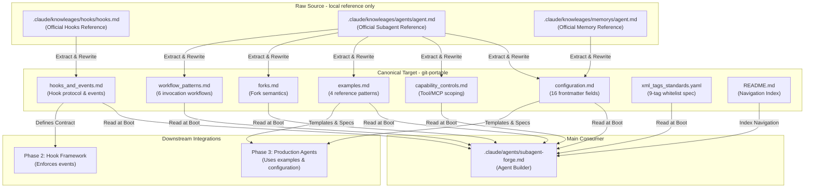
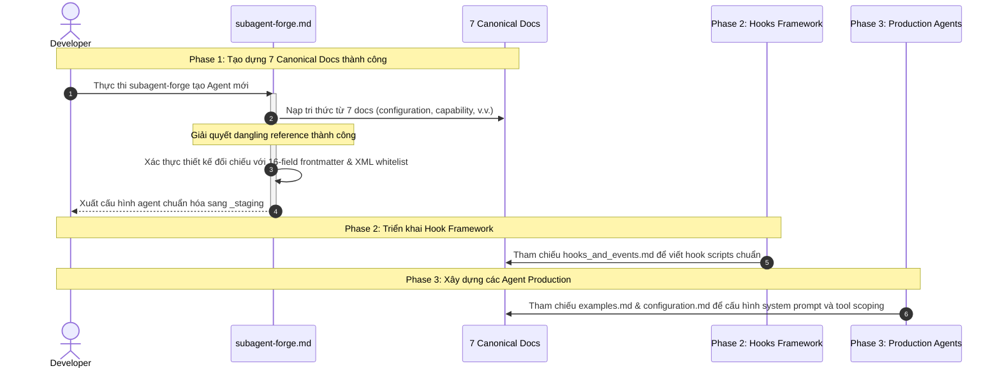

# Architecture & Plan — Phase 1: Knowledge Base Authoring (High-Fidelity Spec)

> [!IMPORTANT]
> Tài liệu này được xây dựng dựa trên sự hợp nhất thông tin từ [business-analysis.2026-07-07.md](file:///home/stveve/Documents/workspace/build-workflow/WASHVN/docs/context-to-work/phase-1/business-analysis.2026-07-07.md) và [phase-1-transition-scope.2026-07-07.md](file:///home/stveve/Documents/workspace/build-workflow/WASHVN/docs/context-to-work/phase-1/phase-1-transition-scope.2026-07-07.md). Nó đóng vai trò định hướng kiến trúc kỹ thuật và cung cấp các **khung xương tài liệu (skeletons)** chi tiết để sẵn sàng cho việc triển khai tự động.

---

## §1: Kiến Trúc Hệ Thống (Physical & Logical Architecture)

### 1.1 Cấu Trúc Thư Mục Vật Lý (Physical Directory Layout)

Triển khai Phase 1 tác động trực tiếp lên phân vùng tri thức và cấu hình đại lý trong workspace [WASHVN](file:///home/stveve/Documents/workspace/build-workflow/WASHVN):

```text
WASHVN/
├── .claude/
│   ├── agents/
│   │   └── subagent-forge.md           ← [Consumer] Đại lý tạo subagent, tham chiếu 7 docs
│   ├── knowleages/                     ← [Raw Source] Tri thức gốc từ Claude Code (gitignored)
│   │   ├── agents/agent.md
│   │   ├── hooks/hooks.md
│   │   └── memorys/agent.md
│   └── knowledge/                      ← [Target Area] Tri thức chuẩn hóa (canonical - git-pushed)
│       └── agents/
│           ├── configuration.md        ← [Deliverable 1.1] Frontmatter Schema 16-field
│           ├── capability_controls.md  ← [Deliverable 1.2] Tool/MCP Scoping
│           ├── examples.md             ← [Deliverable 1.3] 4 Reference Patterns
│           ├── forks.md                ← [Deliverable 1.4] Fork Semantics
│           ├── hooks_and_events.md     ← [Deliverable 1.5] Hook Protocol Spec
│           ├── workflow_patterns.md    ← [Deliverable 1.6] Invocation Patterns
│           ├── xml_tags_standards.yaml  ← [Deliverable 1.7] 9-Tag Whitelist
│           └── README.md               ← [Deliverable 1.10] Navigation Map
```

### 1.2 Kiến Trúc Logic & Luồng Dữ Liệu (Logical Architecture & Data Flow)

Kiến trúc Phase 1 tổ chức theo mô hình **Rewrite & Self-contained**. Chúng ta trích xuất và viết lại hoàn toàn tri thức từ nguồn thô `.claude/knowleages/` (đang có lỗi typo cố ý để phân biệt) sang thư mục tri thức chuẩn hóa `.claude/knowledge/agents/` để đảm bảo tính di động cao (git-portable), không bị liên kết gãy khi chia sẻ dự án.



---

## §2: Khung Xương Tri Thức (Knowledge Doc Skeletons)

Mỗi tài liệu trong danh sách 7 deliverables bắt buộc tuân thủ định dạng nghiêm ngặt của chuẩn **LLM Knowledge Activation Standard**:
1. **Frontmatter YAML**: Bắt buộc chứa `name`, `version`, `status`, `target_consumer`, và `suite`.
2. **Dung lượng**: Tối thiểu 100 dòng nội dung thực tế (khoảng 300 - 500 tokens tiếng Việt) để đảm bảo LLM nhận đủ bối cảnh cần thiết.
3. **Chỉ số Placeholder**: Bằng 0 (không chứa `TODO`, `FIXME`, `mock`, `pass`, v.v.).

Dưới đây là đặc tả khung xương và nguồn ánh xạ chi tiết cho từng tài liệu:

### 2.1 configuration.md — Frontmatter Schema (16-field)
* **Nguồn thô**: [agent.md (RAW)](file:///.claude/knowleages/agents/agent.md) lines 267-284, 427-443, 286-303 và [agent.md (Memory)](file:///.claude/knowleages/memorys/agent.md) lines 55-63.
* **Mẫu Khung Xương (Skeleton)**:
```markdown
---
name: configuration
version: 0.0.1
last_updated: 2026-07-07
status: canonical
target_consumer: subagent-forge
suite: WASHVN
---

# Frontmatter Configuration Reference

Tài liệu này đặc tả 16 trường cấu hình frontmatter của đại lý (agent) trong Claude Code.

## 1. Schema Bảng 16 Trường
| Trường | Kiểu | Bắt buộc | Mặc định | Quy tắc hợp lệ & Mô tả |
| :--- | :--- | :---: | :--- | :--- |
| `name` | string | ✅ Yes | — | kebab-case, duy nhất trong `.claude/agents/` |
| `description` | string | ✅ Yes | — | Mô tả khi nào Claude sẽ delegate. Tối đa 500 ký tự. |
| `model` | string | No | `inherit` | `sonnet`, `opus`, `haiku`, `fable` hoặc ID đầy đủ. |
| `tools` | list | No | (Tất cả) | Danh sách tool cho phép sử dụng. |
| `disallowedTools`| list | No | — | Danh sách tool cấm sử dụng (áp dụng trước tools). |
| `permissionMode` | enum | No | `default` | `default`, `acceptEdits`, `auto`, `bypassPermissions`, `plan`, `dontAsk`. |
| `maxTurns` | int | No | — | Số lượt suy nghĩ tối đa của agent. |
| `skills` | list | No | — | Skills được tải trước tại khởi động (tối đa 3). |
| `mcpServers` | list | No | — | Khai báo MCP servers inline hoặc tham chiếu. |
| `hooks` | object | No | — | Lifecycle hooks cục bộ (`PreToolUse`, `PostToolUse`, `Stop`, `SessionStart`). |
| `memory` | enum | No | — | Scope của bộ nhớ lưu trữ (`user`, `project`, `local`). |
| `background` | bool | No | `true` | Chạy nền (background) hoặc chạy chính (foreground). |
| `effort` | enum | No | — | Effort level (`low`, `medium`, `high`, `xhigh`, `max`). |
| `isolation` | enum | No | — | Chạy trên git worktree biệt lập (`worktree`). |
| `color` | enum | No | — | Màu hiển thị trong task list (`red`, `blue`, `green`, v.v.). |
| `initialPrompt` | string | No | — | Prompt tự động kích hoạt khi chạy ở chế độ `--agent`. |

## 2. Quy Tắc Ràng Buộc & Kiểm Tra của WASHVN
* Cấm sử dụng `bypassPermissions` trong mọi trường hợp (safety violation).
* Các tool `Bash`, `WebFetch`, `NotebookEdit` bắt buộc phải có lý do biện hộ (justification) trong acceptance criteria.
* Tối đa 8 tools cho một agent.

## 3. Xác Thực YAML Parse
```python
# python3 -c "import yaml; yaml.safe_load(open('.claude/knowledge/agents/configuration.md'))"
```
```
*(Chi tiết thêm tối thiểu 100 dòng)*
```

---

### 2.2 capability_controls.md — Tool/MCP/Skills Scoping
* **Nguồn thô**: [agent.md (RAW)](file:///.claude/knowleages/agents/agent.md) lines 308-467.
* **Mẫu Khung Xương (Skeleton)**:
```markdown
---
name: capability-controls
version: 0.0.1
last_updated: 2026-07-07
status: canonical
target_consumer: subagent-forge
suite: WASHVN
---

# Capability Scoping & Controls

Đặc tả cách phân vùng năng lực của đại lý thông qua công cụ (Tools), MCP, và Skills.

## 1. Cơ Chế Allowlist và Denylist
* `disallowedTools` được áp dụng trước `tools`.
* Để vô hiệu hóa MCP server: sử dụng pattern `mcp__<server>` hoặc `mcp__*` để chặn toàn bộ MCP.
* Chỉ cho phép tối đa 8 tools trên mỗi agent.

## 2. Các Chế Độ Quyền Hạn (Permission Modes)
* `default`: Xác nhận từng bước.
* `acceptEdits`: Tự động đồng ý sửa file (bắt buộc kết hợp với PreToolUse hook để khóa write path).
* `plan`: Read-only, không kích hoạt công cụ ghi/sửa file.

## 3. Quản Lý MCP và Skills
* MCP servers inline: `mcpServers: [{playwright: {type: stdio, command: npx, args: [...]}}]`
* Skills preload: Tối đa 3 skills từ `skills-registry.json`.

## 4. Ma Trận Rủi Ro (Anti-patterns)
| Cấu Hình | Hậu Quả | Giải Pháp |
| :--- | :--- | :--- |
| `Bash` + `bypassPermissions` | Rò rỉ mã thực thi nguy hiểm | Luôn tắt bypassPermissions |
| `Write` + `acceptEdits` không hook | Tự động ghi đè file không kiểm soát | Cài PreToolUse hook |

```
*(Chi tiết thêm tối thiểu 100 dòng)*
```

---

### 2.3 examples.md — 4 Reference Patterns
* **Nguồn thô**: [agent.md (RAW)](file:///.claude/knowleages/agents/agent.md) và [subagent-forge.md](file:///.claude/agents/subagent-forge.md).
* **Mẫu Khung Xương (Skeleton)**:
```markdown
---
name: examples
version: 0.0.1
last_updated: 2026-07-07
status: canonical
target_consumer: subagent-forge
suite: WASHVN
---

# Reference Agent Patterns

Tài liệu này cung cấp 4 mẫu thiết kế agent chuẩn chỉnh.

## 1. code-reviewer Pattern (Phân Tích Chỉ Đọc)
```yaml
name: code-reviewer
description: Phân tích và đánh giá chất lượng mã nguồn
tools: Read, Glob, Grep
model: inherit
```
* **System Prompt**: Bạn là chuyên gia đánh giá chất lượng mã nguồn. Tập trung kiểm tra tính bảo mật, hiệu năng và phong cách code...

## 2. debugger Pattern (Chẩn Đoán và Fix Lỗi)
```yaml
name: debugger
description: Tìm nguyên nhân gốc rễ và sửa lỗi
tools: Read, Edit, Bash, Grep
model: inherit
```
* **Vòng lặp**: Giả thuyết (Hypothesis) → Kiểm thử (Test) → Sửa đổi (Fix) → Xác minh (Re-verify).

## 3. data-scientist Pattern (Phân Tích Dữ Liệu SQL)
```yaml
name: data-scientist
description: Phân tích dữ liệu BigQuery/SQL
tools: Read, Bash, Grep, Task
model: sonnet
```

## 4. db-reader Pattern (Chỉ Đọc CSDL, Gated Bash Hook)
```yaml
name: db-reader
description: Truy vấn dữ liệu CSDL chỉ đọc
tools: Read, Bash
hooks:
  PreToolUse:
    - matcher: "Bash"
      hooks:
        - type: command
          command: "./scripts/validate-readonly-query.sh"
```
* **Script validation** (`./scripts/validate-readonly-query.sh`): Chặn toàn bộ các lệnh chứa `INSERT|UPDATE|DELETE|DROP|TRUNCATE`.

```
*(Chi tiết thêm tối thiểu 100 dòng)*
```

---

### 2.4 forks.md — Experimental Fork Semantics
* **Nguồn thô**: [agent.md (RAW)](file:///.claude/knowleages/agents/agent.md) lines 89, 184-220.
* **Mẫu Khung Xương (Skeleton)**:
```markdown
---
name: forks
version: 0.0.1
last_updated: 2026-07-07
status: canonical
target_consumer: subagent-forge
suite: WASHVN
---

# Experimental Agent Fork Semantics

Định nghĩa quy tắc tạo nhánh (fork) thử nghiệm agent.

## 1. Quy Ước Đặt Tên Fork
* Định dạng: `<parent-name>--<fork-suffix>`
* Ví dụ: `code-reviewer--strict-mode`

## 2. Vòng Đời của Một Fork
1. **Experiment**: Khởi tạo bản fork chạy song song với parent agent.
2. **Evaluation**: Đánh giá hiệu quả của bản fork trong môi trường thử nghiệm.
3. **Promote**: Đổi tên bản fork thay thế cho parent agent ban đầu.
4. **Archive**: Lưu trữ và đóng bản fork nếu không đạt yêu cầu.

## 3. Cảnh Báo Chống Lạm Dụng
* Cấm tạo "shadow fork" bằng cách sửa description mà giữ nguyên tools.
* Chỉ được phép dùng fork khi có yêu cầu rõ ràng.

```
*(Chi tiết thêm tối thiểu 100 dòng)*
```

---

### 2.5 hooks_and_events.md — Hook Protocol Specification
* **Nguồn thô**: [hooks.md (RAW)](file:///.claude/knowleages/hooks/hooks.md) toàn bộ tài liệu (~1000 dòng).
* **Mẫu Khung Xương (Skeleton)**:
```markdown
---
name: hooks-and-events
version: 0.0.1
last_updated: 2026-07-07
status: canonical
target_consumer: subagent-forge
suite: WASHVN
---

# Hook Protocol & Event Specification

Tài liệu đặc tả các cổng chặn (hooks) và sự kiện (events) trong Claude Code.

## 1. Danh Sách 4 Sự Kiện Lõi
* `PreToolUse`: Kích hoạt trước khi chạy tool. Nhận JSON `{tool_name, tool_input}` từ stdin.
* `PostToolUse`: Kích hoạt sau khi tool hoàn thành. Nhận `{tool_name, tool_input, tool_output}`.
* `Stop`: Kích hoạt khi dừng phiên (Ctrl-C).
* `SessionStart`: Kích hoạt khi boot phiên làm việc.

## 2. Matcher Syntax
* `"Bash"`: Khớp chính xác công cụ Bash.
* `"Edit|Write"`: Khớp Edit hoặc Write (dấu `|` là OR).
* `"^Notebook"`: Khớp biểu thức RegExp unanchored.

## 3. Chặn Tool với Dual-Format
### Format A: Stdout JSON (Canonical)
```bash
#!/bin/bash
# .claude/hooks/check.sh
COMMAND=$(jq -r '.tool_input.command')
if [[ "$COMMAND" == *"rm -rf"* ]]; then
  jq -n '{
    hookSpecificOutput: {
      hookEventName: "PreToolUse",
      permissionDecision: "deny",
      permissionDecisionReason: "Destructive commands blocked by WASHVN safety hook"
    }
  }'
  exit 0
fi
exit 0
```

### Format B: Exit Code 2 (Alternative)
```bash
#!/bin/bash
INPUT=$(cat)
COMMAND=$(echo "$INPUT" | jq -r '.tool_input.command // empty')
if [[ "$COMMAND" == *"DROP"* ]]; then
  echo "Error: DROP statement is forbidden" >&2
  exit 2
fi
exit 0
```

```
*(Chi tiết thêm tối thiểu 100 dòng)*
```

---

### 2.6 workflow_patterns.md — Invocation Patterns
* **Nguồn thô**: [agent.md (RAW)](file:///.claude/knowleages/agents/agent.md) lines 656-739.
* **Mẫu Khung Xương (Skeleton)**:
```markdown
---
name: workflow-patterns
version: 0.0.1
last_updated: 2026-07-07
status: canonical
target_consumer: subagent-forge
suite: WASHVN
---

# Invocation & Workflow Patterns

Đặc tả 6 mô hình vận hành đại lý ở runtime.

## 1. Danh Sách 6 Workflow Patterns
1. **Foreground invocation**: Gọi đồng bộ, cha dừng đợi con.
2. **Background invocation**: Gọi bất đồng bộ (chạy nền), poll kết quả sau.
3. **Resume pattern**: Tiếp tục hội thoại dựa trên `task_id` cũ.
4. **Compaction pattern**: Đại lý tự tóm tắt context cũ khi cửa sổ bối cảnh đầy.
5. **Cascading agents**: Gọi lồng nhau (độ sâu tối đa ≤ 2).
6. **Cross-runtime invocation**: Claude Code gọi chéo sang Codex/Hermes.

## 2. Cú Pháp Task Call
```python
# Foreground
task(subagent_type="explore", run_in_background=false)

# Background
task(subagent_type="explore", run_in_background=true)
```

## 3. Bảng Ước Tính Chi Phí Token
| Pattern | Số Lượng Lượt Điển Hình | Ước Tính Token Tiêu Thụ |
| :--- | :---: | :--- |
| Foreground Explore | 2-3 turns | ~5k - 10k tokens |
| Cascading (depth=2) | 5-10 turns | ~25k - 50k tokens |

```
*(Chi tiết thêm tối thiểu 100 dòng)*
```

---

### 2.7 xml_tags_standards.yaml — 9-Tag Whitelist Spec
* **Nguồn thô**: Quy ước thiết kế từ [subagent-forge.md](file:///.claude/agents/subagent-forge.md) và [standards.md](file:///home/stveve/Documents/workspace/build-workflow/WASHVN/standards.md).
* **Mẫu Khung Xương (Skeleton)**:
```yaml
# xml_tags_standards.yaml
name: xml-tags-standards
version: 0.0.1
last_updated: 2026-07-07
status: canonical
target_consumer: subagent-forge
suite: WASHVN

canonical_xml_tags:
  - tag: instructions
    usage: "Điều khiển hành vi agent — các luật cứng"
    placement: "Đầu prompt hệ thống"
    required_attribute: "priority (normal|critical)"
    allow_nested: false
  
  - tag: context
    usage: "Dữ liệu tham chiếu tĩnh, không phải mệnh lệnh"
    allow_nested: false
  
  - tag: examples
    usage: "Chứa các ví dụ thực tế minh họa mẫu đúng"
  
  - tag: input
    usage: "Bao bọc thông tin đầu vào từ user"
  
  - tag: output_contract
    usage: "Định dạng đầu ra bắt buộc của agent"
  
  - tag: retrieved_docs
    usage: "Tham chiếu tới các tệp tin tri thức (đường dẫn tuyệt đối)"
  
  - tag: task
    usage: "Mô tả tác vụ cụ thể cần thực thi"
  
  - tag: constraints
    usage: "Ràng buộc cứng phải tuân thủ (must/must_not)"
    sub_tags: [must, must_not]
  
  - tag: acceptance_criteria
    usage: "Tiêu chí nghiệm thu đầu ra"
```

---

## §3: Quyết Định Thiết Kế & Giải Quyết Khoảng Trống (Design Decisions & Gap Reconciliations)

Trong quá trình phân tích tài liệu bối cảnh, các mâu thuẫn và khoảng trống kỹ thuật sau đây đã được giải quyết:

### Quyết định 1: Cơ chế Chặn Tool Dual-Format (Hook Blocking Protocol)
Có sự khác biệt giữa đặc tả roadmap cũ (dùng `exit 2` để chặn) và tài liệu vận hành thực tế của Claude Code (dùng stdout JSON `permissionDecision: "deny"`). 
* **Giải pháp**: Tài liệu [hooks_and_events.md](file:///.claude/knowledge/agents/hooks_and_events.md) sẽ đặc tả cả 2 format:
  - *Format A (Stdout JSON)*: Khuyến nghị dùng cho các hooks phức tạp cần có lý do rõ ràng để phục vụ audit log.
  - *Format B (Exit Code 2)*: Chấp nhận cho các shell scripts đơn giản.
  - Luồng quyết định chi tiết sẽ được xử lý tại Phase 2.

### Quyết định 2: Chiến lược Rewrite 100% (Self-contained Strategy)
Để tránh liên kết bị đứt gãy (broken links) when chia sẻ mã nguồn, chúng ta thực hiện viết lại hoàn toàn tri thức (rewrite) thay vì tạo liên kết tham chiếu (reference-only) đến `.claude/knowleages/`.
* **Giải pháp**: Toàn bộ 7 tài liệu canonical bắt buộc phải tự đọc hiểu độc lập (self-contained) mà không phụ thuộc vào sự tồn tại của thư mục raw source.

### Quyết định 3: Quy ước thư mục `knowleages/` (Intentional Typo)
Thư mục `.claude/knowleages/` cố tình viết sai chính tả. Đây là vùng lưu trữ tạm thời tri thức gốc (RAW) từ hệ sinh thái Claude Code và được đưa vào `.gitignore` để tránh đẩy lên kho mã nguồn chung. Thư mục `.claude/knowledge/` (viết đúng chính tả) là nơi lưu trữ tri thức chuẩn hóa (canonical) được đẩy lên git.

### Quyết định 4: Bổ sung Kiểm tra Tự động cho NFR-05 (Self-contained Enforcement)
Báo cáo BA phát hiện ra NFR-05 (không được tham chiếu chéo ngược lại thư mục raw `knowleages/`) đang thiếu Acceptance Criteria kiểm tra tự động.
* **Giải pháp**: Bổ sung kiểm tra tự động bằng cách tích hợp lệnh grep quét từ khóa `knowleages` vào kịch bản kiểm định AC-8 tại tài liệu kế hoạch thực thi.

---

## §4: Giao Diện Hạ Nguồn & Luồng Tích Hợp (Downstream Interface & Integration)

Sau khi Phase 1 hoàn thành, luồng tích hợp với các thành phần khác sẽ tự động được kích hoạt:



* **Điểm nghẽn (Bottleneck)**: `subagent-forge.md` và các phase tiếp theo hoàn toàn bị block nếu Phase 1 chưa hoàn thành hoặc không pass bộ lọc AC-1 đến AC-8. Do đó, tính chính xác và chất lượng của 7 docs là ưu tiên tối cao.

---

## §5: Tiếp Cận Bước Tiếp Theo (Onboarding Reference)

Thông tin chi tiết về các bước thực hiện tuần tự và kịch bản kiểm thử AC tự động được lưu trữ tại:
* [todo-checklist.2026-07-07.md](file:///home/stveve/Documents/workspace/build-workflow/WASHVN/docs/context-to-work/phase-1/todo-checklist.2026-07-07.md)

---
**Document Status**: Designed & Approved
* **Approved by**: Antigravity
* **Next Action**: Tạo tệp todo-checklist và tiến hành thực thi Task 1.
