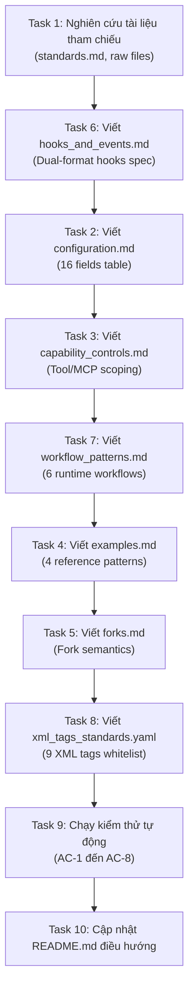

# Todo Checklist & Verification Gates — Phase 1: Knowledge Base Authoring (High-Fidelity)

> [!NOTE]
> Tài liệu này cung cấp danh sách công việc (todo list) chi tiết từng bước, liên kết trực tiếp tới các khung xương thiết kế tại [architecture-plan.2026-07-07.md](file:///home/stveve/Documents/workspace/build-workflow/WASHVN/docs/context-to-work/phase-1/architecture-plan.2026-07-07.md) và các tệp gốc. Điều này đảm bảo quá trình triển khai có thể chạy tự động mà không cần thêm sự suy diễn của LLM.

---

## §1: Bản Đồ Phụ Thuộc Task (DAG Task Blocker Map)



---

## §2: Kế Hoạch Triển Khai Chi Tiết (Actionable Blueprint)

| Task ID | Trace Tag | Hoạt Động Cụ Thể | Nguồn Tham Chiếu Gốc (RAW) | Khung Xương Đích (Skeleton Link) | Quy Tắc Nghiệp Vụ Cần Nhớ | Commit Message |
|:---:|:---|:---|:---|:---|:---|:---|
| **Task 1** | `[TỪ DESIGN §2.5]` | **Đọc tài liệu định hướng**<br>Nghiên cứu nguyên tắc token, liên kết click, block hooks. | [standards.md](file:///home/stveve/Documents/workspace/build-workflow/WASHVN/standards.md) §3, [subagent-forge.md](file:///home/stveve/Documents/workspace/build-workflow/WASHVN/.claude/agents/subagent-forge.md) | N/A | Không dùng relative paths cho cross-links. | *(Không có commit)* |
| **Task 2** | `[TỪ DESIGN §2.1]` | **Triển khai configuration.md**<br>Tạo tệp tri thức cấu hình và 16-field schema. | [agent.md:L267-307](file:///home/stveve/Documents/workspace/build-workflow/WASHVN/.claude/knowleages/agents/agent.md#L267-L307), [memorys/agent.md:L55-63](file:///home/stveve/Documents/workspace/build-workflow/WASHVN/.claude/knowleages/memorys/agent.md#L55-L63) | [configuration Skeleton](file:///home/stveve/Documents/workspace/build-workflow/WASHVN/docs/context-to-work/phase-1/architecture-plan.2026-07-07.md#L45) | **Cấm** ghi từ khóa `knowleages` và `bypassPermissions`. | `phase-1: configuration schema canonical doc` |
| **Task 3** | `[TỪ DESIGN §2.2]` | **Triển khai capability_controls.md**<br>Tác giả quy tắc scoping tool/MCP/skills. | [agent.md:L308-467](file:///home/stveve/Documents/workspace/build-workflow/WASHVN/.claude/knowleages/agents/agent.md#L308-L467) | [capability_controls Skeleton](file:///home/stveve/Documents/workspace/build-workflow/WASHVN/docs/context-to-work/phase-1/architecture-plan.2026-07-07.md#L101) | Tối đa 8 tools/agent và 3 skills preload. | `phase-1: capability controls doc` |
| **Task 4** | `[TỪ DESIGN §2.3]` | **Triển khai examples.md**<br>Tạo 4 boilerplates thực tế cho đại lý. | [agent.md:L247-257](file:///home/stveve/Documents/workspace/build-workflow/WASHVN/.claude/knowleages/agents/agent.md#L247-L257) | [examples Skeleton](file:///home/stveve/Documents/workspace/build-workflow/WASHVN/docs/context-to-work/phase-1/architecture-plan.2026-07-07.md#L143) | Prompt hệ thống của mỗi ví dụ phải ≥ 30 dòng. | `phase-1: examples reference patterns` |
| **Task 5** | `[TỪ DESIGN §2.4]` | **Triển khai forks.md**<br>Đặc tả phân nhánh agent thử nghiệm. | [agent.md:L89](file:///home/stveve/Documents/workspace/build-workflow/WASHVN/.claude/knowleages/agents/agent.md#L89), [agent.md:L184-220](file:///home/stveve/Documents/workspace/build-workflow/WASHVN/.claude/knowleages/agents/agent.md#L184-L220) | [forks Skeleton](file:///home/stveve/Documents/workspace/build-workflow/WASHVN/docs/context-to-work/phase-1/architecture-plan.2026-07-07.md#L191) | Sử dụng quy ước đặt tên `--fork-suffix`. | `phase-1: fork semantics doc` |
| **Task 6** | `[TỪ DESIGN §2.5]` | **Triển khai hooks_and_events.md**<br>Viết đặc tả hook protocol và Dual-Format. | [hooks.md:L15-65](file:///home/stveve/Documents/workspace/build-workflow/WASHVN/.claude/knowleages/hooks/hooks.md#L15-L65), [hooks.md:L90-108](file:///home/stveve/Documents/workspace/build-workflow/WASHVN/.claude/knowleages/hooks/hooks.md#L90-L108) | [hooks_and_events Skeleton](file:///home/stveve/Documents/workspace/build-workflow/WASHVN/docs/context-to-work/phase-1/architecture-plan.2026-07-07.md#L225) | Tác giả chi tiết cả 2 định dạng: Stdout JSON và Exit 2. | `phase-1: hook protocol spec` |
| **Task 7** | `[TỪ DESIGN §2.6]` | **Triển khai workflow_patterns.md**<br>Tác giả 6 runtime workflows và token cost. | [agent.md:L656-739](file:///home/stveve/Documents/workspace/build-workflow/WASHVN/.claude/knowleages/agents/agent.md#L656-L739) | [workflow_patterns Skeleton](file:///home/stveve/Documents/workspace/build-workflow/WASHVN/docs/context-to-work/phase-1/architecture-plan.2026-07-07.md#L279) | Phải có ví dụ Task call và bảng Token cost. | `phase-1: workflow patterns doc` |
| **Task 8** | `[TỪ DESIGN §2.7]` | **Triển khai xml_tags_standards.yaml**<br>Viết 9-tag whitelist chuẩn hóa dạng YAML. | [standards.md §3](file:///home/stveve/Documents/workspace/build-workflow/WASHVN/standards.md) | [xml_tags Skeleton](file:///home/stveve/Documents/workspace/build-workflow/WASHVN/docs/context-to-work/phase-1/architecture-plan.2026-07-07.md#L327) | Tuân thủ chính xác định dạng YAML thuần túy. | `phase-1: xml tags whitelist` |
| **Task 9** | `[TỪ AUDIT TÀI NGUYÊN]` | **Chạy kiểm định tự động toàn diện**<br>Chạy bash suite kiểm tra AC-1 đến AC-8. | N/A | [Section §3 phía dưới](file:///home/stveve/Documents/workspace/build-workflow/WASHVN/docs/context-to-work/phase-1/todo-checklist.2026-07-07.md#L98) | Sửa đổi toàn bộ các lỗi cho tới khi PASS 100%. | `phase-1: acceptance criteria pass` |
| **Task 10**| `[TỪ AUDIT TÀI NGUYÊN]` | **Cập nhật README.md điều hướng**<br>Tạo tệp README điều hướng cho tri thức. | N/A | N/A | Phải chứa liên kết tới cả 7 tệp canonical. | `phase-1: knowledge registry README` |

---

## §3: Script Xác Thực Tiêu Chỉ Nghiệm Thu (Automated Verification Scripts)

Các lệnh và đoạn mã dưới đây được thiết kế để chạy trực tiếp trên Terminal tại thư mục gốc của workspace.

### AC-1: Xác thực sự tồn tại và dung lượng tài liệu
Mỗi tệp tin tri thức phải tồn tại và có dung lượng tối thiểu 2000 Bytes (đảm bảo độ phủ ≥ 100 dòng).
```bash
for doc in configuration.md capability_controls.md examples.md forks.md hooks_and_events.md workflow_patterns.md xml_tags_standards.yaml; do
  test -f .claude/knowledge/agents/$doc || { echo "FAIL: Missing $doc"; exit 1; }
  size=$(wc -c < .claude/knowledge/agents/$doc)
  if [ $size -lt 2000 ]; then
    echo "FAIL: $doc size is $size bytes (less than 2000 bytes)"; exit 1;
  fi
done
echo "AC-1 PASS: All 7 files exist and satisfy the size requirement."
```

### AC-2: Xác thực Frontmatter YAML và trạng thái
Mỗi tệp tin Markdown phải có YAML frontmatter hợp lệ và trường status phải bằng `canonical`.
```bash
python3 << 'EOF'
import yaml, os
docs = ['configuration.md', 'capability_controls.md', 'examples.md', 'forks.md', 'hooks_and_events.md', 'workflow_patterns.md', 'xml_tags_standards.yaml']
for d in docs:
    p = f'.claude/knowledge/agents/{d}'
    with open(p) as f:
        content = f.read()
    if not content.startswith('---'):
        print(f"FAIL: {d} missing frontmatter divider")
        exit(1)
    parts = content.split('---')
    if len(parts) < 3:
        print(f"FAIL: {d} frontmatter malformed")
        exit(1)
    try:
        data = yaml.safe_load(parts[1])
    except Exception as e:
        print(f"FAIL: YAML parse error in {d}: {e}")
        exit(1)
    assert 'name' in data, f"FAIL: {d} missing field 'name'"
    assert 'version' in data, f"FAIL: {d} missing field 'version'"
    assert 'status' in data, f"FAIL: {d} missing field 'status'"
    assert data['status'] == 'canonical', f"FAIL: {d} status '{data['status']}' is not 'canonical'"
print("AC-2 PASS: All files have valid YAML frontmatter and canonical status.")
EOF
```

### AC-3: Kiểm tra zero-placeholder
Đảm bảo không sót các chuỗi placeholder như `TODO`, `FIXME`, `mock`, `pass # implement`.
```bash
if grep -rn -E "(TODO|FIXME|mock\(\)|pass # implement)" .claude/knowledge/agents/; then
  echo "FAIL: Found placeholders in knowledge base!"
  exit 1
else
  echo "AC-3 PASS: Zero placeholders found."
fi
```

### AC-4: Kiểm tra tính liên kết nội bộ (Cross-links validity)
Tất cả các liên kết `file:///` trong tài liệu bắt buộc phải tồn tại trong workspace.
```bash
python3 << 'EOF'
import re, os
docs = os.listdir('.claude/knowledge/agents/')
for d in docs:
    p = f'.claude/knowledge/agents/{d}'
    with open(p) as f:
        c = f.read()
    # Tìm kiếm các mẫu link file:///
    links = re.findall(r'\]\((file:///[^\)]+)\)', c)
    for link in links:
        # Loại bỏ file:/// để lấy path tuyệt đối
        path = link.replace('file://', '')
        if not os.path.exists(path):
            print(f"FAIL: Broken link in {d} pointing to non-existent: {path}")
            exit(1)
print("AC-4 PASS: All cross-links are resolved and valid.")
EOF
```

### AC-5: Xác thực tích hợp subagent-forge.md
`subagent-forge.md` bắt buộc phải tham chiếu chính xác tuyệt đối tới 7 tệp tin canonical này.
```bash
for doc in configuration.md capability_controls.md examples.md forks.md hooks_and_events.md workflow_patterns.md xml_tags_standards.yaml; do
  test -r .claude/knowledge/agents/$doc || { echo "FAIL: $doc not readable"; exit 1; }
  grep -q "\.claude/knowledge/agents/$doc" .claude/agents/subagent-forge.md || {
    echo "FAIL: subagent-forge.md does not reference $doc"; exit 1;
  }
done
echo "AC-5 PASS: subagent-forge integration references are verified."
```

### AC-6: Xác thực mẫu ví dụ trong examples.md
Tệp `examples.md` bắt buộc phải đặc tả tối thiểu 4 patterns (kiểm tra dòng tiêu đề `### ` hoặc `## `).
```bash
pattern_count=$(grep -E "^### " .claude/knowledge/agents/examples.md | wc -l)
if [ $pattern_count -lt 4 ]; then
  echo "FAIL: examples.md contains only $pattern_count patterns (requires >= 4)"
  exit 1
else
  echo "AC-6 PASS: examples.md contains $pattern_count reference patterns."
fi
```

### AC-7: Xác thực định nghĩa event hook trong hooks_and_events.md
Bắt buộc phải đặc tả đủ 4 loại events trong `hooks_and_events.md`.
```bash
for ev in PreToolUse PostToolUse Stop SessionStart; do
  grep -q "$ev" .claude/knowledge/agents/hooks_and_events.md || {
    echo "FAIL: hooks_and_events.md missing definition for event: $ev"; exit 1;
  }
done
echo "AC-7 PASS: All 4 event types are documented in hooks_and_events.md."
```

### AC-8 (Bổ sung cho NFR-05): Kiểm tra không tham chiếu ngược raw source
Tất cả 7 tệp tin chuẩn hóa không được chứa từ khóa `knowleages` để đảm bảo độc lập hoàn toàn với raw source.
```bash
if grep -rn "knowleages" .claude/knowledge/agents/; then
  echo "FAIL: Found raw source 'knowleages' reference inside canonical knowledge docs!"
  exit 1
else
  echo "AC-8 PASS: Canonical docs are completely self-contained and free from raw reference leaks."
fi
```

---

## §4: Tiêu Chí Hoàn Thành (Definition of Done)

* [ ] Cả 7 tệp tin tri thức canonical đều tồn tại trong [agents/](file:///home/stveve/Documents/workspace/build-workflow/WASHVN/.claude/knowledge/agents/) với trạng thái `status: canonical`.
* [ ] 100% các script xác thực AC-1 đến AC-8 thông báo **PASS**.
* [ ] Tổng dung lượng dòng nội dung của 7 docs đạt ≥ 1100 dòng.
* [ ] Trang điều hướng [README.md](file:///home/stveve/Documents/workspace/build-workflow/WASHVN/.claude/knowledge/agents/README.md) được khởi tạo thành công để lập chỉ mục.
* [ ] Không còn bất kỳ dangling references nào trong tệp cấu hình [subagent-forge.md](file:///home/stveve/Documents/workspace/build-workflow/WASHVN/.claude/agents/subagent-forge.md).
* [ ] Toàn bộ các commits tuân thủ tiền tố cấu trúc `phase-1: <description>`.

---
**Document Status**: Verification System Integrated
* **Maintained by**: Quality Gatekeeper / Antigravity
