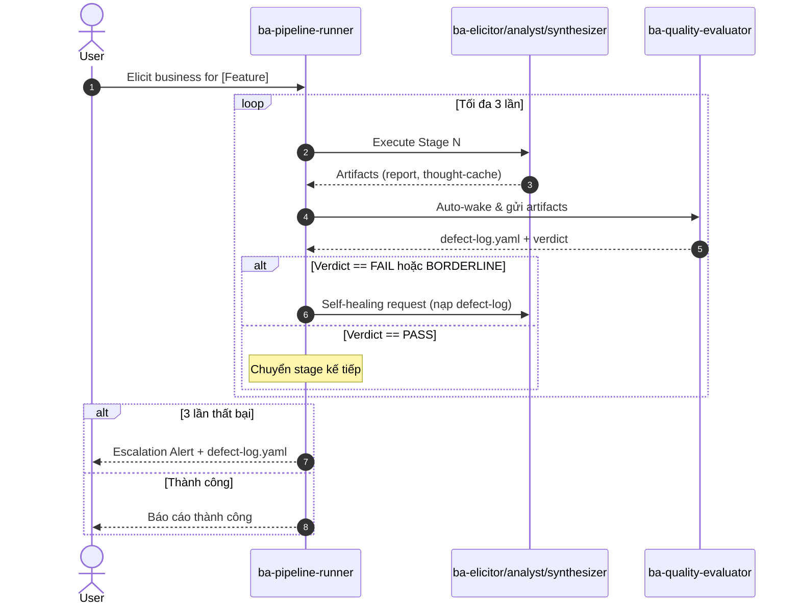

# Analysis: Hooks & Agents Architecture → Self-Healing Quality Gates for Phase 5 BA Pipeline

**Created**: 2026-07-10  
**Source files analyzed**:
- `.claude/knowledge/hooks/hooks-and-events.md` (hub — lifecycle, 4 core events)
- `.claude/knowledge/hooks/hooks-reference.md` (27 events, matcher, schema)
- `.claude/knowledge/hooks/hooks-implementation.md` (dual-format blocking, handler types, error policy)
- `.claude/knowledge/agents/agent_hooks.md` (subagent hook lifecycle, prompt/agent hooks, continueOnBlock)
- `.claude/knowledge/agents/configuration.md` (16-field frontmatter schema)
- `.claude/knowledge/agents/capability_controls.md` (tool scoping, permission modes, risk matrix)
- `.claude/knowledge/agents/workflow_patterns.md` (6 invocation patterns)
- `.claude/knowledge/agents/examples.md` (4 reference patterns)
- `.claude/knowledge/agents/forks.md` (fork semantics)
- `.claude/knowledge/agents/xml_tags_standards.yaml` (9-tag XML whitelist)
- `.claude/agents/ba-pipeline-runner.md` (current orchestrator)
- `docs/context-to-work/phase-5-ba-pipeline/scope.deep-activation-and-quality-gates.2026-07-10.md`
- `Temps/spec/architects/shared/quality-gates-reference.md`
- `skills/ver-0.0.2/_shared/rules/quality-gates.md`

---

## 1. Hook Lifecycle & Blocking Protocol

### 1.1 Four-Phase Lifecycle

```
Session Start → Per-Turn Loop → Tool Call Lifecycle → Session End
```

| Phase | Events Fired | Description |
|-------|-------------|-------------|
| **Session Start** | `SessionStart` → `Setup` → `InstructionsLoaded` | Init context, validate env. Once per session. |
| **Per-Turn** | `UserPromptSubmit` → [`UserPromptExpansion`] → [`Elicitation` ↔ `ElicitationResult`] | Each user message. |
| **Tool Call Lifecycle** | `PreToolUse` → [`PermissionRequest` → `PermissionDenied`] → `PostToolUse` / `PostToolUseFailure` → `PostToolBatch` | **Primary blocking point**: `PreToolUse`. |
| **Session End** | `PreCompact` → `PostCompact` → (`Stop` / `StopFailure`) → `SessionEnd` | Cleanup, flush. |

**Key rule**: `PreToolUse` is the **ONLY** event that can block a tool call. `PostToolUse` handlers cannot roll back — they only log.

### 1.2 Agent-Specific Orchestration Events

The hook system extends into subagent orchestration with 5 dedicated events:

| Event | Phase | Input | Use Case |
|-------|-------|-------|----------|
| `SubagentStart` | Orchestration | `{ agentType, config, sessionId }` | Log spawn, inject env, validate authorization |
| `SubagentStop` | Orchestration | `{ agentType, result, sessionId }` | Collect results, trigger post-processing |
| `TaskCreated` | Orchestration | `{ taskId, type, params }` | Track task-level progress |
| `TaskCompleted` | Orchestration | `{ taskId, result }` | Measure time, trigger downstream gates |
| `TeammateIdle` | Orchestration | `{ teammateId, duration }` | Auto-wakeup or reassignment |

### 1.3 PreToolUse Exit Protocol

| Script Behavior | Runtime Interpretation |
|----------------|----------------------|
| `exit 0` + no `permissionDecision` | **Allow** |
| `exit 0` + stdout `{"permissionDecision": "deny"}` | **Block** (Format A) |
| `exit 2` (stderr message shown to user) | **Block** (Format B) |
| Any other non-zero exit | **Block**, logged as hook error |

**Critical design choice**: There is NO permanent grant — every `PreToolUse` is independently evaluated. This means quality gates fire on EVERY relevant tool call, not just the first one.

### 1.4 Hook Priority Resolution (Last-Writer-Wins Merge)

| Priority | Location | Scope |
|----------|----------|-------|
| 1 (low) | `~/.claude/settings.json` | Global user defaults |
| 2 | `.claude/settings.json` | Project-wide |
| 3 | `.claude/settings.local.json` | Local overrides |
| 4 | Plugin-declared hooks | Plugin manifest |
| 5 (high) | **Subagent YAML frontmatter** | Per-agent |

**Implication for quality gates**: The `ba-quality-evaluator` subagent can declare hooks at priority 5 (frontmatter), guaranteeing its gates fire with highest precedence.

---

## 2. Thiết Kế Subagent `ba-quality-evaluator` với Actionable Defect Log

### 2.1 Subagent YAML Frontmatter Design

Dựa trên 16-field schema từ `configuration.md` và agent-based hook pattern từ `agent_hooks.md`:

```yaml
---
name: ba-quality-evaluator
version: 0.0.1
suite: WASHVN
status: canonical
description: "BA Quality Evaluator — thẩm định độc lập artifacts nghiệp vụ. Tự động wake sau mỗi BA stage. Sinh Actionable Defect Log và Quality Matrix. Trigger: auto-wake từ ba-pipeline-runner."
model: inherit
tools:
  - Read
  - Write
permissionMode: default
disallowedTools:
  - Bash
  - Edit
  - Glob
  - Grep
  - Task
  - Agent
effort: high
hooks:
  PreToolUse:
    - matcher: "Write"
      hooks:
        - type: command
          command: |
            INPUT=$(cat)
            FILE_PATH=$(echo "$INPUT" | jq -r '.params.filePath // empty')
            [ -z "$FILE_PATH" ] && exit 0
            if [[ ! "$FILE_PATH" =~ \.skill-context/.*/quality-(matrix|evaluation)/ ]]; then
              echo "BLOCKED: ba-quality-evaluator chỉ write vào .skill-context/{feature}/quality-*" >&2
              exit 2
            fi
  SubagentStop:
    - hooks:
        - type: prompt
          prompt: >
            Evaluate if the quality evaluation artifacts are structurally complete.
            Event context: $ARGUMENTS.
            Return JSON: {"ok": boolean, "reason": string}
          model: haiku
          timeout: 30
          continueOnBlock: true
          description: "Ensure quality-matrix.yaml and defect-log.yaml exist before exit"
---
```

### 2.2 Actionable Defect Log Format

Based on `scope.deep-activation-and-quality-gates.2026-07-10.md §4.3`:

```yaml
verdict: FAIL | BORDERLINE | PASS
composite_score: 72  # 0-100 scale
evaluated_at: "2026-07-10T22:45:00Z"
evaluator_version: "ba-quality-evaluator-0.0.1"
defects:
  - defect_id: DEF-ELICIT-001
    severity: BLOCKING  # BLOCKING | WARNING
    category: "META-2.1 Semantic Depth"
    target_file: ".skill-context/{feature}/ba-elicitor/elicitation-report.md"
    target_section: "§3. Stakeholder Analysis"
    error_code: "MISSING_MANDATORY_STAKEHOLDER"
    description: "Thiếu Stakeholder có vai trò 'Security Reviewer' trong khi hệ thống có yêu cầu bảo mật cao."
    evidence: "Dòng 12-25 chỉ mô tả End-User và Operator."
    recommendation: "Bổ sung Security Reviewer, phân tích pain points liên quan đến rò rỉ dữ liệu."
quality_dimensions:
  META-1_Domain_Anchoring:
    score: 65
    criteria:
      - name: "BA-1.0 Domain Ontology"
        status: PASS
      - name: "BA-2.0 Stakeholder Profiles"
        status: FAIL  # Vì thiếu Security Reviewer
      - name: "BA-3.0 Edge Cases"
        status: PASS
      - name: "BA-4.0 Quantifiable NFRs"
        status: BORDERLINE
  META-2_Semantic_Depth:
    score: 70
    criteria:
      - name: "6 Mindset Keywords kích hoạt"
        status: FAIL
        details: "Systems Thinking và First Principles chưa xuất hiện trong report."
```

### 2.3 Evaluation Dimensions (META Criteria Mapping)

Integrates `quality-gates-reference.md` META gates with the scope document's 6 Mindset Keywords:

| Dimension | Source Gate | 6 Mindset Keywords Mapped | Quality Criteria |
|-----------|-------------|---------------------------|------------------|
| META-1 | META-1.1 Domain Anchor, META-1.2 Phase Deconstruct | MECE, Structural Decomposition | Domain ontology present, no overlapping zones |
| META-2 | META-2.1 Semantic Depth Gate v2 (4 signals S1-S4 AND) | Systems Thinking, First Principles, Root Cause Isolation | Semantic anchors active, BABOK alignment, depth signals |
| META-3 | META-3.1 Mechanical, META-3.2 Negative Space, META-3.3 Sandbox | Root Cause Isolation, Impact Analysis | No ambiguities, edge cases covered, sandbox verified |

### 2.4 Separation of Concerns Principle

> **Executor ≠ Evaluator** — The `ba-quality-evaluator` is designed as an independent subagent (not part of `ba-elicitor`) to:
> 1. Eliminate LLM "self-satisfaction" bias (as noted in §8.1 of the scope doc)
> 2. Provide objective, evidence-based assessment via `Read`-only access to artifacts
> 3. Act as a "Senior BA Audit" — looking only at concrete evidence
> 4. Format output as machine-parseable YAML (`defect-log.yaml` + `quality-matrix.yaml`) ready for self-healing loop consumption

---

## 3. Tích Hợp Self-Healing Loop vào `ba-pipeline-runner`

### 3.1 Current Architecture Gap

The existing `ba-pipeline-runner` (`.claude/agents/ba-pipeline-runner.md`) has:

- **Simple sequential orchestration**: elicitor → analyst → synthesizer
- **Mechanical gates only**: file-existence checks and format validation
- **Failure modes F1-F6**: Only handle mechanical errors (missing file, timeout, invalid name) — **NO quality content validation**
- **No retry loop**: F2 (missing artifact) stops pipeline with `STOP — no auto-retry`

### 3.2 Required Architecture Enhancement

The scope document (§4.4) defines the Self-Healing Loop:



### 3.3 Integration into ba-pipeline-runner YAML Frontmatter

Using the `Task` tool + background subagent pattern from `workflow_patterns.md`:

```yaml
# Add to existing ba-pipeline-runner.md hooks:
hooks:
  # Existing write-gate hook (giữ nguyên)
  PreToolUse:
    - matcher: "Write"
      hooks:
        - type: command
          command: |  # (existing — blocks writes outside .skill-context/ba-*)
  PostToolUse:
    - matcher: "Task"
      hooks:
        - type: command
          command: |
            # After each BA skill completes, auto-wake ba-quality-evaluator
            # Read the stage output and check verdict
            STAGE_NAME=$(echo "$INPUT" | jq -r '.params.subagent_type // "unknown"')
            if [ "$STAGE_NAME" = "ba-elicitor" ] || [ "$STAGE_NAME" = "ba-analyst" ] || [ "$STAGE_NAME" = "ba-synthesizer" ]; then
              echo "Auto-invoking ba-quality-evaluator for stage: $STAGE_NAME" >&2
              # Signal pipeline-runner to spawn evaluator
            fi
```

### 3.4 Self-Healing Execution Flow (Pseudocode)

```
FOR each stage in [ba-elicitor, ba-analyst, ba-synthesizer]:
    retries = 0
    max_retries = 3
    WHILE retries < max_retries:
        # 1. Dispatch BA skill via Task
        Task(subagent_type=stage, run_in_background=true)
        Wait for completion → background_output(task_id)

        # 2. Gate check: artifact tồn tại?
        IF artifact missing:
            Handle F2 (mechanical failure) — STOP pipeline
        
        # 3. Auto-wake ba-quality-evaluator
        Task(subagent_type="ba-quality-evaluator",
             prompt="Evaluate artifacts at path: {artifact_path}",
             run_in_background=true)
        result = background_output(task_id)
        
        # 4. Parse verdict
        verdict = result.defect_log.verdict
        composite_score = result.defect_log.composite_score
        
        IF verdict == "PASS" AND composite_score >= 80:
            BREAK  # Quality met, proceed to next stage
        
        # 5. Self-healing
        IF verdict == "FAIL" OR "BORDERLINE":
            retries += 1
            IF retries >= max_retries:
                Escalate to user with defect-log.yaml
                STOP pipeline
            
            # Send self-healing request back to the BA skill
            self_healing_prompt = format_self_healing_prompt(
                defect_log=result.defect_log,
                original_context=feature_context
            )
            CONNTINUE  # Re-run the stage with healing prompt
```

### 3.5 Self-Healing Prompt Format (XML tags per standards)

```xml
<self_healing_request>
  <context>
    Output của bạn ở stage {stage_name} chưa đạt chuẩn chất lượng.
    Composite score: {composite_score}/100 (ngưỡng: >= 80).
  </context>
  <defect_log>
    {Nội dung defect-log.yaml — chỉ BLOCKING defects}
  </defect_log>
  <instructions priority="critical">
    must:
      - Đọc kỹ từng defect_id có severity là BLOCKING
      - Thực hiện sửa đổi trực tiếp vào file artifact tương ứng (target_file, target_section)
      - Giải quyết triệt để phần 'recommendation' được đề xuất
      - Sau khi sửa xong, ghi đè lên file artifact cũ
    must_not:
      - Không bỏ qua hoặc workaround bất kỳ BLOCKING defect nào
      - Không thay đổi các section không liên quan đến defect
  </instructions>
</self_healing_request>
```

---

## 4. Mô hình Dual-Format Blocking cho Quality Gates

### 4.1 Two-Layer Blocking Strategy

The system uses two distinct blocking layers, each implementing the hook protocol differently:

| Layer | Event | Format | Consumer | Purpose |
|-------|-------|--------|----------|---------|
| **Layer 1: Mechanical Gate** | `PreToolUse` (Write) | **Format B** (exit 2) | Write zone enforcement | Block writes outside `.skill-context/` zones. Hard block — cannot be bypassed. |
| **Layer 2: Semantic Gate** | `SubagentStop` / `Stop` | **Format A** (JSON) via `continueOnBlock: true` | Quality evaluation | Block low-quality artifacts from proceeding. Soft block — triggers self-healing loop. |

### 4.2 Layer 1 — Mechanical Write-Gate (PreToolUse, Format B)

Already implemented in `ba-pipeline-runner.md`:

```bash
# Format B — exit 2 with stderr message
if [[ ! "$FILE_PATH" =~ \.skill-context/.*/ba-(elicitor|analyst|synthesizer)/ ]]; then
  echo "BLOCKED: ba-pipeline-runner chỉ write vào .skill-context/{feature}/ba-*" >&2
  exit 2
fi
```

**Extension for Phase 5**: Add additional write-zone for quality evaluator:

```bash
if [[ ! "$FILE_PATH" =~ \.skill-context/.*/(ba-(elicitor|analyst|synthesizer|quality-evaluator)/|quality-matrix/|quality-evaluation/) ]]; then
  echo "BLOCKED: Only write to .skill-context/{feature}/ba-* or quality-*" >&2
  exit 2
fi
```

### 4.3 Layer 2 — Semantic Quality Gate (SubagentStop, Format A + continueOnBlock)

The `ba-quality-evaluator` uses prompt-based `SubagentStop` hooks with **Format A** (JSON output):

```yaml
# In ba-quality-evaluator frontmatter
hooks:
  SubagentStop:
    - hooks:
        - type: prompt
          prompt: >
            Evaluate all quality artifacts for this session.
            Event context: $ARGUMENTS.
            Verify: quality-matrix.yaml and defect-log.yaml exist and are valid.
            Return JSON: {"ok": boolean, "reason": string}
          model: haiku
          timeout: 30
          continueOnBlock: true
          description: "Validate quality artifacts completeness"
```

**continueOnBlock mechanics** (from `agent_hooks.md` §3.3):
1. Hook returns `{"ok": false, "reason": "..."}`
2. Runtime does NOT terminate the session — feeds `reason` back as new turn
3. Agent corrects issues described in `reason`
4. Agent retries the operation

> **Important constraint**: `continueOnBlock` is only supported on `Stop` and `SubagentStop` events. It is ignored on other events.

### 4.4 Quality Gate Triggers Across the Pipeline

```yaml
# HOOK-HEAL-1.0 (Advanced Prompt Gate) — from quality-gates-reference.md
# Native Prompt-based Hook with continueOnBlock: true on Stop / SubagentStop events
hook_heal_1_0:
  description: "Automatically audits markdown format and YAML syntax structure"
  events: [Stop, SubagentStop]
  type: prompt
  continueOnBlock: true
  
# HOOK-AUDIT-2.0 (Agent-based Verification) — from quality-gates-reference.md  
hook_audit_2_0:
  description: "Execute test suites and inspect audit logs dynamically"
  events: [Stop, TaskCompleted]
  type: agent
  timeout: 120
```

### 4.5 Quality Gate Matrix → Hook Mapping

| Gate ID (from quality-gates-reference) | Hook Event | Blocking Format | continueOnBlock | Subagent Trigger |
|----------------------------------------|-----------|-----------------|-----------------|------------------|
| BA-1.0 Domain Ontology | PostToolUse (Task) | Format A (defect_log) | N/A | ba-quality-evaluator |
| BA-2.0 Stakeholder Profiles | PostToolUse (Task) | Format A (defect_log) | N/A | ba-quality-evaluator |
| BA-3.0 Edge Cases | PostToolUse (Task) | Format A (defect_log) | N/A | ba-quality-evaluator |
| BA-4.0 Quantifiable NFRs | PostToolUse (Task) | Format A (defect_log) | N/A | ba-quality-evaluator |
| META-1.1 Domain Anchor | PostToolUse (Task) | Format A (defect_log) | N/A | ba-quality-evaluator |
| META-2.1 Semantic Depth Gate v2 | PostToolUse (Task) | Format A (defect_log) | N/A | ba-quality-evaluator |
| HOOK-HEAL-1.0 (post-audit) | SubagentStop | Format A (ok/reason) | true | N/A (in-agent) |
| HOOK-AUDIT-2.0 (deep audit) | Stop, TaskCompleted | Format A (ok/reason) | true | ba-quality-evaluator |

### 4.6 Error Handling for Gate Failures

Per `hooks-implementation.md` §3:

| Scenario | Behavior | Quality Gate Implication |
|----------|----------|--------------------------|
| `ba-quality-evaluator` script not found | Fail closed — block tool call | Pipeline stops, escalation to user |
| Quality gate timeout (30s default) | Fail closed — block | Verdict defaults to FAIL, self-healing skipped |
| Malformed `defect-log.yaml` (parse error) | Fall back to Format B | Human-readable error on stderr, but no structured self-healing |
| Non-zero exit not 2 | Fail open — allow, log error | Artifact passes through without evaluation (degraded mode) |

---

## 5. Summary: Architectural Decision Records

### ADR-1: Why `PostToolUse` (Task) instead of `PreToolUse` for quality gates?
- **Decision**: Quality evaluation fires on `PostToolUse` (after a BA skill's Task completes), not `PreToolUse`
- **Rationale**: You can't evaluate quality before the artifact exists. `PreToolUse` blocks execution; `PostToolUse` inspects results. The evaluator reads the finished artifact.
- **Exception**: Write-zone enforcement remains on `PreToolUse` (Layer 1 mechanical gate).

### ADR-2: Why background Task dispatch for ba-quality-evaluator?
- **Decision**: `ba-pipeline-runner` dispatches `ba-quality-evaluator` as a background subagent
- **Rationale** (per `workflow_patterns.md` §2): Quality evaluation is I/O-heavy (reads multiple artifacts) and benefits from isolated context window. Parent `ba-pipeline-runner` can poll for completion via `background_output(task_id, block=true)`.
- **Max depth**: 1 level (ba-pipeline-runner (L0) → ba-quality-evaluator (L1)). No cascading to L2.

### ADR-3: Why `continueOnBlock` only on session-end events?
- **Decision**: The self-healing loop for quality gates is orchestrated by `ba-pipeline-runner` (explicit loop logic), NOT by `continueOnBlock` on `SubagentStop`
- **Rationale**: `continueOnBlock` is used for **post-hoc** validation (markdown/YAML formatting checks after evaluation completes), not for the main quality gate loop. The pipeline runner's explicit retry logic gives finer control (max 3 retries, escalation at failure).
- **Where continueOnBlock IS used**: `SubagentStop` hook in `ba-quality-evaluator` to ensure quality artifacts are well-formed before exit.

### ADR-4: Permission mode for ba-quality-evaluator
- **Decision**: `permissionMode: default` with `tools: [Read, Write]`
- **Rationale**: Read-only access to BA artifacts. Write only to quality-scoped zones (`.skill-context/{feature}/quality-*`). No `Bash`, `Edit`, `Glob`, `Grep` — evaluator should not modify artifacts, only assess them.
- **Constraint**: `disallowedTools: [Bash, Edit, Glob, Grep, Task, Agent]` — prevents any side-effect operations.

### ADR-5: Composite Score Threshold
- **Decision**: PASS threshold = 80/100 composite score AND zero BLOCKING defects
- **Rationale**: Aligns with the scope document's 80% threshold and ensures no critical defect escapes. A BORDERLINE verdict (score 60-79 but no BLOCKING defects) triggers self-healing but with warning-level severity.

---

## 6. Files to Create / Modify

| File | Action | Priority |
|------|--------|----------|
| `.claude/agents/ba-quality-evaluator.md` | **CREATE** — new subagent definition | P0 |
| `.claude/agents/ba-pipeline-runner.md` | **MODIFY** — add self-healing loop logic, quality gate triggers | P0 |
| `skills/ver-3/ba-elicitor/knowledge/elicitation_patterns.md` | **CREATE** — 6 Mindset Keywords, ontology | P1 |
| `skills/ver-3/ba-elicitor/templates/thought_cache_template.yaml` | **CREATE** — thought process structure | P1 |
| `.claude/knowledge/hooks/hooks-and-events.md` | No change (canonical) | — |
| `.claude/knowledge/agents/agent_hooks.md` | No change (canonical) | — |
| `Temps/spec/architects/shared/quality-gates-reference.md` | No change (reference only) | — |
