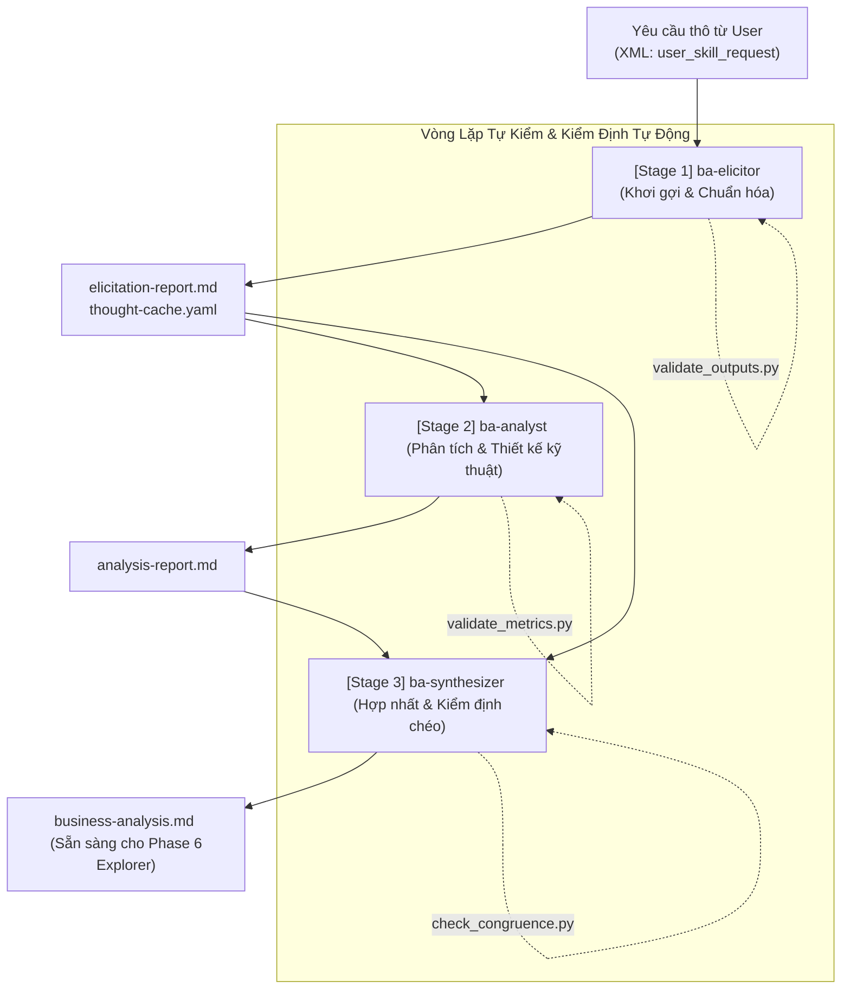
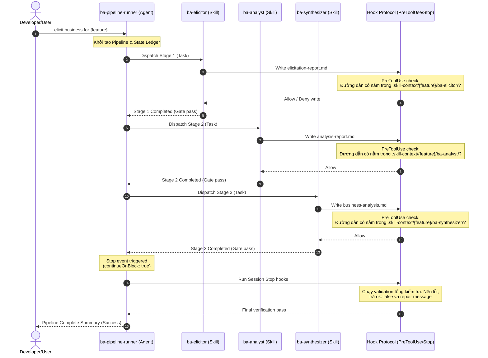
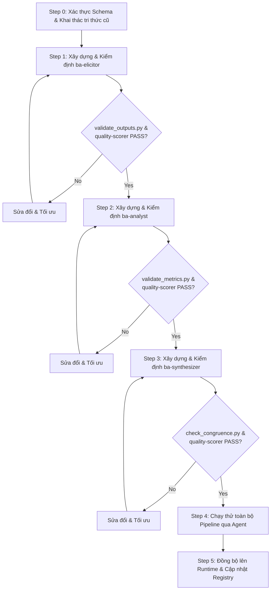

# TÀI LIỆU PHÂN TÍCH NGHIỆP VỤ (BA REPORT) — PHASE 5: BA SKILLS PIPELINE

> **Vai trò tài liệu:** Phân tích toàn diện và định hình giải pháp nghiệp vụ cho Phase 5, bao phủ sự kết hợp chặt chẽ giữa Hooks (cơ chế kiểm soát), Agents (bộ điều phối và chấm điểm) và bộ ba Skills (`ba-elicitor`, `ba-analyst`, `ba-synthesizer`).
> **Traceability Anchor:** [CLAUDE.md](file:///home/stveve/Documents/workspace/build-workflow/WASHVN/CLAUDE.md), [scope.2026-07-10.md](file:///home/stveve/Documents/workspace/build-workflow/WASHVN/docs/context-to-work/phase-5-ba-pipeline/scope.2026-07-10.md)

---

## §1. Khái Quát Nghiệp Vụ & Bối Cảnh (Elicitation & Context)

### 1.1 Mục Tiêu Nghiệp Vụ
[TỪ INPUT] Phase 5 là giai đoạn chuyển tiếp quan trọng từ hạ tầng nền tảng (Phase 0-4) sang triển khai thực tế bộ kỹ năng (Skills Pipeline). Mục tiêu nghiệp vụ cốt lõi của Phase 5 là xây dựng và vận hành **BA Skills Pipeline** — một chuỗi liên hoàn gồm ba kỹ năng phụ trợ nghiệp vụ: `ba-elicitor` $\rightarrow$ `ba-analyst` $\rightarrow$ `ba-synthesizer`. 

[SUY LUẬN] Chuỗi pipeline này đóng vai trò là "Cửa ngõ Nghiệp vụ" (Upstream Gatekeeper) cho toàn bộ hệ thống Master Skill Suite. Nếu tài liệu nghiệp vụ đầu ra của Phase 5 (`business-analysis.md`) bị lỗi hoặc thiếu tính nhất quán, các giai đoạn sau (Stage 0 Explorer, Stage 1 Architect, v.v. của Phase 6) sẽ không có đầu vào chuẩn để sinh mã nguồn kỹ năng mới, dẫn đến lỗi dây chuyền (Cascading Failure).

### 1.2 Yêu Cầu Về Năng Lực Lượng Hóa (NFR Quantification)
[TỪ INPUT] Để đảm bảo tính chặt chẽ, các tiêu chí phi chức năng (NFR) trong Phase 5 được lượng hóa như sau:
1. **Chất lượng Kỹ năng (Skill Quality Score):** Mọi Kỹ năng (`ba-elicitor`, `ba-analyst`, `ba-synthesizer`) sau khi xây dựng phải được đánh giá qua `quality-scorer` agent (dựa trên bộ tiêu chí META-1, META-2, META-3) và phải đạt điểm số tối thiểu **$\ge 70\%$** mới được phép deploy lên runtime.
2. **Kích thước Kỹ năng (Token Budget Limit):** File `SKILL.md` của mỗi kỹ năng phải tuân thủ nghiêm ngặt L0 Anchor Rule: dung lượng không vượt quá **700 tokens** (tương đương tối đa **800 từ** để dự phòng) nhằm tối ưu hóa ngữ cảnh và tránh trôi lệch tri thức.
3. **Tính Toàn Vẹn của Artifact (Artifact Integrity):** Mọi báo cáo đầu ra phải được tự động xác thực cấu trúc bởi `schema_validator.py` và kiểm tra tính nhất quán nghiệp vụ bởi các scripts nội bộ của từng kỹ năng. Tỷ lệ lỗi cấu trúc (Schema Compliance) phải bằng **0%**.
4. **Môi trường cách ly (Testing Isolation):** Việc chạy thử nghiệm các script kiểm tra và tạo mockup phải được thực hiện cách ly, không làm ảnh hưởng đến thư mục runtime `.claude/skills/` cho đến khi có lệnh đồng bộ chính thức (cp/sync).

---

## §2. Phân Tích Luồng Nghiệp Vụ & Phân Rã Chức Năng (Analysis & Functional Decomposition)

Bộ ba kỹ năng của BA Skills Pipeline được thiết kế để giải quyết 3 pha nghiệp vụ liên tiếp của một Business Analyst:

### 2.1 Kỹ năng 1: ba-elicitor (Khơi gợi & Chuẩn hóa Nghiệp vụ)
* **Mục tiêu:** Tiếp nhận yêu cầu thô từ người dùng, lọc bỏ nhiễu, chống prompt injection, khơi gợi các khía cạnh còn thiếu thông qua câu hỏi 5W1H và lượng hóa các từ ngữ mơ hồ thành chỉ số đo lường được (metrics).
* **Đầu vào (Input Contract):** Yêu cầu thô bọc trong thẻ XML `<user_skill_request>`.
* **Quy trình xử lý (4 Phases):**
  1. *Normalization:* Loại bỏ từ ngữ cảm tính, bóc tách thực thể chính, kiểm tra ranh giới dữ liệu đầu vào.
  2. *Gap Analysis:* Kích hoạt 6 từ khóa tư duy phản biện (Systems Thinking, Root Cause Isolation, MECE, First Principles, Impact Analysis, Structural Decomposition) để phát hiện lỗ hổng nghiệp vụ.
  3. *5W1H Questioning:* Tạo câu hỏi đa lựa chọn (multiple-choice) phân rã thành 3 luồng xử lý (Happy Path, Alternative Path, Exception Path).
  4. *Self-verification:* Chạy checklist 7 tiêu chí tự đánh giá (`scoping_checklist.md`) với trọng số tương ứng. Yêu cầu pass 100% trước khi ghi file.
* **Đầu ra (Output Artifacts):** 
  - [elicitation-report.md](file:///.skill-context/{feature_name}/ba-elicitor/elicitation-report.md) (Tuân thủ `elicitation.schema.yaml`)
  - [thought-cache.yaml](file:///.skill-context/{feature_name}/ba-elicitor/thought-cache.yaml) (Lưu trữ luồng suy nghĩ nghiệp vụ nâng cao)

### 2.2 Kỹ năng 2: ba-analyst (Phân tích & Đặc tả Kỹ thuật)
* **Mục tiêu:** Chuyển đổi báo cáo khơi gợi thô thành tài liệu thiết kế kỹ thuật có cấu trúc trực quan (biểu đồ Mermaid, sơ đồ dữ liệu, kịch bản kiểm thử Gherkin và ma trận rủi ro).
* **Đầu vào (Input Contract):** `elicitation-report.md` từ stage trước.
* **Quy trình xử lý (6 Phases):**
  1. *Alignment:* Đồng bộ hóa metadata của tài liệu, kiểm tra trạng thái (nếu upstream báo `pending_clarification` thì dừng lại ngay).
  2. *Classification:* Phân loại yêu cầu chức năng (FR), yêu cầu phi chức năng (NFR) và sắp xếp độ ưu tiên theo ma trận MoSCoW (Must, Should, Could, Won't).
  3. *Diagram Generation:* Vẽ 3 loại biểu đồ Mermaid chuẩn hóa: Sequence Diagram (yêu cầu $\ge 3$ actors, double-quote all labels), Flowchart (mô tả 3 paths của luồng nghiệp vụ), và ERD (định nghĩa thực thể, khóa chính PK, khóa ngoại FK).
  4. *Data Schema Design:* Thiết kế chi tiết cấu trúc bảng và JSON schema cho các thực thể.
  5. *Gherkin Scenarios:* Viết các kịch bản kiểm thử hành vi Given-When-Then cho tối thiểu 3 kịch bản nghiệp vụ (Happy, Alternative, Exception).
  6. *Risk Assessment:* Lập ma trận đánh giá rủi ro (Probability x Impact) và đề xuất phương án giảm thiểu (mitigation).
* **Đầu ra (Output Artifacts):**
  - [analysis-report.md](file:///.skill-context/{feature_name}/ba-analyst/analysis-report.md) (Tuân thủ `analysis.schema.yaml`)

### 2.3 Kỹ năng 3: ba-synthesizer (Hợp nhất & Kiểm định chéo)
* **Mục tiêu:** Đóng vai trò là "Quality Gate" cuối cùng của BA Pipeline, thực hiện kiểm định chéo để phát hiện mâu thuẫn giữa thiết kế sơ đồ và thiết kế dữ liệu, tính điểm chất lượng tổng hợp và xác nhận tính sẵn sàng của pipeline.
* **Đầu vào (Input Contract):** Cả `elicitation-report.md` và `analysis-report.md`.
* **Quy trình xử lý (4 Phases):**
  1. *Cross-Validation:* Áp dụng 2 quy tắc kiểm định chéo cốt lõi:
     - **Actor-Entity Matching:** Đối chiếu các thực thể tham gia trong Sequence Diagram với thực thể định nghĩa trong ERD. Phát hiện lệch hướng và cảnh báo `[MAU THUẪN NGHIỆP VỤ]`.
     - **MoSCoW-Gherkin Matching:** Đảm bảo mọi tính năng mức độ "Must-Have" bắt buộc phải có tối thiểu 1 kịch bản Gherkin tương ứng. Phát hiện thiếu hụt và cảnh báo `[THIẾU KỊCH BẢN KIỂM THỬ]`.
  2. *Quality Scoring:* Tính toán điểm chất lượng tổng hợp dựa trên 7 deliverables nhân với hệ số trọng số từ `quality-matrix.yaml`. Điểm số vượt qua ngưỡng **0.80** mới được đánh giá là `PASS`, ngược lại là `WARNING`.
  3. *Synthesis:* Hợp nhất các nội dung nghiệp vụ và kỹ thuật thành một đặc tả duy nhất, loại bỏ trùng lặp và đồng bộ hóa trace tags.
  4. *Self-check:* Chạy checklist 14 tiêu chí kiểm định (`congruence_checklist.md`) chia thành 3 nhóm (Completeness, Validation, Format).
* **Đầu ra (Output Artifacts):**
  - [business-analysis.md](file:///.skill-context/{feature_name}/ba-synthesizer/business-analysis.md) (Tuân thủ `synthesis.schema.yaml`, là tài liệu bàn giao chính thức cho Phase 6).

---

## §3. Phân Tích Phối Hợp Kỹ Thuật (Hooks, Agents & Skills Integration)

Sự thành công của Phase 5 phụ thuộc vào sự kết hợp chặt chẽ của 3 thực thể công nghệ trong WASHVN suite:

### 3.1 Vai Trò Của Hook Protocol Trong Pipeline
[SUY LUẬN] Hooks đóng vai trò như một màng lọc bảo mật và tự kiểm tra động (Dynamic Guardrails). Thay vì để agent tự do thực hiện ghi chép hoặc gọi subagents đệ quy, Hook sẽ chủ động can thiệp ở mức hệ thống (level 5 priority) để thực thi chính sách bảo vệ.

1. **Kiểm soát Ghi chép (WORM / Path Confinement):**
   * *Event:* `PreToolUse` (Matcher: `Write`).
   * *Nghiệp vụ:* Chặn đứng mọi nỗ lực ghi đè code trực tiếp hoặc ghi file ra ngoài thư mục quy định. Chỉ cho phép ghi vào đường dẫn `.skill-context/{feature_name}/ba-(elicitor|analyst|synthesizer)/`.
   * *Cơ chế chặn:* Trả về `exit 2` với thông điệp lỗi chi tiết trên `stderr` (Format B) nếu đường dẫn vi phạm.

2. **Chống Gọi Đệ Quy (Anti-Recursion Gate):**
   * *Event:* `PreToolUse` (Matcher: `Task`).
   * *Nghiệp vụ:* Kiểm tra tham số `subagent_type`. Nếu phát hiện yêu cầu spawn `ba-pipeline-runner` lồng nhau (recursive spawning), hook sẽ chặn ngay lập tức với `exit 2` để ngăn ngừa lỗi cạn kiệt tài nguyên (resource exhaustion) và lặp vô hạn.

3. **Cơ Chế Tự Sửa Lỗi (Auto-Repair / Self-Healing Loop):**
   * *Event:* `Stop` hoặc `SubagentStop` (Matcher: `ba-pipeline-runner` hoặc các kỹ năng BA).
   * *Nghiệp vụ:* Khai báo hook với `type: "prompt"` hoặc `type: "agent"` và thiết lập thuộc tính `continueOnBlock: true`. 
   * *Luồng hoạt động:* Khi kết thúc turn hoặc kết thúc subagent, hook sẽ chạy script kiểm định hoặc kiểm tra tính hợp lệ của output artifact. Nếu phát hiện vi phạm (như chứa placeholder hoặc sai schema), hook sẽ trả về `"ok": false` kèm theo lý do cụ thể trong trường `reason`. Runtime sẽ không tắt session mà nạp lại thông điệp lỗi này vào ngữ cảnh turn kế tiếp để agent tự sửa đổi tài liệu (self-healing) cho đến khi đạt chuẩn.

### 3.2 Vai Trò Của Agent & Subagent
1. **ba-pipeline-runner (Subagent):**
   * Đóng vai trò là Bộ điều phối trung tâm (Pipeline Orchestrator). Agent này không trực tiếp xử lý nghiệp vụ hay viết nội dung tài liệu (để đảm bảo tính phân tách trách nhiệm - Separation of Concerns), mà chỉ đọc file cấu hình trạng thái (`_ba_pipeline_state.yaml`) và sử dụng tool `Task` để dispatch tuần tự 3 kỹ năng BA.
   * Quản lý lỗi ngoại lệ (Failure Modes F1-F6): Xử lý các tình huống như thiếu kỹ năng (F1), thiếu artifact đầu ra của stage trước (F2), lỗi timeout (F3), tên feature sai định dạng (F4) hoặc ngữ cảnh quá mơ hồ (F6).

2. **quality-scorer (Subagent):**
   * Đóng vai trò là Cổng thẩm định thiết kế (Quality Gatekeeper). Agent này được gọi độc lập để chấm điểm cấu trúc và chất lượng ngữ nghĩa của 3 kỹ năng BA trước khi đồng bộ lên hệ thống. Nó kiểm tra mật độ phủ của các câu lệnh Must/Must Not, tính thực tế của các kịch bản kiểm thử trong `criteria.md` và sinh báo cáo `quality-matrix.yaml`.

### 3.3 Vai Trò Của Các Kỹ Năng (Skills ver-3)
Mỗi kỹ năng được triển khai dưới dạng **7-Zone structure** tiêu chuẩn để đảm bảo tính tái sử dụng cao và dễ bảo trì:
* **Zone 1: Core (SKILL.md):** Chứa các chỉ thị neo (L0 anchors), ranh giới hoạt động, và sơ đồ định tuyến nghiệp vụ. Độ dài hạn chế dưới 700 tokens để tránh phình ngữ cảnh.
* **Zone 2: Knowledge (`knowledge/`):** Chứa tri thức nghiệp vụ cốt lõi (như taxonomy FR/NFR, quy tắc Mermaid/Gherkin, quy tắc kiểm định chéo). Được gộp từ nhiều file nhỏ ở phiên bản cũ thành 1 file duy nhất để tránh phân mảnh ngữ nghĩa.
* **Zone 3: Templates (`templates/`):** Chứa các file mẫu báo cáo dạng WORM (Write Once Read Many) với frontmatter YAML chuẩn hóa để khớp với schema dữ liệu.
* **Zone 4: Loop (`loop/`):** Chứa các checklist tự đánh giá chất lượng (weighted scoring) nhằm thực hiện cơ chế tự đóng gói chất lượng đầu ra.
* **Zone 5: Scripts (`scripts/`):** Chứa các file Python validator chạy local (như `validate_outputs.py`, `validate_metrics.py`, `check_congruence.py`) để kiểm tra cú pháp và cấu trúc dữ liệu tự động trước khi bàn giao.
* **Zone 6: Data (`data/drc.yaml`):** Định nghĩa hợp đồng định tuyến động (Dynamic Routing Contract - DRC), mô tả rõ ràng luồng dữ liệu vào/ra, các ràng buộc kiểu và cơ chế fallback.
* **Zone 7: Assets (`assets/`):** Chứa các tài nguyên bổ trợ tĩnh (như hình ảnh hoặc sơ đồ mẫu). Ở giai đoạn đầu, chỉ cần giữ `.gitkeep`.

---

## §4. Ma Trận Kiểm Định Chéo & Đảm Bảo Chất Lượng (Cross-Validation & QA)

[TỪ INPUT] Để đảm bảo tính chặt chẽ của kết quả đầu ra trước khi bàn giao cho Phase 6, `ba-synthesizer` sẽ áp dụng ma trận kiểm định và chấm điểm chất lượng tự động:

### 4.1 Quy Tắc Kiểm Định Chéo (Cross-Validation Rules)
1. **Quy tắc 1 (Actor-ERD Consistency):**
   * *Đầu vào:* Danh sách Actors/Participants trong biểu đồ Sequence (Sequence Diagram) và danh sách các thực thể trong biểu đồ ERD (ERD Diagram).
   * *Ràng buộc:* Mọi Actor đóng vai trò là thực thể dữ liệu trong Sequence Diagram bắt buộc phải tồn tại dưới dạng một bảng dữ liệu tương ứng trong ERD.
   * *Tag cảnh báo:* `[MAU THUẪN NGHIỆP VỤ: Thực thể CSDL thiếu hụt]` nếu phát hiện Sequence Diagram gọi thực thể mà ERD không định nghĩa.

2. **Quy tắc 2 (MoSCoW-Gherkin Coverage):**
   * *Đầu vào:* Danh sách các tính năng được phân loại là "Must-Have" (P0) trong ma trận MoSCoW và danh sách các kịch bản kiểm thử (Scenarios) trong Gherkin.
   * *Ràng buộc:* 100% các tính năng Must-Have bắt buộc phải có ít nhất một kịch bản kiểm thử tương ứng mô tả hành vi của nó (bao gồm cả Happy Path và Exception Path).
   * *Tag cảnh báo:* `[THIẾU KỊCH BẢN KIỂM THỬ: Tính năng Must-Have chưa được bao phủ]` nếu phát hiện tính năng bắt buộc bị bỏ quên trong phần đặc tả Gherkin.

### 4.2 Ma Trận Trọng Số Chấm Điểm Chất Lượng (Quality Scoring Matrix)
[TỪ INPUT] Điểm số chất lượng tổng hợp của tài liệu BA nghiệp vụ được tính dựa trên công thức weighted sum của 7 thành phần nghiệp vụ:

| Deliverable ID | Thành phần Nghiệp vụ cần Đánh giá | Trọng số (Weight) | Tiêu chí nghiệm thu tối thiểu (Minimum Acceptance Criteria) |
| :---: | :--- | :---: | :--- |
| **BA-DEL-01** | Elicitation Report & Thought Cache | 15% | Đầy đủ frontmatter, phân tích stakeholder và lượng hóa NFR. |
| **BA-DEL-02** | Classification & MoSCoW Matrix | 15% | Phân loại rõ ràng FR/NFR, gán nhãn P0-P3 và có giải trình kỹ thuật. |
| **BA-DEL-03** | Sequence Diagram | 15% | Đạt $\ge 3$ actors, mô tả đúng luồng nghiệp vụ chính, nhãn được bao trong dấu nháy kép. |
| **BA-DEL-04** | Flowchart Diagram | 15% | Phân tách rõ ràng 3 luồng xử lý (Happy, Alternative, Exception). |
| **BA-DEL-05** | Entity Relationship Diagram (ERD) | 15% | Xác định đầy đủ khóa chính (PK), khóa ngoại (FK) và kiểu dữ liệu của các trường. |
| **BA-DEL-06** | Gherkin Acceptance Criteria | 15% | Đủ cấu trúc Given-When-Then, bao phủ tối thiểu 3 scenarios cho 3 luồng xử lý. |
| **BA-DEL-07** | Risk Assessment Matrix | 10% | Ma trận Probability x Impact đầy đủ, có phương án giảm thiểu khả thi. |
| **Tổng cộng** | **Chỉ số Chất lượng Tổng hợp** | **100%** | **Điểm đạt yêu cầu (PASS Threshold) $\ge 80\%$** |

---

## §5. Kế Hoạch Triển Khai Xây Dựng Bước Đầu (Build & Deploy Plan)

### 5.1 Các Bước Chuẩn Bị (Pre-verification Step 0)
1. **Xác thực Schema:** Chạy `schema_validator.py` trên các schemas và fixtures hiện tại để đảm bảo môi trường kiểm định Phase 4 hoạt động ổn định (exit 0).
2. **Khai thác Tri thức Cũ:** Tiến hành đọc và phân loại tài liệu nghiệp vụ từ thư mục cũ `skills/ver-0.0.2/ba-*/` thành 2 nhóm:
   * *Nhóm direct-use (copy-edit):* Các checklist tự đánh giá chất lượng và cấu trúc phần thân mẫu báo cáo (chiếm ~550 dòng).
   * *Nhóm adaptation-needed (restructure):* 5 file knowledge của mỗi kỹ năng cũ cần được merge lại thành 1 file duy nhất cho mỗi kỹ năng mới để đáp ứng 7-Zone structure; cấu trúc SKILL.md cũ cần được viết lại toàn bộ theo skeleton mới.
3. **Đọc Cấu trúc Registry:** Đọc file `skills-registry.json` và cấu trúc `_state.yaml` hiện tại để chuẩn bị định dạng đăng ký.

### 5.2 Trình Tự Triển Khai Từng Kỹ Năng (Interleaved Build-Verify-Fix)
[SUY LUẬN] Để tránh việc tích lũy lỗi và rủi ro ở cuối giai đoạn, kế hoạch triển khai đề xuất xây dựng tuần tự và cuốn chiếu (xây dựng xong kỹ năng nào, chạy validator và quality-scorer ngay cho kỹ năng đó trước khi chuyển sang kỹ năng tiếp theo):

#### Bước 1: Xây dựng và Thẩm định `ba-elicitor`
* *Tạo mới hợp đồng:* Thiết kế `data/drc.yaml` và `templates/thought_cache_template.yaml` (mới hoàn toàn).
* *Restructure tri thức:* Merge 5 file knowledge cũ thành `knowledge/elicitation_patterns.md` (lọc bỏ các tham chiếu file cũ không còn tồn tại).
* *Adapt mẫu báo cáo:* Viết `templates/elicitation_report.template.md` và `loop/scoping_checklist.md` (chuyển đổi cú pháp biến cũ sang frontmatter).
* *Viết core logic & script:* Viết `SKILL.md` (dưới 700 tokens, 11 sections) và `scripts/validate_outputs.py` (chấm điểm tự động 8 tiêu chí).
* *Kiểm định:* Gọi `quality-scorer` để chấm điểm META, yêu cầu đạt $\ge 70\%$. Chạy thử với mock request `"I need an e-commerce skill..."` để đảm bảo sinh ra tài liệu hợp lệ.

#### Bước 2: Xây dựng và Thẩm định `ba-analyst`
* *Tạo mới hợp đồng:* Thiết kế `data/drc.yaml` (dựa trên `analysis.schema.yaml`).
* *Restructure tri thức:* Merge 5 file kiến thức cũ (classification, gherkin, mermaid, risk) thành `knowledge/fr_nfr_taxonomy.md` (giữ nguyên toàn bộ 153 dòng quy tắc Mermaid và 102 dòng quy tắc Gherkin).
* *Adapt mẫu báo cáo:* Viết `templates/analysis_report.template.md` và `loop/interlock_checklist.md`.
* *Viết core logic & script:* Viết `SKILL.md` và viết mới hoàn toàn script Python `scripts/validate_metrics.py` để kiểm tra độ bao phủ và tính lượng hóa của NFR.
* *Kiểm định:* Chạy `validate_metrics.py` và gọi `quality-scorer` thẩm định chất lượng ($\ge 70\%$). Test tiêu thụ `elicitation-report.md` từ Bước 1.

#### Bước 3: Xây dựng và Thẩm định `ba-synthesizer`
* *Tạo mới hợp đồng:* Thiết kế `data/drc.yaml` (dựa trên `synthesis.schema.yaml`).
* *Restructure tri thức:* Merge các quy tắc kiểm định chéo và tiêu chí đánh giá thành `knowledge/cross_validation_strategies.md`.
* *Adapt mẫu báo cáo:* Viết `templates/business_analysis_template.md` (cập nhật trường `pipeline_ready` và `congruence_check`) và `loop/congruence_checklist.md`.
* *Viết core logic & script:* Viết `SKILL.md` và viết mới hoàn toàn script Python `scripts/check_congruence.py` để tự động hóa việc rà soát chéo cấu trúc dữ liệu.
* *Kiểm định:* Chạy `check_congruence.py` và gọi `quality-scorer` thẩm định chất lượng ($\ge 70\%$). Test tiêu thụ cả 2 tài liệu từ Bước 1 và Bước 2.

#### Bước 4: Chạy thử toàn bộ Pipeline qua Agent
* Kích hoạt `ba-pipeline-runner` agent để điều phối chạy thử nghiệm từ đầu đến cuối với một mock feature cụ thể (ví dụ: `international-shipping-handler`).
* Xác minh xem file tracking trạng thái `.skill-context/{feature}/_ba_pipeline_state.yaml` được cập nhật đúng và chuỗi artifact 3 file được sinh ra toàn vẹn.

#### Bước 5: Đồng bộ hóa lên Runtime & Đóng gói Giai đoạn
* Thực hiện sao chép đồng bộ từ thư mục staging `skills/ver-3/ba-*/` sang runtime `.claude/skills/ba-*/`.
* Thêm thông tin đăng ký cho 3 kỹ năng mới vào `skills-registry.json` với trạng thái `installed`.
* Cập nhật file suite `_state.yaml` để ghi nhận hoàn thành Phase 5.
* Chạy rà soát cơ học toàn bộ 9 Acceptance Criteria (AC) để hoàn tất.

---

## §6. Các Câu Hỏi Nghiệp Vụ & Quyết Định Thiết Kế (Design Decisions)

[TỪ INPUT] Dựa trên phản hồi và phê duyệt thiết kế từ Steve (2026-07-10), các câu hỏi nghiệp vụ được chốt phương án triển khai như sau:

1. **Chạy thử nghiệm chất lượng (Dry-run Quality Audit):**
   * *Quyết định:* **Bắt buộc thực hiện.** Chúng ta sẽ tiến hành dry-run kiểm định chất lượng bằng `quality-scorer` agent trên khung xương kỹ năng (skeleton) mẫu trước khi viết chi tiết nội dung của từng kỹ năng. Việc này giúp đánh giá sớm độ strict của scorer và điều chỉnh các từ khóa Must/Must Not.
   
2. **Cấu trúc lưu trữ của `thought-cache.yaml`:**
   * *Quyết định:* **Mở rộng thành 5 fields.** Tài liệu thought-cache sẽ được cụ thể hóa, chuyên biệt hóa và đồng bộ hóa với 5 trường dữ liệu:
     1. `business_thought_process` (Quy trình suy nghĩ nghiệp vụ)
     2. `stakeholder_empathy` (Thấu cảm bên liên quan)
     3. `reverse_questions` (Câu hỏi phản biện ngược)
     4. `confidence_breakdown` (Phân rã độ tin cậy)
     5. `uncertainty_areas` (Các vùng bất định/rủi ro)
   
3. **Cơ chế Hook tích hợp (Integrated Hooks):**
   * *Quyết định:* Khai thác tối đa cơ chế linh hoạt của Claude Code / Antigravity. Hooks được cấu hình kép: vừa đặt trong bộ điều phối Agent (`ba-pipeline-runner.md`) để bảo vệ ranh giới ghi, vừa khai báo trực tiếp bên trong frontmatter YAML của từng Skill (`SKILL.md`) để quản lý vòng đời và tự động sửa lỗi (Self-Healing Loop) thông qua thuộc tính `continueOnBlock: true`.

---

**Trạng thái tài liệu:** Đã hoàn thành phân tích nghiệp vụ & cập nhật quyết định thiết kế. Sẵn sàng cho triển khai xây dựng Phase 5.
**Đường dẫn tài liệu:** [phase-5-ba-pipeline-business-analysis.md](file:///home/stveve/Documents/workspace/build-workflow/WASHVN/docs/context-to-work/phase-5-ba-pipeline/phase-5-ba-pipeline-business-analysis.md)
