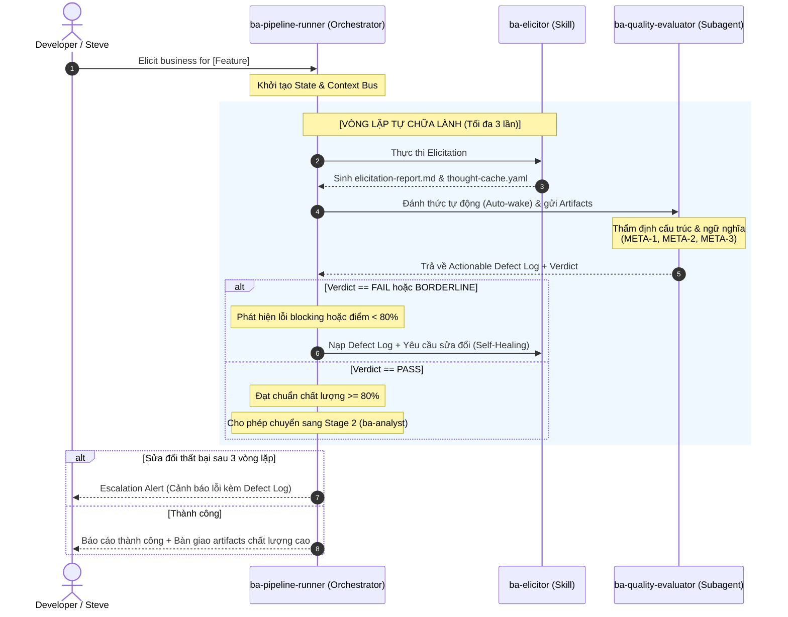

# Scope & Architecture Spec — Phase 5 BA Pipeline: Deep Knowledge Activation & Self-Healing Quality Gates

**Date**: 2026-07-10
**Status**: Canonical Proposed
**Skill**: context-before-fix v1.0.0
**Feature**: Phase 5 BA Pipeline (Elicitor → Analyst → Synthesizer)
**Context Source**: 
  - `docs/context-to-work/phase-5-ba-pipeline/phase-5-ba-pipeline-business-analysis.md`
  - `docs/context-to-work/phase-5-ba-pipeline/scope.ba-elicitor-build.2026-07-10.md`
  - `docs/context-to-work/phase-5-ba-pipeline/scope.2026-07-10.md`
  - `.claude/agents/ba-pipeline-runner.md`
  - `skills/ver-0.0.2/ba-elicitor/`

---

## §1: Problem Summary & Core Intent

### 1.1 Vấn đề cốt lõi (The Core Problem)
Hiện tại, việc xây dựng và vận hành bộ kỹ năng phân tích nghiệp vụ (BA Skills Pipeline) đang gặp hai rào cản lớn làm giảm hiệu quả hoạt động trong môi trường production:
1. **Hạn chế trong khai thác tri thức của LLM (Semantic Drift & Low Vector Activation)**: Việc sử dụng các prompt và tài liệu context dạng văn bản thông thường không đủ để kích hoạt các vùng kiến thức sâu (deep knowledge embeddings) mà LLM đã được huấn luyện. Dữ liệu đầu vào bị vector hóa mờ nhạt, dẫn đến kết quả đầu ra chung chung, thiếu chiều sâu nghiệp vụ (ví dụ: NFRs không lượng hóa được, thiếu phân tích rủi ro thực tế).
2. **Cơ chế chốt chặn chất lượng vô hồn (Passive & Opaque Quality Gates)**: Các scripts và hooks kiểm tra hiện tại trả về điểm số khô khan (ví dụ: `88/100`) hoặc báo lỗi cứng nhắc mà không giải thích rõ ràng **vì sao sai, sai ở đâu, và làm thế nào để sửa**. LLM khi bị chặn bởi các gate này không thể tự nhận thức lỗi để sửa đổi (Self-Healing), dẫn đến bế tắc trong luồng tự động và buộc người dùng phải can thiệp thủ công.

### 1.2 Mục tiêu chiến lược (Core Intent)
1. **Thiết kế Cơ chế Kích hoạt Tri thức Sâu (Deep Knowledge Activation)**: Chuyển đổi cách viết tài liệu nghiệp vụ, Prompt, và cấu trúc Kỹ năng từ dạng text đơn thuần sang dạng **Semantic Vector Anchors** (sử dụng các từ khóa có điểm vector cao, ontology chuẩn của BABOK và ISO/IEC 25010) để kéo LLM về vùng không gian vector của một chuyên gia BA thực thụ.
2. **Xây dựng Hệ thống Chốt chặn Tự chữa lành (Self-Healing Quality Gates)**: Thiết lập một Subagent đánh giá chất lượng chuyên biệt (`ba-quality-evaluator`), tự động kích hoạt để "Grill" (thẩm định phản biện) các artifacts nghiệp vụ đầu ra. Thay vì chấm điểm vô hồn, subagent này sinh ra **Actionable Defect Log** (Nhật ký lỗi có thể sửa đổi) để Agent chính tự sửa tài liệu (Self-Healing Loop) trước khi chuyển sang các stage tiếp theo.

---

## §2: Entry Point

- **Scope master documents**: 
  - [phase-5-ba-pipeline-business-analysis.md](file:///home/stveve/Documents/workspace/build-workflow/WASHVN/docs/context-to-work/phase-5-ba-pipeline/phase-5-ba-pipeline-business-analysis.md)
  - [scope.2026-07-10.md](file:///home/stveve/Documents/workspace/build-workflow/WASHVN/docs/context-to-work/phase-5-ba-pipeline/scope.2026-07-10.md)
- **Pipeline Runner configuration**:
  - [ba-pipeline-runner.md](file:///home/stveve/Documents/workspace/build-workflow/WASHVN/.claude/agents/ba-pipeline-runner.md)
- **Old v0.0.2 legacy codebase** (nguồn khai thác tri thức):
  - [Old ba-elicitor SKILL.md](file:///home/stveve/Documents/workspace/build-workflow/WASHVN/skills/ver-0.0.2/ba-elicitor/SKILL.md)
  - [Old elicitation-rules.md](file:///home/stveve/Documents/workspace/build-workflow/WASHVN/skills/ver-0.0.2/ba-elicitor/knowledge/elicitation-rules.md)
- **Architectural specs reference**:
  - [README.md](file:///home/stveve/Documents/workspace/build-workflow/WASHVN/Temps/spec/architects/README.md)
  - [quality-gates-reference.md](file:///home/stveve/Documents/workspace/build-workflow/WASHVN/Temps/spec/architects/shared/quality-gates-reference.md)

---

## §3: Deep Knowledge Activation (Kích hoạt Tri thức Sâu)

Để vượt qua giới hạn của prompt thông thường, chúng ta xây dựng cấu trúc tri thức cho `ba-elicitor` dựa trên việc ánh xạ trực tiếp các thuật ngữ nghiệp vụ và mô hình tư duy vào không gian vector sâu của LLM.

```text
+---------------------------------------------------------------------------------+
|                                LATENT VECTOR SPACE                              |
|                                                                                 |
|   [General Space]                               [Expert Space]                  |
|   "Viết tài liệu BA..."  ======= (Drift) =====> (Systems Thinking)              |
|   "Làm rõ yêu cầu..."                           (BABOK Knowledge Area)          |
|                                                 (ISO/IEC 25010 NFRs)            |
|                                                 (Ishikawa Root Cause)           |
|                                                                                 |
|   Semantic Vector Anchors (Từ khóa vector cao) kích hoạt Expert Space           |
+---------------------------------------------------------------------------------+
```

### 3.1 6 Mindset Keywords - Trục Vector Nhận Thức (Cognitive Anchors)
Bản chất của các từ khóa này không chỉ là chỉ thị, mà là các **vector triggers** hướng LLM áp dụng các mô hình tư duy phản biện cao:
1. **Systems Thinking (Tư duy hệ thống)**: Kích hoạt khả năng phân tích hệ thống dưới dạng các vòng lặp phản hồi (Feedback Loops), ranh giới (Boundaries), và mối quan hệ tương tác (Interconnections). LLM sẽ không nhìn tính năng cô lập mà nhìn trong mối quan hệ với toàn bộ Master Skill Suite.
2. **Root Cause Isolation (Cô lập nguyên nhân gốc rễ)**: Kéo LLM về mô hình Ishikawa (Sơ đồ xương cá) và kỹ thuật 5 Whys. Tránh việc mô tả triệu chứng lỗi mà phải tìm ra lỗ hổng thiết kế ban đầu.
3. **MECE (Mutually Exclusive, Collectively Exhaustive - Không trùng lặp, không bỏ sót)**: Kích hoạt thuật toán phân rã cấu trúc logic. Mọi luồng xử lý và dữ liệu phải được phân chia sạch sẽ, không có vùng xám chồng lấn.
4. **First Principles (Tư duy nguyên bản)**: Bắt buộc LLM phá vỡ các giả định và thói quen thiết kế thông thường, bóc tách bài toán về các sự thật cơ bản nhất (hạ tầng, giới hạn token, ranh giới file) rồi xây dựng giải pháp đi lên.
5. **Impact Analysis (Phân tích tác động)**: Kích hoạt khả năng vẽ bản đồ lan truyền ảnh hưởng (Propagation Map). Một thay đổi ở upstream (ví dụ: Schema thay đổi) sẽ tác động như thế nào đến downstream.
6. **Structural Decomposition (Phân rã cấu trúc)**: Kích hoạt kỹ năng phân rã từ Epic nghiệp vụ lớn xuống các Feature, User Story và Acceptance Criteria rõ ràng.

### 3.2 Domain Ontology - Bản đồ Thực thể Nghiệp vụ (Ontological Schema)
Để tránh sự mơ hồ, tài liệu `knowledge/elicitation_patterns.md` của `ba-elicitor` phải định nghĩa rõ ràng ontology nghiệp vụ dưới dạng các thực thể có quan hệ chặt chẽ:
- **Stakeholder Profiles**: Gồm Role, Core Objectives, và Pain Points. Đặc biệt bắt buộc phải phân tích ở các góc độ: *End-User* (Người dùng cuối), *System Operator* (Vận hành), *Developer/Maintainer* (Phát triển), và *Security Reviewer* (Bảo mật).
- **SMART NFRs (Yêu cầu phi chức năng thông minh)**: Thay vì các từ khóa chất lượng mơ hồ, ontology bắt buộc phải ánh xạ theo chuẩn **ISO/IEC 25010**:
  - *Hiệu năng*: Lượng hóa bằng Latency (p95/p99), Throughput (RPS), Concurrency.
  - *Bảo mật*: Lượng hóa bằng Authorization levels, Data Encryption standards, Token expiration.
  - *Độ tin cậy*: Lượng hóa bằng MTBF (Mean Time Between Failures), Recovery Time Objective (RTO).
  - *Tài nguyên*: Lượng hóa bằng Token budget (max 700 tokens per SKILL.md), memory footprints.

---

## §4: Self-Healing Quality Gates (Chốt chặn Tự chữa lành)

Để thay thế các điểm số mơ hồ, chúng ta thiết kế một cơ chế kiểm định đa tầng với vòng lặp tự động sửa lỗi dưới sự dẫn dắt của Subagent `ba-quality-evaluator`.

### 4.1 Mô hình Kiến trúc Kiểm định & Tự chữa lành (Self-Healing Architecture)



### 4.2 Thiết kế Subagent `ba-quality-evaluator`
Tạo một Subagent mới chuyên biệt đảm nhiệm việc đánh giá trực tiếp kết quả nghiệp vụ trước khi Done task. 

- **Role**: `BA Quality Evaluator` - Người thẩm định chất lượng thiết kế và nghiệp vụ độc lập.
- **Model**: `opus` hoặc `gemini-3.5-flash` (đảm bảo khả năng lập luận sắc bén).
- **Tools**: `Read` (Đọc artifacts), `Write` (Chỉ ghi vào phân vùng gate context).
- **Input Contract**:
  - `elicitation-report.md` và `thought-cache.yaml` (nếu kiểm tra Stage 1).
  - `analysis-report.md` (nếu kiểm tra Stage 2).
  - `business-analysis.md` (nếu kiểm tra Stage 3).
- **Output Contract**:
  - `quality-matrix.yaml`: Chứa điểm số lượng hóa và phân rã các tiêu chí.
  - `evaluation-report.md`: Báo cáo chi tiết dạng ngôn ngữ tự nhiên.
  - `defect-log.yaml` (Hoặc nhúng trong `quality-matrix.yaml`): Danh sách các lỗi cần sửa.

### 4.3 Cấu trúc Actionable Defect Log (Nhật ký lỗi có thể sửa)
Để LLM hiểu và sửa được, mọi lỗi phát hiện phải được cấu trúc theo định dạng YAML nghiêm ngặt:

```yaml
verdict: FAIL | BORDERLINE | PASS
composite_score: 72  # Trên thang điểm 100
evaluated_at: "2026-07-10T22:45:00Z"
defects:
  - defect_id: DEF-ELICIT-001
    severity: BLOCKING  # BLOCKING (phải sửa) | WARNING (cảnh báo)
    category: "META-2.1 Semantic Depth"
    target_file: ".skill-context/{feature}/ba-elicitor/elicitation-report.md"
    target_section: "§3. Stakeholder Analysis"
    error_code: "MISSING_MANDATORY_STAKEHOLDER"
    description: "Thiếu Stakeholder có vai trò 'Security Reviewer' trong khi hệ thống có yêu cầu bảo mật cao."
    evidence: "Dòng 12-25 chỉ mô tả End-User và Operator."
    recommendation: "Bổ sung Security Reviewer, phân tích pain points liên quan đến rò rỉ dữ liệu."
    
  - defect_id: DEF-ELICIT-002
    severity: BLOCKING
    category: "META-1.1 Domain Anchoring"
    target_file: ".skill-context/{feature}/ba-elicitor/elicitation-report.md"
    target_section: "§4. Non-Functional Requirements"
    error_code: "NON_QUANTIFIED_NFR"
    description: "Yêu cầu về hiệu năng hệ thống đang sử dụng từ ngữ mơ hồ 'phải phản hồi nhanh'."
    evidence: "Dòng 45: 'Hệ thống cần phản hồi nhanh chóng cho người dùng.'"
    recommendation: "Lượng hóa từ ngữ mơ hồ. Chuyển thành chỉ số đo lường cụ thể: Latency p95 ≤ 200ms dưới tải 1000 RPS."
```

### 4.4 Cơ chế Tự sửa lỗi (Self-Healing Loop execution)
Khi nhận được `defect-log.yaml` với trạng thái `FAIL` hoặc `BORDERLINE`, `ba-pipeline-runner` sẽ thực thi các bước:
1. Đọc danh sách các defects có mức độ `BLOCKING`.
2. Tạo một prompt sửa lỗi có cấu trúc:
   ```xml
   <self_healing_request>
     <context>Output của bạn ở stage vừa qua chưa đạt chuẩn chất lượng.</context>
     <defect_log>
       [Nội dung defect-log.yaml tương ứng]
     </defect_log>
     <instructions>
       Hãy đọc kỹ từng defect_id có severity là BLOCKING.
       Thực hiện sửa đổi trực tiếp vào file artifacts tương ứng.
       Đảm bảo giải quyết triệt để phần 'recommendation' được đề xuất.
       Sau khi sửa xong, ghi đè lên file artifacts cũ.
     </instructions>
   </self_healing_request>
   ```
3. Gọi lại Stage đó để Agent thực hiện chỉnh sửa.
4. Sau khi ghi đè xong, kích hoạt lại `ba-quality-evaluator` để đánh giá lại.
5. Loop tối đa 3 lần. Nếu vượt quá, báo cáo lỗi cho Steve.

---

## §5: Scope Definition & Boundaries

### 5.1 In Scope (Trong phạm vi xây dựng)
- **Tái cấu trúc tri thức cho `ba-elicitor`**: Thiết kế file `knowledge/elicitation_patterns.md` tích hợp sâu sắc 6 Mindset Keywords, Domain Ontology (BABOK, ISO 25010), kỹ thuật lượng hóa NFR và chống prompt injection.
- **Xây dựng `templates/thought_cache_template.yaml`**: Chứa luồng suy nghĩ nghiệp vụ nâng cao (business thought process, stakeholder empathy, reverse questions, confidence breakdown, uncertainty areas).
- **Thiết kế & Triển khai Subagent `ba-quality-evaluator`**:
  - Tạo file định nghĩa agent tại `.claude/agents/ba-quality-evaluator.md`.
  - Thiết lập luật thẩm định (validation policies) dựa trên 7 deliverables nghiệp vụ.
  - Tích hợp sinh cấu trúc `defect-log.yaml` và `quality-matrix.yaml`.
- **Tích hợp luồng Self-Healing vào `ba-pipeline-runner`**: Cấu trúc lại file `.claude/agents/ba-pipeline-runner.md` để tự động kích hoạt `ba-quality-evaluator` sau mỗi stage và thực hiện vòng lặp tự sửa lỗi nếu chất lượng dưới 80%.

### 5.2 Out of Scope (Ngoài phạm vi)
- Không xây dựng các kiểm thử sandbox hạ tầng (Docker/gVisor) cho pipeline ở phase này.
- Không thay đổi các schemas của Phase 4 (đã hoàn thành và validated).
- Không tự động sửa code nguồn của ứng dụng thực tế (WASHVN code) — chỉ sửa đổi tài liệu nghiệp vụ/kỹ năng trong `.skill-context/` và `skills/ver-3/`.

### 5.3 Boundaries & Confinement
- **Write confinement**: Mọi báo cáo nghiệp vụ và file state trung gian chỉ được ghi vào `.skill-context/{feature_name}/ba-*/` và `.skill-context/{feature_name}/quality-*`. Bất kỳ hành vi ghi đè code runtime hoặc thư mục khác sẽ bị chặn bởi Hook mức hệ thống.

---

## §6: Impact Analysis

### 6.1 Direct Impact (Ảnh hưởng trực tiếp)

| Thành phần | Trạng thái hiện tại | Tác động thay đổi | Mức độ |
|:---|:---|:---|:---:|
| `skills/ver-3/ba-elicitor/knowledge/elicitation_patterns.md` | Chưa có content | Ghi nhận tri thức sâu (Ontology + Mindset + 5W1H) | 🔴 Tạo mới |
| `skills/ver-3/ba-elicitor/templates/thought_cache_template.yaml` | Chưa có content | Định nghĩa 5 cấu trúc suy nghĩ để kích hoạt vector space | 🔴 Tạo mới |
| `.claude/agents/ba-quality-evaluator.md` | Chưa tồn tại | Tạo mới Subagent thẩm định chất lượng và sinh Defect Log | 🔴 Tạo mới |
| `.claude/agents/ba-pipeline-runner.md` | Đã có luồng tuần tự cơ bản | Tích hợp cơ chế tự đánh thức Evaluator và Self-Healing Loop | 🟡 Nâng cấp |

### 6.2 Indirect Impact (Ảnh hưởng gián tiếp)
- **Các Stage tiếp theo (ba-analyst, ba-synthesizer)**: Nhận được đầu vào `elicitation-report.md` chất lượng cao, đã được lượng hóa hoàn toàn, giúp việc vẽ sơ đồ Mermaid và kịch bản Gherkin không bị mơ hồ.
- **Main Pipeline (Phase 6)**: Nhận tài liệu `business-analysis.md` đạt chuẩn chất lượng thực chất, giảm thiểu lỗi thiết kế hệ thống ở các stage sau.

---

## §7: Call Chain & Data Flow

### 7.1 Luồng Dữ liệu Nghiệp vụ (Semantic Data Flow)

```text
User Raw Request (Ý tưởng thô từ Steve)
  ↓
[ba-elicitor] boot & nạp "elicitation_patterns.md"
  ↓ (Kích hoạt 6 Mindset Keywords & SMART NFR Ontology)
Tạo Bản thảo: elicitation-report.md + thought-cache.yaml (Chưa commit)
  ↓
[ba-quality-evaluator] boot
  ↓ (Thẩm định ngữ nghĩa, so khớp ISO 25010 NFRs & Stakeholder Profiles)
Tạo: quality-matrix.yaml + defect-log.yaml
  ↓
[Kiểm tra Verdict]
  ├─ FAIL / BORDERLINE (< 80% hoặc có BLOCKING defect)
  │    ↓
  │  [Self-Healing Loop] -> Gửi Defect Log quay lại ba-elicitor (Max 3 lần)
  │
  └─ PASS (>= 80% & 0 BLOCKING defect)
       ↓
     Commit chính thức elicitation-report.md -> Chuyển sang ba-analyst
```

---

## §8: Open Questions & Design Decisions

### 8.1 Liệu tạo một Subagent mới đảm nhiệm đánh giá trực tiếp có phù hợp hơn?
**Quyết định**: **RẤT PHÙ HỢP**. Việc tách biệt vai trò (Separation of Concerns) giữa Agent thực thi (Executor - `ba-elicitor/analyst/synthesizer`) và Agent kiểm định (Evaluator - `ba-quality-evaluator`) là nguyên tắc cốt lõi để đảm bảo tính khách quan và chất lượng.
- Nếu để Executor tự chấm điểm, LLM sẽ có xu hướng "tự mãn" và bỏ qua lỗi.
- Subagent `ba-quality-evaluator` đóng vai trò như một khách hàng khó tính hoặc một Senior BA Audit, chỉ nhìn vào bằng chứng thực tế (evidence) để đánh giá.

### 8.2 Cơ chế sửa lỗi có nên được tự động hóa hoàn toàn không?
**Quyết định**: Có, tự động hóa tối đa 3 lần chỉnh sửa (Self-Healing Loop). Nếu sau 3 lần chỉnh sửa mà điểm chất lượng vẫn dưới 80%, hệ thống sẽ tạm dừng và gửi cảnh báo Escalation cho Steve kèm theo file `defect-log.yaml` cuối cùng để Steve có thể bổ sung thông tin bị thiếu bằng ngôn ngữ tự nhiên. Điều này ngăn chặn việc Agent bị lặp vô hạn và tiêu tốn token vô ích.

---

## §9: Evidence & Source Tracing

<evidence>
  <file>docs/context-to-work/phase-5-ba-pipeline/phase-5-ba-pipeline-business-analysis.md</file>
  <line>26-32</line>
  <finding>Yêu cầu NFR lượng hóa điểm tối thiểu của kỹ năng phải >= 70% qua quality-scorer, nhưng thực tế điểm số này đang bị mơ hồ và thiếu cơ chế tự sửa.</finding>
</evidence>

<evidence>
  <file>docs/context-to-work/phase-5-ba-pipeline/phase-5-ba-pipeline-business-analysis.md</file>
  <line>191-203</line>
  <finding>Ma trận trọng số chấm điểm chất lượng tổng hợp (7 deliverables) có trọng số rõ ràng, đây sẽ là dữ liệu đầu vào cho chất lượng đánh giá của ba-quality-evaluator.</finding>
</evidence>

<evidence>
  <file>.claude/agents/ba-pipeline-runner.md</file>
  <line>179-198</line>
  <finding>Các trường hợp lỗi (Failure Modes F1-F6) hiện tại chỉ ghi nhận lỗi cơ học (lỗi thiếu file, lỗi timeout) chứ chưa xử lý lỗi chất lượng nội dung nghiệp vụ.</finding>
</evidence>

---

## §10: Confidence Assessment

```yaml
overall_confidence: 92%

breakdown:
  scope_completeness: 95%  # Xác định rõ ràng phạm vi cải tiến prompt và kiến trúc Evaluator.
  architectural_feasibility: 90% # Cấu trúc Subagent Evaluator và Defect Log hoàn toàn khả thi trên nền tảng Claude Code / Antigravity Hooks.
  healing_logic_consistency: 90% # Vòng lặp self-healing 3-iterations giúp cân bằng giữa tính tự động và tối ưu hóa tài nguyên token.
```

**NO CODE CHANGES — Context and Architecture Ready for Implementation Phase**
